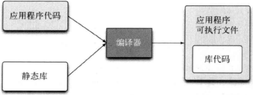

# 静态链接

[TOC]

## 静态库

静态库也称为存档文件，文件中中包含目标代码，这些目标代码会被链接到最终用户的应用程序，并成为其中的一部分。

在`*nix`系统上，静态库以`.a`为文件扩展名；在windows系统上，静态库以`.lib`为文件扩展名。

### 优缺点

| 优点                                   | 缺点                                                         |
| -------------------------------------- | ------------------------------------------------------------ |
| + 运行时不需要额外的运行时依赖项。  | - 有多个可执行程序时，每一个都需要包含静态库的副本，包体较大。 - 对于热更新时，需要替换整个可执行程序。 |

## 参考

[1] 俞甲子，石凡，潘爱民, 程序员的自我修养 - 链接，装在与库, 1ED

[2] Martin Reddy, C++ API 设计, 1ED,  P337-P337
