English | [中文版](storage_zh.md)

# Storage

[TOC]

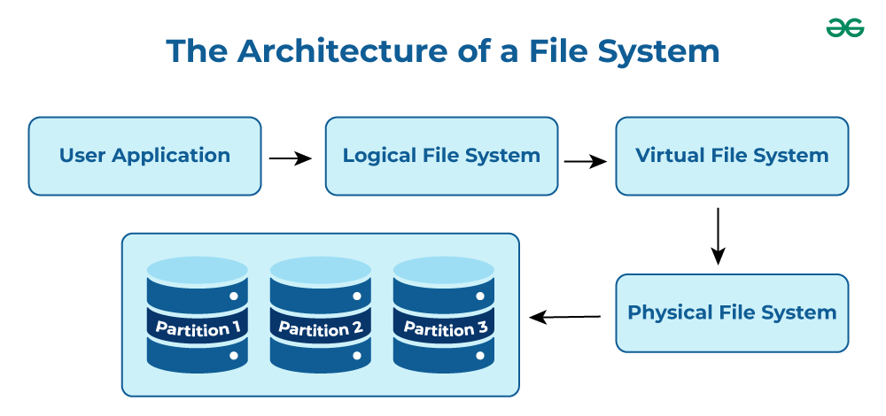

File systems are a crucial part of any operating system, providing a structured way to store, organize and manage data on storage devices such as hard drives, SSDs and USB drives.

## Popular File Systems

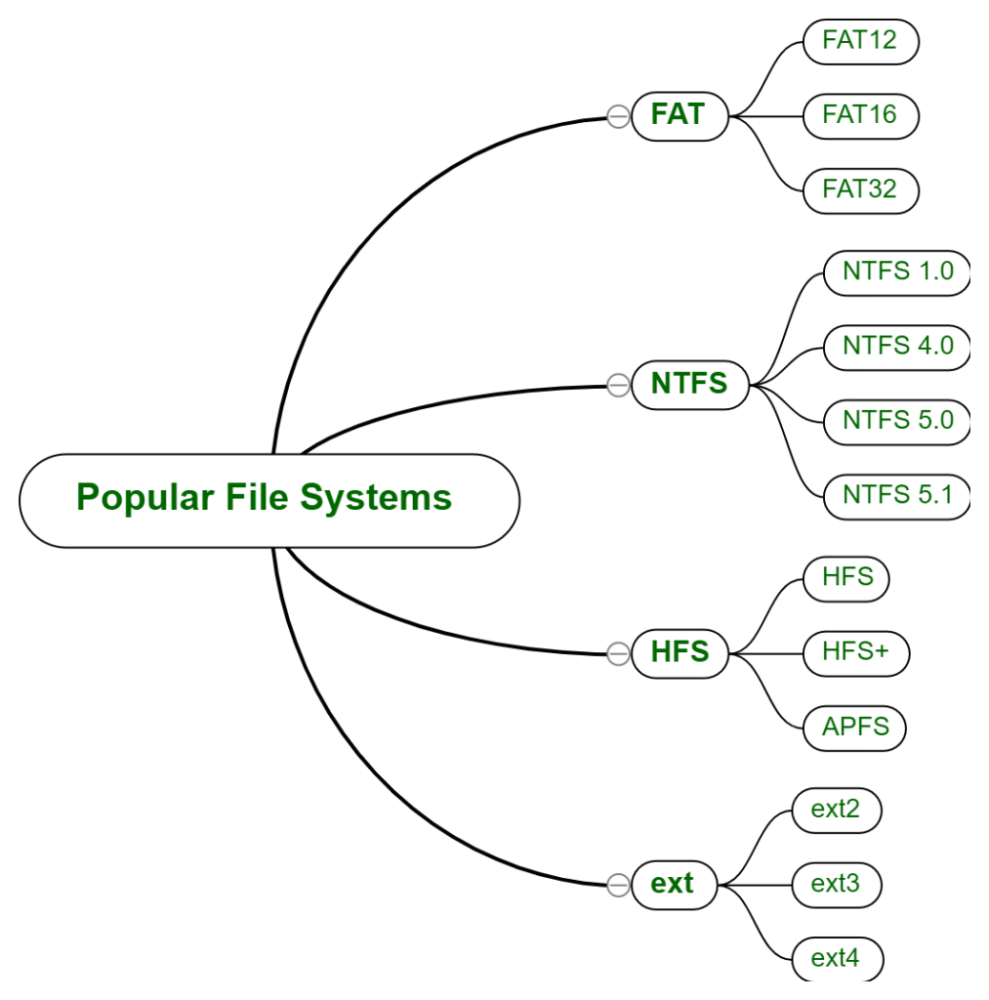

---

## Path

When files are organized as a directory tree, there must be a way to uniquely identify and access them. This is done through path names.

### Absolute Path Name

An absolute path name (also known as a full path) specifies the complete path from the root directory ("/") to the target file or directory.

### Relative Path Name

A relative path name specifies the file or directory in relation to the current working directory (also known as the present working directory). It does not start from the root and is shorter and more flexible than an absolute path.

---

## Directory

### Single-Level Directory

In the single-level directory, all files are contained in the same directory which makes it easy to support and understand.

### Two-Level Directory

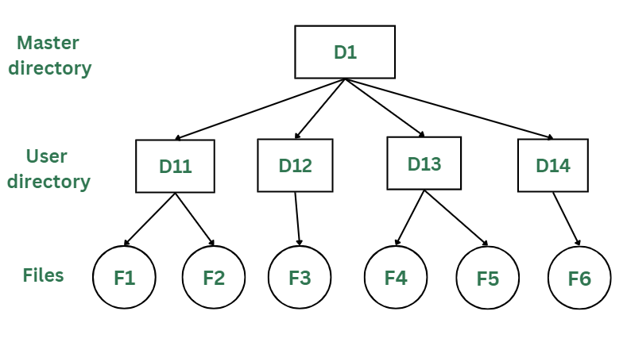

In a two-level directory structure, each user has a separate User File Directory (UFD) containing only their files. A Master File Directory (MFD) stores entries for all users and points to their respective UFDs, preventing filename conflicts between users.

### Tree Structure/Hierarchical Structure

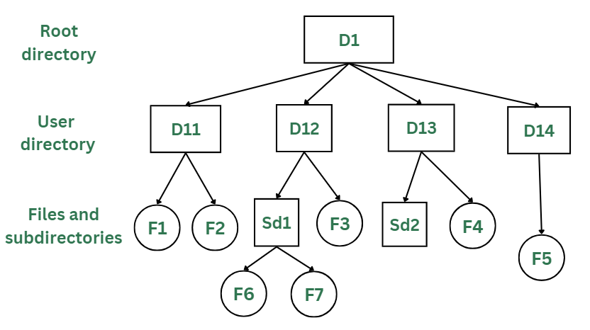

The tree directory structure resembles an upside-down tree, with the root directory at the top containing all user directories. Each user can create files and subdirectories within their own directory but cannot access or modify the root or other users' directories.

### Acyclic Graph Structure

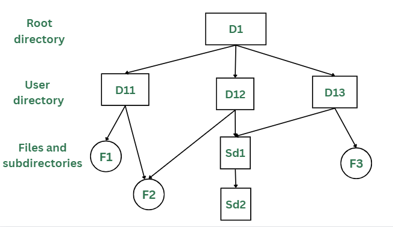

The acyclic graph directory structure allowing a file or subdirectory to be shared across multiple directories suing links. Changes made by one user are visible to all users sharing that file.

### General-Graph Directory Structure

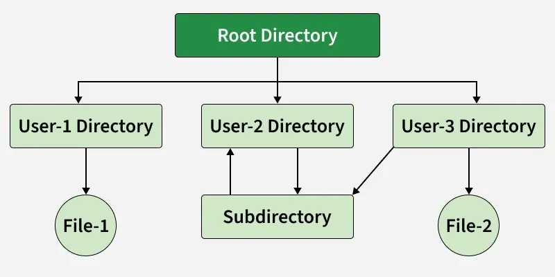

General-Graph directory avoids loops, the general-graph directory can have cycles, meaning a directory can contain paths that loop back to the starting point. This can make navigating and managing files more complex.

---

## File Allocation Methods

The allocation methods define how the files are stored in the disk blocks. Ther are three main disk space or file allocation methods:

- Contiguous Allocation
- Linked Allocation
- Indexed Allocation

### Contiguous Allocation

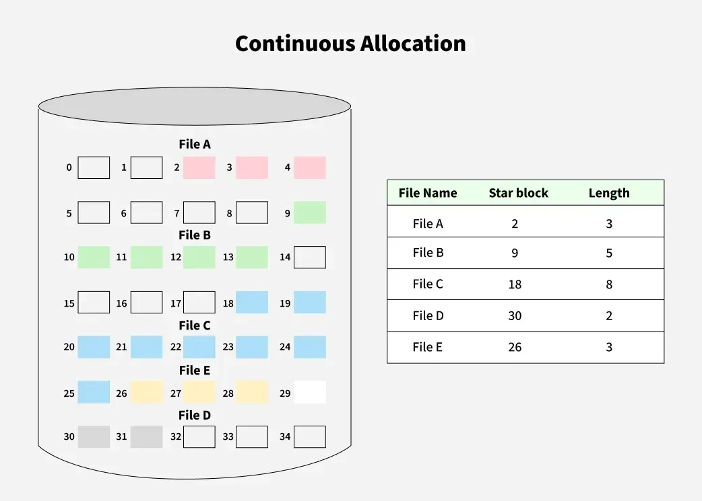

In this scheme, each file occupies a contiguous set of blocks on the disk. This means that given the starting block address and the length of the file (in terms of blocks required), we can determine the block occupied by the file.

### Linked Allocation

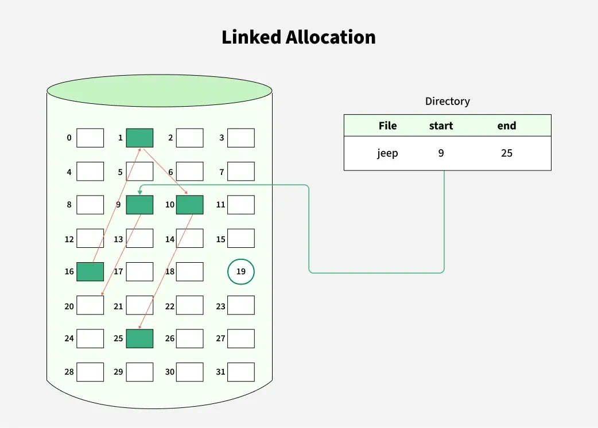

In this scheme, each file is a linked list of disk blocks which need not be contiguous.

### Indexed Allocation

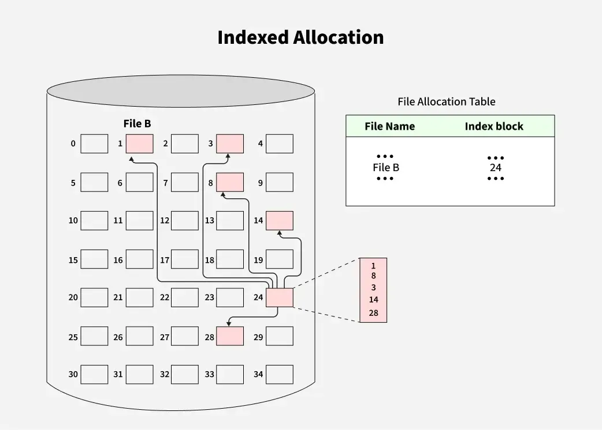

In this scheme, a special block known as the Index block contains the pointers to all the blocks occupied by a file.

---

## File Access Methods

File access methods are techniques used by an OS to read and write data in files. They define how information is organzied, retrieved, and modified. There are three ways to access a file in a computer system:

- Sequential-Access
- Direct Access
- Index Sequential Method

### Sequential Access

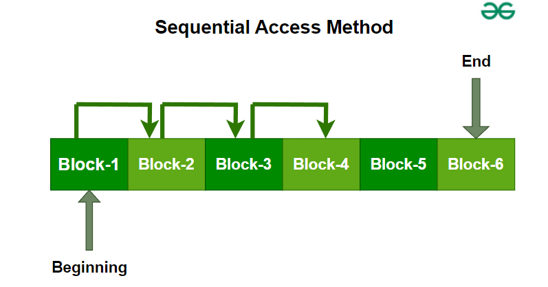

A file access method where data is read or written in order, one record after anotehr, starting from the beginning. The file pointer moves forward automatically after each operation.

### Direct Access Method

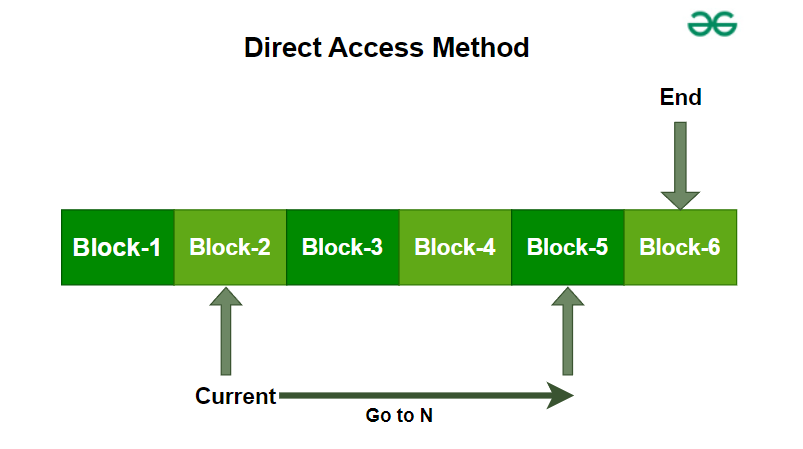

A file access method that allows data to be read or written directly at any block or record, using its address (block number). It supports random access without scanning previous records.

### Index Sequential Method

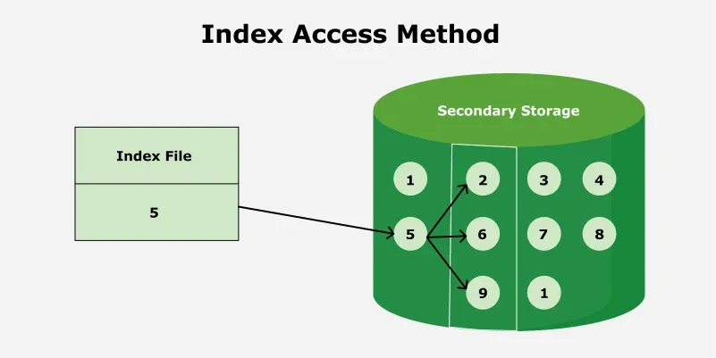

It is the other method of accessing a file that is built on the top of the sequential access method. These methods construct an index for the file. The index, like an index in the back of a book, contains the pointer to the various blocks. To find a record in the file, we first search the index, and then by the help of pointer we access the file directly.

---

## Disk Scheduling Algorithms

Disk scheduling algorithms manage how data is read from and written to a computer's hard disk.

### Key Terms

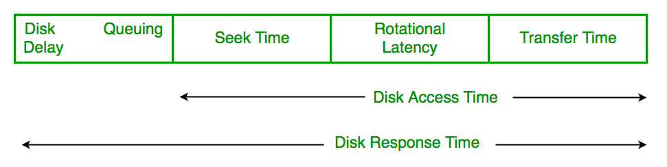

Disk Access Time = Seek Time + Rotational latency + Transfer Time

Total Seek Time = Total head Movement * Seek Time

- **Seek Time**: Time taken to move the disk arm to the track where data is located.
- **Rotational Latency**: Time taken for the desired sector to rotate under the read/write head.
- **Transfer Time**: Time taken to actually read or write the data, depending on disk speed and data size.

### FCFS (First Come First Serve)

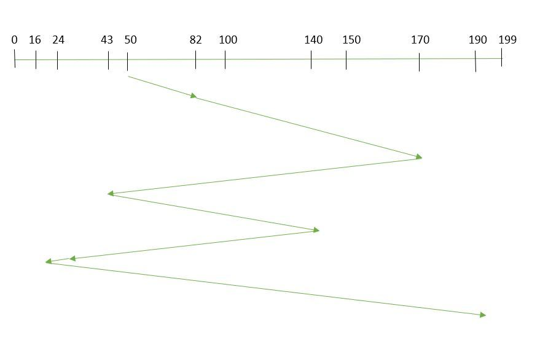

In FCFS, the requests are addressed in the order they arrive in the disk queue.

### SSTF (Shortest Seek Time First)

In SSTF, requests having the shortest seek time are executed first. So, the seek time of every request is calculated in advance in the queue and then they are scheduled according to their calculated seek time. As a result, the request near the disk arm will get executed first.

### SCAN

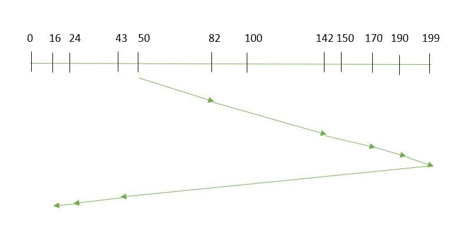

In the SCAN algorithm the disk arm moves in a particular direction and services the requests coming in its path and after reaching the end of the disk, it reverses its direction and again services the request arriving in its path. So, this algorithm works as an elevator and is hence also requests at the midrange are serviced more and those arriving behind the disk arm will have to wait.

### C-SCAN

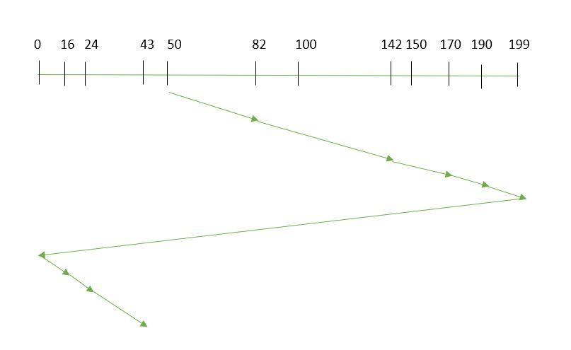

The CSCAN algorithm reversing the disk arm direction goes to the other end of the disk and starts servicing the requests from there. So, the disk arm moves in a circular fashion and this algorithm is also similar tothe SCAN algorithm hence it is known as C-SCAN (Circular SCAN).

### LOOK

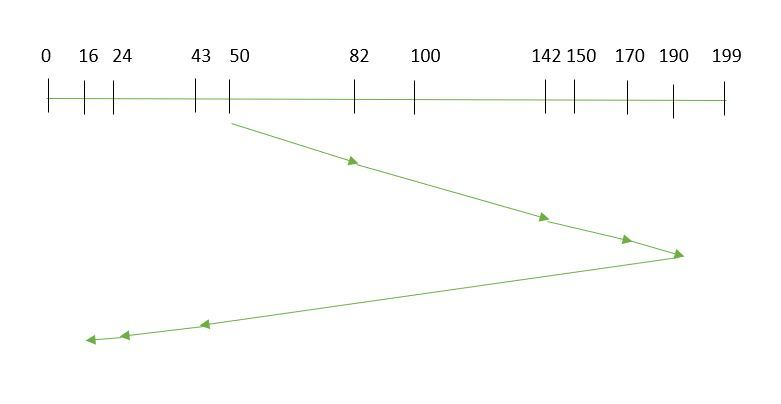

LOOK Algorithm is similar to the SCAN disk scheduling algorithm except for the difference that the disk arm in spite of going to the end of the disk goes only to the last request to be serviced in front of the head and then reverses its direction from there only. Thus it prevents the extra delay which occurred due to unnecessary traversal to the end of the disk.

### C-LOOK

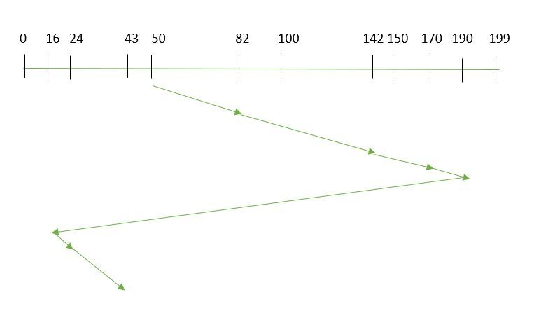

In CLOOK, the disk arm in spite of going to the end goes only to the last request to be serviced in front of the head and then from there goes to the other end's last request. Thus, it also prevents the extra dealy which occurred due to unnecessary traversal to the end of the disk.

### RSS (Random Scheduling)

TODO

### LIFO (Last-In First-Out)

TODO

### N-STEP SCAN

TODO

### F-SCAN

TODO

---

## Secondary Memory

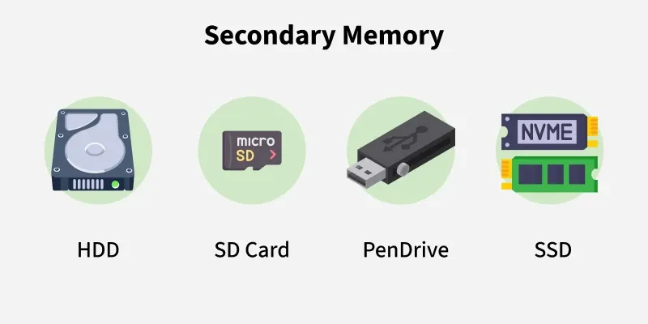

Secondary memory, also known as secondary storage, refers to the storage devices and systems used to store data persistently, even when the computer is powered off.

### Hard Disk Drive (HDD)

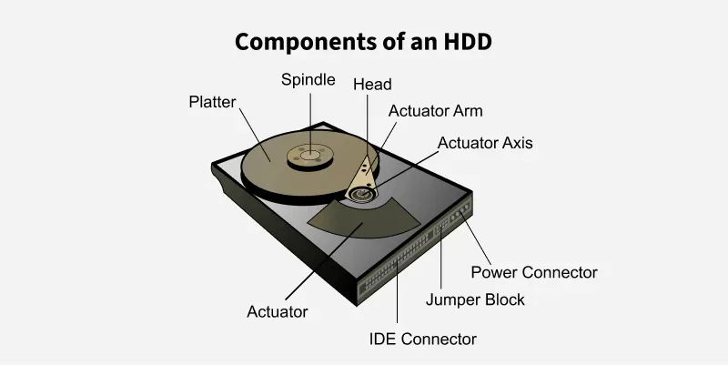

A hard disk drive (HDD) is a fixed storage device inside a comuter that uses magnetic technology to retrieve and store digital data for long-term.

How HDDs Work:

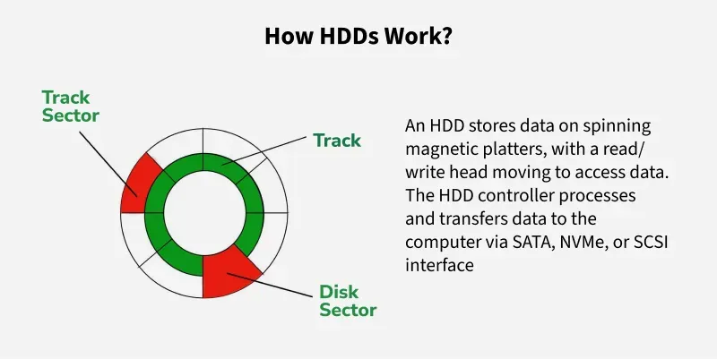

### Solid-State Drive (SSD)

TODO

### Optical DIscs (CD, DVD, Blu-ray)

TODO

### USB Flash Drives

TODO

### Magnetic Tapes

TODO

### Flash Memory Cards (SD Cards, MicroSD Cards)

TODO

### External Hard Drives

TODO

---

## Spooling

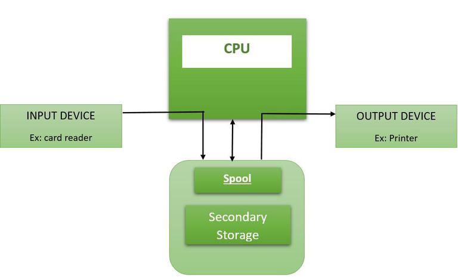

Spooling is a special process in a special area on disk where data is temporarily stored and queued for execution. A spool is similar to a buffer as it holds the jobs for a device until the device is ready to accept the job. It considers the disk as a huge buffer that can store as many jobs for the device till the output devices are ready to accept them.

---

## Unix File System

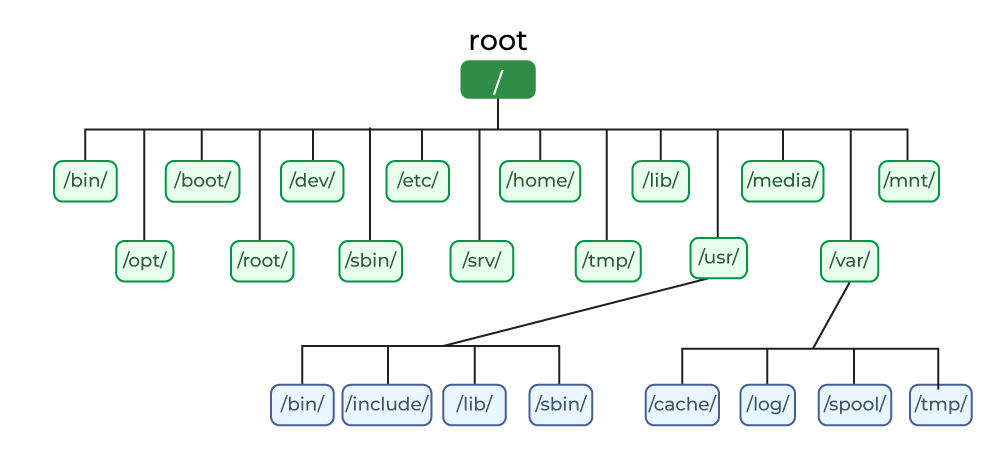

Unix (UNiplexed Information Computing System) File System is a logical method of organizing and storing large amounts of information in a way that makes it easy to manage.

### Types

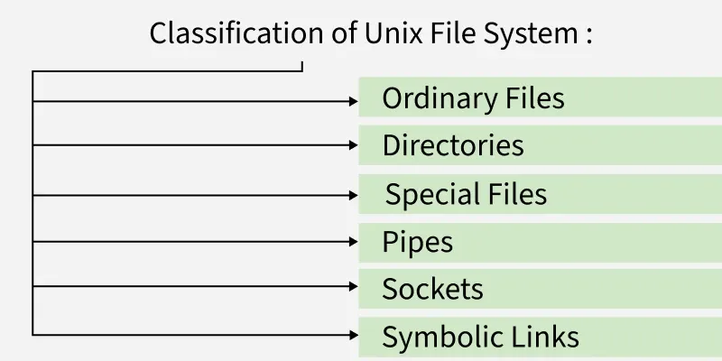

---

## Summary

### Absolute vs Relative Path

| Criteria   | Absolute Path                                                | Relative Path                                   |
| ---------- | ------------------------------------------------------------ | ----------------------------------------------- |
| Definition | Full path from root directory                                | Path relative to current working directory      |
| Dependency | Independent of working directory                             | Depends on working directory                    |
| Uniqueness | Always unique                                                | May vary depending on current directory         |
| Usage      | Used in scripts or programs requiring fixed file references. | Used in user-level commands or local navigation |

### HDD vs SDD

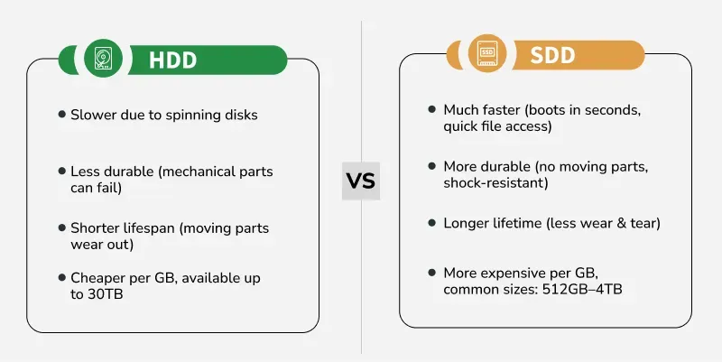

### Spooling vs Buffering

| Spooling                                                     | Buffering                                                    |
| ------------------------------------------------------------ | ------------------------------------------------------------ |
| Overlaps the input/output of one job with the execution of another job. | Overlaps the input/output of a job with the execution of the same job. |
| Stands for Simultaneous Peripheral Operation On-Line.        | Has no full form.                                            |
| More efficient since multiple jobs can be processed at the same time. | Less efficient compared to spooling.                         |
| Uses disk as a large buffer.                                 | Uses a limited area of main memory (RAM).                    |
| Supports remote processing.                                  | Does not support remote processing.                          |
| Implemented using spoolers to manage I/O requests and resources. | Implemented using software or hardware buffers like FIFO or circular buffers. |
| Can handle large amounts of data as storage is on disk.      | Limited by the size of main memory.                          |
| Provides better recovery from errors since data is stored on disk. | Buffer overflow may cause data loss or corruption.           |
| More complex due to additional management software.          | Simpler and easier to implement.                             |

## References

[1] [File Systems in Operating System](https://www.geeksforgeeks.org/operating-systems/file-systems-in-operating-system/)

[2] [Unix File System](https://www.geeksforgeeks.org/operating-systems/unix-file-system/)

[3] [Path Name in File Directory](https://www.geeksforgeeks.org/operating-systems/path-name-in-file-directory/)

[4] [Structures of Directory in Operating System](https://www.geeksforgeeks.org/operating-systems/structures-of-directory-in-operating-system/)

[5] [File Allocation Methods](https://www.geeksforgeeks.org/operating-systems/file-allocation-methods/)

[6] [File Access Methods in Operating System](https://www.geeksforgeeks.org/operating-systems/file-access-methods-in-operating-system/)

[7] [Secondary Memory](https://www.geeksforgeeks.org/computer-science-fundamentals/secondary-memory/)

[8] [Hard Disk Drive (HDD) Secondary Memory](https://www.geeksforgeeks.org/computer-organization-architecture/hard-disk-drive-hdd-secondary-memory/)

[9] [Disk Scheduling Algorithms](https://www.geeksforgeeks.org/operating-systems/disk-scheduling-algorithms/)

[10] [Spooling vs Buffering](https://www.geeksforgeeks.org/operating-systems/difference-between-spooling-and-buffering/)
