English | [中文版](storage_zh.md)

# Storage

[TOC]

## Hierarchy

- CPU registers
  - Registers
- Main memory
  - Cache
  - Main memory
  - Disk cache
- Secondary storage
  - Fixed disk
  - Removable storage media

## Contiguous Allocation Storage Management

### Single Contiguous Allocation

Only for single-user, single-task OS, divided into system area and user area.

### Fixed Partition Allocation

Divides user space in memory into several fixed-size partitions, each loaded with a job.

Partitioning methods:
- Equal-size partitions
- Unequal-size partitions

Memory allocation method:
Queue partitions by size and create a partition usage table.
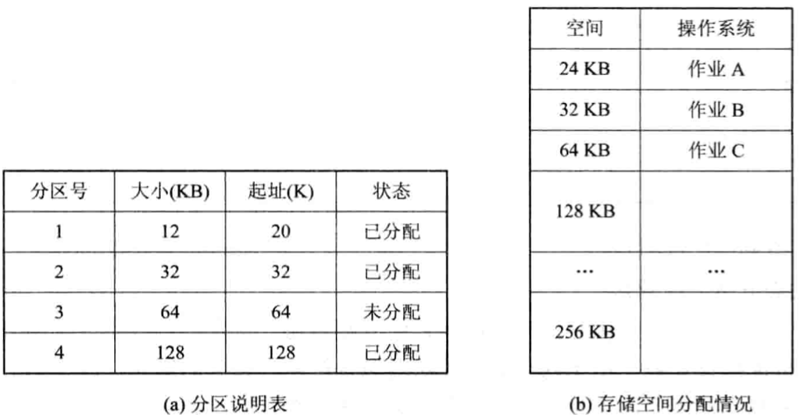
*Fixed partition usage table*

### Dynamic Partition Allocation

Data structures in dynamic partition allocation:
- Free Partition Table (FPT)
  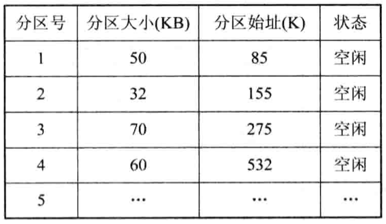
- Free Partition Chain (FPC)
  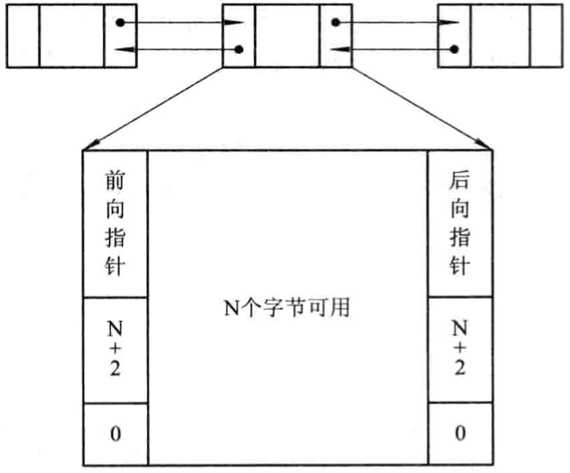

Memory allocation method:
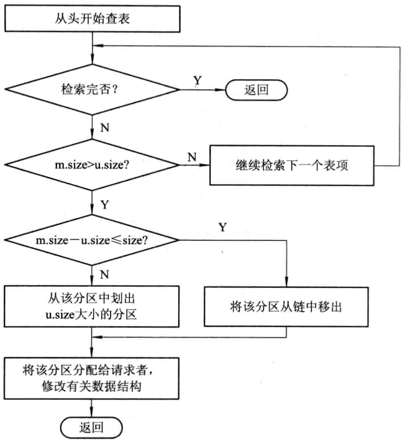

Memory reclamation method:
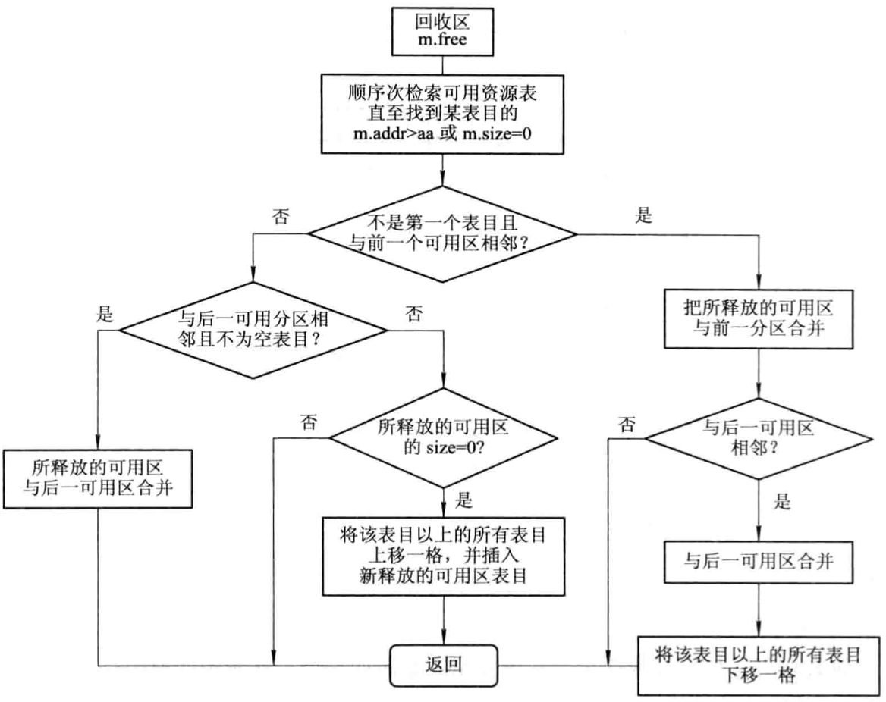
*Memory reclamation process*

#### Sequential Search-Based Dynamic Partition Allocation Algorithms

- `First fit (FF)`: Search from the head of the list until a suitable partition is found.
- `Next fit (NF)`: Start searching from the last found position; if not found by the end, start again from the head.
- `Best fit (BF)`: Sort spaces from small to large, always find the closest fit.
- `Worst fit (WF)`: Sort spaces from large to small, helps reduce fragmentation.

#### Index Search-Based Dynamic Partition Allocation Algorithms

- `Quick fit (QF)`: Classify free spaces by size, create an index table, each entry for a size type, each free partition holds a process.
- `Buddy system (BS)`: All allocated or free partitions are powers of 2 in size ($1 \leqslant k \leqslant m$).
  For a block of size $2^k$ at address $x$, its buddy's address is:
  $$
  buddy_k(x) = 
  \begin{cases}
  x + 2^k \quad (if\ x \bmod 2^{k+1} = 0) \\
  x - 2^k \quad (if\ x \bmod 2^{k+1} = 2^k)
  \end{cases}
  $$
- `Hash algorithm`: When allocating, use a hash function on the required size to find the position in the hash table and the corresponding free partition list for optimal allocation.

#### Dynamic Relocatable Partition Allocation

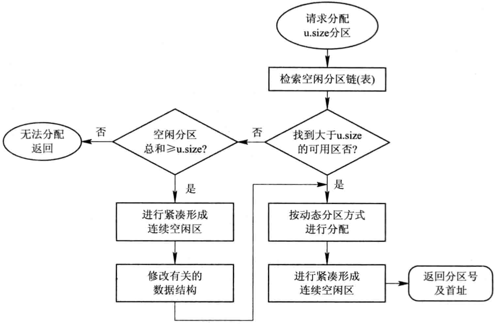
*Dynamic partition allocation algorithm flowchart*

## Paging Storage Management

### Basic Information
1. Pages and frames
	- `Page`: Paging divides a process's logical address space into pages, each with a number.
	- `Page size`: The size of each memory page.
2. Address structure
	
	$P = INT [\frac{A}{L}], d = [A] \bmod L$
	- $L$: page size
	- $P$: page number
	- $A$: address in logical address space
	- $d$: offset within page
	- $INT$: integer division
	- $MOD$: modulo
3. Page table
	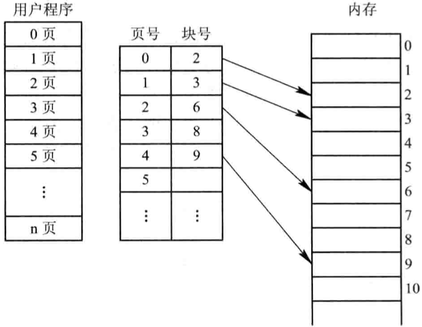

### Address Translation
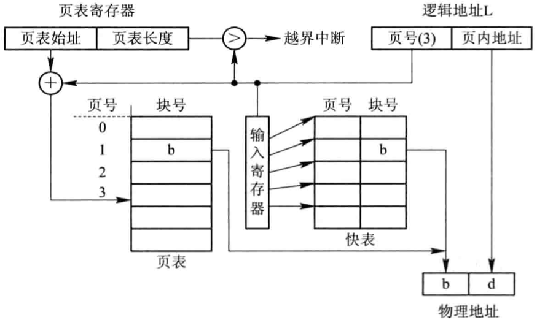
*Address translation mechanism with TLB*

### Effective Access Time
`Effective Access Time (EAT)`: The total time from a process issuing a logical address access request, through address translation, to finding and retrieving the data from the physical address in memory.
$EAT = a \times \lambda + (t + \lambda)(1 - a) + t = 2t + \lambda - t \times a $
- $\lambda$: TLB lookup time
- $a$: hit rate
- $t$: memory access time

Relationship between hit rate and EAT:
| Hit rate (%) a | EAT |
| ------------- | --- |
| 0             | 220 |
| 50            | 170 |
| 80            | 140 |
| 90            | 130 |
| 98            | 122 |

### Multilevel Page Table
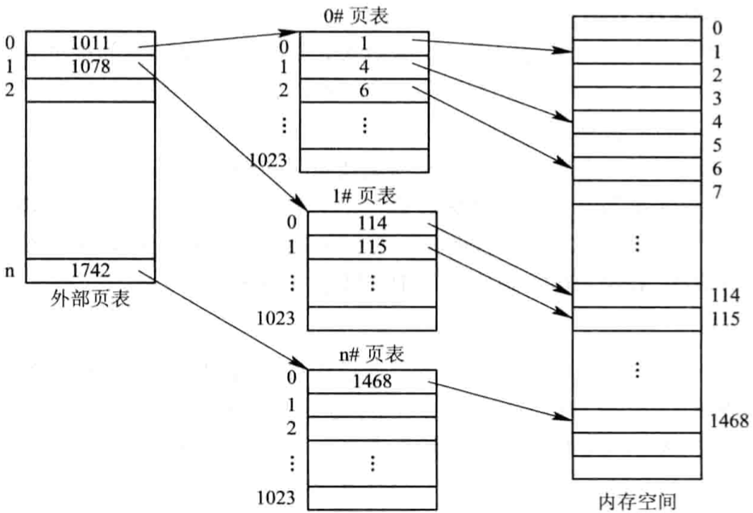
*Two-level page table address translation*

### Information Sharing
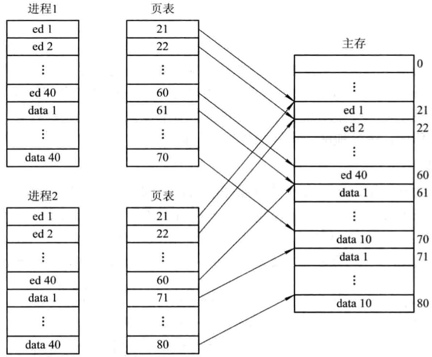

## Segmented Storage Management

### Basic Principle
1. Segmentation
	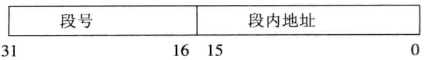
	This address structure allows a job to have up to 64K segments, each up to 64KB.
2. Segment table
	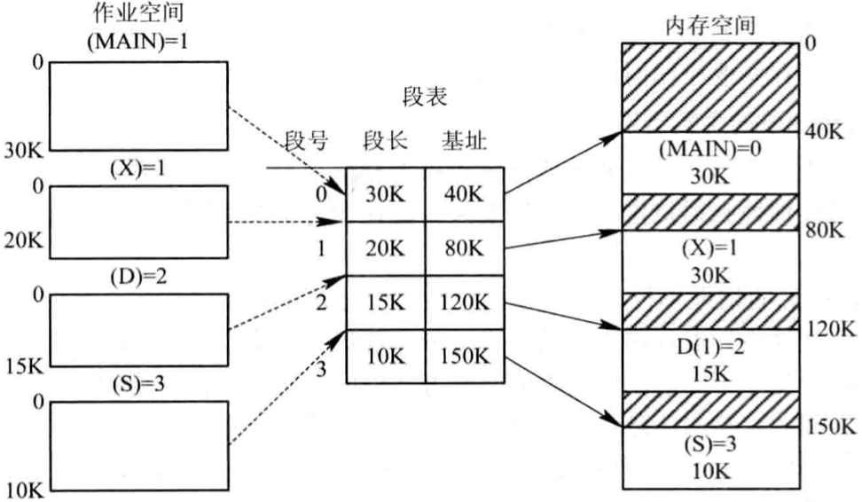
3. Address translation mechanism
	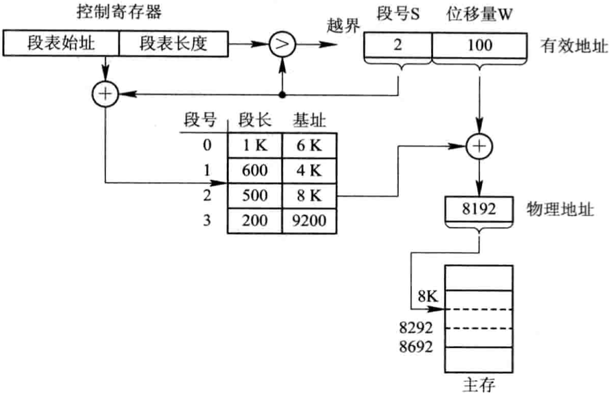

### Information Sharing
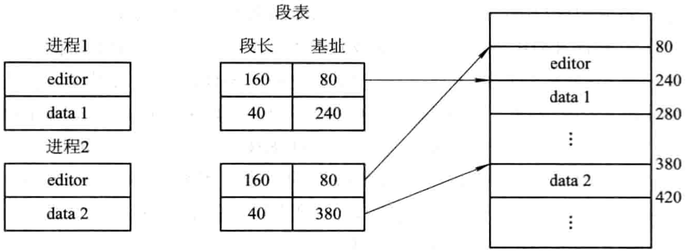

## Segmented Paging Storage Management

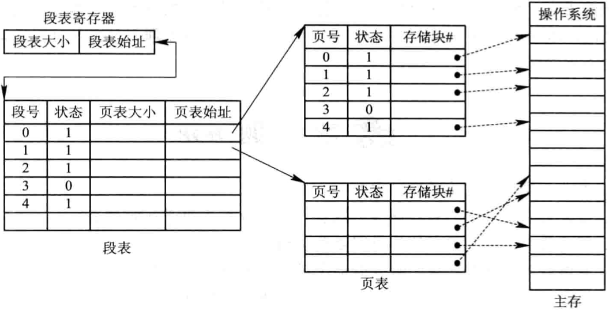
*Address mapping using segment and page tables*
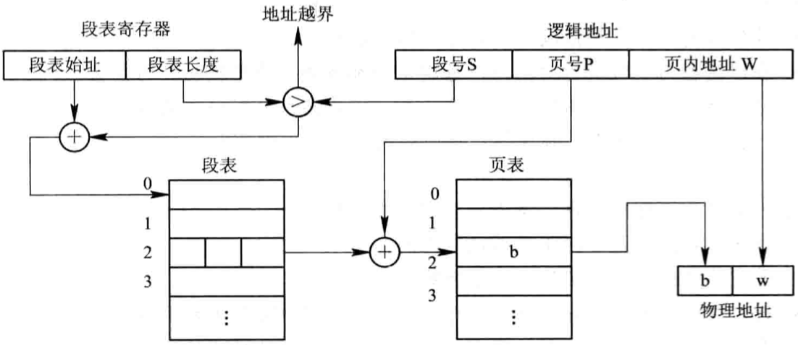
*Address translation mechanism in segmented paging systems*

## Virtual Memory

Has demand paging and replacement, can logically expand memory capacity.

### Implementation Methods
1. Demand paging system
	Main hardware support:
	- Page table mechanism for demand paging
	  `|Page#|Frame#|Present bit P|Access field A|Modify bit M|Disk address|`
	  - `Present bit P`: indicates if the page is in memory
	  - `Access field A`: records how often or how recently the page was accessed
	  - `Modify bit M`: indicates if the page has been modified since being loaded
	  - `Disk address`: where the page is on disk, usually a block number
	- Page fault interrupt mechanism
	  When the required page is not in memory, a page fault interrupt is generated, requesting the OS to load the page.
	- Address translation mechanism
	  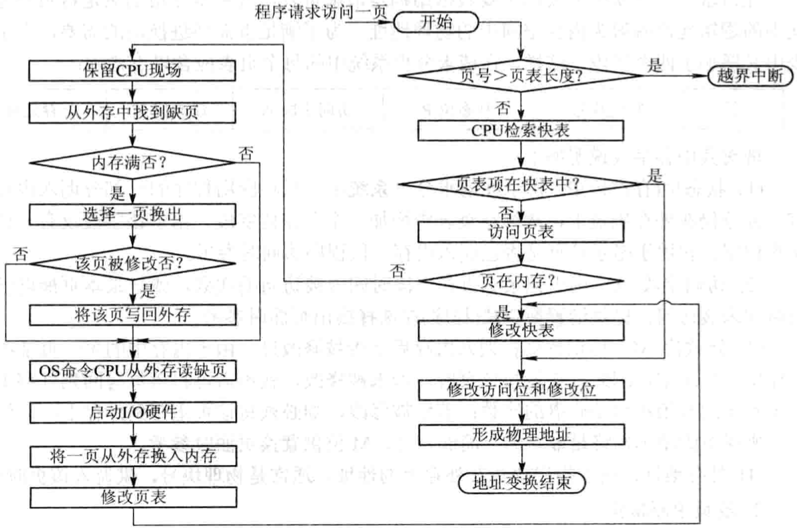
2. Demand segmentation system
	Hardware support:
	- Segment table mechanism for demand segmentation
	- Page fault interrupt mechanism
	- Address translation mechanism
	Segment table entry for demand segmentation:
	`|Segment name|Length|Base|Access mode|Access field A|Modify bit M|Present bit P|Growth bit|Disk base|`
	- `Access mode`
	- `Access field`: frequency of access
	- `Modify bit M`: whether the segment has been modified since loaded
	- `Present bit P`: whether the segment is in memory
	- `Growth bit`: whether the segment has grown dynamically
	- `Disk base`: starting address on disk
	Page fault interrupt mechanism:
	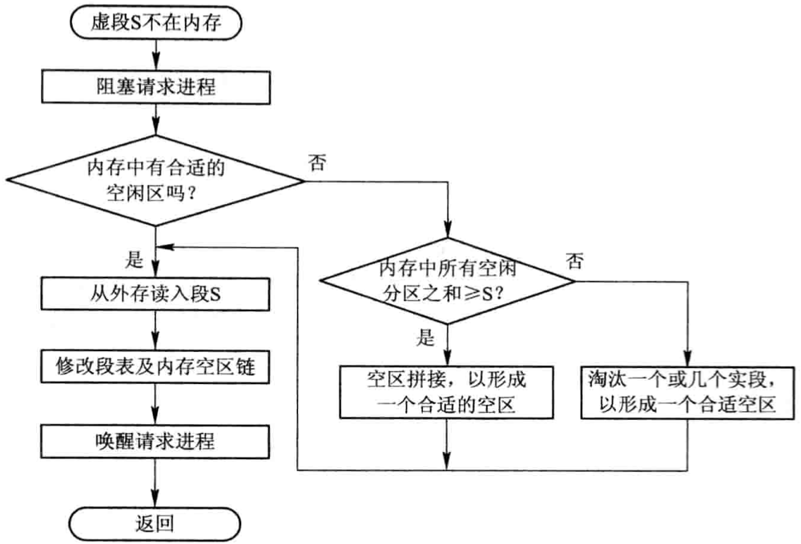
	Address translation mechanism:
	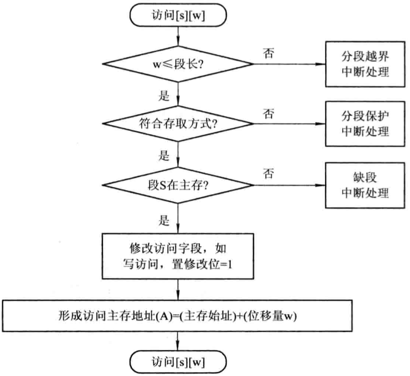
	Shared segment table:
	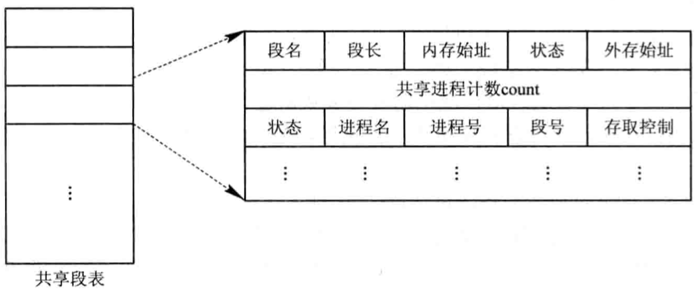
	- `Count`: number of processes sharing the segment
	- `Access control field`: different permissions for different processes
	- `Segment number`: different processes can have different segment numbers for the same segment
	Segment protection:
	- Bounds checking
	- Access control checking
	- Ring protection
	  Lower-numbered rings have higher privilege; OS kernel is in ring 0; important apps and services in middle rings; general apps in outer rings. Rules:
	  1. A program can access data in the same or lower-privilege (outer) rings.
	  2. A program can call services in the same or higher-privilege (inner) rings.
	  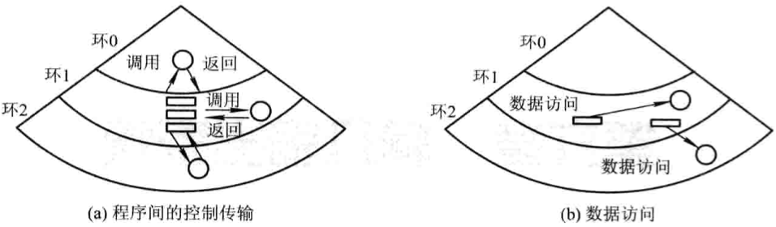
	  *Ring protection mechanism*

### Memory Allocation and Reclamation

`Minimum number of frames`: minimum required for a process to run normally.

#### Memory Allocation Strategies

- `Fixed allocation, local replacement`: Each process gets a fixed number of frames; on a page fault, only pages from its own set are replaced.
- `Variable allocation, global replacement`: Each process gets a certain number of frames, which can change; on a page fault, a free frame is allocated from the OS pool.
- `Variable allocation, local replacement`: Each process gets a certain number of frames; on a page fault, only its own pages are replaced. If page faults are frequent, more frames are allocated; if rare, frames may be reduced.

#### Frame Allocation Algorithms

- `Equal allocation`: Divide all available frames equally among processes.
- `Proportional allocation`: Allocate frames based on process size.
  Total pages: $S = \sum_{i=1}^{n} S_i$
  - $S$: total pages
  - $S_i$: pages per process
  - $n$: number of processes
  Frames per process: $b_i = \frac{S_i}{S} \times m$
  - $b_i$: frames per process (rounded, must be at least the minimum)
  - $m$: total frames
- `Priority-based allocation`: Divide frames into two parts: one part is allocated proportionally, the other by process priority.

### Page-In

| Page-in strategy | Description | Pros and Cons |
| ---------------- | ----------- | ------------ |
| Prepaging        | Load several adjacent pages at once | Inefficient if most are not used; current success rate only 50% |
| Demand paging    | OS loads a page only when requested | Simple, but loads only one page at a time, increasing overhead and disk I/O |

#### Where to Page-In From

Swap space is divided into:
- `File area`: for user files, discrete allocation
- `Swap area`: for swapped pages, contiguous allocation, higher I/O efficiency

Depending on the situation:
- Enough swap space: all pages are loaded from swap area
- Insufficient swap space: unmodified files are loaded from file area; modified parts are swapped out to swap area
- UNIX: never-run pages from file area; previously swapped-out pages from swap area

#### Page Fault Rate

Page fault rate formula:
$f = \frac{F}{S+F}$
- $F$: failed accesses
- $S$: successful accesses

Page fault handling time:
$t = \beta \times t_a + (1 - \beta) \times t_b$
- $\beta$: probability the replaced page was modified
- $t_a$: handling time if modified
- $t_b$: handling time if not modified

Factors affecting page fault rate:
- `Page size`: larger pages, lower fault rate; smaller, higher fault rate
- `Number of frames`: more frames, lower fault rate
- `Page replacement algorithm`: determines number of faults
- `Program locality`: higher locality, lower fault rate

### Page Replacement

#### Optimal Replacement Algorithm
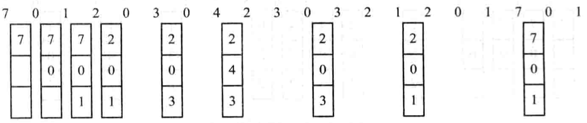

#### FIFO Replacement Algorithm
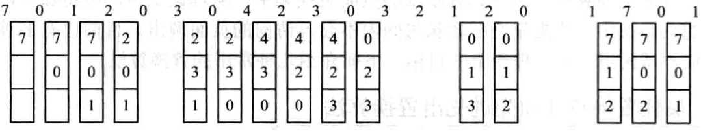

#### Least Recently Used (LRU) Replacement Algorithm
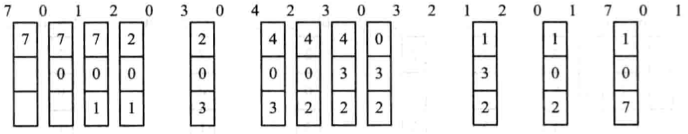

#### Least Frequently Used (LFU) Replacement Algorithm
Each page has a shift register to record access frequency.

#### Clock Replacement Algorithm
1. Simple Clock (Not Recently Used, NRU)
	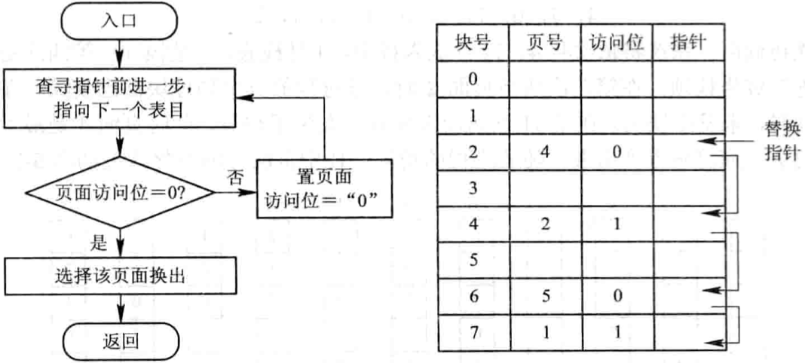
2. Improved Clock
	Adds "replacement cost" using access bit $A$ and modify bit $M$ to form four types:
	- Class 1 (A=0, M=0): not recently accessed or modified, best to replace
	- Class 2 (A=0, M=1): not recently accessed but modified, not ideal to replace
	- Class 3 (A=1, M=0): recently accessed, not modified, may be accessed again
	- Class 4 (A=1, M=1): recently accessed and modified, may be accessed again

#### Page Buffering Algorithm (PBA)
TODO

## Thrashing

`Thrashing`: Too many processes run simultaneously, each with too few frames, causing frequent page faults.

### Multiprogramming Degree and Thrashing
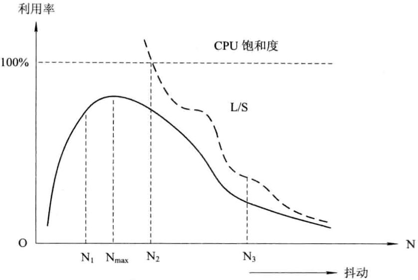

### Preventing Thrashing
1. Use local replacement
2. Integrate working set algorithm into CPU scheduling
3. Use the "L=S" rule to adjust fault rate (L: mean time between faults, S: mean fault service time)
4. Select processes to suspend

## Data Consistency Control

Recovery algorithms
- $undo <T_i>$: restores all data modified by transaction $T_i$ to its previous value
- $redo <T_i>$: sets all data modified by $T_i$ to the new value

### Checkpoints

The main purpose of checkpoints is to regularly clean up the transaction log. At intervals:
1. Write all records in the current transaction log in volatile memory to stable storage
2. Write all modified data in volatile memory to stable storage
3. Write the (checkpoint) record in the transaction log to stable storage
4. When a checkpoint record appears, the system uses redo and undo for recovery

### Concurrency Control
1. Use mutexes for sequentiality
2. Use mutexes and shared locks for sequentiality

### Consistency Issues with Redundant Data
1. Consistency of duplicate files
	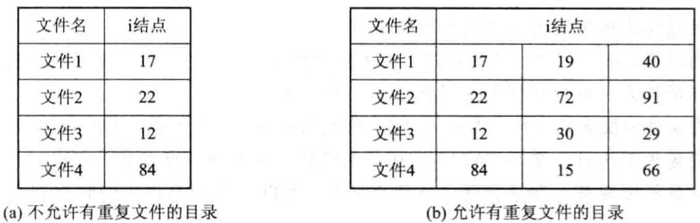
2. 

## Disk Storage

### Classification
- Fixed-head disk
- Movable-head disk

### Data Organization and Format
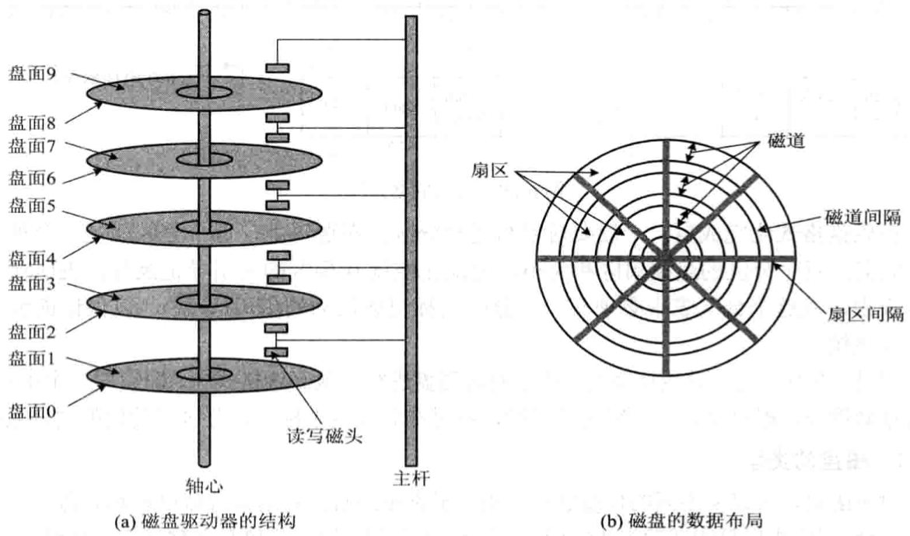
*Disk structure and layout*
Each sector contains two fields:
- `ID Field`: A byte of SYNCH as a delimiter, uses track number, head number, and sector number to identify a sector; CRC for error checking.
- `Data Field`: Stores 512 bytes of data.
  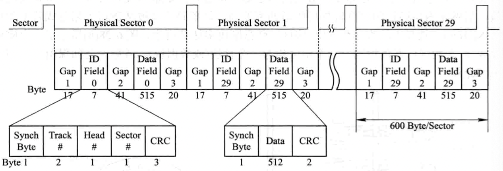
  *Disk formatting*

#### Contiguous Organization
Also called contiguous allocation, allocates a group of adjacent blocks for each file, usually on the same track. No head movement is needed for read/write. This forms a sequential file structure.
Advantages:
1. Easy sequential access
2. Fast sequential access
Disadvantages:
1. Requires contiguous space, causing external fragmentation and low utilization
2. File length must be known in advance
3. Inflexible deletion/insertion
4. Hard to allocate space for dynamically growing files

#### Linked Organization
**Implicit linking**
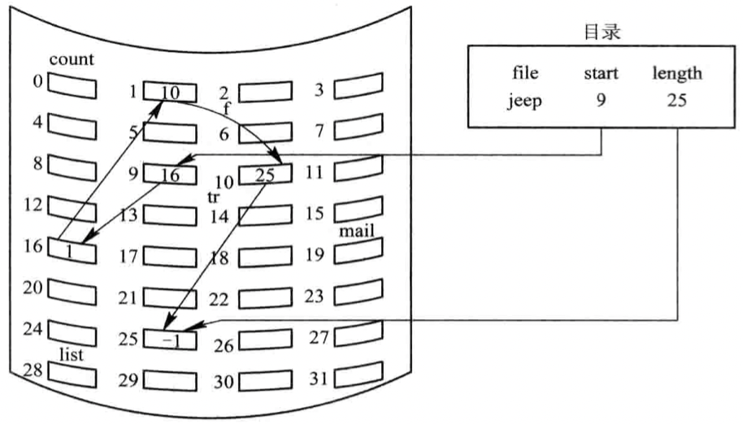
**Explicit linking**
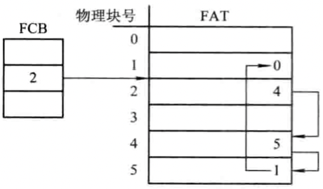
Advantages:
1. Eliminates external fragmentation, improves utilization
2. Easy insertion, deletion, modification
3. Adapts to dynamic file growth

#### FAT
1. FAT12
	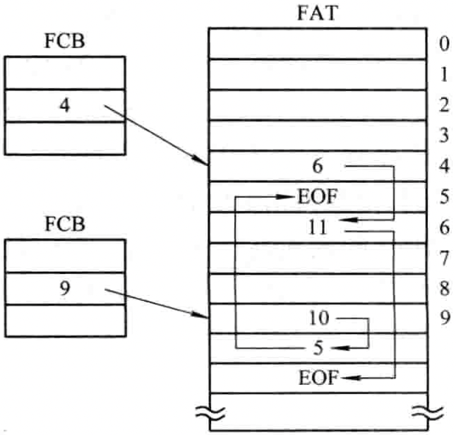
2. FAT16
3. FAT32
	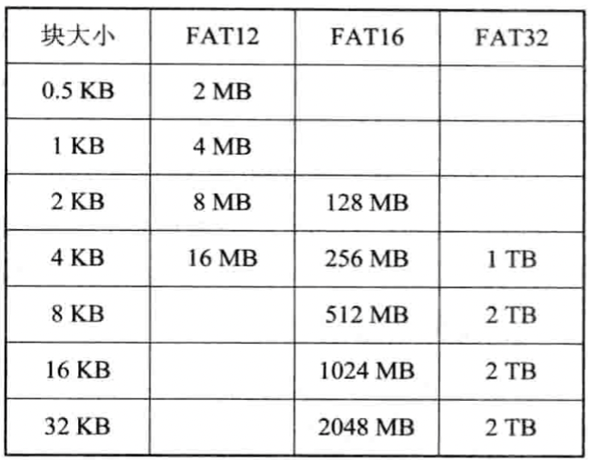

#### NTFS
NTFS uses Logical Cluster Number (LCN) and Virtual Cluster Number (VCN).
LCN numbers all clusters in a volume sequentially. NTFS maps addresses by multiplying the volume factor by the LCN to get the byte offset, thus finding the physical disk address.
NTFS records all file, directory, and free space info in a Master File Table (MFT).

#### Indexed Organization
1. Single-level index
	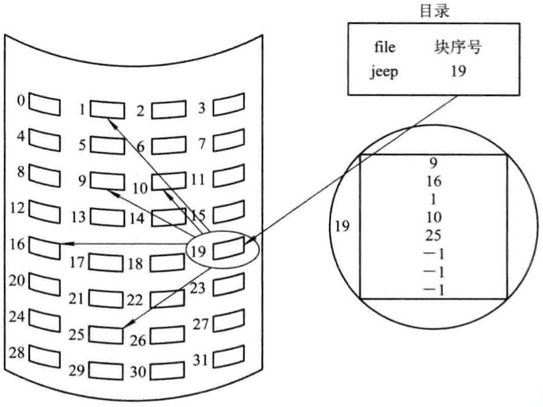
2. Multi-level index
	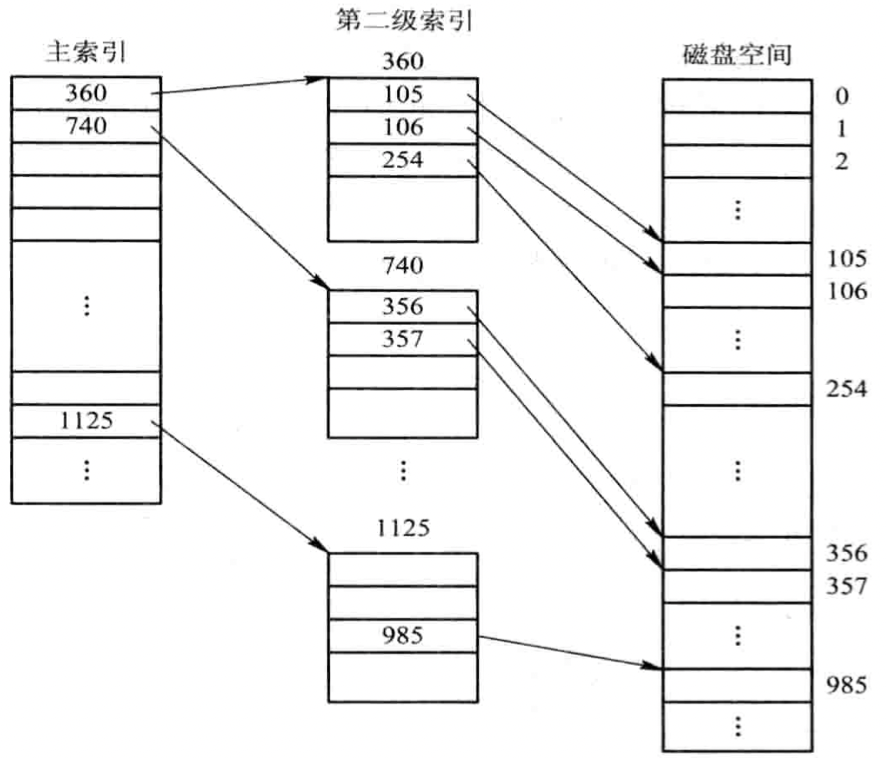
	**Advantages**
	1. Greatly speeds up large file searches
	**Disadvantages**
	1. More index levels means more disk accesses per block
3. Incremental index
	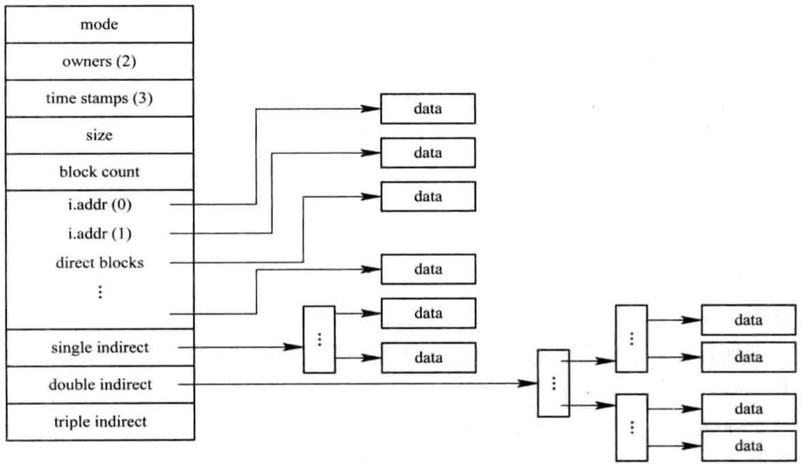
	*Mixed index*

### Storage Space Management

#### Free Table Method
- Free table: System creates a table for all free areas, each entry includes index, first block, and number of free blocks. All free areas are sorted by starting block number.
  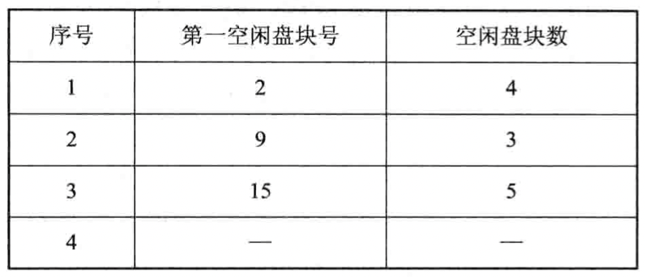
- Allocation and reclamation: To allocate, scan the table for the first area large enough, allocate, and update the table.

#### Free List Method
- Free block list: All free blocks are linked; each block points to the next. To allocate, take blocks from the head; to reclaim, add to the tail.
- Free area list: All free areas (each with several blocks) are linked; each area has a pointer to the next and info on its size.

#### Bitmap Method
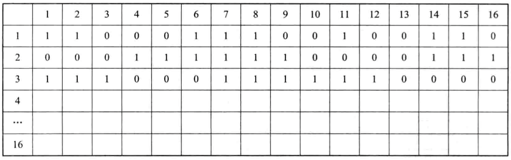
- 0: block is free
- 1: block is allocated
Block allocation steps:
1. Scan bitmap for 0 bits (free)
2. Convert found bits to block numbers: $b = n(i - 1) + j$
	- $n$: bits per row
	- $i$: row
	- $j$: column
3. Set $map[i, j] = 1$
Block reclamation steps:
1. Convert block number to row/column: $i = (b - 1) \div n + 1$, $j = (b - 1) \bmod n + 1$
2. Set $map[i, j] = 0$

#### Group Linking Method
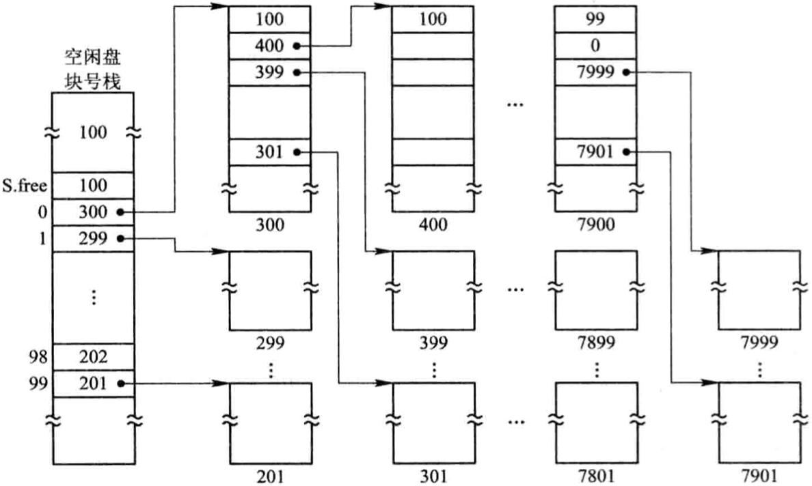
1. Free block number stack stores a group of free block numbers (up to 100) and the count N.
2. All free blocks are divided into groups.
3. Each group's count and block numbers are stored in the first block of the previous group.
4. The first group's info is in the stack as the current available blocks.
5. The last group has 99 blocks; their numbers are in the previous group's first block, with 0 in S.free(0) to mark the end.

### Disk Access

- Seek time $T_s$: time to move the arm to the target track: $T_s = m \times n + s$
  - $m$: constant, usually $m = 0.2$ for normal disks, $m \leqslant 0.1$ for high-speed disks
  - $s$: arm start time
  - $n$: number of tracks moved
- Rotational latency $T_t$: time for the target sector to reach the head; varies by disk speed
- Transfer time $T_t$: time to read/write data: $T_t = \frac{b}{rN}$
  - $b$: bytes per transfer
  - $r$: rotations per second
  - $N$: bytes per track
**Concentrating data transfer improves efficiency.**

### Disk Scheduling Algorithms
1. First-Come, First-Served (FCFS)
	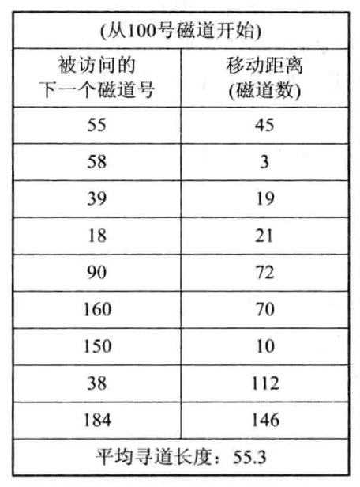
	FCFS is only suitable when there are few disk I/O requests.
2. Shortest Seek Time First (SSTF)
	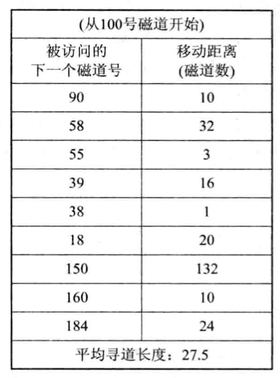
	Chooses the request closest to the current head position; does not guarantee minimum average seek time.
3. SCAN (Elevator) Algorithm
	Considers both distance and head movement direction.
	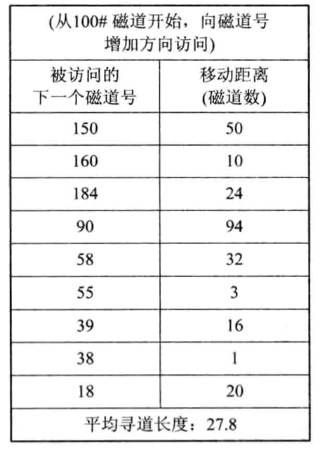
4. Circular SCAN (CSCAN) Algorithm
	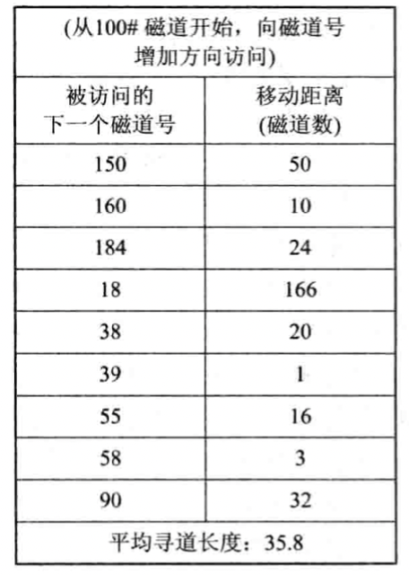
5. NStepSCAN Algorithm
6. FSCAN Algorithm

### Techniques to Improve Disk I/O Speed

#### Disk Cache
1. Data delivery: transfer data directly from cache to process memory
2. Pointer delivery: give a pointer to the cache area
3. Replacement algorithms: based on access frequency, predictability, and data consistency
4. Periodic write-back: In UNIX, an update program runs in the background, periodically calling SYNC to write modified blocks back to disk.

#### RAID
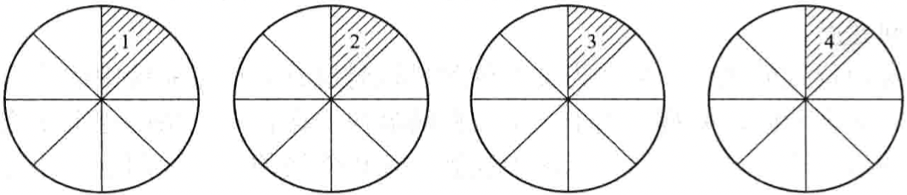
Multiple disk drives; data in each block is split and stored across disks. Parallel transfer greatly reduces transfer time.

#### Others
1. Read-ahead: When reading a block, also read the next block into the buffer.
2. Delayed write: Buffer data is written to disk only when the buffer is reused.
3. Optimize block layout: Place blocks of the same file on the same or adjacent tracks.
4. RAM disk: Simulate a disk using memory; device driver accepts standard disk operations, but they are performed in memory.

### Techniques to Improve Disk Reliability

#### SFT-1 (First Level Fault Tolerance)
1. Dual directory and dual FAT: Maintain main and backup copies on different disks or areas. If the main is damaged, use the backup.
2. Hot-fix redirection and write-after-read verification: Use a small area for hot-fix; after writing, read back and compare. If mismatch, write to hot-fix area.

#### SFT-2 (Second Level Fault Tolerance)
1. Disk mirroring: 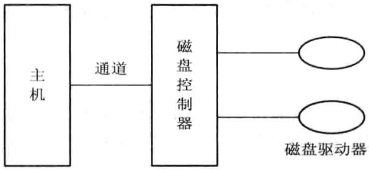 Add an identical disk under the same controller.
2. Disk duplexing: 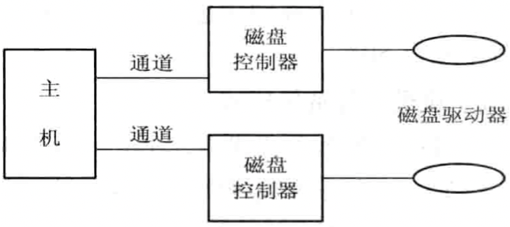 Two disks on separate controllers, mirrored.

#### Cluster-Based Fault Tolerance
1. Dual-machine hot backup: 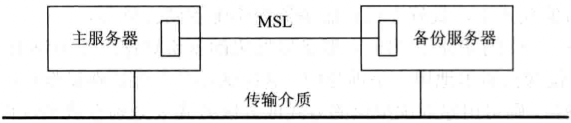
2. Mutual backup: 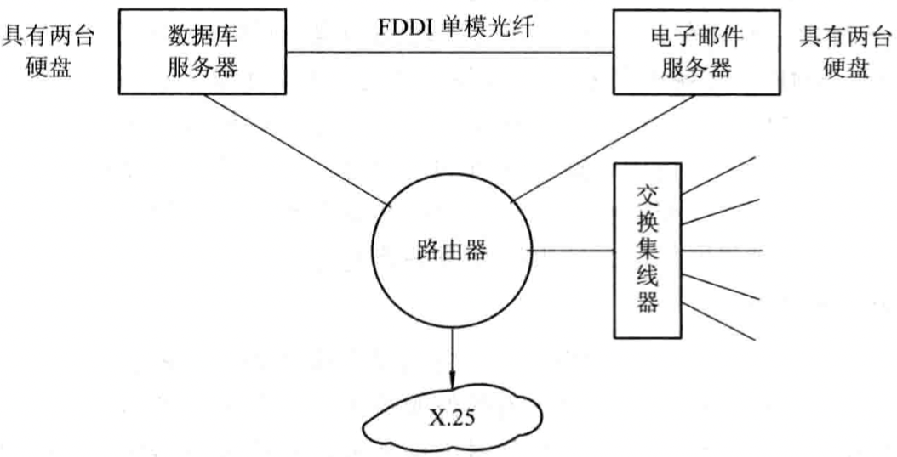
3. Shared disk: Multiple computers share a disk system, divided into volumes. If one fails, another takes over, reducing replication and network/server load.

## Summary

Main differences between paging and segmentation:
- Pages are physical units, system-managed
- Page size is fixed and system-determined; segment length is variable and user-determined
- Paging gives a one-dimensional address space; segmentation gives a two-dimensional address space

## References

[1] Tang Xiaodan, Liang Hongbing, Zhe Fengping, Tang Ziying. Computer Operating Systems. 3rd Edition. P120 - P172
