English | [中文版](storage_zh.md)

# Storage

[TOC]

## File Allocation Methods

The allocation methods define how the files are stored in the disk blocks. There are three main disk space or file allocation methods:

- Contiguous Allocation
- Linked Allocation
- Indexed Allocation

### Contiguous Allocation

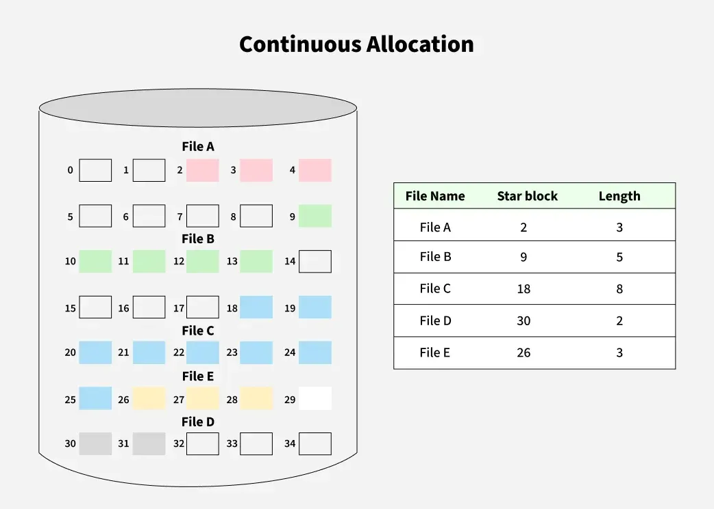

In this scheme, each file occupies a contiguous set of blocks on the disk. This means that given the starting block address and the length of the file (in terms of blocks required), we can determine the block occupied by the file.

### Linked Allocation

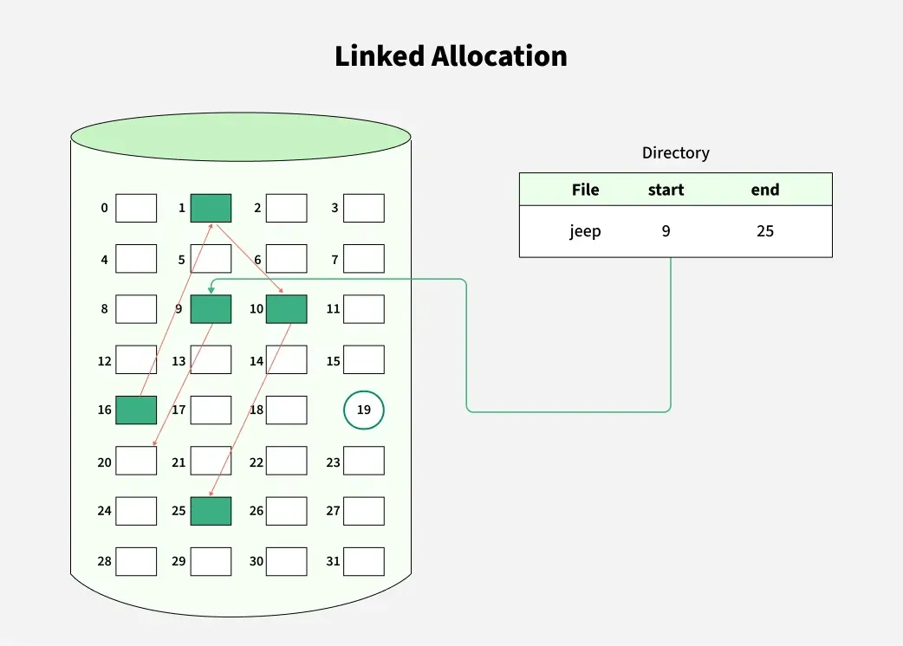

In this scheme, each file is a linked list of disk blocks, which need not be contiguous.

### Indexed Allocation

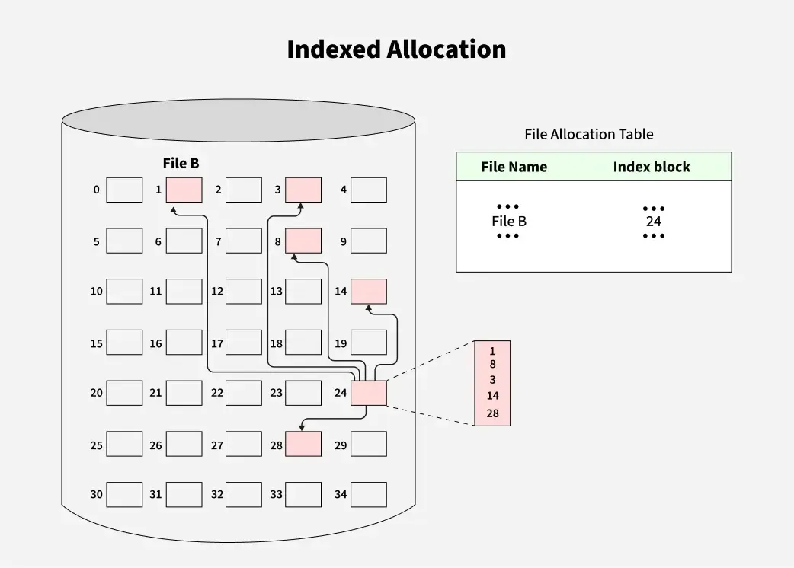

In this scheme, a special block known as the Index block contains the pointers to all the blocks occupied by a file.

---

## File Access Methods

File access methods are techniques used by an OS to read and write data in files. They define how information is organized, retrieved, and modified. There are three ways to access a file in a computer system:

- Sequential-Access
- Direct Access
- Index Sequential Method

### Sequential Access

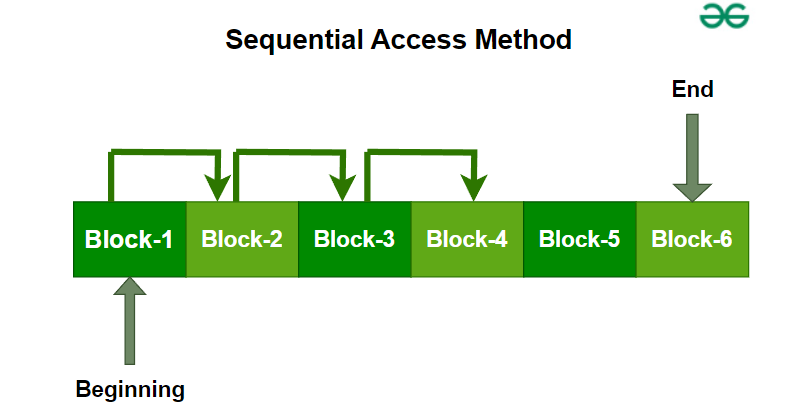

A file access method where data is read or written in order, one record after another, starting from the beginning. The file pointer moves forward automatically after each operation.

### Direct Access Method

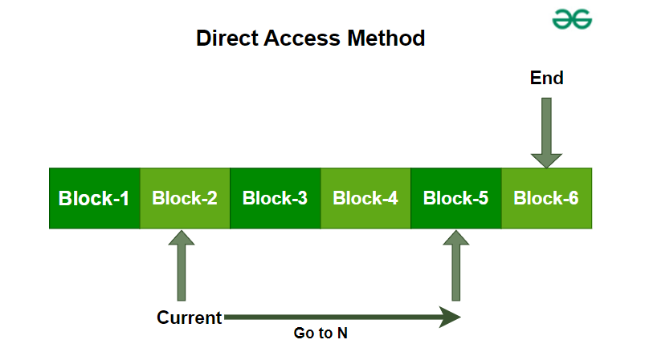

A file access method that allows data to be read or written directly at any block or record, using its address (block number). It supports random access without scanning previous records.

### Index Sequential Method

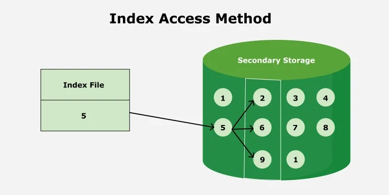

It is the other method of accessing a file that is built on top of the sequential access method. These methods construct an index for the file. The index, like an index in the back of a book, contains pointers to the various blocks. To find a record in the file, we first search the index, and then, with the help of a pointer, we access the file directly.

---

## Disk Scheduling Algorithms

Disk scheduling algorithms manage how data is read from and written to a computer's hard disk.

### Key Terms

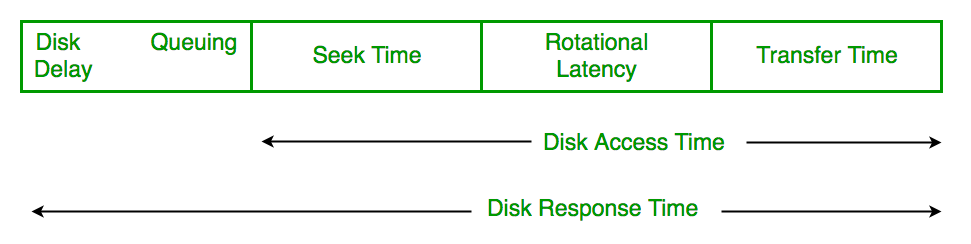

Disk Access Time = Seek Time + Rotational latency + Transfer Time

Total Seek Time = Total head Movement * Seek Time

- **Seek Time**: Time taken to move the disk arm to the track where data is located.
- **Rotational Latency**: Time taken for the desired sector to rotate under the read/write head.
- **Transfer Time**: Time taken to actually read or write the data, depending on disk speed and data size.

### FCFS (First Come First Serve)

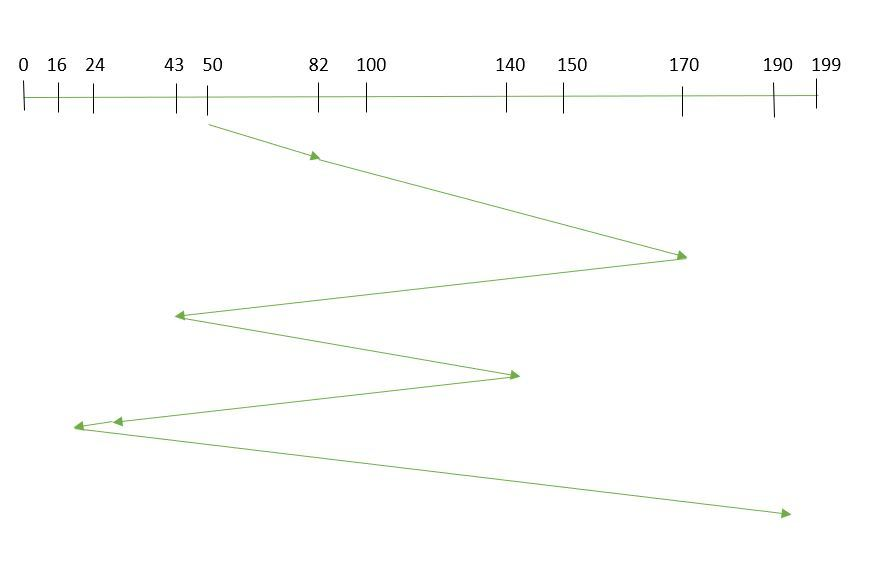

In FCFS, the requests are addressed in the order they arrive in the disk queue.

### SSTF (Shortest Seek Time First)

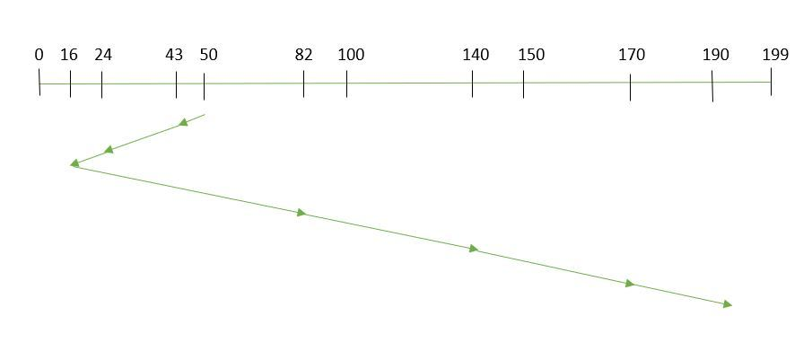

In SSTF, requests having the shortest seek time are executed first. So, the seek time of every request is calculated in advance in the queue and then they are scheduled according to their calculated seek time. As a result, the request near the disk arm will get executed first.

### SCAN

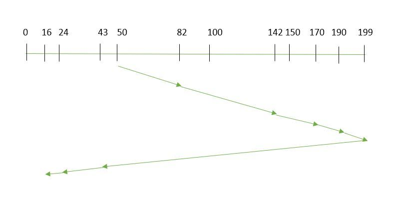

In the SCAN algorithm the disk arm moves in a particular direction and services the requests coming in its path and after reaching the end of the disk, it reverses its direction and again services the request arriving in its path. So, this algorithm works as an elevator and is hence also requests at the midrange are serviced more and those arriving behind the disk arm will have to wait.

### C-SCAN

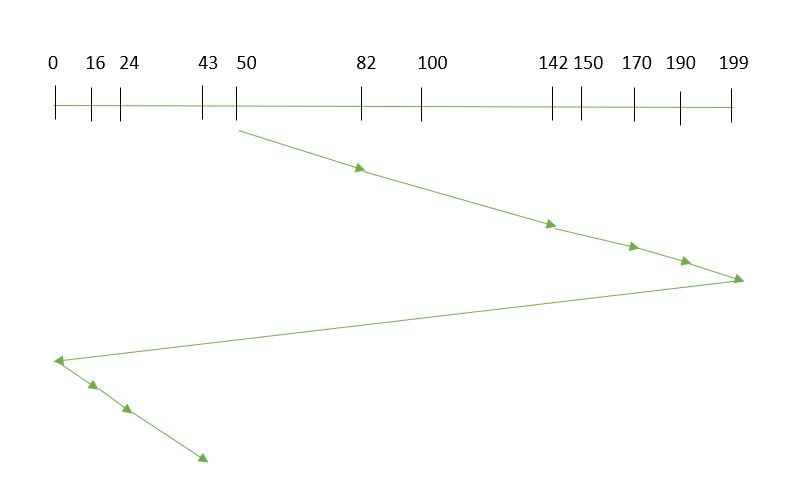

The CSCAN algorithm reversing the disk arm direction goes to the other end of the disk and starts servicing the requests from there. So, the disk arm moves in a circular fashion and this algorithm is also similar tothe SCAN algorithm hence it is known as C-SCAN (Circular SCAN).

### LOOK

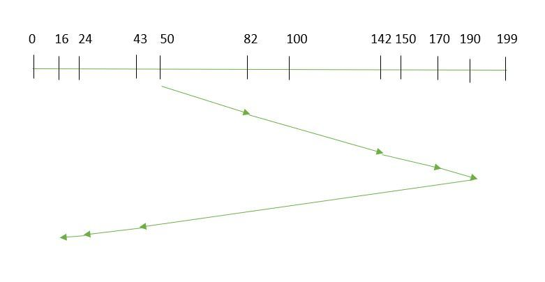

LOOK Algorithm is similar to the SCAN disk scheduling algorithm except for the difference that the disk arm in spite of going to the end of the disk goes only to the last request to be serviced in front of the head and then reverses its direction from there only. Thus it prevents the extra delay which occurred due to unnecessary traversal to the end of the disk.

### C-LOOK

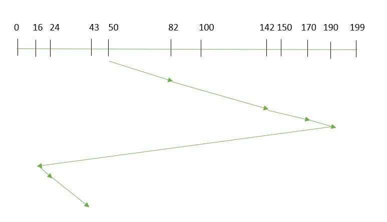

In CLOOK, the disk arm, in spite of going to the end, goes only to the last request to be serviced in front of the head, and then from there goes to the other end's last request. Thus, it also prevents the extra delay that occurred due to unnecessary traversal to the end of the disk.

### RSS (Random Scheduling)

TODO

### LIFO (Last-In First-Out)

TODO

### N-STEP SCAN

TODO

### F-SCAN

TODO

---

## Secondary Memory Device

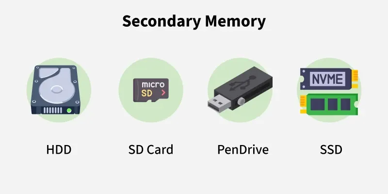

Secondary memory, also known as secondary storage, refers to the storage devices and systems used to store data persistently, even when the computer is powered off.

### Hard Disk Drive (HDD)

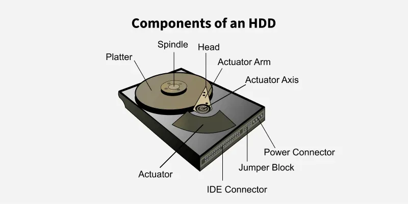

A hard disk drive (HDD) is a fixed storage device inside a computer that uses magnetic technology to retrieve and store digital data for the long term.

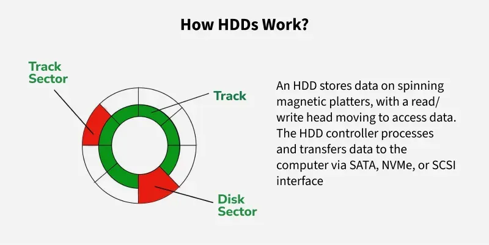

### Solid-State Drive (SSD)

TODO

### Optical Discs (CD, DVD, Blu-ray)

An optical disk is a storage medium that relies on laser technology to read and write data. In shape, it is a flat circular disk that is made up of polycarbonate or a similar material with a very shiny reflective layer on the surface.

### USB Flash Drives

TODO

### Magnetic Tapes

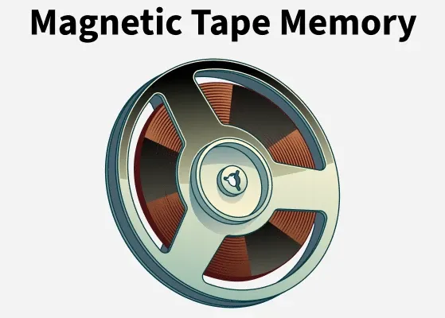

In magnetic tape, only one side of the ribbon is used for storing data. It is a sequential memory that contains a thin plastic ribbon to store data and is coated with magnetic oxide. Data read/write speed is slower because of sequential access. It is highly reliable, which requires a magnetic tape drive for writing and reading data.

### Flash Memory Cards (SD Cards, MicroSD Cards)

Flash memory is secondary memory, and so it is not volatile, which means it retains the data even if there is no electrical supply provided. This flash memory works on the principle of EEPROM. EEPROM stands for Electrically Erasable Programmable Read-Only Memory. ROM operation can only one time write once and read many times, and we can't erase it. But Flash Memory can be erased multiple times and update the data or program integrated into it. So it gives flexibility to the updation of the program, but ROM has no such type of feature.

### External Hard Drives

TODO

---

## Spooling

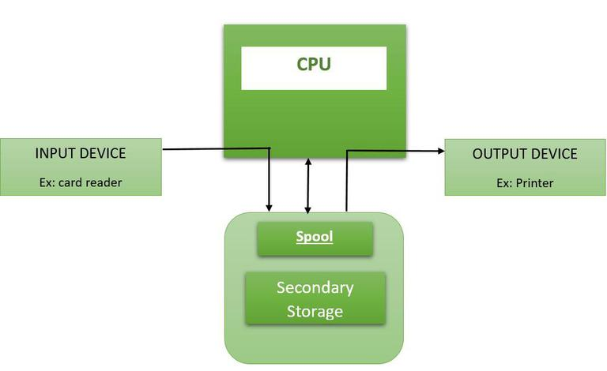

Spooling is a special process in a special area on disk where data is temporarily stored and queued for execution. A spool is similar to a buffer as it holds the jobs for a device until the device is ready to accept the job. It considers the disk as a huge buffer that can store as many jobs for the device till the output devices are ready to accept them.

---

## RAID

RAID(Redundant Array of Independent Disks) is a technique that combines multiple hard drives or SSDs into a single system to improve performance, data safety, or both. If one drive fails, data can still be recovered from the others.

### Key Evaluation Points

When evaluating a RAID system, the following critical aspects should be considered:

1. Reliability
2. Availability
3. Performance
4. Capacity

### RAID Controller

A RAID controller manages multiple hard drives, making them work together as one system. It helps improve speed and adds data protection by handling drive failures. Think of it as a smart manager that boosts performance and keeps your data safe.

Types of RAID Controller:

1. Hardware-Based
2. Software-Based
3. Firmware-Based

### RAID Levels

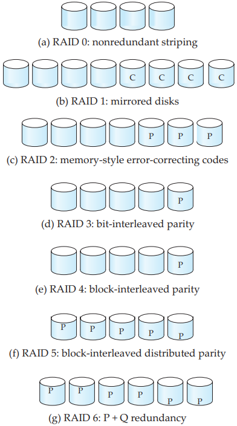

- `RAID level 0`, refers to disk arrays with striping at the level of blocks, but without any redundancy (such as mirroring or parity bits).
- `RAID level 1`, refers to disk mirroring with block striping.
- `RAID level 2`, known as memory-style error-correcting code (ECC) organization, employs parity bits. 
- `RAID level 3`, bit-interleaved parity organization.
- `RAID level 4`, block-interleaved parity organization.
- `RAID level 5`, block-interleaved distributed parity.
- `RAID level 6`, the $P + Q$ The redundancy scheme is much like RAID level 5, but stores extra redundant information to guard against multiple disk failures.

The RAID Levels Comparison Table (0–6, 10, 50, 60):

|  RAID Level   |                    Technique                     |       Fault Tolerance       |     Usable Capacity     |            Performance             |                      Advantages                      |                        Disadvantages                         |
| :-----------: | :----------------------------------------------: | :-------------------------: | :---------------------: | :--------------------------------: | :--------------------------------------------------: | :----------------------------------------------------------: |
|  **RAID 0**   |               Block-Level Striping               |           0 disks           |          N × B          |        Excellent read/write        |          Fastest performance, full capacity          |      No redundancy, one disk failure → total data loss       |
|    RAID 1     |                    Mirroring                     | Up to N/2 disks (best case) |       (N × B) / 2       |      Good read, average write      |           High reliability, easy recovery            |                 50% storage loss, expensive                  |
|    RAID 2     |        Bit-Level Striping + Hamming Code         |           1 disk            | (N − parity drives) × B |                Fast                |               Strong error correction                |                     Complex, rarely used                     |
|    RAID 3     |      Byte-Level Striping + Dedicated Parity      |           1 disk            |       (N − 1) × B       |    Good sequential performance     |           High throughput for large files            |      Slow for small/random I/O, parity disk bottleneck       |
|    RAID 4     |     Block-Level Striping + Dedicated Parity      |           1 disk            |       (N − 1) × B       |             Fast reads             |         Single parity disk makes writes slow         |                    Parity disk bottleneck                    |
|    RAID 5     |    Block-Level Striping + Distributed Parity     |           1 disk            |       (N − 1) × B       |     Good read, moderate write      |       Balanced cost + performance + redundancy       |               Slow random writes due to parity               |
|    RAID 6     | Block-Level Striping + Double Distributed Parity |           2 disks           |       (N − 2) × B       |      Good read, slower write       | Can survive ***\*2 disk failures\****, very reliable |                 More parity → slower writes                  |
| RAID 10 (1+0) |               Mirroring + Striping               |   1 disk per mirror pair    |       (N × B) / 2       |        Excellent read/write        |                 Fastest + redundancy                 |               Needs even # of disks, expensive               |
| RAID 50 (5+0) |        Block Striping over RAID-5 arrays         |   1 disk per RAID-5 group   |     G × (n − 1) × B     | High performance & good redundancy |   High speed + better fault tolerance than RAID 5    | Cannot tolerate >1 disk failure per group; rebuilds are slow; parity overhead; complex setup |
| RAID 60 (6+0) |        Block Striping over RAID-6 arrays         |  2 disks per RAID-6 group   |     G × (n − 2) × B     | Very high redundancy + good speed  |     Survives 2 failures per group, very reliable     | High cost; requires many disks; slower writes due to double parity; complex configuration |

---

## Summary

### HDD vs SDD

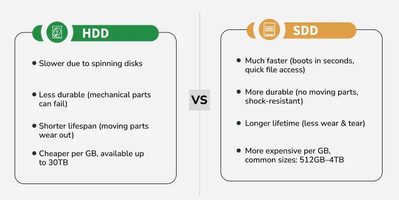

### Spooling vs Buffering

| Spooling                                                     | Buffering                                                    |
| ------------------------------------------------------------ | ------------------------------------------------------------ |
| Overlaps the input/output of one job with the execution of another job. | Overlaps the input/output of a job with the execution of the same job. |
| Stands for Simultaneous Peripheral Operation On-Line.        | Has no full form.                                            |
| More efficient since multiple jobs can be processed at the same time. | Less efficient compared to spooling.                         |
| Uses disk as a large buffer.                                 | Uses a limited area of main memory (RAM).                    |
| Supports remote processing.                                  | Does not support remote processing.                          |
| Implemented using spoolers to manage I/O requests and resources. | Implemented using software or hardware buffers like FIFO or circular buffers. |
| Can handle large amounts of data as storage is on disk.      | Limited by the size of main memory.                          |
| Provides better recovery from errors since data is stored on disk. | Buffer overflow may cause data loss or corruption.           |
| More complex due to additional management software.          | Simpler and easier to implement.                             |

## References

[1] [File Systems in Operating System](https://www.geeksforgeeks.org/operating-systems/file-systems-in-operating-system/)

[2] [Unix File System](https://www.geeksforgeeks.org/operating-systems/unix-file-system/)

[3] [Path Name in File Directory](https://www.geeksforgeeks.org/operating-systems/path-name-in-file-directory/)

[4] [Structures of Directory in Operating System](https://www.geeksforgeeks.org/operating-systems/structures-of-directory-in-operating-system/)

[5] [File Allocation Methods](https://www.geeksforgeeks.org/operating-systems/file-allocation-methods/)

[6] [File Access Methods in Operating System](https://www.geeksforgeeks.org/operating-systems/file-access-methods-in-operating-system/)

[7] [Secondary Memory](https://www.geeksforgeeks.org/computer-science-fundamentals/secondary-memory/)

[8] [Hard Disk Drive (HDD) Secondary Memory](https://www.geeksforgeeks.org/computer-organization-architecture/hard-disk-drive-hdd-secondary-memory/)

[9] [Disk Scheduling Algorithms](https://www.geeksforgeeks.org/operating-systems/disk-scheduling-algorithms/)

[10] [Spooling vs Buffering](https://www.geeksforgeeks.org/operating-systems/difference-between-spooling-and-buffering/)

[11] [RAID (Redundant Arrays of Independent Disks)](https://www.geeksforgeeks.org/dbms/raid-redundant-arrays-of-independent-disks/)

[12] [Magnetic Tape memory](https://www.geeksforgeeks.org/computer-organization-architecture/magnetic-tape-memory/)

[13] [What is an Optical Disk?](https://www.geeksforgeeks.org/computer-organization-architecture/what-is-an-optical-disk/)
