# 存储器

[TOC]

## 层次结构

- CPU寄存器
  - 寄存器
- 主存
  - 高速缓存
  - 主存储器
  - 磁盘缓存
- 辅存
  - 固定磁盘
  - 可移动存储介质

## 连续分配存储管理

### 单一连续分配

只能用于单用户，单任务的OS，分为系统区和用户区。

### 固定分区分配

将内存中的用户空间分为固定大小的若干分区，每个分区装入一道作业；

划分分区的方法：

- 大小相等的分区；
- 大小不相等的分区；

内存分配方法：

将分区按大小排队，并建立一张分区使用表；

*固定分区使用表*

### 动态分区分配

动态分区分配中的数据结构：

- 空闲分区表(Free Partition Table, FPT)

  

- 空闲分区链(Free Partition Chain, FPC)

  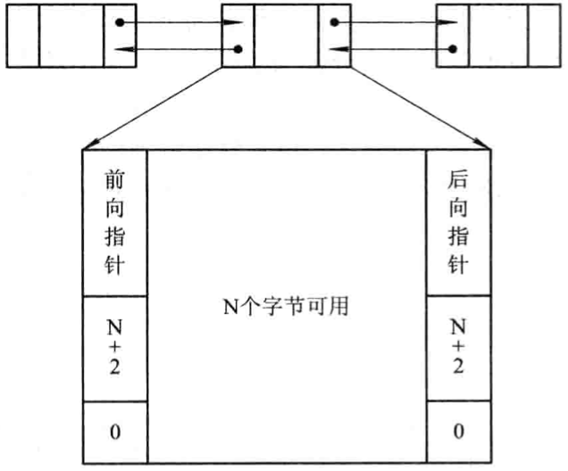

内存分配方法：

内存回收方法：

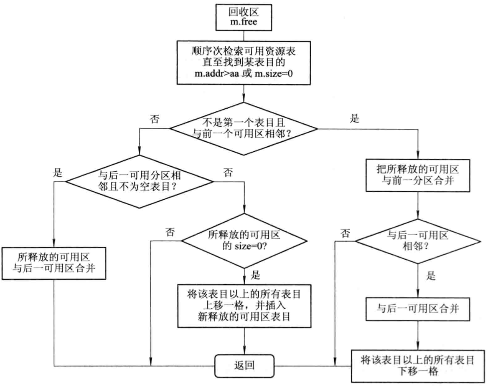

*内存回收流程*

#### 基于顺序搜索的动态分区分配算法

- `首次适应算法(first fit, FF)` 

  在链表中从头开始找，找到为止；

- `循环首次适应算法(next fit, NF)` 

  从上一次找到的位置开始找，找到合适的为止，到了链尾还没有找到的话，再从链头开始找；

- `最佳适应算法(best fit, BF)` 

  将空间从小到大排列，从头开始找，每次找到的都是最接近要求的大小；

- `最坏适应算法(worst fit, WF)` 

  将空间从大到小排列，从头开始找，有利于减少碎片的产生。

#### 基于索引搜索的动态分区分配算法

- `快速适应算法(quick fit, QF)` 

  将空闲空间按大小分类，建立一张管理索引表，每一项对应一种大小类型，每个空闲分区放一个进程；

- `伙伴系统(buddy system, BS)` 

  无论已分配分区或空闲分区，其大小均为2的$k$次幂(k为整数，$1 \leqslant k \leqslant m$)。

  对于一个大小为$2^k$，地址为$x$的内存块，其伙伴块的地址用$buddy_k(x)$表示，其通式为：
  $$
  buddy_k(x) = 
  \begin{cases}
  x + 2^k (若xMOD 2^{k+1} = 0) \\
  x - 2^k (若xMOD x^{k+1} = x^k)
  \end{cases}
  $$

- `哈希算法` 

  进行空闲分区分配时，根据所需空闲分区大小，通过哈希函数计算，即得到在哈希表中的位置，从中得到相应的空闲分区链表，实现最佳分配策略。

#### 动态可重定位分区分配

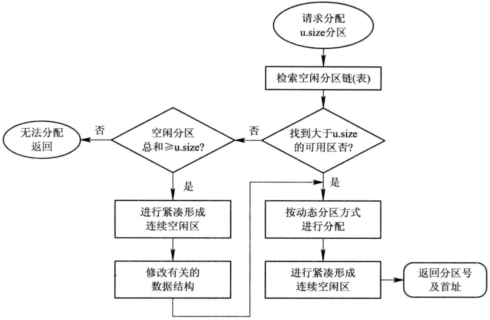

*动态分区分配算法流程图*

## 分页存储管理

### 基本信息

1. 页面和物理块

   - `页面`分页存储管理将进程的逻辑地址空间分成若干个页，并为各页加以编号。
   - `页面大小`每个内存页的大小。

2. 地址结构

   

   $P = INT [\frac{A}{L}], d = [A]MOD \ L$

   - $L$ 页面大小
   - $P$ 页号
   - $A$ 逻辑地址空间中的地址
   - $d$ 页内地址
   - $INT$ 整除函数
   - $MOD$ 取余函数

3. 页表

   

### 地址变换

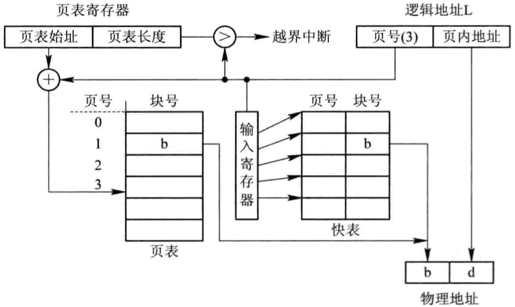

*具有快表的地址变换机构*

### 访问内存的有效时间

`有效访问时间(Effective Access Time, EAT)` 从进程发出指定逻辑地址的访问请求，经过地址变换，到在内存中找到对应的实际物理地址单元并取出数据，所需要花费的总时间。

$EAT = a \times \lambda + (t + \lambda)(1 - a) + t = 2t + \lambda - t \times a $

- $\lambda$ 查找快表所需的时间
- $a$ 命中率
- $t$ 访问一次内存所需要的时间

不同命中率与有效访问时间的关系：

| 命中率(%) a | 有效访问时间 EAT |
| ----------- | ---------------- |
| 0           | 220              |
| 50          | 170              |
| 80          | 140              |
| 90          | 130              |
| 98          | 122              |

### 多级页表

*具有两级页表的地址变换机构*

### 信息共享

## 分段存储管理

### 基本原理

1. 分段

   

   该地址结构中，允许一个作业最长有64K个段，每个段的最大长度为64KB。

2. 段表

   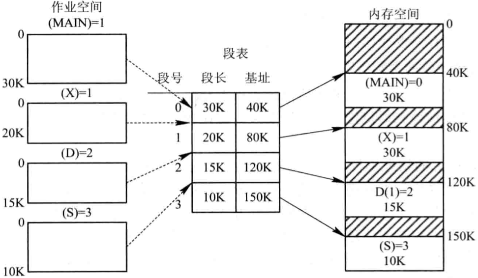

3. 地址变换机构

   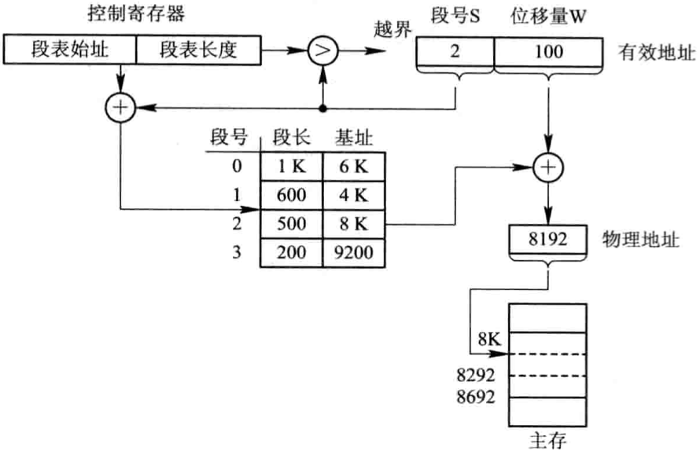

### 信息共享

## 段页式存储管理

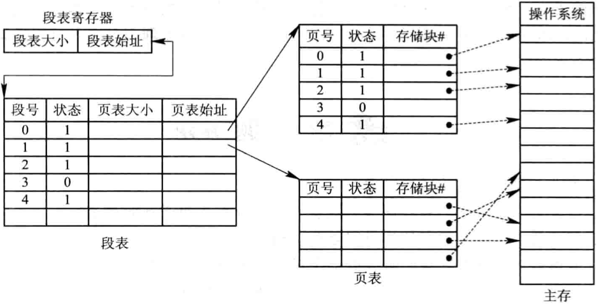

*利用段表和页表实现地址映射*

*段页式系统中的地址变换机构*

## 虚拟存储

具有请求调入功能和置换功能，能从逻辑上对内存容量加以扩充的一种存储器系统。

### 虚拟存储器的实现方法

1. 分页请求系统

   主要的硬件支持：

   - 请求分页的页表机制

     `|页号|物理块号|状态位P|访问字段A|修改位M|外存地址|`

     - `状态位P（存在位）` 指示该页是否已调入内存
     - `访问字段A` 记录本页再一段时间内被访问的次数，或记录本页最近已有多长时间未被访问
     - `修改位M` 标识该页在调入内存后是否被修改过
     - `外存地址` 指出该页在外存上的地址，通常是物理块号

   - 缺页中断机构

     当所要访问的页面不在内存时，产生缺页中断，请求OS将所缺页调入内存。

   - 地址变换机构

     

2. 请求分段系统

   硬件支持：

   - 请求分段的段表机制；
   - 缺页中断机构；
   - 地址变换机构。

   请求分段的段表项：

   `|段名|段长|段基址|存取方式|访问字段A|修改位M|存在位P|增补位｜外存始址｜`

   - `存取方式` 
   - `访问字段` 记录该段被访问的频繁程度
   - `修改位M` 表示该页在进入内存后是否已被修改过
   - `存在位P` 指示本段是否已调入内存
   - `增补位` 表示本段在运行过程中是否做过动态增长
   - `外存始址` 本段在外存中的起始地址，即起始盘块号

   缺段中断机构：

   

   地址变换机构：

   

   共享段表：

   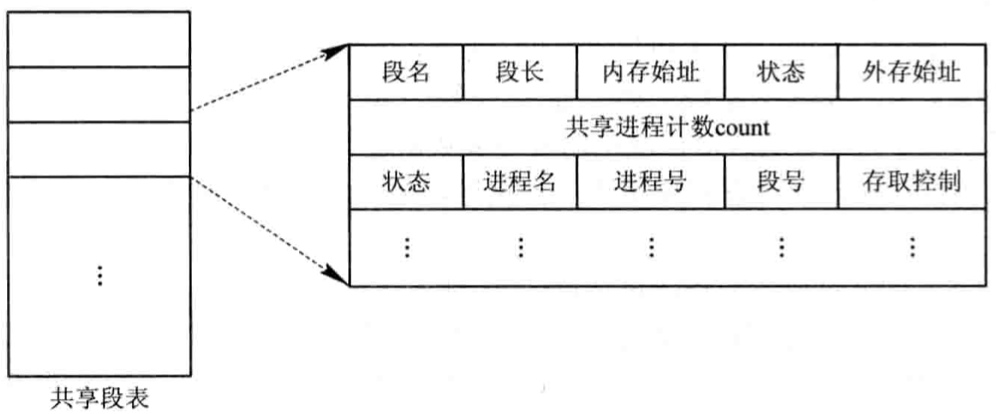

   - `共享进程计数count` 记录有多少进程正在共享该分段；
   - `存取控制字段` 对于一个共享段，为不同的进程赋予不同的存取权限；
   - `段号` 不同的进程可以拥有不同的段号，每个进程可用自己进程的段号去访问该共享段。

   分段保护：

   - 越界检查

   - 存取控制检查

   - 环保护机构

     低编号的环具有高优先权，OS核心处于0号环内；某些重要的应用程序和操作系统服务占据中间环；一般的应用程序被安排在外环上；在环系统中，程序的访问和调用应遵循以下规则：

     1. 一个程序可以访问驻留在相同环或较低特权环（外环）中的数据；
     2. 一个程序可以调用驻留在相同环或较高特权环（内环）中的服务。

     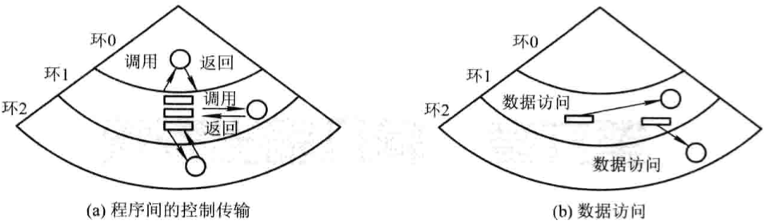

     *环保护机构*

     

### 内存分配与回收

`最小物理块数` 保证进程正常运行所需的最小物理块数。

#### 内存分配策略

- `固定分配局部置换(Fixed Allocation, Local Replacement)` 

  为每个进程分配一组固定数目的物理块，在进程运行期间不再改变；如果进程运行中发现缺页，则只能从分配给该进程的n个页面中选出一页换出，然后再调入一页，以保证分配给该进程的内存空间不变。

- `可变分配全局置换(Variable Allocation, Global Replacement)` 

  为每个进程分配一定数目的物理块，在进程运行期间根据情况适当增加或减少；如果进程运行中发现缺页，则将OS所保留的空闲物理块取出一块分配给进程。

- `可变分配局部置换(Variable Allocation, Local Replacement)`

  为每个进程分配一定数目的物理块，当发现缺页时，只允许从该进程在内存的页面中选择一页换出，这样就不会影响其它进程的运行。如果进程在运行中频繁发生缺页中断，则系统再为该进程纷飞若干附加的的物理块；如果进程在运行中缺页率特别低，在不引起缺页率明显增加的情况下，适当减少分配给该进程的物理块数。

#### 物理块分配算法

- `平均分配算法` 将系统中所有可供分配的物理块平均分配给各进程

- `按比例分配算法` 根据进程大小按比例分配物理块；

  系统中各进程页面数总和计算公式：$S = \sum_{n}^{i=1} S_i$

  - $S$ 进程页面数总和
  - $S_i$ 每个进程页面数
  - $n$ 进程个数

  每个进程所能分配到的物理块数计算公式：$b_i = \frac{S_i}{S} \times m$

  - $b_i$ 进程能分到的物理块数（取整，必须大于最小物理块数）
  - $m$ 物理块总数

- `考虑优先权的分配算法` 把内存中可供分配的所有物理块分成两部分：一部分按比例分配给各进程；另一部分则根据各进程的优先权进行分配，为高优先进程适当增加份额。

### 页面调入

| 调页策略     | 说明                                                         | 优缺点                                                       |
| ------------ | ------------------------------------------------------------ | ------------------------------------------------------------ |
| 预调页策略   | 批量调入若干相邻的页                                         | 如果批量调入的页面中大多数未被访问，则是低效调入，目前预调页的成功率仅有50% |
| 请求调页策略 | 当进程需要访问某部分程序和数据时，向OS提出请求，由OS将其所需页面调入内存 | 调页策略比较简单，但是每次只调入1页，需要花费较大的系统开销，增加了磁盘I/O的启动频率 |

#### 从何处调入页面

分页系统外存分为两部分：

- `文件区` 用户存放文件，采用离散分配方式
- `对换区` 用于存放对换页面，采用连续分配方式，I/O效率较高

在不同情况下，调入内存的位置有所区别：

- 系统拥有足够的对换区空间：全部从对换区调入所需页面；
- 系统缺少足够的对换区空间：凡是不会被修改的文件，直接从文件区调入；可能被修改的部分，在将它们换出时便须调到对换区，以后需要时再从对换区调入；
- UNIX方式：未运行的页面，从文件区调入；曾经运行过但又被换出的页面，直接从对换区调入。

#### 缺页率

缺页率计算公式：

$f = \frac{F}{S+F}$

- $F$ 访问页面失败的次数
- $S$ 访问页面成功的次数

缺页中断处理时间计算公式：

$t = \beta \times t_a + (1 - \beta) \times t_b$

- $\beta$ 被置换的页面被修改的概率
- $t_a$ 缺页中断处理时间
- $t_b$ 被置换页面没有被修改的缺页中断时间

缺页率受以下几个因素影响：

- `页面大小` 页面划分较大，则缺页率较低；反之，缺页率较高；
- `进程所分配物理块的数目` 所分配的物理块数目越多，缺页率越低；反之越高；
- `页面置换算法` 算法的优劣决定了进程执行过程中缺页中断的次数；
- `程序固有特性` 程序编制的局部化程度越高，相应执行时的缺页程度越低；

### 页面置换

#### 最佳(Optimal)置换算法

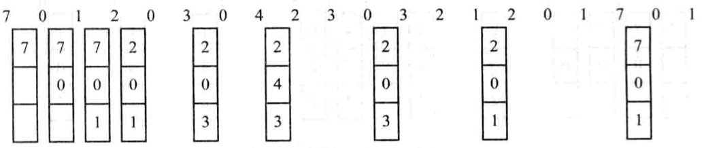

#### 先进先出(FIFO)置换算法

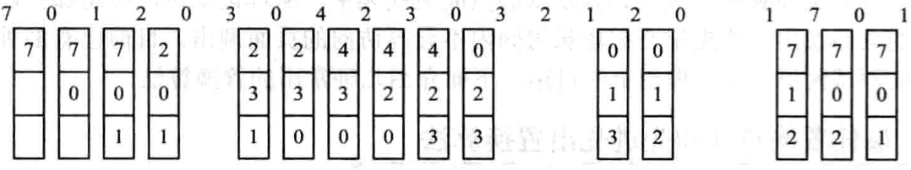

#### 最近最久未使用置换算法

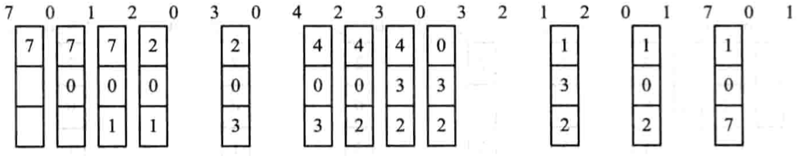

#### 最少使用(Least Frequently Used, LFU)置换算法

为每个页面设置一个移位寄存器，用来记录该页面被访问的频率。

#### Clock置换算法

1. 简单的Clock置换算法(Not Recently Used, NRU)

   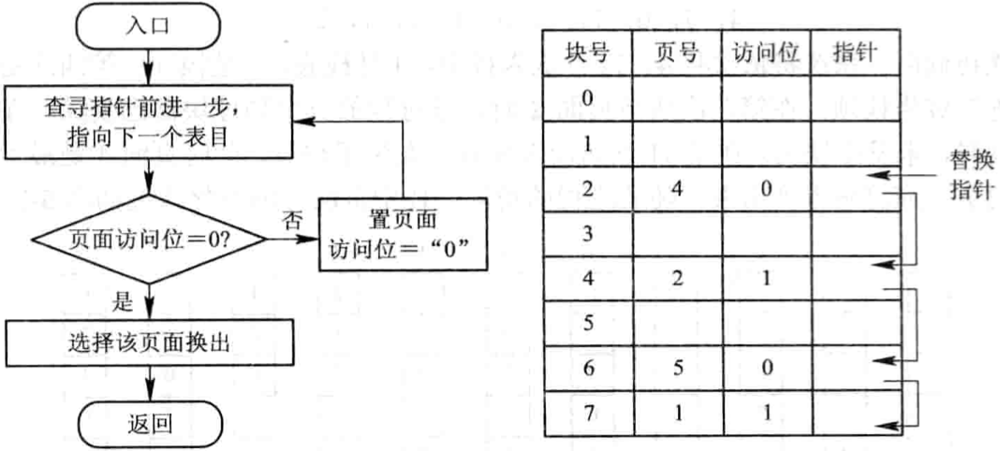

2. 改进型Clock置换算法

   在简单Clock置换算法的基础上，增加“置换代价”因素，由访问位$A$和修改位$M$可以组合成下面四种类型的页面：

   1 类(A=0, M=0)：表示该页最近既未被访问，又未被修改，是最佳淘汰页；

   2 类(A=0, M=1)：表示该页最近未被访问，但已被修改，并不是很好的淘汰页；

   3 类(A=1, M=0)：表示最近已被访问，但未被修改，该页有可能再被访问；

   4 类(A=1, M=1)：表示最近已被访问且被修改，该页可能再被访问。

#### 页面缓冲算法(Page Buffering ALgorithm, PBA)

TODO

## 抖动

`抖动(Thrashing)` 同时在系统中运行的进程太多，分配给每个进程的物理块太少，不能满足进程正常运行的基本要求，致使每个进程在运行时，频繁地出现缺页。

### 多道程序度与抖动

### 预防抖动

1. 采取局部置换策略；
2. 把工作集算法融入到处理机调度中；
3. 利用"L=S"准则调节缺页率(L:缺页之间的平均时间，S:平均缺页服务时间，即置换一个页面所需的时间)；
4. 选择暂停的进程。

## 数据一致性控制

恢复算法

- $undo <T_i>$ 该过程把所有被事务$T_i$修改过的数据恢复为修改前的值。
- $redo <T_i>$ 该过程能把所有被事务$T_i$修改过的数据设置为新值。

### 检查点

引入检查点的主要目的是，使对事务记录表中事务记录的清理工作经常化，即每隔一定时间便执行下述工作：

1. 将驻留在易失性存储器（内存）中的当前事务记录表中的所有记录输出到稳定存储器中；
2. 将驻留在易失性存储器中的所有已修改数据输出到稳定存储器中；
3. 将事务记录表中的（检查点）记录输出到稳定存储器中；
4. 每当出现一个（检查点）记录时，系统利用redo和undo过程实现恢复功能。

### 并发控制(Concurrent Control)

1. 利用互斥锁实现“顺序性”。
2. 利用互斥锁和共享锁实现顺序性。

### 重复数据的数据一致性问题

1. 重复文件的一致性

   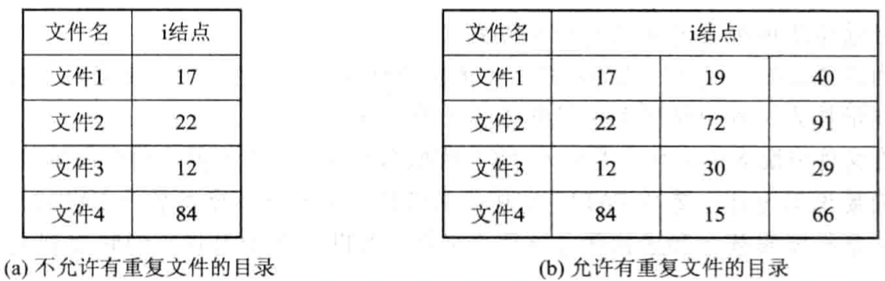

2. 

## 磁盘存储器

### 分类

- 固定头磁盘
- 移动头磁盘

### 数据的组织和格式

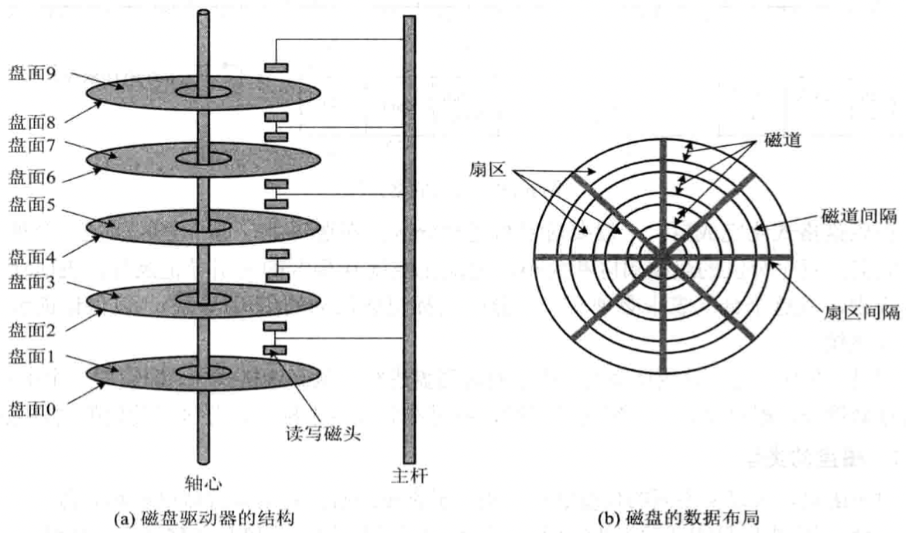

*磁盘的结构和布局*

每个扇区包含两个字段：

- `标识符字段（ID Field）` 一个字节的SYNCH具有特定的位图像，作为该字段的定界符，利用磁道号（Track），磁头号（Head #）及扇区号（Sectors #）三者来标识一个扇区；CRC字段用于段校验。

- `数据字段（Data Field）` 存放512个字节的数据。

  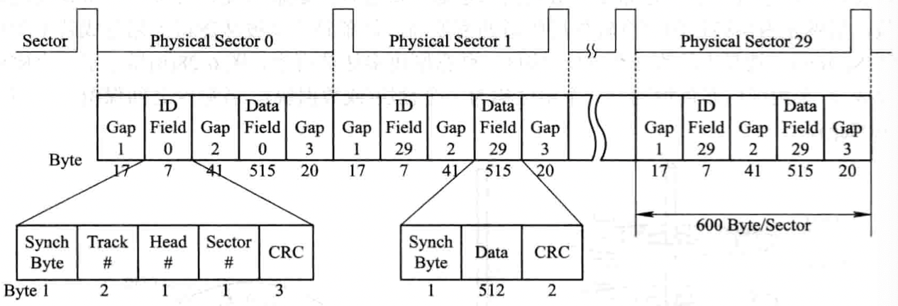

  *磁盘的格式化*

#### 连续组织方式

连续组织方式又称为连续分配方式，要求为每一个文件分配一组相邻接的盘块，通常他们都位于一条磁道上，在进行读/写时，不必移动磁头。这样所形成的文件结构称为顺序文件结构，此时的物理文件称为顺序文件。

优点：

1. 顺序访问容易；
2. 顺序访问速度快。

缺点：

1. 要求为一个文件分配连续的存储空间，这样容易产生许多外部碎片，严重降低外存空间的利用率；
2. 必须事先知道文件的长度；
3. 不能灵活地删除和插入记录；
4. 对于那些动态增长的文件，由于事先很难知道文件的最终大小，因而很难为其分配空间。

#### 链接组织方式

**隐式链接**

**显式链接**

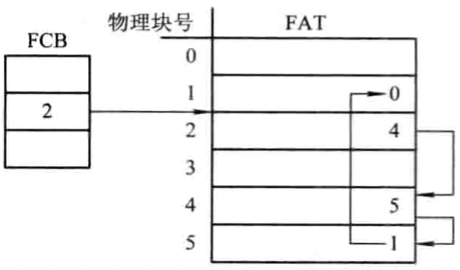

链接组织方式的优点：

1. 消除了磁盘的外部碎片，提高了外存的利用率。
2. 对插入，删除和修改记录都非常容易。
3. 能适应文件的动态增长，无需事先知道文件的大小。

#### FAT

1. FAT12

   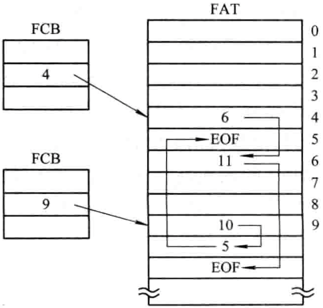

2. FAT16

3. FAT32

   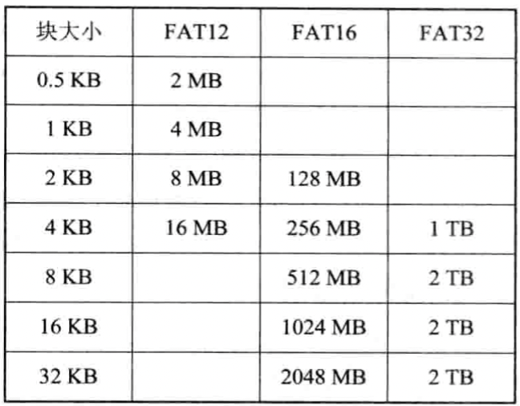

#### NTFS

NTFS采用逻辑符号LCN(Logical Cluster Number)和虚拟簇号VCN(Virtual Cluster Number)进行。

LCN以卷为单位，将整个卷中所有的簇按顺序进行简单的编号，NTFS在进行地址映射时，可以通过卷因子与LCN的乘积，算出卷上的物理字节偏移量，从而得到文件数据所在的物理磁盘地址。

在NTFS中，以卷为单位，将一个卷中的所有文件信息，目录信息以及可用的未分配空间信息，都以文件记录的方式记录在一张主控文件表MFT(Master File Table)中。

#### 索引组织方式

1. 单级索引组织方式

   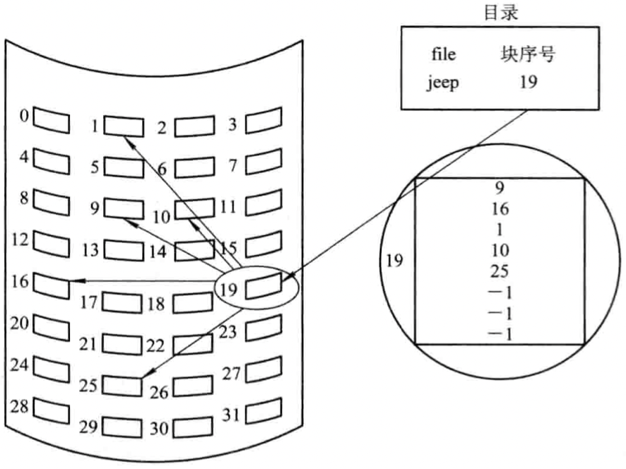

2. 多级索引组织方式

   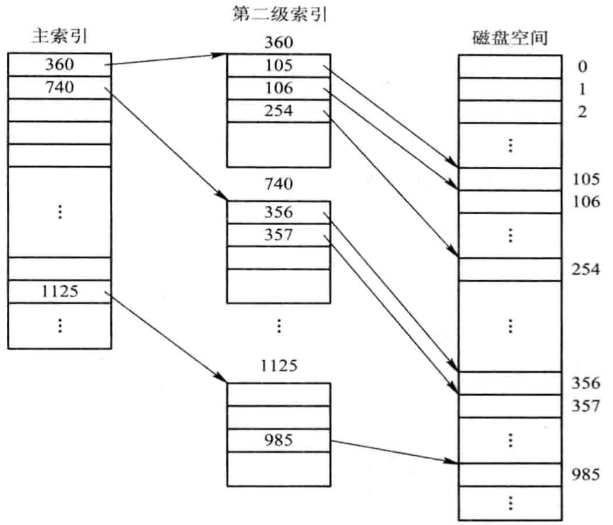

   **优点**

   1. 大大加快了对大型文件的查找速度。

   **缺点**

   1. 在访问一个盘块时，其所需启动磁盘的次数随着索引级数的增加而增多。

3. 增量式索引组织方式

   

   *混合索引方式*

### 存储空间管理

#### 空闲表法

- 空闲表

  系统为外存上所有空闲区建立一张空闲表，每个空闲表对应于一个空闲表项，其中包括表项序号，该空闲区的第一个盘块号，该区的空闲盘块数等信息。再将所有空闲区按其起始盘块号递增的次序排列，形成空闲盘块表。

  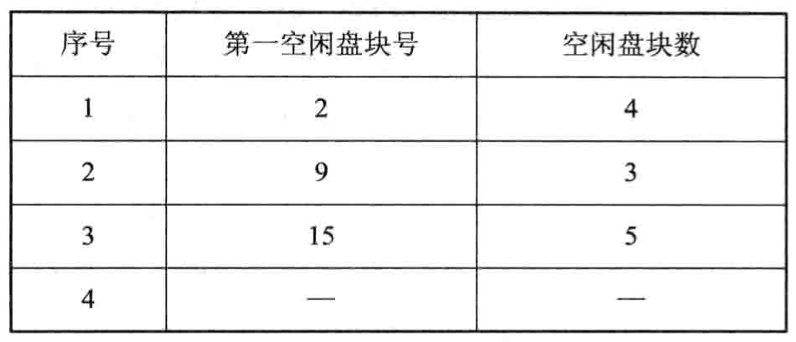

- 存储空间的分配与回收

  在系统为某新创建的文件分配空闲盘块时，先顺序地检索空闲表的各表项，直到找到第一个其大小能满足要求的空闲区，再将该盘区分配给用户（进程），同时修改空闲表。

#### 空闲链表法

- 空闲盘块链

  将磁盘上的所有空闲空间以盘块为单位拉成一条链，其中的每一个盘块都有指向后继盘块的指针。当用户因创建文件而请求分配存储空间时，系统从链首开始，依次摘下适当数目的空闲盘块分配给用户。当用户因删除文件而释放存储空间时，系统将回收的盘块依次挂在空闲盘块链的末尾。

- 空闲盘区链

  将磁盘上的所有空闲盘区（每个盘区可包含若干个盘块）拉成一条链。在每个盘区上除含有用于指示下一个空闲盘区的指针外，还应有能指明本盘区大小（盘块数）的信息。

#### 位示图法

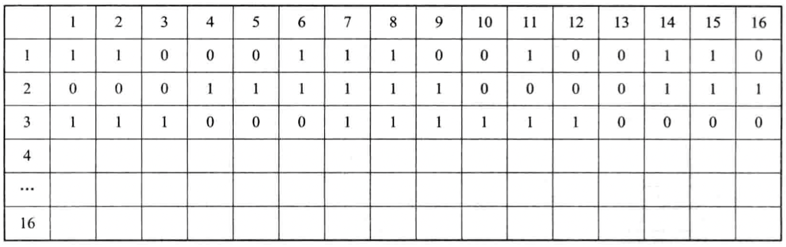

- 0 盘块空闲。
- 1 盘块已分配。

盘块分配步骤：

1. 顺序扫描位示图，从中找出一个或一组其值为“0”的二进制位（“0”表示空闲时）。

2. 将所找到的一个或一组二进制位转换成与之相应的盘块号。

   盘块号计算公式：

   $b = n(i - 1) + j$

   - $n$ 每行的位数。
   - $i$ 行号。
   - $j$ 列号。

3. 修改位示图，令$map[i, j] = 1$。

盘块的回收步骤：

1. 将回收盘块的盘块号转换成位示图中的行号和列号。转换公式为：

   $i = (b - 1)DIV\ n + 1$

   $j = (b - 1)MOD\ n + 1$

2. 修改位示图。令$map[i, j] = 0$。

#### 成组链接法

1. 空闲盘块号栈，用来存放当前可用的一组空闲盘块的盘块号（最多含100个号），以及栈中尚有的空闲盘块（号）数N。
2. 文件去中的所有空闲盘块被分成若干组。
3. 将每一组含有的盘块总数N和该组所有的盘块号记入其前一组的第一个盘块的`S.free(0)~S.free(99)`中。这样，由各组的第一个盘块可链成一条链。
4. 将第一组的盘块总数和所有的盘块号记入空闲盘块号栈中，作为当前可供分配的空闲盘块号。
5. 最末一组只有99个盘块，其盘块号分别记入其前一组的`S.free(1)~S.free(99)`中，而在`S.free(0)`中则存放“0”，作为空闲盘块链的结束标识。

### 磁盘访问

- 寻道时间$T_s$ ，把磁臂移动到指定磁道上所经历的时间即：

  $T_s = m \times n + s$

  - $m$ 常数，一般磁盘$m = 0.2$，高速磁盘$m \leqslant 0.1$；
  - $s$ 磁臂启动时间；
  - $n$ 磁头移动的磁道条数；

- 旋转延迟时间$T_t$，指定扇区移动到磁头下面所经历的时间；

  不同的磁盘转速不一样，如软盘300r/min，硬盘7200r/min~15000r/min；...。

- 传输时间$T_t$，把数据从磁盘读出或向磁盘写入数据所经历的时间；

  $T_t = \frac{b}{rN}$

  - $b$ 每次所读写的字节数；
  - $r$ 磁盘每秒钟的转数；
  - $N$ 一条磁道上的字节数；

**适当地集中数据传输，将有利于提高传输效率。**

### 磁盘调度算法

1. 先来先服务（FCFS）

   

   FCFS仅适用于请求磁盘I/O的进程数目较少的场合。

2. 最短寻道时间优先（SSTF）

   

   要求访问的磁道与当前磁头所在的磁道距离最近，以使每次的寻道时间最短，但这种算法不能保证平均寻道时间最短。

3. 扫描（SCAN）算法

   SCAN算法又叫电梯算法，不仅考虑道仅访问的磁道与当前磁道间的距离，更优先考虑的是磁头当前的移动方向。

   

4. 循环扫描（CSCAN）算法

   

5. NStepSCAN算法

6. FSCAN算法

### 提高磁盘I/O速度的技术

#### 磁盘高速缓存(Disk Cache)

1. 数据交付(Data Delivery)方法

   - 数据交付，直接将高速缓存中的数据传送到请求者进程的内存工作区中；
   - 指针交付，只将指向高速缓存中某区域的指针交付给请求者进程。

2. 置换算法

   - 访问频率。
   - 可预见性。
   - 数据的一致性。

3. 周期性地写回磁盘

   在UNIX系统中专门增设了一个修改（update）程序，使之在后台运行，该程序周期性地执行一个系统调用SYNC。强制性地将所有在高速缓存中已修改的盘块数据写回磁盘。

#### 廉价磁盘冗余阵列(RAID)

在一个系统中有多个磁盘驱动器，系统将每一盘块中的数据分为若干个子盘块数据，再分别存储到不同磁盘中；当需要读取磁盘数据时，采用并行传输方式，将各个盘块中的数据同时向内存传输，大大减少传输时间。

#### 其它

1. 提前读

   在读当前块时，将下一个盘块（提前读的块）中的数据也读入缓冲区。

2. 延迟写

   将缓冲区中的数据挂在空闲缓冲区队列的末尾，当再有进程申请到该缓冲区时，才将该缓冲区中的数据写入磁盘。

3. 优化物理块的分布

   尽量将属于同一个文件的盘块安排在同一条磁道上或相邻的磁道上，以减少磁头的移动。

4. 虚拟盘

   虚拟盘，又称为RAM盘；利用内存空间去仿真磁盘，该盘的设备驱动程序也可以接受所有标准的磁盘操作，但这些操作的执行不是在磁盘上而是在内存中。

### 提高磁盘可靠性的技术

#### 第一级容错技术 SFT-1

1. 双份目录和双份文件分配表

   在不同的磁盘上或磁盘的不同区域中分别建立（双份）目录表和FAT（一份为主目录及主FAT，另一份为备份目录及备份FAT）。一旦由于磁盘表面缺陷造成主文件目录或主FAT的损坏时，系统便自动启用备份文件目录及备份FAT，从而保证磁盘上数据的可访问性。

2. 热修复重定向和写后读校验

   在磁盘表面有少量缺陷的情况下，可采取以下补救措施：

   - 热修复重定向：系统将磁盘容量的很小一部分（例如2%～2%）作为热修复重定向区，用于存放当发现磁盘有缺陷时的待写数据，并对写入该区的所有数据进行登记，以便于以后对数据进行访问。
   - 写后读校验方式：为保证所有写入磁盘的数据都能写入到完好的盘块中，应该在每次向磁盘中写入一个数据块后，又立即将它读出，并送至另一个缓冲区中，再将该缓冲区内容与内存缓冲区中在写后仍保留的数据进行比较，若两者一致，便认为此次写入成功；否则，再重写。若重写后两者仍不一致，则认为该盘块有缺陷，此时，便将应写入该盘块的数据写入到热修复重定向区中。

#### 第二级容错技术SFT-2

1. 磁盘镜像（Disk Mirroring）

   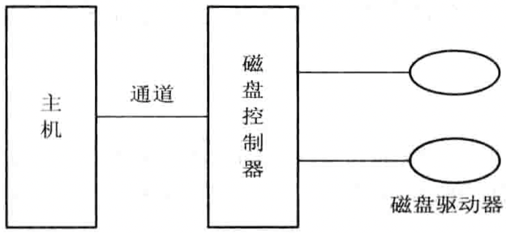

   在同一磁盘控制器下，增设一个完全相同的磁盘驱动器。

2. 磁盘双工（Disk Duplexing）

   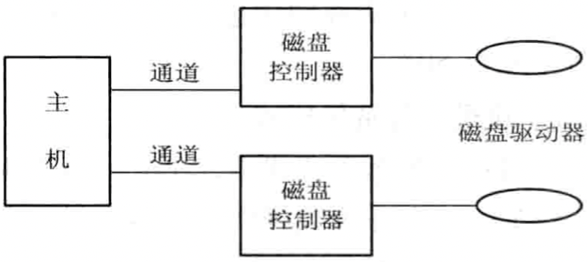

   将两台磁盘驱动器分别接到两个磁盘控制器上，同样使这两台磁盘机镜像成对。

#### 基于集群技术的容错功能

1. 双机热备份模式

   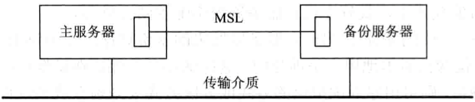

2. 双机互为备份模式

   

3. 公用磁盘模式

   将多台计算机连接到一台公共的磁盘系统上，该公共磁盘被划分为若干个卷。每台计算机使用一个卷。如果某台计算机发生故障，此时系统将重新进行配置，根据某种调度策略来选择另一台替代机器。这种模式消除了信息的复制时间，减少了网络和服务器的开销。

## 总结

分页和分段的主要区别

- 页是信息的物理单位，是系统行为；
- 页的大小固定且由系统决定，段的长度不固定，取决于用户编写的程序；
- 分页的用户程序地址空间是一维的，分段的用户程序地址空间是二维的；

## 参考

[1] 汤小丹, 梁红兵, 哲凤屏, 汤子瀛 . 计算机操作系统 . 3th Edition . P120 - P172

