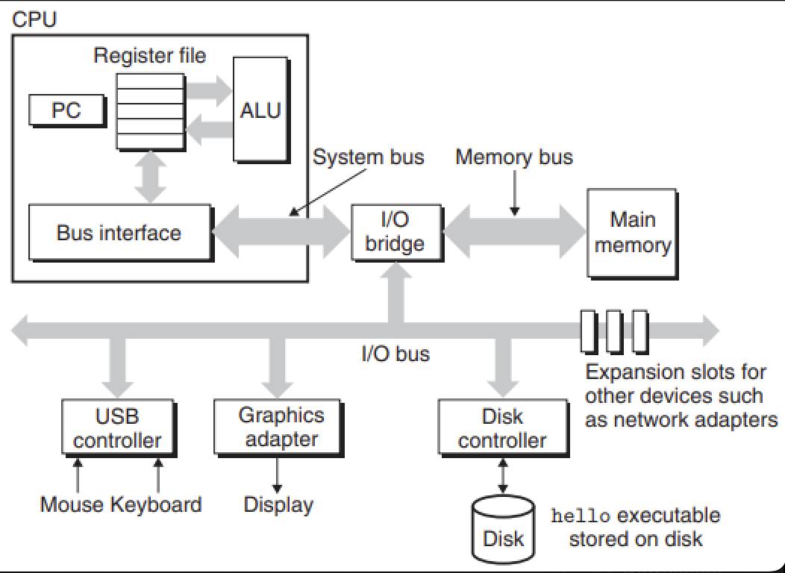

# OS Summary

[TOC]

The operating system has two primary purposes: (1) to protect the hardware from misuse by runaway applications and (2) to provide applications with simple and uniform mechanisms for manipulating complicated and often wildly different low-level hardware devices.

## Hardware Organization

*Hardware organization of a typical system. CPU: central processing unit, ALU: arithmetic/logic unit, PC: program counter, USB: Universal Serial Bus.*

- `Buses`. Running throughout the system is a collection of electrical conduits called `buses` that carry bytes of information back and forth between the components.
- `I/O Devices`. Input/output (I/O) devices are the system's connection to the external world. Each I/O device is connected to the I/O bus by either a `controller` or an `adapter`. 
- `Main Memory` The `main memory` is a temporary storage device that holds both a program and the data it manipulates while the processor is executing the program. 
- `Processor` The `central processing unit` (CPU), or simply processor, is the engine that interprets (or `executes`) instructions stored in main memory.

## Reference

[1] Randal E. Bryant, David R. O'Hallaron . COMPUTER SYSTEMS: A PROGRAMMER'S PERSPECTIVE . 3ED