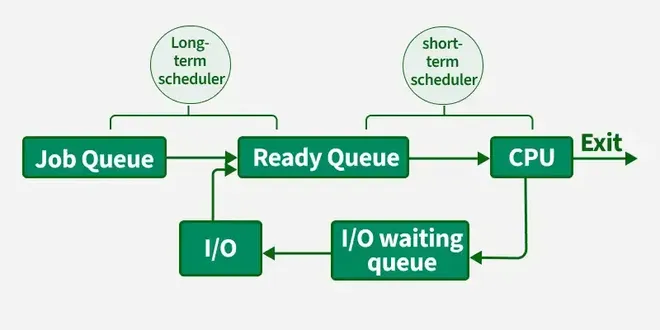
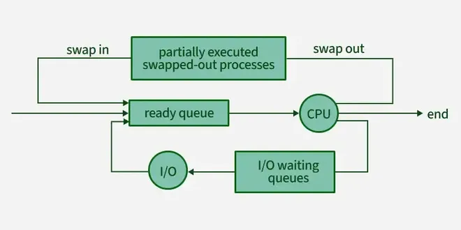
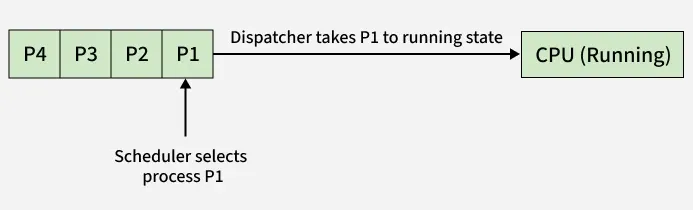
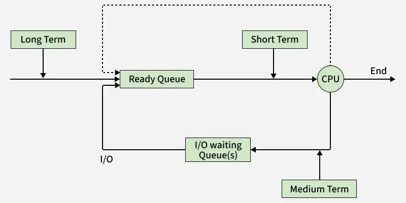

English | [中文版](summary_zh.md)

# OS Summary

[TOC]

The operating system has two primary purposes: (1) to protect the hardware from misuse by runaway applications and (2) to provide applications with simple and uniform mechanisms for manipulating complicated and often wildly different low-level hardware devices.

## Hardware Organization

## Control flow

### System Call

## Types

### Batch Operating System

### Multi-Programming Operating System

### Multi-tasking/Time-sharing Operating System

### Multi-Processing Operating System

### Distributed Operating System

### Network Operating System

### Real-Time Operating System

### Mobile Operating Systems

## Components

### Shell

Shell is the outermost layer of the Operating System and handles user interaction. It interprets input for the OS and handles the output from the OS.

### Kernel

Kernel is the core component of the operating system. The kernel is the primary interface between the Operating system and Hardware.

### Process Schedulers

Process Schedulers are fundamental components of operating systems responsible for deciding the order in which processes are executed by the CPU. Include:

1. Long-Term Scheduler(Job Scheduler)

2. Short-Term Scheduler(CPU Scheduler)

   

3. Medium-Term Scheduler

   

Comparison Among Scheduler:

| Long-Term Scheduler                                          | Short-Term Scheduler                                      | Medium-Term Scheduler                                        |
| ------------------------------------------------------------ | --------------------------------------------------------- | ------------------------------------------------------------ |
| It is a job scheduler                                        | It is a CPU scheduler                                     | It is a process-swapping scheduler                           |
| It is the slowest scheduler                                  | It is the fastest scheduler                               | It's speed lies between long-term and short-term schedulers  |
| It controls the degree of multiprogramming                   | It gives less control over the degree of multiprogramming | It reduces the degree of multiprogramming                    |
| It is barely present or nonexistent in time-sharing systems  | It is essential for time-sharing systems                  | It is a component of time-sharing systems                    |
| It selects processes from the job poll and loads them into memory | It selects ready processes for execution by the CPU       | It can re-introduce processes into memory and resume execution |

## Process

### States Transaction

## Summary

### Process vs Thread vs Coroutine

|             | Process                                                     | Thread                                                       | Coroutine                                                 |
| ----------- | ----------------------------------------------------------- | ------------------------------------------------------------ | --------------------------------------------------------- |
| Scheduling  | Runs independently.                                         | Basic unit of scheduling and dispatch; actually runs on CPU. | Fully controlled by user.                                 |
| Resources   | Has independent resources.                                  | All threads in a process share resources; more efficient.    | Has its own register context and stack.                   |
| Overhead    | Large overhead for creation/destruction and context switch. | Small overhead.                                              | Can save/restore state; switching has almost no overhead. |
| Concurrency | Processes run independently.                                | Preemptive multitasking; threads need locks; less robust.    | Cooperative multitasking; no locks needed; more robust.   |

### Dispatcher vs Scheduler

*OS Dispather*

*OS Scheduler*

| Scheduler                                            | Dispatcher                                                   |
| ---------------------------------------------------- | ------------------------------------------------------------ |
| Decides which process should be executed next.       | Transfers control of CPU to the process selected by the scheduler. |
| To select the process and determine execution order. | To start the execution of the selected process.              |
| Long-term, Medium-term and Short-term.               | No types; it's a single module.                              |
| Works independently.                                 | Dependent on the scheduler's decision.                       |
| Uses algorithms like FCFS, SJF, RR, Priority, etc.   | No specific algorithm used.                                  |
| Negligible and occurs less frequently.               | Time taken is known as Dispatch Latency.                     |
| Process selection and queue management.              | Context switching, mode change and process start.            |
| Works with the ready queue and dispatcher.           | Works with CPU and the selected process.                     |
| Takes longer than the dispatcher.                    | Executes in a very short time.                               |

## Reference

[1] Randal E. Bryant, David R. O'Hallaron . COMPUTER SYSTEMS: A PROGRAMMER'S PERSPECTIVE . 3ED

[2] [Operating System Tutorial](https://www.geeksforgeeks.org/blogs/operating-systems/)

[3] [Introduction to Operating System](https://www.geeksforgeeks.org/operating-systems/introduction-of-operating-system-set-1/)

[4] [Types of Operating Systems](https://www.geeksforgeeks.org/operating-systems/types-of-operating-systems/)

[5] [Kernel in Operating System](https://www.geeksforgeeks.org/operating-systems/kernel-in-operating-system/)

[6] [System Call](https://www.geeksforgeeks.org/operating-systems/introduction-of-system-call/)

[7] [Process Schedulers in Operating System](https://www.geeksforgeeks.org/operating-systems/process-schedulers-in-operating-system/)

[8] [Dispatcher vs Scheduler in OS](https://www.geeksforgeeks.org/operating-systems/difference-between-dispatcher-and-scheduler/)