English | [中文版](summary_zh.md)

# OS Summary

[TOC]

The operating system has two primary purposes: (1) to protect the hardware from misuse by runaway applications and (2) to provide applications with simple and uniform mechanisms for manipulating complicated and often wildly different low-level hardware devices.

## Hardware Organization

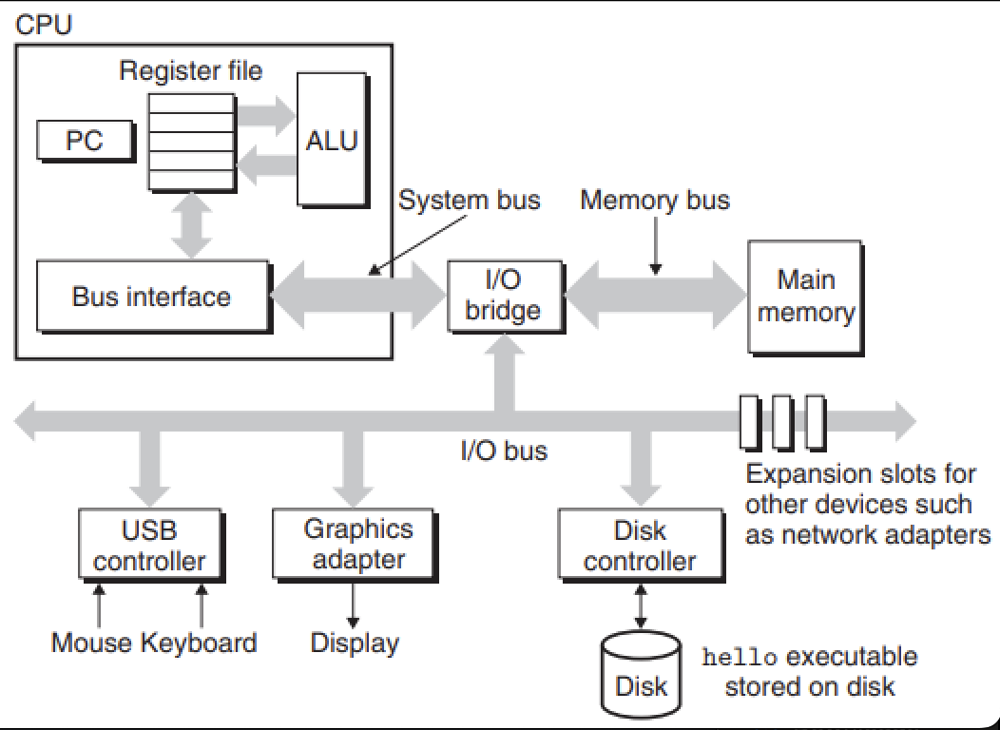

## Control flow

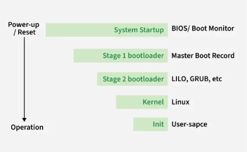

### System Call

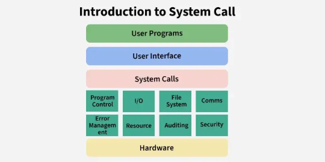

## Types

### Batch Operating System

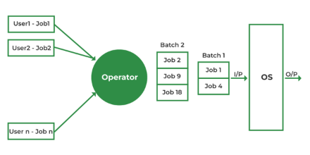

### Multi-Programming Operating System

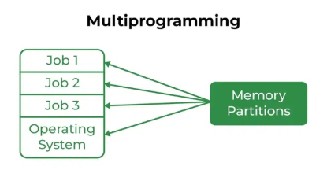

### Multi-tasking/Time-sharing Operating System

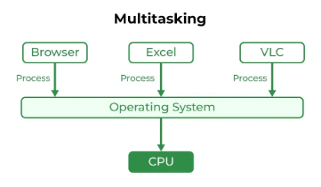

### Multi-Processing Operating System

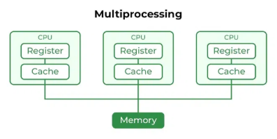

### Distributed Operating System

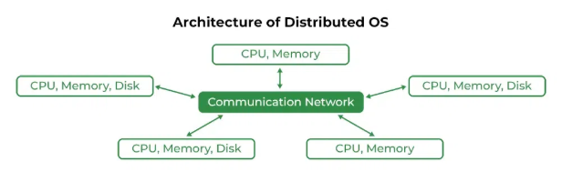

### Network Operating System

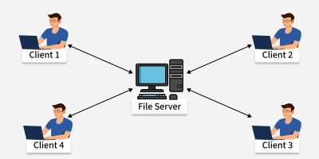

### Real-Time Operating System

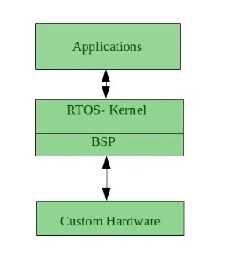

### Mobile Operating Systems

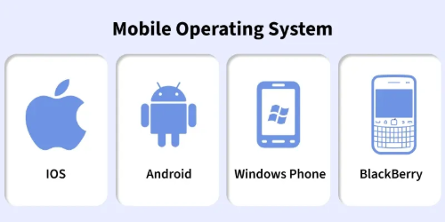

## Components

### Shell

Shell is the outermost layer of the Operating System and handles user interaction. It interprets input for the OS and handles the output from the OS.

### Kernel

Kernel is the core component of the operating system. The kernel is the primary interface between the Operating system and Hardware.

## Process vs Thread vs Coroutine

|             | Process                                                     | Thread                                                       | Coroutine                                                 |
| ----------- | ----------------------------------------------------------- | ------------------------------------------------------------ | --------------------------------------------------------- |
| Scheduling  | Runs independently.                                         | Basic unit of scheduling and dispatch; actually runs on CPU. | Fully controlled by user.                                 |
| Resources   | Has independent resources.                                  | All threads in a process share resources; more efficient.    | Has its own register context and stack.                   |
| Overhead    | Large overhead for creation/destruction and context switch. | Small overhead.                                              | Can save/restore state; switching has almost no overhead. |
| Concurrency | Processes run independently.                                | Preemptive multitasking; threads need locks; less robust.    | Cooperative multitasking; no locks needed; more robust.   |

## Reference

[1] Randal E. Bryant, David R. O'Hallaron . COMPUTER SYSTEMS: A PROGRAMMER'S PERSPECTIVE . 3ED

[2] [Operating System Tutorial](https://www.geeksforgeeks.org/blogs/operating-systems/)

[3] [Introduction to Operating System](https://www.geeksforgeeks.org/operating-systems/introduction-of-operating-system-set-1/)

[4] [Types of Operating Systems](https://www.geeksforgeeks.org/operating-systems/types-of-operating-systems/)

[5] [Kernel in Operating System](https://www.geeksforgeeks.org/operating-systems/kernel-in-operating-system/)

[6] [System Call](https://www.geeksforgeeks.org/operating-systems/introduction-of-system-call/)