English | [中文版](summary_zh.md)

# OS Summary

[TOC]

The operating system has two primary purposes: (1) to protect the hardware from misuse by runaway applications and (2) to provide applications with simple and uniform mechanisms for manipulating complicated and often wildly different low-level hardware devices.

## Hardware Organization

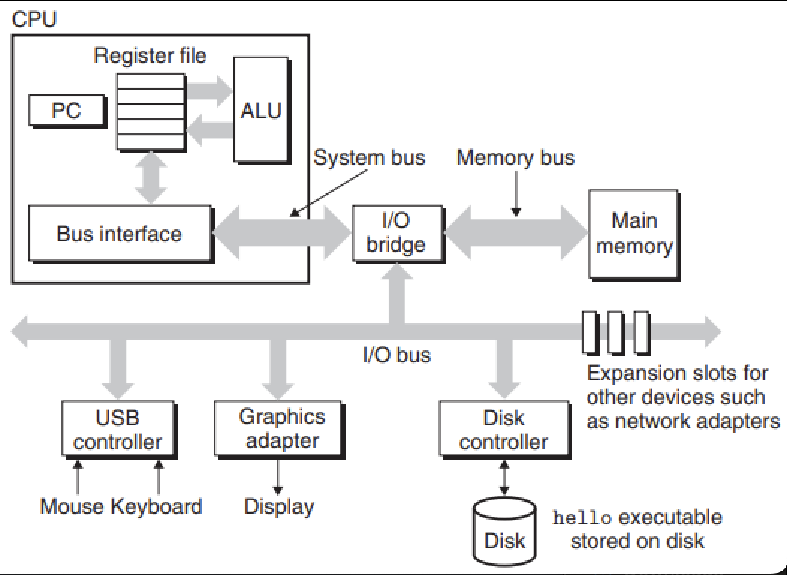

## Control flow

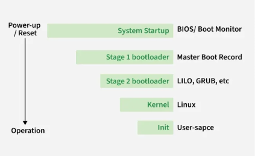

### Bootloader

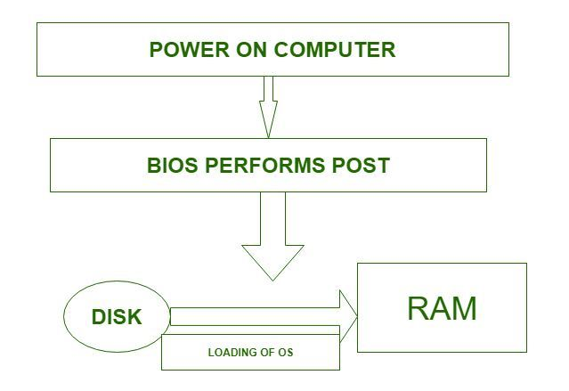

### System Call

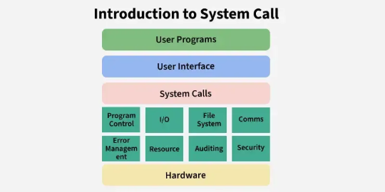

## Types

### Batch Operating System

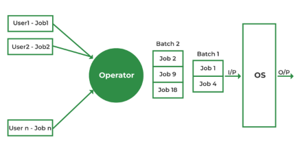

### Multi-Programming Operating System

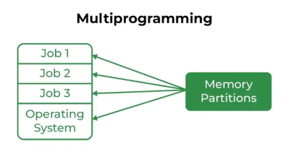

### Multi-tasking/Time-sharing Operating System

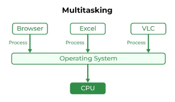

### Multi-Processing Operating System

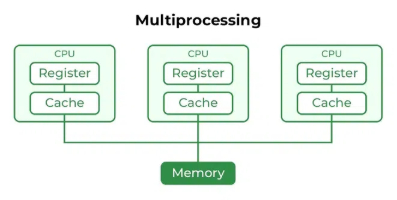

### Distributed Operating System

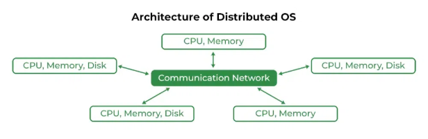

### Network Operating System

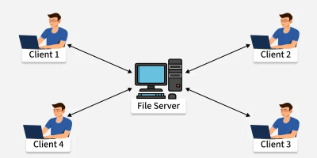

### Real-Time Operating System

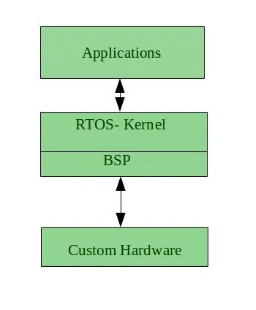

### Mobile Operating Systems

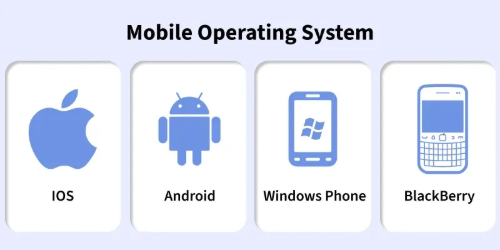

## Components

### Shell

Shell is the outermost layer of the Operating System and handles user interaction. It interprets input for the OS and handles the output from the OS.

### Kernel

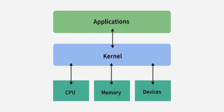

The kernel is the core component of the operating system. The kernel is the primary interface between the Operating system and Hardware.

### Process Schedulers

Process Schedulers are fundamental components of operating systems responsible for deciding the order in which processes are executed by the CPU. Include:

1. Long-Term Scheduler(Job Scheduler)

2. Short-Term Scheduler(CPU Scheduler)

   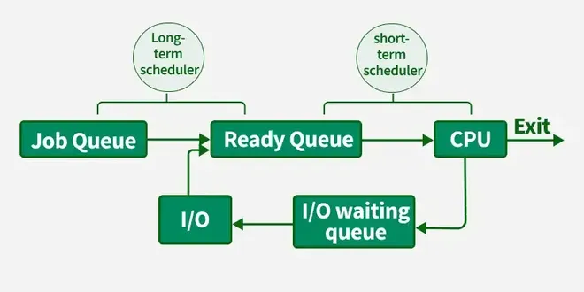

3. Medium-Term Scheduler

   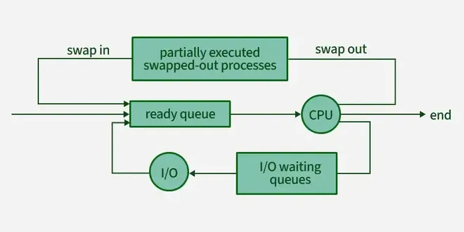

Comparison Among Scheduler:

| Long-Term Scheduler                                          | Short-Term Scheduler                                      | Medium-Term Scheduler                                        |
| ------------------------------------------------------------ | --------------------------------------------------------- | ------------------------------------------------------------ |
| It is a job scheduler                                        | It is a CPU scheduler                                     | It is a process-swapping scheduler                           |
| It is the slowest scheduler                                  | It is the fastest scheduler                               | It's speed lies between long-term and short-term schedulers  |
| It controls the degree of multiprogramming                   | It gives less control over the degree of multiprogramming | It reduces the degree of multiprogramming                    |
| It is barely present or nonexistent in time-sharing systems  | It is essential for time-sharing systems                  | It is a component of time-sharing systems                    |
| It selects processes from the job poll and loads them into memory | It selects ready processes for execution by the CPU       | It can re-introduce processes into memory and resume execution |

## Process

### States Transaction

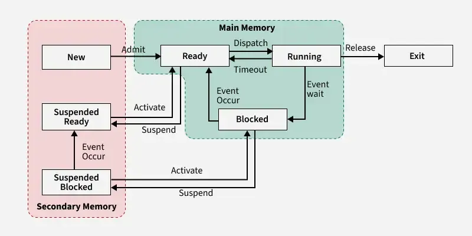

## Storage

### HDD vs SDD

## Summary

### Process vs Thread vs Coroutine

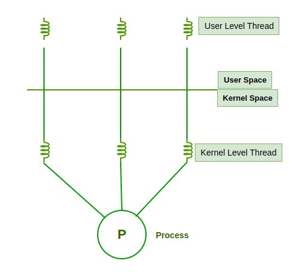

|             | Process                                                     | Thread                                                       | Coroutine                                                 |
| ----------- | ----------------------------------------------------------- | ------------------------------------------------------------ | --------------------------------------------------------- |
| Scheduling  | Runs independently.                                         | Basic unit of scheduling and dispatch; actually runs on CPU. | Fully controlled by user.                                 |
| Resources   | Has independent resources.                                  | All threads in a process share resources; more efficient.    | Has its own register context and stack.                   |
| Overhead    | Large overhead for creation/destruction and context switch. | Small overhead.                                              | Can save/restore state; switching has almost no overhead. |
| Concurrency | Processes run independently.                                | Preemptive multitasking; threads need locks; less robust.    | Cooperative multitasking; no locks needed; more robust.   |

### Thread Context Switch vs Process Context Switch

| Thread Context Switch                                        | Process Context Switch                                       |
| ------------------------------------------------------------ | ------------------------------------------------------------ |
| TCS occurs when the CPU saves the current state of the thread and switches to another thread of the same process. | PCS occurs when the operating system's scheduler saves the current state of the running Program (including the state of the PCB) and switches to another program. |
| TCS helps the CPU to handle multiple threads simultaneously. | PCS involves loading of the states of the new program for it's execution. |
| TCS does not involve switching of memory address spaces. All the memory addresses that the processor accounts for remain saved. | PCS involves switching of memory address spaces. All the memory addresses that the processor accounts for get flushed. |
| The processor's cache and Translation Lookaside Buffer preserve their state. | The processor's cache and TLB get flushed.                   |
| Though TCS involves switching of registers and stack pointers, it does not incur the cost of changing the address space. Hence, it is more efficient. | PCS involves the high cost of changing the address space. Hence, it is less efficient. |
| TCS is a bit faster and cheaper.                             | PCS is relatively slower and costlier                        |

### Zombie vs Orphan vs Daemon Processes

|                        Zombie Process                        |                        Orphan Process                        |                        Daemon Process                        |
| :----------------------------------------------------------: | :----------------------------------------------------------: | :----------------------------------------------------------: |
| A zombie is a process that has completed its task but still shows an entry in a process table. | An orphan process is a computer process that continues even after its parent terminates. The init process becomes its parent and continues the remaining task. | A daemon process is a system-related process that always runs in the background. |
|      Zombie process states are always indicated by "Z"       | An orphan process is often created unintentionally due to a system crash. | A daemon process state indicated by '?' in the TTY column in the output |
|     A zombie process does not have controlling terminals     |         An Orphan process has controlling terminals.         |    A daemon process does not have controlling terminals.     |
| A zombie process is treated as dead and is not used for system processing. | An orphan process is a computer process that, even after its parent terminates, init is become a parent and continues the remaining task. | A program that runs for a long time makes them as a daemon process and runs it in the background. |
|   To remove the zombie process, execute the kill command.    |   To terminate the Orphan process, use the SIGHUP signal.    | A daemon process terminates only when the system shuts down. |

### Dispatcher vs Scheduler

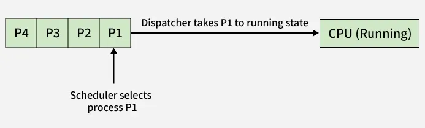

*OS Dispather*

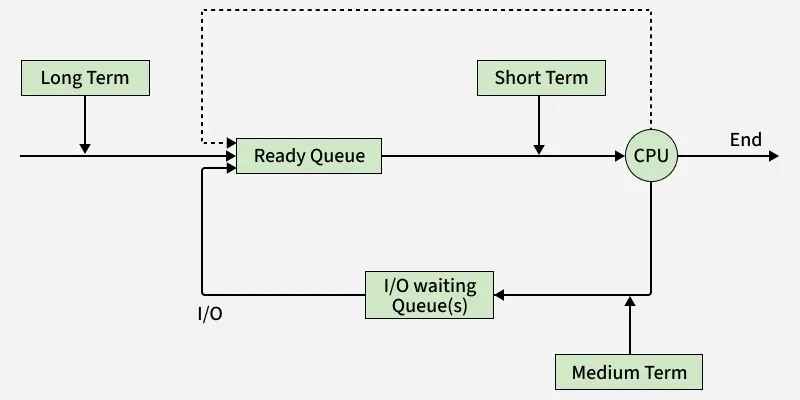

*OS Scheduler*

| Scheduler                                            | Dispatcher                                                   |
| ---------------------------------------------------- | ------------------------------------------------------------ |
| Decides which process should be executed next.       | Transfers control of CPU to the process selected by the scheduler. |
| To select the process and determine execution order. | To start the execution of the selected process.              |
| Long-term, Medium-term and Short-term.               | No types; it's a single module.                              |
| Works independently.                                 | Dependent on the scheduler's decision.                       |
| Uses algorithms like FCFS, SJF, RR, Priority, etc.   | No specific algorithm used.                                  |
| Negligible and occurs less frequently.               | Time taken is known as Dispatch Latency.                     |
| Process selection and queue management.              | Context switching, mode change and process start.            |
| Works with the ready queue and dispatcher.           | Works with CPU and the selected process.                     |
| Takes longer than the dispatcher.                    | Executes in a very short time.                               |

### Multiprogramming vs Multi-tasking OS

|                       Multiprogramming                       |                        Multi-tasking                         |
| :----------------------------------------------------------: | :----------------------------------------------------------: |
| Involves loading multiple programs into the computer's memory and allowing them to share the CPU. The CPU switches between programs, especially when one is waiting for I/O operations to complete. | Refers to the ability of an operating system to execute multiple tasks (or processes) simultaneously by rapidly switching between them. |
| The main goal is to increase CPU utilization by reducing idle time. | The primary goal is to improve user responsiveness and allow for interactive computing |
|         It does not involve direct user interaction.         | Designed with user interaction, allowing users to run multiple applications (e.g., word processors, web browsers, etc.) simultaneously |
| Less complex than multitasking. It focuses on keeping the CPU busy by running one program at a time until it needs to wait for an I/O operation. | More complex one. It requires more sophisticated scheduling algorithms and resource management to handle multiple tasks, user inputs, and ensure a smooth experience. |
|           There will be no effect of Parallelism.            |       It will give rise to the concept of Parallelism        |
| Used in environments where resource utilization is more critical, such as batch processing, and where tasks are long-running. | Used in interactive environments where multiple applications need to be run concurrently, particularly in desktop and mobile operating systems. |

### Multitasking vs Multiprocessing

|                        Multi-tasking                         |                       Multiprocessing                        |
| :----------------------------------------------------------: | :----------------------------------------------------------: |
| The execution of more than one task simultaneously is known as multitasking. | The availability of more than one processor per system, which can execute several sets of instructions in parallel, is known as multiprocessing. |
|                  The number of CPUs is one.                  |             The number of CPUs is more than one.             |
|             It takes a moderate amount of time.              |            It takes less time for job processing.            |
|     In this, one by one job is being executed at a time.     |  In this, more than one process can be executed at a time.   |
|                      It is economical.                       |                    It is less economical.                    |
|            The number of users is more than one.             |     The number of users is can be one or more than one.      |
|                   Throughput is moderate.                    |                    Throughput is maximum.                    |
|                 Its efficiency is moderate.                  |                  Its efficiency is maximum.                  |
| It is of two types: single-user multitasking and multiple-user multitasking. | It is of two types: Symmetric Multiprocessing and Asymmetric Multiprocessing. |

### Difference Between Unix and Linux

|                          **Linux**                           |                           **Unix**                           |
| :----------------------------------------------------------: | :----------------------------------------------------------: |
|  The source code of Linux is freely available to its users   | The source code of Unix is not freely available to the general public |
| It has a graphical user interface along with a command line interface |             It only has a command line interface             |
| Linux OS is portable, flexible, and can be executed on different hard drives |                   Unix OS is not portable                    |
| Different versions of Linux OS are Ubuntu, Linux Mint, RedHat Enterprise Linux, etc. | Different versions of Unix are AIS, HP-UX, BSD, Iris, Solaris, etc. |
| The file systems supported by Linux are as follows: xfs, ramfs, vfat, cramfsm, ext3, ext4, ext2, ext1, ufs, autofs, devpts, ntfs | The file systems supported by Unix are as follows: zfs, js, hfx, gps, xfs, vxfs |
| Linux is an open-source operating system that was first released in 1991 by Linus Torvalds. | Unix is a proprietary operating system that was originally developed by AT&T Bell Labs in the mid 1960s. |
| The Linux kernel is monolithic, meaning that all of its services are provided by a single kernel. | The Unix kernel is modular, meaning that it is made up of a collection of independent modules that can be loaded and unloaded dynamically. |
|      Linux has much broader hardware support than Unix.      | Unix was originally designed to run on large, expensive mainframe computers, while Linux was designed to run on commodity hardware like PCs and servers. |
|   The user interface of Linux is Graphical or text-based.    |          The user interface of Unix is text-based.           |
|  Command Line Interfaces of Linux are Bash, Zsh, and Tcsh.   | Command Line Interface of Unix is Bourne, Korn, C, and Zsh.  |

## Reference

[1] Randal E. Bryant, David R. O'Hallaron . COMPUTER SYSTEMS: A PROGRAMMER'S PERSPECTIVE . 3ED

[2] [Operating System Tutorial](https://www.geeksforgeeks.org/blogs/operating-systems/)

[3] [Introduction to Operating System](https://www.geeksforgeeks.org/operating-systems/introduction-of-operating-system-set-1/)

[4] [Types of Operating Systems](https://www.geeksforgeeks.org/operating-systems/types-of-operating-systems/)

[5] [Kernel in Operating System](https://www.geeksforgeeks.org/operating-systems/kernel-in-operating-system/)

[6] [System Call](https://www.geeksforgeeks.org/operating-systems/introduction-of-system-call/)

[7] [Process Schedulers in Operating System](https://www.geeksforgeeks.org/operating-systems/process-schedulers-in-operating-system/)

[8] [Dispatcher vs Scheduler in OS](https://www.geeksforgeeks.org/operating-systems/difference-between-dispatcher-and-scheduler/)

[9] [Multiprogramming in Operating System](https://www.geeksforgeeks.org/operating-systems/multiprogramming-in-operating-system/)