# Synchronization

[TOC]


## Multitasking

### Process-Based Multitasking

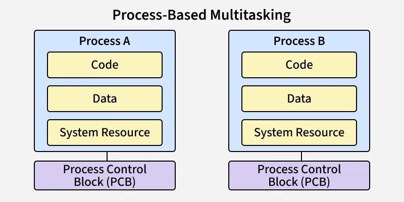

In process-based multitasking, two or more independent processes run concurrently. Each process is self-contained with:

- Its own memory space (address space)
- Its own code, data, and system resources
- Its own Process Control Block (PCB)

### Thread-Based Multitasking (Multithreading)

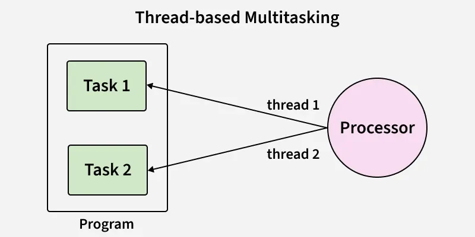

In thread-based multitasking, multiple threads run within a single process. Threads share:

- The same address space, code, and data
- But each has its own stack and execution context


## Critical Section

A critical section is a part of a program where shared resources (like memory, files, or variables) are accessed by multiple processes or threads.

### Structure


1. Entry Section

   - The process requests permission to enter the critical section.
   - Synchronization tools (e.g., mutex, semaphore) are used to control access.

2. Critical Section

   The actual code where shared resources are accessed or modified.

3. Exit Section

   The process releases the lock or semaphore, allowing other processes to enter the critical section.

4. Remainder Section

   The reset of the program that does not involve shared resource access.

### Requirements Of Critical Section Solutions

1. Mutual Exclusion
2. Progress
3. Bounded Waiting

---


## Race Condition


A race condition occurs when two or more processes or threads access and modify the same data at the same time, and the final result depends on the order in which they run.

### Key Concepts

- Shared Resource: A variable, file, memory location, or device accessed by multiple processes.
- Concurrency: Multiple processes or threads executing simultaneously or overlapping in execution.
- Non-Atomic Operations: Operations that can be interrupted, such as read-modify-write, which can cause inconsistent states when multiple processes access the same data concurrently.

### Causes

- Simultaneous Access
- Non-Atomic Updates
- Lack of Synchronization

### Effects

- Data Corruption
- Unpredictable Behavior
- Security Risks
- System Crashes

### Prevention Techniques

1. Mutex (Mutual Exclusion)
2. Semaphores
3. Monitors
4. Atomic Operations
5. Disable Interrupts (for kernel-level programming)
6. Proper Scheduling

---


## Deadlock

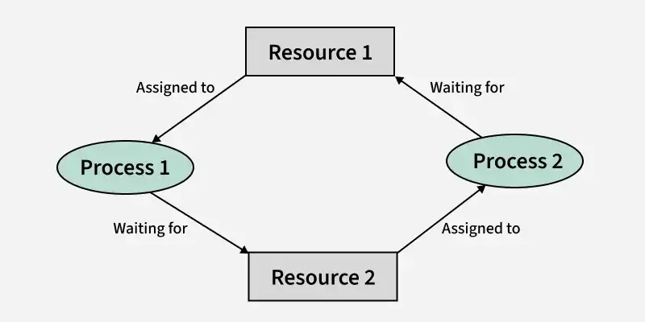

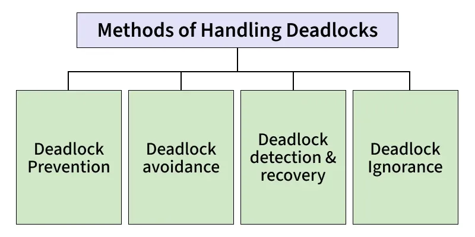

Deadlock is a state in an operating system where two or more processes are stuck forever because each is waiting for a resource held by another.

### Condition

1. Mutual Exclusion: Only one process can use a resource at any given time i.e. the resources and non-sharable.
2. Hold and Wait: A process is holding at least one resource at a time and is waiting to acquire other resources held by some other process.
3. No Preemption: A resource cannot be taken from a process unless the process releases the resource.
4. Circular Wait: Set of processes are waiting for each other in a circular fashion.

### Deadlock Prevention

We can prevent a Deadlock by eliminating any of the above [four conditions](#Condition):

- Eliminate Mutual Exclusion

  1. Shareable resources like read-only files can be accessed by multiple processes at the same time.
  2. For non-sharable resources, prevention through this method is not possible.

- Eliminate Hold and Wait

  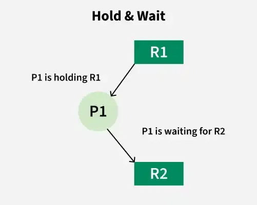

  1. By eliminating wait: The process specifies the resources it requires in advance so that it does not have to wait for allocation after execution starts.
  2. By eliminating hold: The process has to release all resources it is currently holding before making a new request.

- Eliminate No Preemption

  1. Processes must release resources voluntarily: A process gives up resources once it finishes using them.
  2. Avoid partial allocation: If a process requests resources that are unavailable, it must release all currently held resources and wait until all required resources are free.

- Eliminate Circular Wait

  1. Impose a strict ordering on resources.
  2. Assign each resource a unique number.
  3. Processes can only request resources in increasing order of their numbers.
  4. This prevents cycles, as no process can go backwards in numbering.

### Deadlock Avoidance

#### Mathematical Condtion For Deadlock Avoidance

In a system with $R$ identical resources and $P$ processes competing for them, the goal is to determine the minimum number of resoruces required to ensure a deadlock neve occurs. The condition for avoid deadlock is:
$$
R \geq P(N - 1) + 1
$$

- $R$ is the total available resource
- $P$ is the number of processes.
- $N$ is the maximum resources a process may need.

#### Banker's Algorithm

Banker's Algorithm is a resource allocation and deadlock avoidance algorithm used in operating systems.

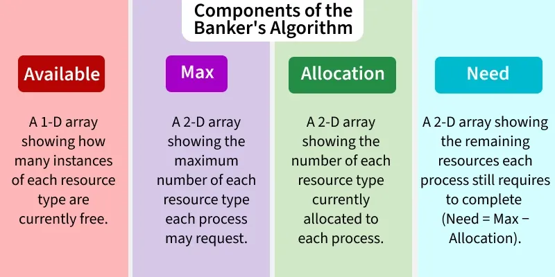

- Available
  1. it is a 1-D array of size 'm' indicating the number of available resources of each type.
  2. $Available[j] = k$ means there are 'k' instances of resource type $R_j$.
- Max
  1. it is a 2-d array of size 'n * m' that defines the maximum demand of each process in a system.
  2. $Max[i, j] = k$ means process $P_i$ may request at most 'k' instances of resource type $R_j$.
- Allocation
  1. It is a 2-d array of size 'n * m' that defines the number of resources of each type currently allocated to each process.
  2. $Allocation[i, j] = k$ means process $P_i$ is currently allocated 'k' instances of resource type $R_j$.
- Need
  1. It is a 2-d array of size 'n * m' that indicates the remaining resource need of each process.
  2. $Need[i, j] = k$ means process $P_i$ currently needs 'k' instances of resource type $R_j$.
  3. $Need[i, j] = Max[i, j] - Allocation[i, j]$.

Types of Banker's Algorithm:

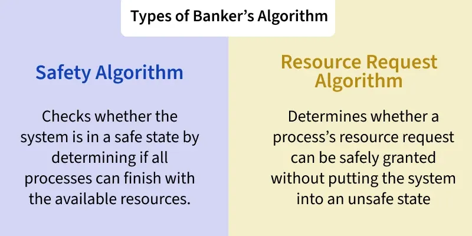

- Safety Algorithm

  The safety algorithm checks whether the system is in a safe state-meaning all processes can complete without causing deadlock.

- Resoource Request Algorithm

  This algorithm decides if a process's resource request can be granted safely.

#### Resource Allocation Graph (RAG)

A Resource Allocation Graph (RAG) is a visual way to understand how resources are assigned in an operating system.

Types of Vertices in RAG:

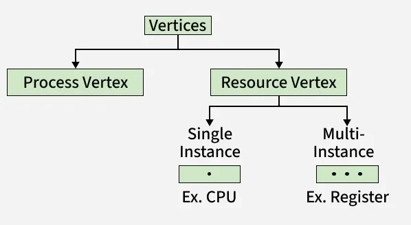

- Process Vertex; Every process will be represented as a process vertex. Generally, the process will be represented with a circle.
- Resource Vertex: Every resource will be represented as a resource vertex. It is also two types;
  - Single Instance Resource: A resource with only one copy.
  - Multi Instance Resource: A resource with multiple copies.

Types of Edges in RAG:

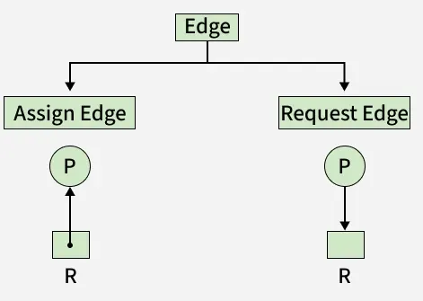

- Assign Edge: If you already assign a resource to a process then it is called Assign edge.
- Request Edge: A request edge represents that a process is currently requesting a resource.

### Deadlock Detection & Recovery

Deadlock detection and recovery is the mechanism of detecting and resolving deadlocks in an operating system.

#### Deadlock Detection

1. If Resources Have a Single Instance

   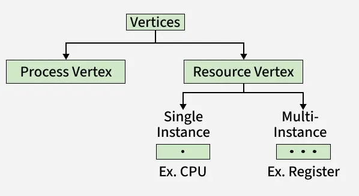

   In this case for Deadlock detection, we can run an algorithm to check for the cycle in the Resource Allocation Graph. The presence of a cycle in the graph is a sufficient codnition for deadlock.

2. If There are Multiple Instances of Resources

   Detection of the cycle is necessary but not a sufficient condition for deadlock detection, in this case, the system may or may not be in deadlock varies according to different situations.

3. Wait-For Graph Algorithm

   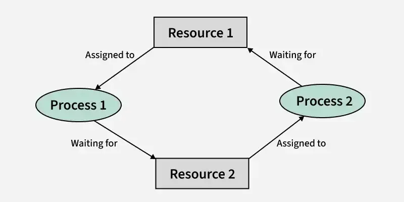

   The algorithm works by constructing a Wait-For Graph, which is a directed graph that represents the dependencies between processes and resources.

#### Deadlock Recovery

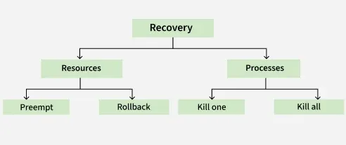

Real-time operating systems use Deadlock recovery:

- KIlling The Process
- Process Rollback
- Resource Preemption
- Concurrency Control

### Deadlock Ignorance

The Deadlock Ignorance strategy simply assumes:

- That deadlocks are so rare that it is not worth the cost of preventing or detecting them.
- If a deadlock does occur, the operating system may take drastic measures such as rebooting to recover.
- This approach is called the Ostrich Algorithm, because it resembles the ostrich burying its head in the stand and pretending the problem doesn't exist.

---


## Starvation and Livelock

### Starvation

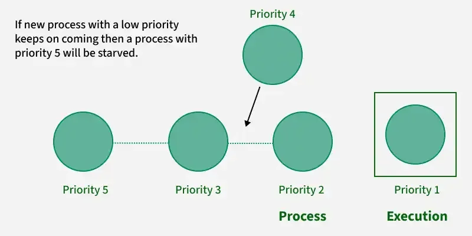

Starvation is the problem that occurs when high priority processes keep executing and low priority processes get blocked for indefinite time.

Causes of Starvation:

- Priority Scheduling

  If there are always higher-priority processes available, then the lower-priority processes may never be allowed to run.

- Resource Utilization

  We see that resources are always used by more significant priority processes and leave a lesser priority process starved.

### Livelock

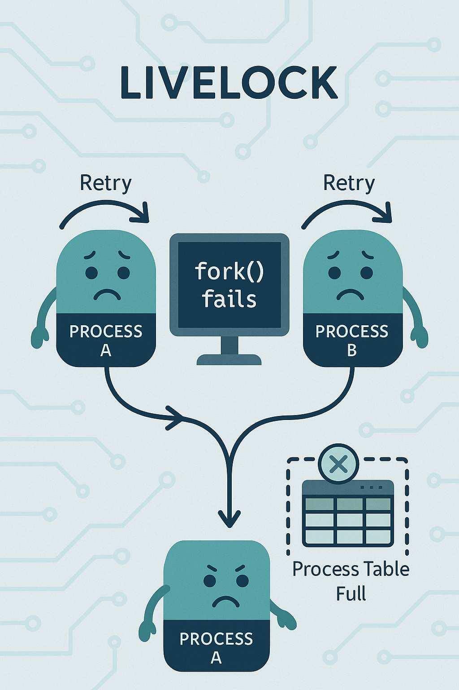

Livelock is a situation where processes are not blocked (like in deadlock) but they continuously change their state in response to each other, without making any real progress.

Causes of Livelock:

- Excessive resource preemption
- Over-politeness (cooperation issue)
- Improper scheduling
- Faulty recovery mechanisms
- Busy-waiting loops

---


## Process Synchronization


Process Synchronization is the coordination of multiple cooperating processes in a system to ensure controlled access to shared resources, thereby preventing race conditions and other synchronization problems.

### Conditions

1. Critical Section
2. Race Condition
3. Pre-emption

### Rules for synchronization mechanisms

- `Enter when idle`: If no process is in the critical section, a requesting process should be allowed to enter immediately.
- `Wait when busy`: If a process is in the critical section, others must wait to ensure mutual exclusion.
- `Bounded waiting`: Every process should be able to enter its critical section within a bounded time.
- `Yield while waiting`: A process unable to enter its critical section should release the CPU immediately.

### Solutions To Process Synchronization Problems

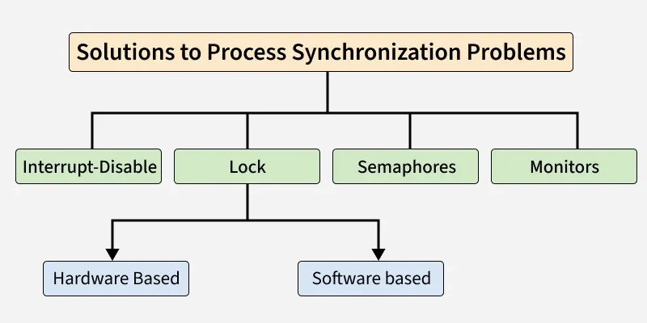

1. Interrupt Disable
2. Lock
3. Semaphores and Monitors

### Peterson's Algorithm

Peterson's Algorithm is a classic software-based solution for the critical section problem in operating systems. It ensures mutual exclusion between two processes, meaning only one process can access a shared resource at a time, thus preventing race conditions.

The Algorithm Workflow:

1. Intent to Enter: A process sets its flag to true when it wants to enter the critical section.
2. Turn Assignment: It sets the turn variable to the other process, giving the other process the chance to enter first if it also wants to.
3. Waiting Condition: A process waits if the other process also wants to enter and it is the other's turn.
4. Critical Section: Once the condition is false, the process enters the critical section safely.
5. Exit: On leaving, the process resets its flag to false, allowing the other process to proceed.

Algorithm Pseudocode:

- For process Pi:

  ```c++
  do {
      flag[i] = true;         // Pi wants to enter
     turn = j;               // Give turn to Pj
  
      while (flag[j] && turn == j);  // Wait if Pj also wants to enter
  
      // Critical Section
  
      flag[i] = false;        // Pi leaves critical section
  
      // Remainder Section
  } while (true);
  ```

- For process Pj:

  ```c++
  do {
      flag[j] = true;         
      turn = i;               
  
      while (flag[i] && turn == i);
  
      // Critical Section
  
      flag[j] = false;        
  
      // Remainder Section
  } while (true);
  ```

The algorithm uses two shared variables:

- flag[i]: shows whether process i wants to enter the critical section.
- turn: indicates whose turn it is to enter if both processes want to access the critical section at the same time.

### Dekker's Algorithm

Dekker's Algorithm was the first correct solution to the critical section problem for two processes. It is significant in the history of operating systems because:

- It avoids the drawbacks of naive alternation (strict turn-taking).
- It uses only shared memory (Boolean flags and a turn variable).
- It ensures mutual exclusion, progress, and bounded waiting.

Algorithm Pseudocode:

```c++
var flag: array [0..1] of boolean;
turn: 0..1;
repeat
        flag[i] := true;
        while flag[j] do
                if turn = j then
                begin
                        flag[i] := false;
                        while turn = j do no-op;
                        flag[i] := true;
                end;
                critical section
        turn := j;
        flag[i] := false;
                remainder section
until false;
```

### Bakery Algorithm

In the Bakery Algorithm, each process is assigned a number (a ticket) in a lexicographical order. Before entering the critical section, a process receives a ticket number, and the process with the smallest ticket number enters the critical section. If two processes receive the same ticket number, the process with the lower process ID is given priority.

Algorithm Pseudocode:

```c++
repeat
  
    choosing[i] := true
    number[i] := max(number[0..n-1]) + 1
    choosing[i] := false

    for j := 0 to n-1 do
        while choosing[j] do skip      // wait if other process is choosing
        while number[j] ≠ 0 and (number[j], j) < (number[i], i) do skip

    end for

    critical section

    number[i] := 0     // exit section
    remainder section

until false
```

### Hardware-Based Solutions

Various hardware solutions to the Critical Section Problem are:

1. Test And Set

   TAS is an atomic instruction that reads a variable's old value and sets it to true in a single indivisible step:

   ```c++
   boolean lock = false;   // Shared lock variable
   
   boolean TestAndSet(boolean &target) {
       boolean rv = target;   // Step 1: Read old value
       target = true;         // Step 2: Set lock (mark busy)
       return rv;             // Step 3: Return old value
   }
   while (1) {
   
       while (TestAndSet(lock));   // Entry Section → Busy wait until lock is free
       // ---- Critical Section ----
       lock = false;   // Exit Section → Release lock
       // ---- Remainder Section ----
   }
   ```

2. Swap (and CAS Enhancement)

   The Swap instruction is a hardware-based synchronization mechanism similar to Test-and-Set. Instead of directly setting the lock, it swaps the values of a shared lock variable and a local key variable. This ensures mutual exclusion because only one process can set its key to false and enter the critical section, while others keep spinning.

   Algorithm Pseudocode:

   ```c++
   boolean lock = false;   // Shared variable
   
   boolean key;            // Local per-process variable
   
   void swap(boolean &a, boolean &b) {
       boolean temp = a;
       a = b
       b = temp;
   }
   
   while (1) {
       key = true;                  // Process wants to enter
       while (key)                  // Entry Section
           swap(lock, key);         // Keep swapping until lock becomes true & key false
       // ---- Critical Section ----
       lock = false;   // Exit Section → Release lock
   }
   ```

3. Spinlock

   A Spinlock is a higher-level abstraction built using Test-and-Set or CAS:

   - A process repeatedly checks if the lock is free (spins) instead of sleeping.
   - Useful when waiting times are short (e.g., in kernel or multiprocessor systems).

   Algorithm Pseudocode:

   ```c++
   int lock = 0;   // 0 = free, 1 = busy
   
   void acquire() {
       while (TestAndSet(lock));   // Busy wait
   }
   
   void release() {
       lock = 0;
   }
   
   while (1) {
       acquire();
       
       // ---- Critical Section ----
       
       release();
       
       // ---- Remainder Section ----
   }
   ```

---


## Semaphore

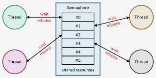

A semaphore is a non-negative integer variable that is shared between various threads. Semaphore works upon a signaling mechanism; in this, a thread can be signaled by another thread.

Semaphores help prevent race conditions and ensure proper coordination between processes:

- Control entry into the critical section.
- Maintains a counter representing available resources.
- Ensures mutual exclusion among processes.
- Can block and wake up processes during execution.
- Widely used in concurrent programming.

Types of Semaphores:

1. Counting Semaphore
2. Binary Semaphore

---


## Mutex

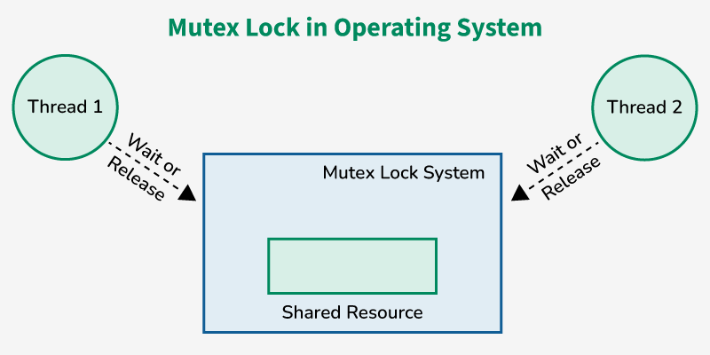

Mutex is mainly used to provide mutual exclusion to a specific portion of the code so that the process can execute and work with a particular section of the code at a particular time.

---


## Summary

### Mutex vs Semaphore

| Mutex                                                        | Semaphore                                                    |
| ------------------------------------------------------------ | ------------------------------------------------------------ |
| A mutex is an object.                                        | A semaphore is an integer.                                   |
| Mutex works upon the locking mechanism.                      | Semaphore uses a signaling mechanism.                        |
| Operations on mutex: Lock & Unlock.                          | Operation on semaphore: Wait & Signal.                       |
| Mutex does not have any subtypes.                            | Semaphore is of two types: Counting Semaphore & Binary Semaphore. |
| A mutex can only be modified by the process that is requesting or releasing a resource. | Semaphore work with two atomic operations (Wait, signal) which can modify it. |
| If the mutex is locked then the process needs to wait in the process queue and the mutex can only be accessed once the lock is released. | If the process needs a resource and no resource is free. So, the process needs to perform a wait operation until the semaphore value is greater than zero. |

### Difference Between Starvation And Livelock

| Feature         | Starvation                                                   | Livelock                                                     |
| --------------- | ------------------------------------------------------------ | ------------------------------------------------------------ |
| Definition      | A process waits indefinitely because it is always bypassed by others. | Processes keep executing but fail to make progress.          |
| Cause           | Unfair resource allocation or scheduling.                    | Processes continuously respond to each other, preventing progress. |
| Process State   | Ready but not scheduled/executed.                            | Actively executing but not making progress.                  |
| System Progress | System progresses, but some processes do not.                | System is busy, but no real work is done.                    |
| Resolution      | Use of fair scheduling (e.g., aging).                        | Needs better coordination or back-off strategies.            |
| Example         | A low-priority task never gets CPU time.                     | Two processes constantly yielding to each other.             |


## Reference

[1] [Critical Section in Synchronization](https://www.geeksforgeeks.org/operating-systems/critical-section-in-synchronization/)

[2] [Solutions to Process Synchronization Problems](https://www.geeksforgeeks.org/operating-systems/solutions-to-critical-section-problem/)

[3] [Peterson's Algorithm in Process Synchronization](https://www.geeksforgeeks.org/dsa/petersons-algorithm-in-process-synchronization/)

[4] [Dekker's algorithm in Process Synchronization](https://www.geeksforgeeks.org/dsa/dekkers-algorithm-in-process-synchronization/)

[5] [Semaphores in Process Synchronization](https://www.geeksforgeeks.org/operating-systems/semaphores-in-process-synchronization/)

[6] [Mutex vs Semaphore](https://www.geeksforgeeks.org/operating-systems/mutex-vs-semaphore/)

[7] [Introduction of Deadlock in Operating System](https://www.geeksforgeeks.org/operating-systems/introduction-of-deadlock-in-operating-system/)

[8] [Deadlock Prevention](https://www.geeksforgeeks.org/operating-systems/deadlock-prevention/)

[9] [Banker's Algorithm](https://www.geeksforgeeks.org/operating-systems/bankers-algorithm-in-operating-system-2/)

[10] [Resource Allocation Graph (RAG)](https://www.geeksforgeeks.org/operating-systems/resource-allocation-graph-rag-in-operating-system/)

[11] [Deadlock Detection And Recovery](https://www.geeksforgeeks.org/operating-systems/deadlock-detection-recovery/)

[12] [Deadlock Ignorance](https://www.geeksforgeeks.org/operating-systems/deadlock-ignorance-in-operating-system/)

[13] [Starvation and Livelock](https://www.geeksforgeeks.org/operating-systems/deadlock-starvation-and-livelock/)