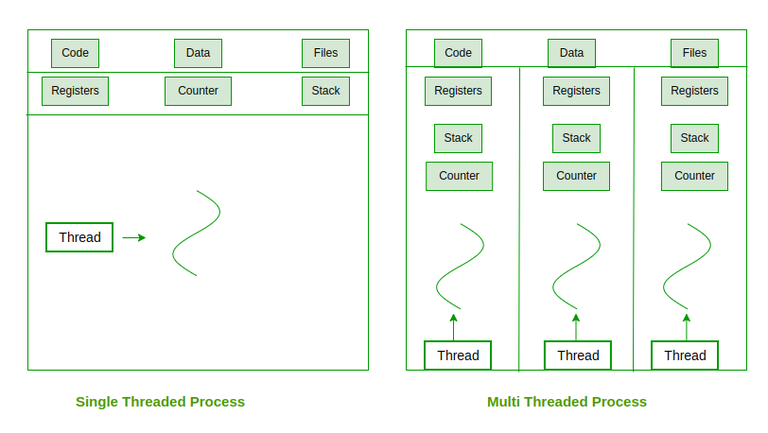
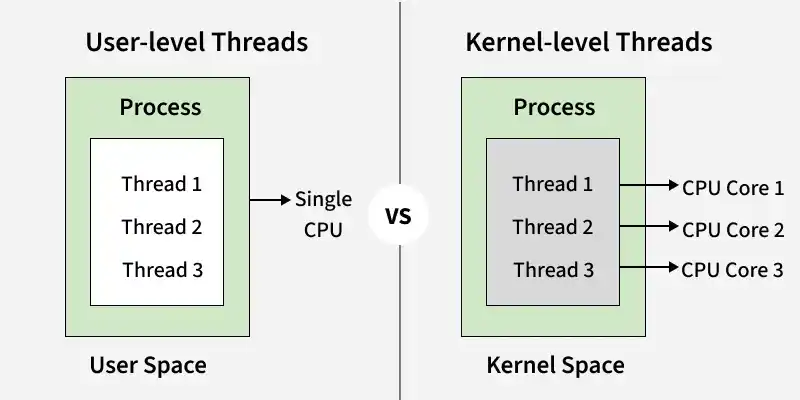
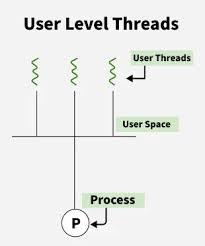
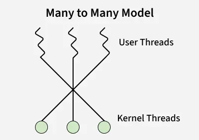
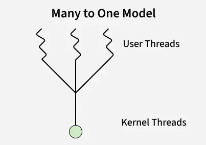
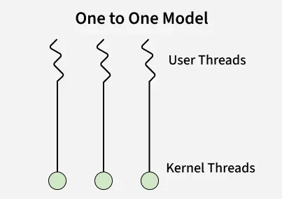

English | [中文版](thread_zh.md)

# Thread

[TOC]


A thread, also called a `Light-Weight Process`, is an entity of a process and the basic unit of CPU scheduling and dispatch. It is lighter than a process, does not own system resources, and only requires some necessary runtime resources (like program counter, registers, and stack). It has a function entry and return, and can share all resources of the process with other threads in the same process. Thread communication is mainly via shared memory; context switching overhead is small, but stability is lower.

Threads are needed in modern operating systems and applications because they:

- Improve Performance
- Increase Responsiveness
- Enable Concurrency
- Better CPU Utilization
- Efficient Resource Sharing

## Components



- Stack Space

  Stores local variables, function calls, and return addresses specific to the thread.

- Register Set

  Hold temporary data and intermediate results for the thread's execution.

- Program Counter

  Tracks the current instruction being executed by the thread.


## Types



### User-Level Threads (ULTs)



The User-level Threads are implemented by the user-level software. These threads are created and managed by the thread library, which the operating system provides as an API for createing, managing, and synchronizing threads.

### kernel-Level Threads (KLTs)

Kernel-level threads (KLTs) are created and managed directly by the operating system kernel. The kernel handles all operations like creation, scheduling, suspension, and termination, giving it full control. This ensures proper coordination and complete awareness of all threads within a process.

### Combined Models

- Many-to-Many Model

  

- Many-to-One Model

  

- One-to-One Model

  


## POSIX API

### pthread_create

```c++
#include <pthread.h>
int pthread_create(pthread_t *tid, const pthread_attr_t *attr, void *(*func)(void *), void *arg);
```

- `tid`: returned thread ID
- `attr`: attributes
- `func`: function to execute
- `arg`: argument to function
- `return value`: 0 on success, error code on failure

Creates a thread.

### pthread_join

```c++
#include <pthread.h>
int pthread_join(pthread_t *tid, void **status);
```

- `tid`: thread ID
- `status`: thread return value
- `return value`: 0 on success, error code on failure

Waits for thread to terminate.

### pthread_self

```c++
#include <pthread.h>
int pthread_detach(pthread_t tid);
```

- `tid`: thread ID
- `return value`: 0 on success, error code on failure

Detaches the specified thread.

### pthread_exit

```c++
#include <pthread.h>
void pthread_exit(void *status);
```

- `status`: thread exit status

Terminates the thread.

### pthread_once

```c++
#include <pthread.h>
int pthread_once(pthread_once_t *onceptr, void (*init)(void));
```

- `onceptr`: call record pointer
- `init`: initialization function
- `return value`: 0 on success, error code on failure

Ensures init is called only once.

### pthread_key_create

```c++
#include <pthread.h>
int pthread_key_create(pthread_key_t *keyptr, void (*destructor)(void *value));
```

- `keyptr`: created key
- `destructor`: key destructor
- `return value`: 0 on success, error code on failure

Allocates a key for thread-specific data.

### pthread_getspecific

```c++
#include <pthread.h>
void *pthread_getspecific(pthread_key_t key);
```

- `key`: key
- `return value`: pointer to thread-specific data (nullable)

Gets value by key.

### pthread_setspecific

```c++
#include <pthread.h>
int pthread_setspecific(pthread_key_t key, const void *value);
```

- `key`: key
- `value`: value
- `return value`: 0 on success, error code on failure

Sets value by key.

### pthread_mutex_lock

```c++
#include <pthread.h>
int pthread_mutex_lock(pthread_mutex_t *mptr);
```

- `mptr`: mutex
- `return value`: 0 on success, error code on failure

Locks the mutex.

### pthread_mutex_unlock

```c++
#include <pthread.h>
int pthread_mutex_unlock(pthread_mutex_t *mptr);
```

- `mptr`: mutex
- `return value`: 0 on success, error code on failure

Unlocks the mutex.

### pthread_cond_wait

```c++
#include <pthread.h>
int pthread_cond_wait(pthread_cond_t *cptr, pthread_mutex_t *mptr);
```

- `cptr`: condition variable
- `mptr`: mutex
- `return value`: 0 on success, error code on failure

Waits on a condition variable (single thread).

### pthread_cond_signal

```c++
#include <pthread.h>
int pthread_cond_signal(pthread_cond_t *cptr);
```

- `cptr`: condition variable
- `mptr`: mutex
- `return value`: 0 on success, error code on failure

Wakes up a single thread waiting on the condition variable.

### pthread_cond_timedwait

```c++
#include <pthread.h>
int pthread_cond_timedwait(pthread_cond_t *cptr, pthread_kmutex_t *mptr, 
                           const struct timespec *abstime);
```

- `cptr`: condition variable
- `mptr`: mutex
- `abstime`: absolute wait time (seconds and nanoseconds since 1970-01-01 UTC)
- `return value`: 0 on success, error code on failure

Timeout wait for all threads on the condition variable.

### pthread_cond_broadcast

```c++
#include <pthread.h>
int pthread_cond_broadcast(pthread_cond_t *cptr);
```

- `cptr`: condition variable
- `mptr`: mutex
- `abstime`: absolute wait time (seconds and nanoseconds since 1970-01-01 UTC)
- `return value`: 0 on success, error code on failure

Wakes up all threads waiting on the condition variable.


## Summary

### user-Level Thread vs Kernel-Level Thread

| User-Level Thread (ULT)                   | Kernel-Level Thread (KLT)                   |
| ----------------------------------------- | ------------------------------------------- |
| Implemented by user-level libraries       | Implemented by the Operating System         |
| Not recognized by the OS                  | Recognized by the OS                        |
| Fast context switching with less overhead | Slower context switching with more overhead |
| Blocking blocks the entire process        | Only the blocked thread is affected         |
| Limited use of multiprocessing            | Fully utilizes multiprocessing              |
| Fast and simple creation and management   | Slower and more complex management          |
| Threads share the same address space      | Each thread has its own address space       |
| More portable, works on any OS            | OS-dependent and less portable              |

### Benefits Of Multithreading

1. Increased Responsiveness
2. Resource Sharing
3. Economy of Resources
4. Scalability
5. Better Communication
6. Microprocessor Architecture Utilization
7. Minimized System Resource Usage
8. Reduced Context Switching Time
9. Enhanced Concurrency


## References

[1] Tang Xiaodan, Liang Hongbing, Zhe Fengping, Tang Ziying. Computer Operating System. 3rd Edition. P32 - P115

[2] [Thread in Operating System](https://www.geeksforgeeks.org/operating-systems/thread-in-operating-system/)

[3] [User Level vs Kernel Level Threads](https://www.geeksforgeeks.org/operating-systems/difference-between-user-level-thread-and-kernel-level-thread/)

[4] [Benefits of Multithreading in Operating System](https://www.geeksforgeeks.org/operating-systems/benefits-of-multithreading-in-operating-system/)