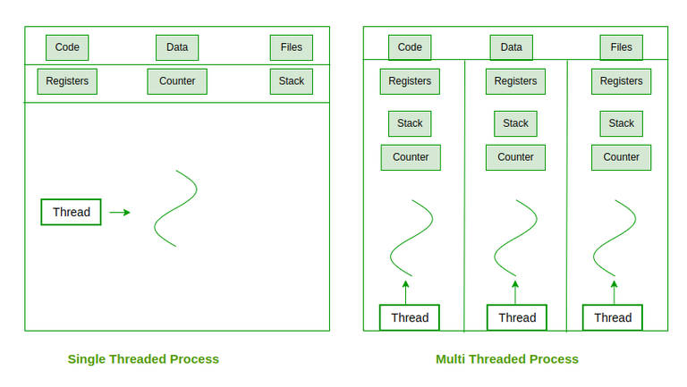
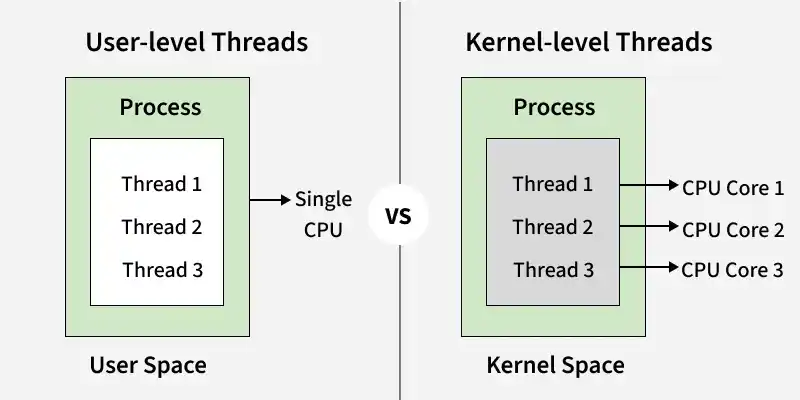
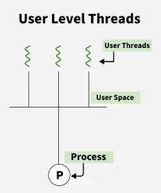
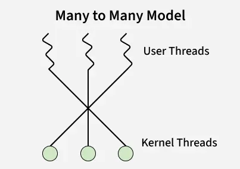
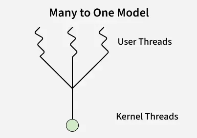
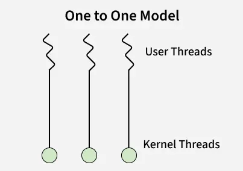

English | [中文版](thread_zh.md)

# Thread

[TOC]

A thread, also called a `Light-Weight Process`, is an entity of a process and the basic unit of CPU scheduling and dispatch. It is lighter than a process, does not own system resources, and only requires some necessary runtime resources (like program counter, registers, and stack). It has a function entry and return, and can share all resources of the process with other threads in the same process. Thread communication is mainly via shared memory; context switching overhead is small, but stability is lower.

Threads are needed in modern operating systems and applications because they:

- Improve Performance
- Increase Responsiveness
- Enable Concurrency
- Better CPU Utilization
- Efficient Resource Sharing

## Components

- Stack Space

  Stores local variables, function calls, and return addresses specific to the thread.

- Register Set

  Hold temporary data and intermediate results for the thread's execution.

- Program Counter

  Tracks the current instruction being executed by the thread.

## Types

### User-Level Threads (ULTs)

The User-level Threads are implemented by the user-level software. These threads are created and managed by the thread library, which the operating system provides as an API for createing, managing, and synchronizing threads.

### kernel-Level Threads (KLTs)

Kernel-level threads (KLTs) are created and managed directly by the operating system kernel. The kernel handles all operations like creation, scheduling, suspension, and termination, giving it full control. This ensures proper coordination and complete awareness of all threads within a process.

### Combined Models

- Many-to-Many Model

  

- Many-to-One Model

  

- One-to-One Model

  

## Thread Scheduling

### Self-scheduling

All processors share a common ready queue; idle processors pick up processes/threads to run.

| Advantages                                                   | Disadvantages                                                |
| ------------------------------------------------------------ | ------------------------------------------------------------ |
| - Easy to port single-machine scheduling - Avoids imbalance, improves utilization | - Bottleneck - Inefficiency - Frequent thread switches |

### Gang scheduling

A group of threads from a process is assigned to a group of processors. Processor time can be allocated:

- Evenly among all applications
- Evenly among all threads

| Advantages                                                   | Disadvantages |
| ------------------------------------------------------------ | ------------- |
| - Reduces context switches, improves efficiency - Reduces scheduling frequency and overhead |               |

### Dedicated processor assignment

During an application's execution, a set of processors is dedicated to it, one per thread, until completion.

### Dynamic scheduling

Allows processes to change thread count during execution. The OS mainly allocates processors, following:

- Allocate if idle
- New jobs have absolute priority
- Keep waiting
- Allocate on release

### Conext Switch

Thread Context Switch is a process of switching the working from one thread to another. The computer CPU stores the state of the current thread, so that it can be returned later. Next, it switches to the next thread, picks up where it was left before, and continues to start working.

## Summary

### user-Level Thread vs Kernel-Level Thread

| User-Level Thread (ULT)                   | Kernel-Level Thread (KLT)                   |
| ----------------------------------------- | ------------------------------------------- |
| Implemented by user-level libraries       | Implemented by the Operating System         |
| Not recognized by the OS                  | Recognized by the OS                        |
| Fast context switching with less overhead | Slower context switching with more overhead |
| Blocking blocks the entire process        | Only the blocked thread is affected         |
| Limited use of multiprocessing            | Fully utilizes multiprocessing              |
| Fast and simple creation and management   | Slower and more complex management          |
| Threads share the same address space      | Each thread has its own address space       |
| More portable, works on any OS            | OS-dependent, and less portable             |

### Benefits Of Multithreading

1. Increased Responsiveness
2. Resource Sharing
3. Economy of Resources
4. Scalability
5. Better Communication
6. Microprocessor Architecture Utilization
7. Minimized System Resource Usage
8. Reduced Context Switching Time
9. Enhanced Concurrency

## References

[1] Tang Xiaodan, Liang Hongbing, Zhe Fengping, Tang Ziying. Computer Operating System. 3rd Edition. P32 - P115

[2] [Thread in Operating System](https://www.geeksforgeeks.org/operating-systems/thread-in-operating-system/)

[3] [User Level vs Kernel Level Threads](https://www.geeksforgeeks.org/operating-systems/difference-between-user-level-thread-and-kernel-level-thread/)

[4] [Benefits of Multithreading in Operating System](https://www.geeksforgeeks.org/operating-systems/benefits-of-multithreading-in-operating-system/)