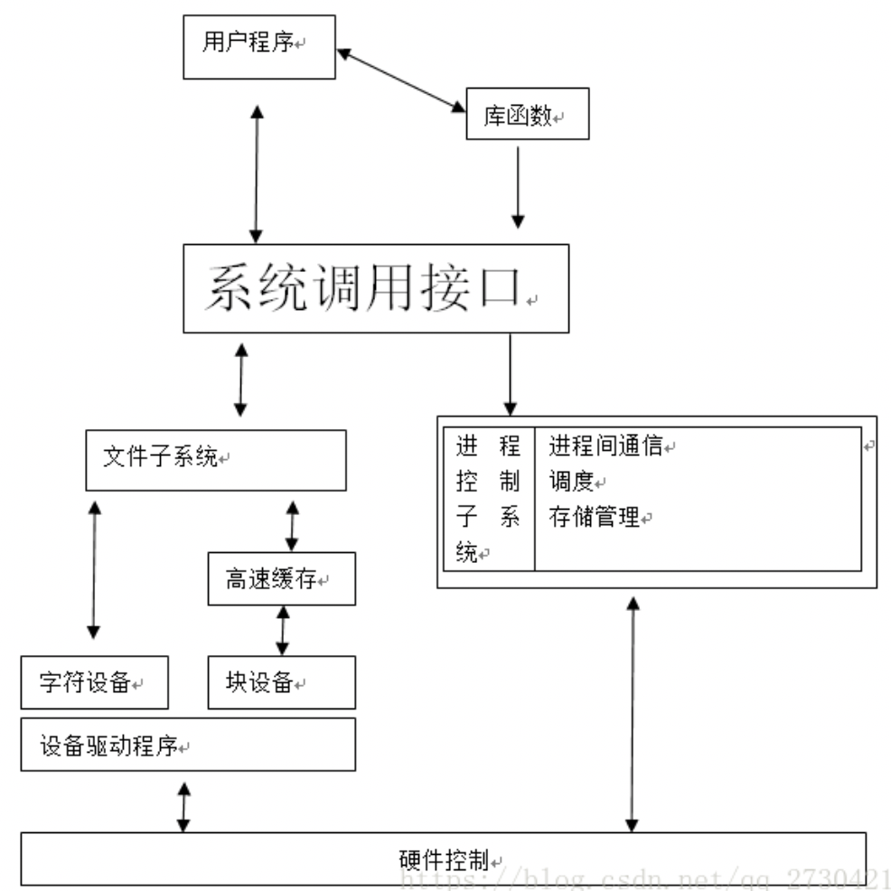
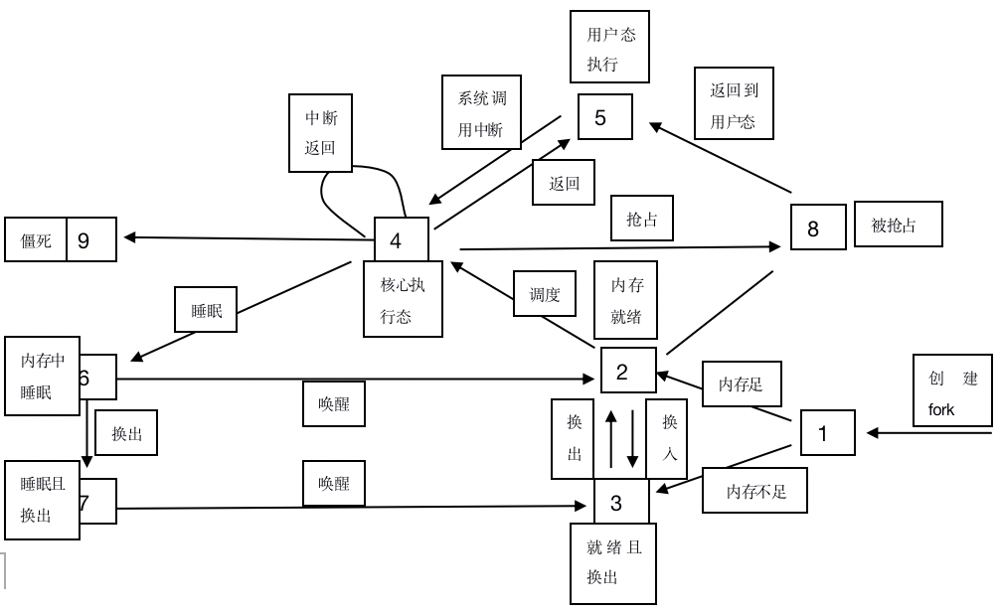
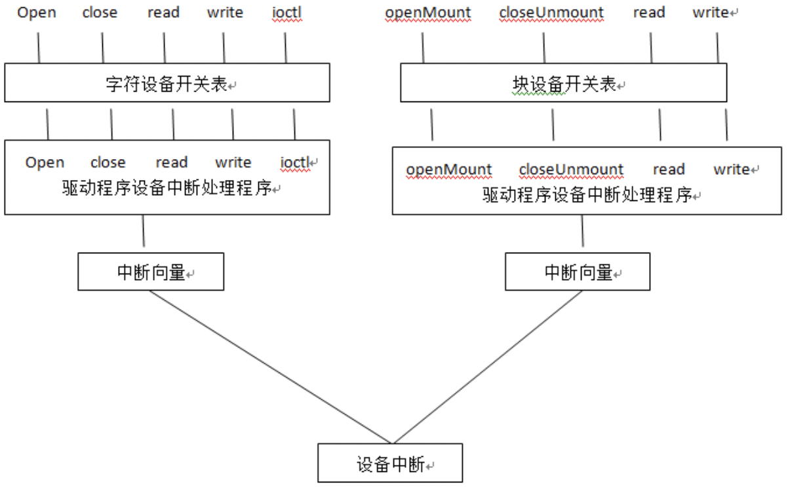

English | [中文版](unix_core_zh.md)

# UNIX Kernel

[TOC]

## UNIX Kernel Structure

## Process State Transitions

## Process Priority

### Calculation Formula

$Priority = (recent CPU time \div 2) + base user priority$

## Device Switch Table and Interface Between System Calls and Drivers

