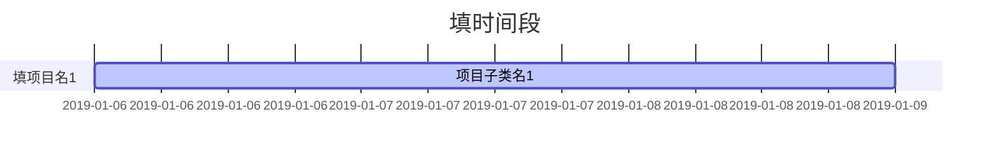

# 工作日志模版

## 需求

标签1#标签2

## 进度

## 日报

| 日期  | 工作内容           | 遇到的问题         | 解决方案 |
| ----- | ------------------ | ------------------ | -------- |
| 01-01 | - 任务1 - 任务2 | - 问题1 - 问题2 |          |

## 阶段总结

1. 总结1
2. 总结2

