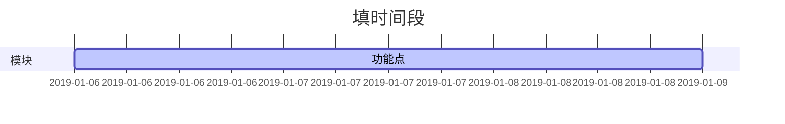

# 需求文档模板

## 版本信息

| 版本号 | 修订人/审核人 | 修订日期   | 修订说明 |
| ------ | ------------- | ---------- | -------- |
| v0.0.0 | xxx/xxx       | 0000.00.00 | - 说明   |

<!-- vim-markdown-toc GFM -->

* [1 文档说明](#1-文档说明)
    - [1.1 文档简介](#11-文档简介)
    - [1.2 文档读者](#12-文档读者)
    - [1.3 专业术语](#13-专业术语)
* [2 产品简介](#2-产品简介)
    - [2.1 产品定位](#21-产品定位)
    - [2.2 产品特色](#22-产品特色)
    - [2.3 需求分析](#23-需求分析)
* [3 产品架构](#3-产品架构)
    - [3.1 用户使用流程图](#31-用户使用流程图)
    - [3.2 产品信息结构图](#32-产品信息结构图)
    - [3.3 产品功能结构图](#33-产品功能结构图)
* [4. 详细功能说明](#4-详细功能说明)
    - [4.1 功能清单](#41-功能清单)
    - [4.2 功能点1](#42-功能点1)
        + [4.2.1 功能原型](#421-功能原型)
        + [4.2.2 功能详细描述](#422-功能详细描述)
        + [4.2.3 功能业务流程图](#423-功能业务流程图)
        + [4.2.4 与其他子模块的接口](#424-与其他子模块的接口)
        + [4.2.5 业务数据描述](#425-业务数据描述)
        + [4.2.6 边界值处理](#426-边界值处理)
        + [4.2.7 异常处理](#427-异常处理)
        + [4.2.8 验收标准](#428-验收标准)
    - [4.3 功能点2](#43-功能点2)
* [5 非功能性需求](#5-非功能性需求)
    - [5.1 界面需求](#51-界面需求)
    - [5.2 性能需求](#52-性能需求)
    - [5.3 安全性需求](#53-安全性需求)
    - [5.4 维护与升级](#54-维护与升级)
    - [5.5 可靠性和健壮性](#55-可靠性和健壮性)
    - [5.6 运行环境](#56-运行环境)
    - [5.7 运营需求](#57-运营需求)
* [6 项目规划](#6-项目规划)
    - [6.1 风险分析及对策](#61-风险分析及对策)
    - [6.2 时间规划](#62-时间规划)
    - [6.3 版本规划](#63-版本规划)
    - [6.4 成本估算](#64-成本估算)
        + [6.4.1 人力资源成本](#641-人力资源成本)
        + [6.4.2 其它](#642-其它)
* [7 附录](#7-附录)
    - [7.1 参考文献](#71-参考文献)
    - [7.2 外部链接](#72-外部链接)

<!-- vim-markdown-toc -->

## 1 文档说明

### 1.1 文档简介

(1. 功能需求点及设计; 2. 各模块的需求细节及逻辑流程)

### 1.2 文档读者

（1.此文档面向的读者）

### 1.3 专业术语

（专业术语说明）

## 2 产品简介

### 2.1 产品定位

（1.产品面向的对象及特征；）

### 2.2 产品特色

（1.对产品的特色进行突出）

### 2.3 需求分析

（1.记录/分析用户的需求）

## 3 产品架构

### 3.1 用户使用流程图

(流程图，串联用户行为信息与产品结构，制定用户操作流程图)

### 3.2 产品信息结构图

(信息结构图，对数据进行归纳和建模，为数据库建立提供参考)

### 3.3 产品功能结构图

（功能结构图，按照产品的逻辑划分各个功能，应展开至用户最小可见单元）

## 4. 详细功能说明

### 4.1 功能清单

| 序号 | 模块     | 功能点      | 优先级       | 输入/前置条件     | 需求说明    | 输出/后置条件 | 备注       |
| ---- | -------- | ----------- | ------------ | ----------------- | ----------- | ------------- | ---------- |
| 1    | (模块名) | 1. （功能） | （低/中/高） | （入口/输入参数） | 1. （需求） | 1. （输出1）  | 1.（备注） |

### 4.2 功能点1

#### 4.2.1 功能原型

(原型图)

#### 4.2.2 功能详细描述

(描述)

#### 4.2.3 功能业务流程图

(流程图)

#### 4.2.4 与其他子模块的接口

(接口说明)

#### 4.2.5 业务数据描述

(1.角色数据结构及功能；2.用户数据结构及功能；3.日志数据结构及功能)

#### 4.2.6 边界值处理

(对于正常操作导致失败时的处理规则)

#### 4.2.7 异常处理

(对于异常错误导致失败时的处理规则)

#### 4.2.8 验收标准

(1.测试环境；2.测试方法；3.测试需要收集的参数)

### 4.3 功能点2

...

## 5 非功能性需求

### 5.1 界面需求

（1.界面风格；2.布局；）

### 5.2 性能需求

（1.TPS；2.QPS；3.并发数；4.RT；...）

### 5.3 安全性需求

（需求描述）

### 5.4 维护与升级

（维护与升级描述）

### 5.5 可靠性和健壮性

（描述）

### 5.6 运行环境

（1.硬件平台；2.操作系统及版本；3.需要的第三方应用程序/插件）

### 5.7 运营需求

（1.用户数据分析功能; 2.数据管理功能）

## 6 项目规划

### 6.1 风险分析及对策

| 风险点   | 分析     | 对策     |
| -------- | -------- | -------- |
| （风险） | （原因） | （对策） |

### 6.2 时间规划

### 6.3 版本规划

| 版本 | 主要模块 | 功能点 | 计划开发时间 | 计划结束时间 | 备注 |
| ---- | -------- | ------ | ------------ | ------------ | ---- |
|      |          |        |              |              |      |

### 6.4 成本估算

#### 6.4.1 人力资源成本

| 编号 | 组别 | 人数 | 工时 | 人月单价 | 成本 | 是否全职 |
| ---- | ---- | ---- | ---- | -------- | ---- | -------- |
|      |      |      |      |          |      |          |

合计：

#### 6.4.2 其它

合计：

## 7 附录

### 7.1 参考文献

[1] 作者.书名.页码 起始年月-结束年月

### 7.2 外部链接

- 

