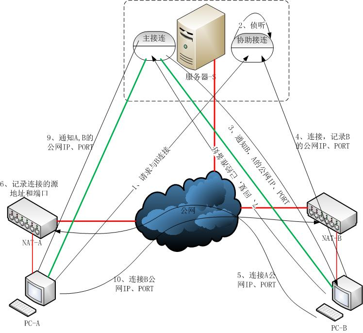

# im系统调研报告

贺汉景

---

**摘要**  IM(instant messaging，即时通讯)

关于im系统的调研报告，包括相关竞品分析，架构，编程语言，消息协议，序列化，数据库，存储，编程语言等方案的选择；

**关键字** im  语音  序列化  持久化   数据库

---

[TOC]

## 1 引言

## 2 预备知识

### 2.1 一个im服务需要提供的功能

一套基本的im服务至少需要提供以下功能：

1. 好友管理
2. 私聊
3. 群聊
4. 状态信息
5. 离线消息
6. 低延迟
7. 消息防丢
8. 消息溯源
9. 消息屏蔽
10. 网络异常处理

以下为可选功能

1. 加密
2. 图片/二进制信息
3. 音/视频
4. 一号多登
5. 消息“已读”

### 2.2 竞品分析

- QQ
- 微信
- 网易云信

对比：

| -    | QQ   | 微信 | 网易云信 |
| ---- | ---- | ---- | -------- |
|      |      |      |          |

### 2.3 难点分析

1. 延时性
2. 消息到达率
3. 弹性扩容/伸缩能力
4. 信息安全
5. 信息存储与溯源

### 2.4 已有开源项目

1. 

## 3 正文

### 3.1 架构

#### 3.1.1 QQ架构方案

#### 3.1.2 网易云信架构方案

### 3.2 通讯协议

#### 3.2.1 TCP

#### 3.2.2 UDP

#### 3.2.3 HTTP

### 3.3 消息协议

#### 3.3.1 MQTT

#### 3.3.2 XMPP

### 3.4 序列化

#### 3.4.1 Protobuf

#### 3.4.2 MessagePack

#### 3.4.3 JSON

### 3.5 数据库

#### 3.5.1Mysql

### 3.6 存储

#### 3.6.1 Ceph

### 3.7 编程语言

#### 3.7.1 lua

#### 3.7.2 go

---

## 参考

### 文献

[^1]: 作者.书名.页码 起始-结束 

### 外链

- [github-im_service](https://github.com/GoBelieveIO/im_service)
- [github-gochat](https://github.com/LockGit/gochat)
- [IM服务器架构实现](https://blog.csdn.net/cluzax/article/details/42584921)
- [网易云信周梁伟专访：亿级架构 IM 平台的技术难点解析](https://www.infoq.cn/article/2018/09/netease-im-techpoint-annalysis)
- [网易云信流媒体首席架构师：新一代音视频技术架构如何构建？](https://www.cnblogs.com/wangyiyunxin/p/14133785.html)
- [阿里钉钉技术分享：企业级IM王者——钉钉在后端架构上的过人之处](https://zhuanlan.zhihu.com/p/93770352)
- [零基础IM开发入门(三)：什么是IM系统的可靠性](https://www.163.com/dy/article/FQ432TM00511X1MK.html)

