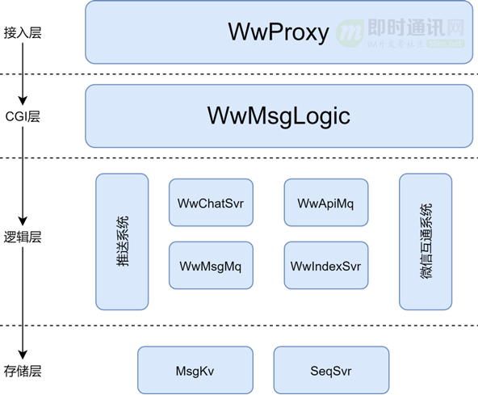
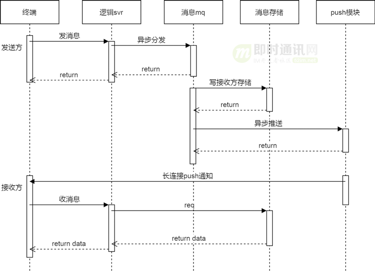
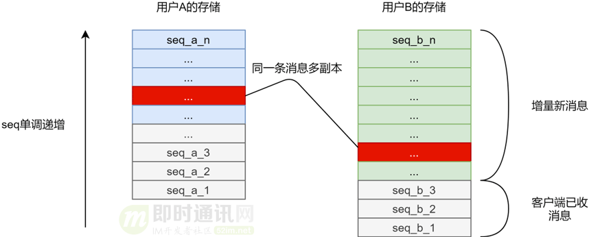
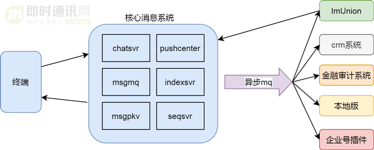
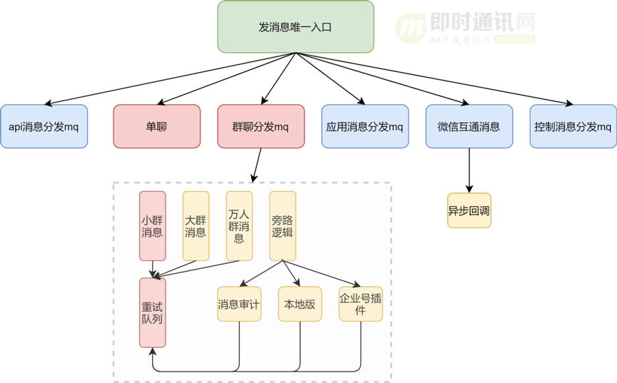
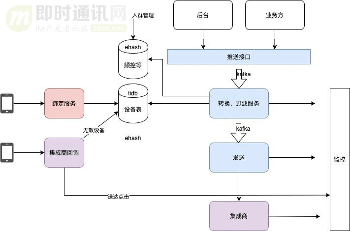
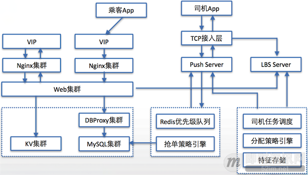
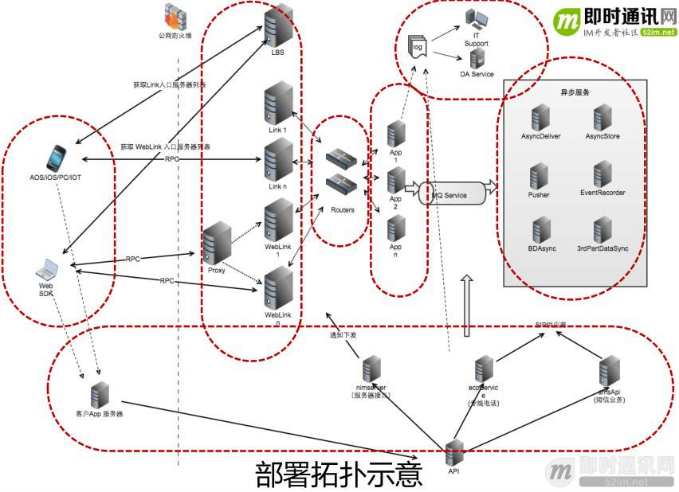

# im系统调研报告

贺汉景

---

**摘要**  IM(instant messaging，即时通讯)

关于im服务的调研报告，包括相关竞品分析，架构，编程语言，消息协议，序列化，数据库，存储，编程语言等方案的选择；主要用于给im系统设计者提供参考；

**关键字** im  调研  语音  序列化  持久化   数据库

---

[TOC]

## 1 引言

## 2 预备知识

### 2.1 需要提供的功能

一套基本的im服务至少需要提供以下功能：

1. 基础聊天（1v1）；
2. 群组聊天（1v多）；
3. 个人状态信息（离线，在线，忙碌...）；
4. 消息多重备份（防止服务端保存的数据因为硬件损坏或其他原因造成丢失，往往需要做多副本）；
5. 消息屏蔽（对于广告/色情/骚扰消息，需要提供屏蔽功能）；
6. 黑名单（需要提供拉黑功能）；
7. 抗弱网；
8. 去网络抖动；
9. 流量控制。

以下为可选功能：

1. 权限管理；
2. 信息安全；
3. 支持图文/语音/视频信息/表情包等信息；
4. 实时音/视频；
5. 一号多登；
6. 消息“已读”功能。

### 2.2 竞品分析

- 网易云信

#### 2.2.1 基本功能对比

| 功能         | 网易云信                   |
| ------------ | -------------------------- |
| 基础聊天     | 支持                       |
| 群组聊天     | 支持                       |
| 个人状态信息 | 支持                       |
| 消息多重备份 | 支持                       |
| 消息屏蔽     | 支持                       |
| 黑名单       | 支持                       |
| 网络异常处理 | 支持                       |
| 权限管理     | 支持                       |
| 信息安全     | 支持                       |
| 图片消息     | 支持                       |
| 音频消息     | 支持                       |
| 视频消息     | 支持                       |
| 图文消息     | 支持                       |
| 表情包       | 支持                       |
| 实时音频     | 支持，高清语音             |
| 实时视频     | 支持，高清视频             |
| 覆盖平台     | IOS，Android，Windows，Web |

#### 2.2.2 参数对比

| 性能指标   | 网易云信     |
| ---------- | ------------ |
| 丢包       | 抗70%丢包    |
| 网络抖动   | 抗2000ms抖动 |
| 带宽利用率 | 90%          |
| 延迟       | 无相关资料   |

### 2.3 难点分析

1. 消息100%送达率

   消息的100%送达率是IM系统的核心功能之一，离线消息要缓存+数据库存储，客户端发送完消息之后要确认。

2. 低延迟

   低延迟的消息送达是IM系统的另一个核心功能；高延迟的IM系统等于不可用的系统，会造成用户的大量流失。

3. 稳定性

   TODO

4. 弹性扩容/伸缩能力

   TODO

5. 信息安全

   信息安全需要防止消息内容在传输过程中被抓包破译；多点登录时，要做鉴权。

6. 信息存储与溯源

   服务端存储的数据管理问题，要防止脱库和信息泄露，做好用户信息的管理。

   同时根据相关法律法规的规定，im系统需要接入公安部门的监控系统，要做好配合任务。

### 2.4 开源项目

1. [im_service (golang)](https://github.com/GoBelieveIO/im_service)
2. [gochat (golang)](https://github.com/LockGit/gochat)

### 2.5 测试方法

#### 2.5.1 丢包率

#### 2.5.2 网络抖动

#### 2.5.3 带宽利用率

#### 2.5.4 延迟

## 3 正文

### 3.1 架构

#### 3.1.1 企业微信架构

- 架构分层

  

- 消息收发模型

  

- 消息扩散写协议

  

- 消息解耦

  

  

#### 3.1.2 喜马拉雅架构

#### 3.1.3 嘀嘀打车架构

#### 3.1.4 网易IM云架构

### 3.2 网络传输协议

选择网络传输协议时需要考虑以下的问题：

- 网络环境的稳定性

  在互联网环境里，网络基础建设比较成熟和完善，网路环境稳定性较高。

  移动互联网相对于互联网来说，还是比较低速，不稳定，并且在短时间内很难达到互联网的质量。

- 客户端的电池续航能力与休眠策略

  对于移动终端来说，电池的续航能力到目前为止，依然是技术瓶颈；一般的终端厂商为了省电，往往会采取休眠+杀后台这种激进方式；在这种情况下会极大的限制im系统的应用场景。

- IPv4资源

  到目前(2021年)为止，IPv6方案推进依旧缓慢，大部分终端采用的还是IPv4的方式；IPv4地址资源相当紧缺；通过“端口映射”方式虽然可以解决这个问题，但是端口的数量依然是有限的，要注意端口资源的耗尽影响正常的通讯。

- 服务端承载能力

  对于有巨量连接的服务来说，TCP的编程难度，程序复杂度，调试难度，运维成本，网络成本远高于UDP。

- 其他特性

  对于im系统来说，除了以上特性之外，还要考虑协议的安全性，可靠性等问题。

#### 3.2.1 TCP

传输控制协议（TCP，Transmission Control Protocol）是一种面向连接的、可靠的、基于字节流的传输层通信协议；为了在不可靠的互联网络上提供可靠的端到端字节流而专门设计。

#### 3.2.2 UDP

用户数据报协议（UDP，User Datagram Protocol）是一种无连接的传输协议，无需建立连接就可以发送封装的 IP 数据包；是一种简单且不可靠信息传送服务。

#### 3.2.3 HTTP

超文本传输协议（Hyper Text Transfer Protocol，HTTP）是一个简单的请求-响应协议，建立在TCP基础之上的文本协议。

#### 3.2.4 小结

选型建议：

1. 应该结合具体的使用场景来确定网络传输协议，灵活的采用UDP，TCP或UDP+TCP的方式；
2. 对于可靠性要求较高的场景，比如：转账，文件传输，建议使用TCP；
3. 对于性能要求较高的场景，比如：基础聊天，音视频通讯，建议使用UDP或UDP+TCP的方式；

以下是一些行业案例：

| 产品 | 网络传输协议 |
| ---- | ------------ |
| QQ   | UDP+TCP      |
| 微信 | TCP+HTTP     |

### 3.3 消息协议

#### 3.3.1 私有协议

自行制定的私有消息协议。

**优点：**高效，节约流量(一般使用二进制协议)，安全性高，难以破解；
**缺点：**在开发初期没有现有样列可以参考，对于设计者的要求比较高。

#### 3.3.2 MQTT

MQTT协议是一种消息列队传输协议，采用订阅、发布机制，订阅者只接收自己已经订阅的数据，非订阅数据则不接收，既保证了必要的数据的交换，又避免了无效数据造成的储存与处理。在工业物联网中得到广泛的应用。

**优点：**协议简单，流量少；
**缺点：**它并不是一个专门为IM设计的协议，多使用于推送。

#### 3.3.3 XMPP

XMPP是一种基于XML的协议，它继承了在XML环境中灵活的发展性；同时具有超强的可扩展性。

**优点：**协议开源，可拓展性强，在各个端(包括服务器)有各种语言的实现，开发者接入方便；
**缺点：**缺点也是不少，XML表现力弱、有太多冗余信息、流量大，实际使用时有大量天坑。

#### 3.3.4 小结

市面上几乎所有主流IM APP都是是使用私有协议，建议自定义消息协议。

### 3.4 序列化协议

在选择序列化协议时应该考虑以下问题：

- 数据大小

  数据大小直接影响带宽利用率和传输效率；对于高并发的服务器来说，如果选择的序列化协议产生的冗余数据太多，就会占用大量的网络带宽，内存等资源，严重影响传输效率。

- 序列化效率

  对于高并发的服务器来说，序列化效率过于低下的编码方式，往往会带来CPU资源的大量占用；严重影响服务器的承载能力。

- 编码复杂度

  编码复杂度包括编码可读性，数据结构的可扩展性和可维护性；

- 通用性

  专有的序列化协议不利于跨平台，选择一种通用的序列化协议往往会大大降低开发的沟通成本，一种通用的序列化协议至少要做到异构平台一致性。

#### 3.4.1 自定义序列化协议

- 自定义协议的复杂度比较高，序列化过程中容易出错；
- 自定义协议不便于扩展；

#### 3.4.2 Protobuf

Protobuf(简称PB)是谷歌出品的一种流行的通用数据格式，在各大产品中使用率比较高；

#### 3.4.3 MessagePack

TODO

#### 3.4.4 JSON

JSON是一种开源的文本协议，可读性非常强，基本上是Web的标准序列化方式；

#### 3.4.5 几种序列化协议的对比

| 特性       | Protobuf           | MessagePack        | JSON               |
| ---------- | ------------------ | ------------------ | ------------------ |
| 数据大小   | 小                 | 一般               | 大                 |
| 序列化效率 | 高                 | 一般               | 低                 |
| 编码复杂度 | 复杂，几乎不可读   | 一般               | 文本协议，可读性高 |
| 通用性     | 跨语言，跨平台支持 | 跨语言，跨平台支持 | 跨语言，跨平台支持 |

### 3.5 数据库

#### 3.5.1Mysql

TODO

#### 3.5.2 Redis

TODO

#### 3.5.3 小结

TODO

### 3.6 消息存储

#### 3.6.1 Ceph

TODO

---

## 参考

### 文献

[1] 作者.书名.页码 起始-结束 

### 外链

- [IM服务器架构实现](https://blog.csdn.net/cluzax/article/details/42584921)
- [网易云信官网](https://netease.im/?from=bdjjnim0036)
- [网易云信周梁伟专访：亿级架构 IM 平台的技术难点解析](https://www.infoq.cn/article/2018/09/netease-im-techpoint-annalysis)
- [网易云信流媒体首席架构师：新一代音视频技术架构如何构建？](https://www.cnblogs.com/wangyiyunxin/p/14133785.html)
- [阿里钉钉技术分享：企业级IM王者——钉钉在后端架构上的过人之处](https://zhuanlan.zhihu.com/p/93770352)
- [零基础IM开发入门(三)：什么是IM系统的可靠性](https://www.163.com/dy/article/FQ432TM00511X1MK.html)
- [3款IM云服务产品对比 即时通讯云产品横向评测](https://www.sohu.com/a/38357112_116226)
- [网易云信大规模聊天室系统架构解析](https://www.cnblogs.com/wangyiyunxin/p/14886464.html)
- [网易云信 QUIC 加速服务架构与实践](https://www.cnblogs.com/wangyiyunxin/p/14539671.html)
- [浅谈IM系统的架构设计](http://www.52im.net/thread-307-1-1.html)
- [企业微信的IM架构设计揭秘：消息模型、万人群、已读回执、消息撤回等](http://www.52im.net/forum.php?mod=viewthread&tid=3631&highlight=%BC%DC%B9%B9)
- [如何选择即时通讯应用的数据传输格式](http://www.52im.net/thread-276-1-1.html)
- [一套海量在线用户的移动端IM架构设计实践分享(含详细图文)](http://www.52im.net/thread-812-1-1.html)
- [喜马拉雅亿级用户量的离线消息推送系统架构设计实践](http://www.52im.net/forum.php?mod=viewthread&tid=3621&highlight=%BC%DC%B9%B9)
- [移动端IM/推送系统的协议选型：UDP还是TCP？](http://www.52im.net/thread-33-1-1.html)
- [QQ和微信使用到的网络协议](https://blog.csdn.net/u012073449/article/details/113406440)

