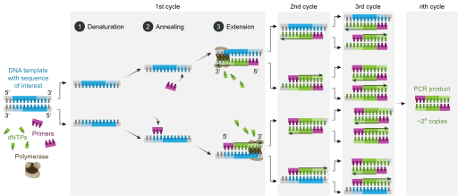

# PCR

[TOC]

## 术语

- `CT值（cycle threshold value）` 根据PCR原理，不断循环`变性 - 退火 - 延伸`这三个步骤（具体见：[PCR](#PCR)），将目标不断复制放大，直到能够判断讯号（阳性），这个过程中循环次数叫做CT值。
- `bp` (base pair)碱基对。
- `kbp` 千碱基对。
- `Mbp` 兆碱基对，百万对碱基。

## 碱基对

碱基对是形成核酸DNA，RNA单体以及编码遗传信息的化学结构。主要由以下碱基组成：

- `A` 腺嘌呤。
- `T` 胸腺嘧啶。
- `G` 鸟嘌呤。
- `C` 胞嘧啶。
- `U` 尿嘧啶。

碱基配对遵循`碱基互补配对原则`：

1. A - T

   

   *AT碱基对由2个氢键相连*

2. G - C

   

   *GC碱基对由3个氢键相连*

3. A - U

## DNA

脱氧核糖核酸（deoxyribonucleic acid, DNA），是一种生物大分子，可组成遗传指令，引导生物发育与生命技能运作。

在细胞内，DNA能组织成染色体结构，整组染色体统称为基因组。

对于以下真核生物：

- 动物
- 植物
- 真菌

染色体存放于细胞核内。

对于以下原核生物：

- 细菌

染色体存放在细胞质中的拟核内。

### 四联体结构

TODO

### 物理化学性质

TODO

### 转录

TODO

### 翻译

TODO

### 复制

TODO

### 与蛋白质的交互作用

TODO

## RNA

TODO

## PCR

聚合酶链式反应（Polymerase Chain Reaction, PCR），是一项利用DNA双链复制的原理，在生物体外复制特定DNA片段的核酸合成技术。

### 操作环境

- `template（DNA模板）` 需要扩增的DNA片段。
- `primer（引物）` 一共有2种，分别决定了需要扩增的起始和终止环境。
- `polymerase（DNA聚合酶）` 用于复制需要扩增的区域。
- `dNTP（脱氧核苷三磷酸）` 用于构造新的互补链。
- `含有镁离子的缓冲体系` 提供适合聚合酶行使功能的化学环境。

### 操作过程

基于DNA半保留复制原理，碱基互补配对原则。在95℃下，双链DNA解链，由双链变成单链。当温度下降时，引物会结合到DNA单链上，在DNA聚合酶的作用下，把游离的dNTP按照碱基互补配对原则集合到单链上，形成一条由旧链和新链杂合成的新的双链DNA。这个过程可以概括为`变性 - 退火 - 延伸`三个基本步骤。

1. 变性(Denaturation)

    利用高温`(93~98℃)`使双链DNA分离.高温将链接两条DNA链的氢键打断，在第一个循环之前，通常加热长一些时间以确保模板和引物完全分离，仅以单链形式存在。该步骤时间1~2分钟，接下来机器控制温度进入循环阶段。

2. 退火(Annealing)

   又称复性，降温贴合，缓冷配对，引物粘合；在DNA双链分离后，降低温度使得引物可以结合于单链DNA上。

3. 延伸(Extension)

   DNA聚合酶由降温时结合上的引物开始沿着DNA链合成互补链。此阶段的温度依赖于DNA聚合酶。该步骤时间依赖于聚合酶以及需要合成的DNA片段长度。

### 分类

- 递减PCR（touchdown PCR）
- 逆转录PCR（RT-PCR）
- 热启动PCR（hot start PCR）
- 即时PCR（real-time PCR）
- 巢式PCR（nested PCR）
- 多重PCR（multiplex PCR）
- 复原条件PCR（reconditioning PCR）
- dsRNA合成（dsRNA replicator）
- 低温变性共扩增PCR（COLD-PCR, co-amplification at lower denaturation temperature-PCR）
- 数字PCR（Digital-PCR, digital polymerase chain reaction）

## 基因测序

TODO

## 参考

[1] [维基百科-聚合酶链式反应](https://zh.wikipedia.org/wiki/%E8%81%9A%E5%90%88%E9%85%B6%E9%93%BE%E5%BC%8F%E5%8F%8D%E5%BA%94)

[2] [维基百科-脱氧核糖核酸](https://zh.wikipedia.org/wiki/%E8%84%B1%E6%B0%A7%E6%A0%B8%E7%B3%96%E6%A0%B8%E9%85%B8)

