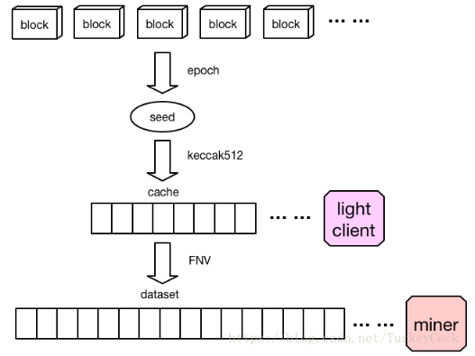
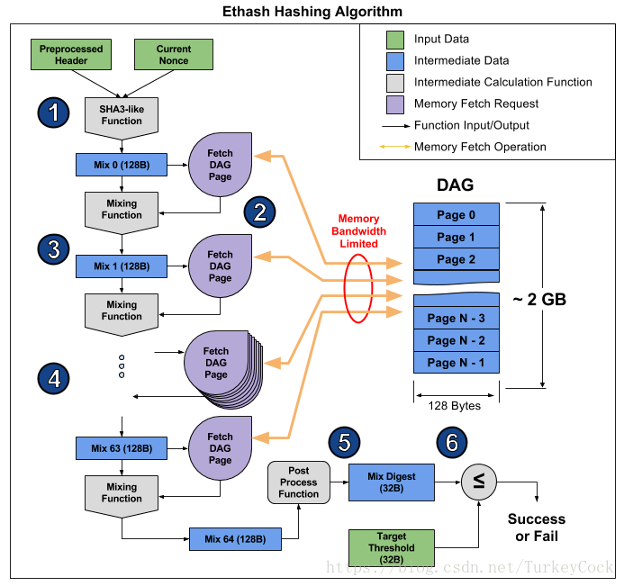

# 以太坊挖矿教程

## 环境

**注意：配置挖矿环境需要先配置以太坊钱包，不然无法进行交易**

| 条目             | 要求                                                         |
| ---------------- | ------------------------------------------------------------ |
| 操作系统         | windows, linux                                               |
| 虚拟内存         | 1张显卡(GPU)需要配置6G虚拟内存（2张GPU需要12G）。            |
| GPU              | NVDIA或AMD，显存不低于5G                                     |
| 软件（任选一个） | - [ethminer-开源](https://github.com/ethereum-mining/ethminer) - [Gminer](https://github.com/develsoftware/GMinerRelease) - [T-Rex](https://trex-miner.com/) - [lolMiner](https://github.com/Lolliedieb/lolMiner-releases) - [PhoenixMiner](https://phoenixminer.org/) - [xmrig-开源](https://github.com/xmrig/xmrig) - [cpuminer-开源](https://github.com/pooler/cpuminer) - Bminer - NBMiner - minerOS - 轻松矿工 - 开源矿工 |

## 交易

### 数字货币交易所排名（20210516）

| 排名 | 交易所                                  | 是否支持ETH | 地区     |
| ---- | --------------------------------------- | ----------- | -------- |
| 1    | [Coinbase](https://www.coinbase.com)    | Y           | 美国     |
| 2    | [eToro](https://www.etoro.com)          | Y           | 以色列   |
| 3    | [Binance 币安](https://www.binance.com) | Y           | 中国     |
| 4    | [Huobi 火币](https://www.huobi.com)     | Y           | 中国     |
| 5    | [Kraken](https://www.kraken.com)        | Y           | 美国     |
| 6    | [Bitfinex](https://www.bitfinex.com)    | Y           | 中国香港 |
| 7    | [Bitstamp](https://www.bitstamp.net/)   | Y           | 英国     |

## 挖矿算法

**Ethash**是以太坊上的加密货币的共识算法，使用工作量证明。 Ethash也使用Keccak，一种已标准化为SHA-3的散列函数。 但Ethash与SHA-3并不相同，不应将两者混淆。

由于工作量证明的核心是Hash运算，运算得愈快的矿工将愈大机会挖掘到新的区块而获得更多货币收益。矿工的挖矿设备亦由CPU演变为GPU，再由GPU演变为ASIC。矿机门槛的提升导致了矿工人数下降，大多数的收益集中于少部分矿工，这种节点的集中与区块链的原意去中心化是相违背的。因此，Ethash的计算过程中增加了对内存的要求而抵抗ASIC矿机的优势。由版本1.0开始，Ethash已被设计为抵制ASIC，主要方法为借着极大量的随机查表，加重内存的负载，ASIC无法再利用专用线路而加速。

Ethash是从**`Dagger-Hashimoto`算法**改动而成的。Ethash使用一个初始值为1GB的`DAGdataset`及一个初始值为16MB的假乱数表cache，它们的内容每30000个区块就会重新计算，这个30000区块的间隔称为epoch。每个epoch所产生的内容都会增大，因此1GB与16MB都只是初始值。

矿工会存储整个dataset和cache，而轻客户端只需要存储cache。矿工挖矿时将找到的nonce填入区块头，并需要以SHA-3形式不断查表寻求MIX值以计算该区块的解。

### Hashimoto算法

Hashimoto算法由Thaddeus Dryja发明，旨在通过“内存读取”瓶颈来抵制ASIC矿机。ASIC矿机可以通过设计专用电路来提升计算速度，但是很难提升“内存读取”速度，因为经历了这么多年的发展，内存访问已经经过了极致的优化。Hashimoto算法直接采用区块链数据，也就是区块中的交易作为输入源。

注：为了减小计算量，Dagger-Hashimoto中实际上只使用了低64位参与移位。

### Dagger算法

Dagger算法由Vitalik Buterin发明，旨在通过DAG（有向无环图）来同时获得“memory-hard计算”和“memory-easy验证”这两个特性，其主要原理是针对每一个单独的nonce只需要访问数据集中的一小部分数据。Dagger曾经被认为可以替代一些memory-hard的算法（如Scrypt），但是后来被Sergio Lerner证明该算法易于遭受共享内存硬件加速的攻击，从而逐渐被废弃。

### Dagger-Hashimoto算法

- 与Hashimoto的主要区别

    Hashimoto直接使用区块链数据作为输入源，而Dagger-Hashimoto使用一个定制的1GB的dataset(数据集）作为输入源，该dataset每隔N个区块会被更新。dataset是通过Dagger算法生成的，轻客户端验证算法可以针对每一个nonce对其中一个子集完成高效计算。

- 与Dagger的主要区别

    Dagger-Hashimoto用于查询区块的dataset是半持久化（semi-permanent）的，需要间隔很长一段时间才会更新。这样生成dataset的工作量比例接近于0，Sergio Lerner用于共享内存加速的参数就可以忽略不计了

### Ethash算法

Ethash算法主要分为以下几个步骤：

- 根据区块信息生成一个seed
- 根据seed计算出一个16MB的伪随机cache，由轻客户端存储
- 根据cache计算出一个1GB的dataset，其中的每一个数据都是通过cache中的一小部分数据计算出来的。该dataset由完整客户端或者矿工存储，大小随时间线性增长
- 矿工会从dataset中随机取出数据计算hash
- 验证者会根据cache重新生成dataset中所需要的那部分数据，因此只需要存储cache就可以了

### 挖矿流程

## 挖矿软件选择

[参考自](https://zhuanlan.zhihu.com/p/350626020)

Nidia显卡：

| 算力排名 | 软件          | 版本   | 是否开源 | 费用  |
| -------- | ------------- | ------ | -------- | ----- |
| 1        | Gminer        | 2.43   | 否       | 0.65% |
| 2        | T-Rex         | 0.19.9 | 否       | 1%    |
| 3        | ethminer      | 0.19.0 | 是       | 免费  |
| 4        | lolMiner      | 1.20   | 否       | ？    |
| 5        | Phoenix Miner | 5.5c   | 否       | 1%    |

Amd显卡：todo

| 算力排名 | 软件 | 版本 | 是否开源 | 费用 | 硬件要求 |
| -------- | ---- | ---- | -------- | ---- | -------- |
| 1        |      |      |          |      |          |
| 2        |      |      |          |      |          |
| 3        |      |      |          |      |          |
| 4        |      |      |          |      |          |
| 5        |      |      |          |      |          |

## 矿池选择

TODO

## 链接

- [数字货币网站-f2pool](https://www.f2pool.com/)
- [以太坊挖矿教程-知乎](https://zhuanlan.zhihu.com/p/32830672)
- [2021以太坊（ETH）显卡原版挖矿教程步骤及交易所](https://www.163.com/dy/article/G52R11NQ053726TS.html)
- [什么是挖矿和Ethash算法？](https://wiki.jikexueyuan.com/project/ethereum/what-dig.html)
- [维基百科-Ethash](https://zh.wikipedia.org/wiki/Ethash)
- [以太坊Ethash算法源码分析](https://blog.csdn.net/TurkeyCock/article/details/81364008)
- [ETH挖矿软件排行榜2021【NVIDIA/AMD】](https://zhuanlan.zhihu.com/p/350626020)
- [挖矿网](https://www.wk588.com/forum-80-1.html)
- [“挖矿”劝退篇：我来给你算算到底划算不，还有市场行情分析](https://www.163.com/dy/article/G374888A0550VSCB.html)

