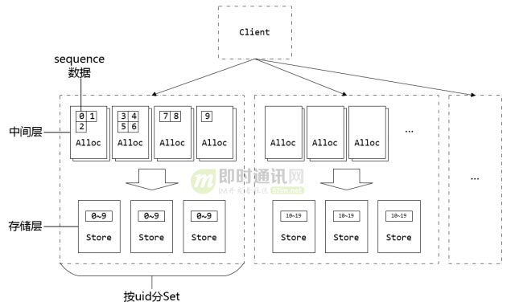

[TOC]

# IM-ID的生成

## 前提

- 生成有效的消息ID，避免消息ID碰撞是一道难题（网络延迟，调试出错等等都可能导致消息ID碰撞）；要解决这个问题，思路有以下几种：
  1. 优先保证消息ID一致性
  2. 优先保证消息ID时序性（微信的思路）

## snow_flake

TODO

## seqsvr

seqsvr是微信的一个高可用，高可靠的消息序列号生成器；用于为微信消息提供递增的消息序列号(sequence)；

### sequence

sequence是一个递增的64bit整型变量；由于全局唯一的sequence会有非常严重的申请互斥问题，所以微信给每个用户一个独立的64位sequence体系。

### 预分配中间层

通过增加一个预分配sequence的中间层，在保证sequence不回退的前提下，大幅地提升了分配sequence的性能。

例：

一张存放用户sequence的表格结构如下：

| 用户    | 小明 | 小红 | ...  |
| ------- | ---- | ---- | ---- |
| cur_seq | 100  | 200  | ...  |
| max_seq | 200  | 200  | ...  |

小明和小红各自申请一个sequence之后的表格结构如下：

| 用户    | 小明 | 小红 | ...  |
| ------- | ---- | ---- | ---- |
| cur_seq | 101  | 201  | ...  |
| max_seq | 200  | 300  | ...  |

- 这里的步长为100，微信实际应用中的步长为10000

### 分号段共享存储

微信的uid上限为$2^{32}$个，每个用户占用8byte的sequence空间，一共$2^{32} \times 8 = 34 359 738 368$​​约32GB的空间才能放得下所有的sequence；问题在于：重启时需要读取约32GB的`max_seq`数据加载到内存，时间花费太大。

通过引入号段来解决这个问题：相邻的一段用户属于一个号段，同个号段内的用户共享一个`max_seq`。

例：

改良后的存放用户sequence的表格结构如下：

小明，小红，小白每个人申请一个sequence的时候，小白突破了`max_seq`，导致`max_seq`升级；

### seqsvr总架构

## 参考

- [IM消息ID技术专题(一)：微信的海量IM聊天消息序列号生成实践（算法原理篇）](http://www.52im.net/forum.php?mod=viewthread&tid=1998&highlight=ID)
- [IM消息ID技术专题(二)：微信的海量IM聊天消息序列号生成实践（容灾方案篇）](http://www.52im.net/thread-1999-1-1.html)

