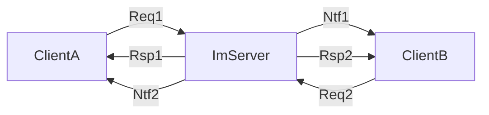

# IM-消息可靠性

消息的可靠性：

1. 消息不丢失
2. 消息不重复

## 前提

### QoS机制

QoS(Quality of Service，服务质量)

QoS提供以下三种服务模型：

1. `Best-Effort Service(尽力而为服务模型)`：尽最大可能发送报文，对带宽，时延，抖动和可靠性等不提供任何保证；
2. `Differentiated Service(区分服务模型)`：根据服务要求对不同业务的数据进行分类，对保温按类进行优先级标记，然后有差别的提供服务；
3. `Integrated Service(综合服务模型)`：节点在发送报文前，需要向网络申请资源预留，确保网络能够满足数据流的特定服务要求；

## 应用层确认

为了实现消息传递的可靠性，需要采用“应用层确认机制”；一次可靠投递需要使用6个报文，流程如下：

- `Req` 请求消息(客户端->服务端)
- `Rsp` 返回消息()
- `Ntf` 通知消息(服务端->客户端)

1. 客户端A发送消息到服务器；
2. 服务器返回回执信息给客户端A；
3. 服务器转发信息到客户端B；
4. 客户端B返回回执信息给服务器；
5. 服务器返回回执信息给客户端B，内容为：已收到B的回执；
6. 服务器发送消息给客户端A，内容为：客户端B已收到A发送的消息

此时为了防止在客户端上述过程中的长时间等待，需要引入消息过期机制；

情景分析：

1. `Req1/Rsp1`丢失：经过一段时间，A还是没有收到`Rsp1`，A重新发送`Req1`；
2. `Ntf1/Req2`丢失：经过一段时间，服务器没有收到`Req2`，服务器重新发送`Ntf1`；
3. `Rsp2`丢失：经过一段时间，B没有收到`Rsp2`，B重新发送`Req2`；
4. `Ntf2`丢失：经过一段时间，A没有收到`Ntf2`，A重新发送`Req1`。

### 个人观点

6步的QoS过于繁琐，如果为了时效性可以考虑牺牲一部分可靠性，则上述步骤中的第2步和第5步可以省略；流程如下：

## 参考

- [IM消息送达保证机制实现(一)：保证在线实时消息的可靠投递](http://www.52im.net/thread-294-1-1.html)
- [QoS的基本原理](https://blog.csdn.net/c1194758555/article/details/78839184)
- [百度百科-QoS](https://baike.baidu.com/item/qos/404053?fr=aladdin)

