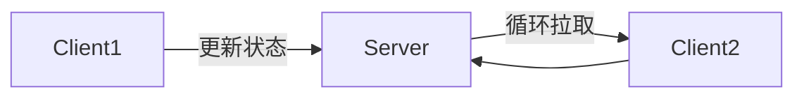
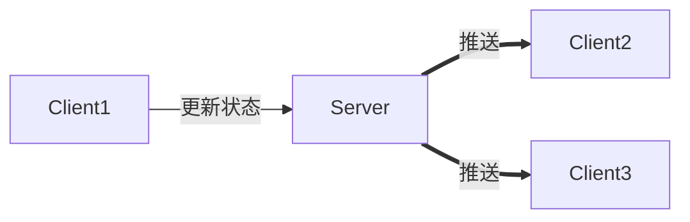

[TOC]

# IM-用户状态

## 用户状态一致性

用户状态的更新，有2种模型：

- 拉模式
- 推模式

### 拉模式

1. Client1状态更新到Server
2. Client2循环拉取Client1的信息

**缺点:**

- Client1状态改变，Client2获取不实时
- Client1状态不改变，Client2会有大量无效轮询请求，占用服务器资源

### 推模式

1. Client1状态更新到Server
2. Server推送到Client2，Client3

**缺点:**

- 当在线好友量很大时，任何一个用户状态的改变，会扩散成N(消息风暴扩散系数)个实时通知，此时非常恐怖。

### 小结

需要根据不同的场景选用不同的模式：

- 好友状态：如果对实时性要求较高，可以采用推送的方式同步；如果实时性要求不高，可以采用轮询拉取的方式同步；
- 群友的状态：由于消息风暴扩散系数过大，可以采用按需拉取，延时拉取的方式同步；
- 系统消息/开屏广告等：对实时性要求不高的业务，可以采用拉取的方式获取消息；
- 消息风暴扩散系数：是指一个消息发出时，变成N个消息的扩散系数，这个系数与业务及数据相关，一定程度上它的大小决定了技术采用推送还是拉取。

## 参考

- [IM单聊和群聊中的在线状态同步应该用“推”还是“拉”？](http://www.52im.net/thread-715-1-1.html)

