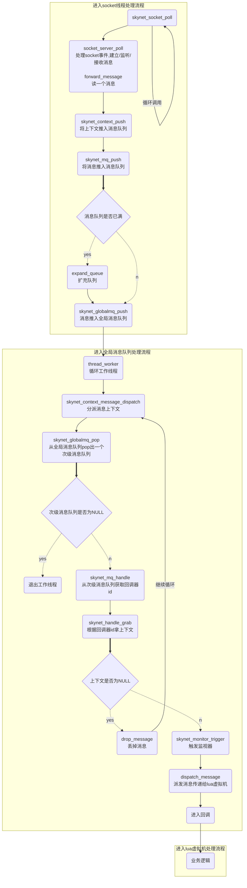
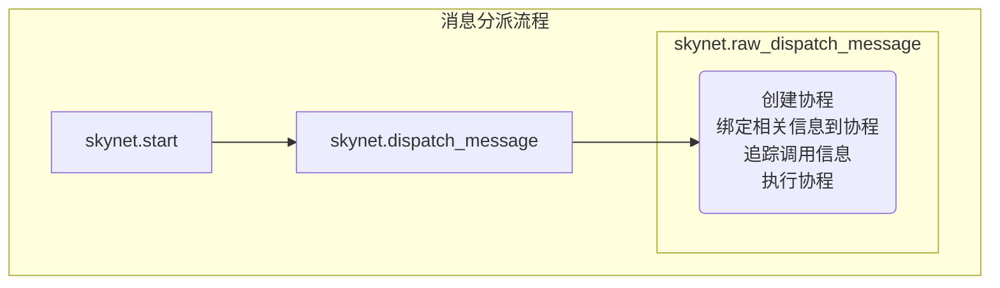

# skynet源码分析-消息机制

[TOC]


## 消息定义

skynet消息的定义如下：

```c
// 消息
struct skynet_message {
	uint32_t source;// 发送方地址
	int session;    // 消息id，用来找对应的协程
	void * data;    // 消息内容地址
	size_t sz;      // 消息大小
};
```


## 消息协议

请求消息的session id为负数，响应包的session id为正数。

### 请求协议(待确定)

协议规定超过32kbyte的数据包需要分成小包传输，小包依赖session来区隔；

| 包头  | type  | 其它 |
| ----- | ----- | ---- |
| 2byte | 1byte | 变长 |

- `type`

  用于区分这是一个完整的小包，还是大包的一部分，参数说明如下:

  - `0` 表示这是一个**不超过32kbyte的完整包**，其结构如下：

    | 包头  | type  | 目的地址（id） | session | 包内容     |
    | ----- | ----- | -------------- | ------- | ---------- |
    | 2byte | 1byte | 4byte          | 4byte   | 0～32kbyte |

    如果session为0，表示这是一个推送包，不需要回应

  - `1` 表示这是一个超过32kbyte的**请求**，包本身没有数据内容，内容在对应的`0x81`处。其结构如下：

    | 包头  | type  | 目的地址（id） | session | 包总长（小端） |
    | ----- | ----- | -------------- | ------- | -------------- |
    | 2byte | 1byte | 4byte          | 4byte   | 4byte          |

  - `2` 表示这是一个长消息的一部分，且**后续还有数据**，其结构如下：

    | 包头  | type  | session | 包内容 |
    | ----- | ----- | ------- | ------ |
    | 2byte | 1byte | 4byte   |        |

  - `3` 表示这是一个长消息的一部分，且**这是最后一个包**，其结构如下：

    | 包头  | type  | session | 包内容 |
    | ----- | ----- | ------- | ------ |
    | 2byte | 1byte | 4byte   |        |

  - `0x41` 表示这是一个超过32kbyte的**推送**，包本身没有数据内容，内容在对应的`0xc1`处。其结构如下：

    | 包头  | type  | 目的地址（id） | session | 包总长（小端） |
    | ----- | ----- | -------------- | ------- | -------------- |
    | 2byte | 1byte | 4byte          | 4byte   | 4byte          |

  - `0x80` 类似0，表示这是一个**不超过32kbyte的完整包**，结构如下：

    | 包头  | type  | 目的地址（字符串） | session | 包内容     |
    | ----- | ----- | ------------------ | ------- | ---------- |
    | 2byte | 1byte | 变长(0~255byte)    | 4byte   | 0～32kbyte |

  - `0x81` 对应1

  - `0xc1` 对应0x41

### 响应协议

TODO


## 消息类型

### 进程内消息

用于进程内部的消息通信，其结构为：

| 消息头 | 消息内容 | 空白区  |
| ------ | -------- | ------- |
| 8byte  | 256byte  | 256byte |

#### 请求消息

```c
// 进程内部的请求消息
struct request_package {
	uint8_t header[8];	// 6 bytes dummy
	union {
		char buffer[256];
		struct request_open open;
		struct request_send send;
		struct request_send_udp send_udp;
		struct request_close close;
		struct request_listen listen;
		struct request_bind bind;
		struct request_resumepause resumepause;
		struct request_setopt setopt;
		struct request_udp udp;
		struct request_setudp set_udp;
	} u;
	uint8_t dummy[256];
};
```

- `header` 消息头

  header的长度为8bit，结构为：`|0|0|0|0|0|0|TYPE|LENGTH|`

  TYPE包括以下类型：

  | 值   | 说明                                                         |
  | ---- | ------------------------------------------------------------ |
  | `S`  | 开启套接字（Start socket）                                   |
  | `B`  | 绑定套接字（Bind socket）                                    |
  | `L`  | 监听套接字（Listen socket）                                  |
  | `K`  | 关闭套接字（Close socket）                                   |
  | `O`  | 连接套接字（Connect to (Open)）                              |
  | `X`  | 关闭套接字（Exit）                                           |
  | `D`  | 发送消息包（高优先级）（Send package (high)）                |
  | `P`  | 发送消息包（低优先级）（Send package (low)）                 |
  | `A`  | 发送UDP包（Send UDP package）                                |
  | `T`  | 设置选项（Set opt）                                          |
  | `U`  | 创建UDP套接字（Create UDP socket）                           |
  | `C`  | 设置UDP地址（set udp address）                               |
  | `Q`  | 查询信息（query info）                                       |
  | `R`  | （Resume Pause）                                             |
  | `W`  | 让本地线程开启写事件（let socket thread enable write event） |

- `u` 消息内容

  该请求消息内容包括以下类型：

  - `request_open` 请求打开套接字

    ```c
    // 请求打开套接字
    struct request_open {
    	int id;			 // id
    	int port;         // 端口
    	uintptr_t opaque; // socket关联的skynet服务的地址
    	char host[1];     // 主机名；IPV4:点分十进制，IPV6:16进制串
    };

  - `request_send` 请求发送

    ```c
    // 请求发送
    struct request_send {
    	int id;				// id
    	size_t sz;			// 缓冲区尺寸
    	const void * buffer; // 缓冲区地址
    };
    ```

  - `request_send_udp` 请求发送udp

    ```c
    // 请求发送udp
    struct request_send_udp {
    	struct request_send send;		  // 请求发送消息
    	uint8_t address[UDP_ADDRESS_SIZE]; // UDP地址
    };
    ```

  - `request_close` 请求关闭套接字

    ```c
    // 请求关闭套接字
    struct request_close {
    	int id;           // id
    	int shutdown;     // 是否强制关闭
    	uintptr_t opaque; // socket关联的skynet服务的地址
    };
    ```

  - `request_listen` 请求监听套接字

    ```c
    // 请求监听套接字
    struct request_listen {
    	int id;           // id
    	int fd;           // 文件描述符
    	uintptr_t opaque; // socket关联的skynet服务的地址
    	char host[1];     // 主机地址；IPV4:点分十进制，IPV6:16进制串
    };
    ```

  - `request_bind` 请求绑定套接字

    ```c
    // 请求绑定套接字
    struct request_bind {
    	int id;           // id
    	int fd;           // 文件描述符
    	uintptr_t opaque; // socket关联的skynet服务的地址
    };
    ```

  - `request_resumepause` 请求重置暂停

    ```c
    // 请求重置暂停
    struct request_resumepause {
    	int id;           // id
    	uintptr_t opaque; // socket关联的skynet服务的地址
    };
    ```

  - `request_setopt` 请求设置套接字选项

    ```c
    // 请求设置套接字选项
    struct request_setopt {
    	int id;    // id
    	int what;  // 键
    	int value; // 值
    };
    ```

  - `request_udp` 请求UDP

    ```c
    // 请求UDP
    struct request_udp {
    	int id;           // id
    	int fd;           // 文件描述符
    	int family;       // 地址族
    	uintptr_t opaque; // socket关联的skynet服务的地址
    };
    ```

  - `request_setudp` 请求设置udp

    ```c
    // 请求设置udp
    struct request_setudp {
    	int id;                            // id
    	uint8_t address[UDP_ADDRESS_SIZE]; // 地址 19*8=152bit: ipv6 128bit + port 16bit + 1 byte type
    };
    ```

- `dummy` 空白区

#### 响应消息

TODO

### 跨进程消息

跨进程消息定义如下：

```c
// 远程节点名字
struct remote_name {
	char name[GLOBALNAME_LENGTH]; // 名字（最长16字节）
	uint32_t handle;              // harbor ID
};
// 远程节点信息
struct remote_message {
	struct remote_name destination; // 目的地
	const void * message;           // 消息
	size_t sz;                      // 大小
	int type;                       // 类型
};
```


## 消息队列

消息队列定义如下：

```c
// 消息队列
struct message_queue {
	struct spinlock lock;           // 自旋锁
	uint32_t handle;                // 回调器ID
	int cap;                        // 容量
	int head;                       // 管道头索引
	int tail;                       // 管道尾索引
	int release;                    // 是否能释放消息
	int in_global;                  // 是否在全局消息队列；0:不在全局消息队列,1:在全局队列或在递送中
	int overload;                   // 过载数量
	int overload_threshold;         // 过载阀值
	struct skynet_message *queue;   // 消息队列
	struct message_queue *next;     // 指向下一个消息队列
};
```

### 消息队列扩充

在push消息时，如果`head==tail`，表示消息队列已满，需要扩充，源码如下：

```c
static void
expand_queue(struct message_queue *q) {
	struct skynet_message *new_queue = skynet_malloc(sizeof(struct skynet_message) * q->cap * 2);
	int i;
	for (i=0;i<q->cap;i++) {
		new_queue[i] = q->queue[(q->head + i) % q->cap];
	}
	q->head = 0;
	q->tail = q->cap;
	q->cap *= 2;
	
	skynet_free(q->queue);
	q->queue = new_queue;
}
```

1. 队列cap扩充2倍
2. 从头到尾重新赋值


## 消息发送

1. `skynet.call/skynet.send/skynet.rawcall/skynet.rawsend`调用`lsend`发送消息；
2. `lsend`调用`skynet_socket_sendbuffer`；
3. `skynet_socket_sendbuffer`调用`socket_server_send`;
4. `socket_server_send`调用`send_request`使用高优先级权限发送消息

### session的意义

session的目的是为了标识该消息对应的响应，当一个服务开了多个协程去call消息时，回来一个应答，通过该应答的session来判断应该唤醒哪个协程。


## 消息接收



### 消息分派

```lua
-- 真正的dispatch_message逻辑；
local function raw_dispatch_message(prototype, msg, sz, session, source)
		...

		local f = p.dispatch -- skynet.dispatch注册的消息回调函数
		if f then
			local co = co_create(f)                -- 创建协程
			session_coroutine_id[co] = session     -- 绑定session到协程
			session_coroutine_address[co] = source -- 绑定source到协程
			local traceflag = p.trace			  -- 是否追踪调用
			if traceflag == false then
				-- force off
				trace_source[source] = nil
				session_coroutine_tracetag[co] = false
			else
				local tag = trace_source[source]
				if tag then
					trace_source[source] = nil
					c.trace(tag, "request")
					session_coroutine_tracetag[co] = tag
				elseif traceflag then
					-- set running_thread for trace
					running_thread = co
					skynet.trace()
				end
			end
			suspend(co, coroutine_resume(co, session,source, p.unpack(msg,sz))) -- 执行协程
        ...
		end
	end
end

-- 消息分派函数
function skynet.dispatch_message(...)
	local succ, err = pcall(raw_dispatch_message,...) -- 以安全模式调用
	...
end

-- lua服务入口
function skynet.start(start_func)
	c.callback(skynet.dispatch_message) -- 调用了skynet.dispatch_message
	init_thread = skynet.timeout(0, function()
		skynet.init_service(start_func)
		init_thread = nil
	end)
end
```



1. 注册消息分派函数`skynet.dispatch_message`到`skynet.start`（skynet.start以0.01s一次的频率被调用，当有消息到来时`skynet.dispatch_message`被调用）；
2. 消息分派函数`skynet.dispatch_message`以安全模式调用真正的分派逻辑函数`skynet.raw_dispatch_message`；
3. 创建协程；
4. 绑定相关信息(session, source, ...)到协程；
5. 追踪调用信息；
6. 执行协程；

### 消息转发

当客户端向功能服务发起请求时，会先将消息发送到代理服务中，由这个代理服务转发给功能服务；功能服务的回应消息也会被代理服务转发回去。

在做代理服务时，我们往往不需要解消息包，只需要做消息转发；但是lua消息已经注册了无法更改，那么我们可以使用`skynet.forward_type`进行协议转换。

例：

```lua
-- clusterproxy.lua
local skynet = require "skynet"
local cluster = require "skynet.cluster"
require "skynet.manager"	-- inject skynet.forward_type

local node, address = ...

skynet.register_protocol { -- 注册system消息
	name = "system",
	id = skynet.PTYPE_SYSTEM,
	unpack = function (...) return ... end, -- 跳过消息解包步骤
}

local forward_map = {
	[skynet.PTYPE_SNAX] = skynet.PTYPE_SYSTEM,

	--发送到代理服务的lua消息全部转成system消息,不改变原先LUA的消息协议处理方式
	[skynet.PTYPE_LUA] = skynet.PTYPE_SYSTEM,

	--如果接收到应答消息，不释放msg,sz（默认会释放掉msg,sz）
	[skynet.PTYPE_RESPONSE] = skynet.PTYPE_RESPONSE,	-- don't free response message
}

skynet.forward_type( forward_map ,function() -- 注册消息处理函数
	local clusterd = skynet.uniqueservice("clusterd")
	local n = tonumber(address)
	if n then
		address = n
	end
	local sender = skynet.call(clusterd, "lua", "sender", node)
	skynet.dispatch("system", function (session, source, msg, sz)
		if session == 0 then
			skynet.send(sender, "lua", "push", address, msg, sz) -- 打包
		else
			skynet.ret(skynet.rawcall(sender, "lua", skynet.pack("req", address, msg, sz))) -- 不打包
		end
	end)
end)
```


## 参考

- [skynet源码赏析](https://manistein.github.io/blog/post/server/skynet/skynet%E6%BA%90%E7%A0%81%E8%B5%8F%E6%9E%90/)
- [云风的BLOG - skynet cluster 模块的设计与编码协议](https://blog.codingnow.com/2017/03/skynet_cluster.html)
- [skynet框架应用 (七) 本地服务间消息通信](https://blog.csdn.net/qq769651718/article/details/79432897?spm=1001.2014.3001.5501)
