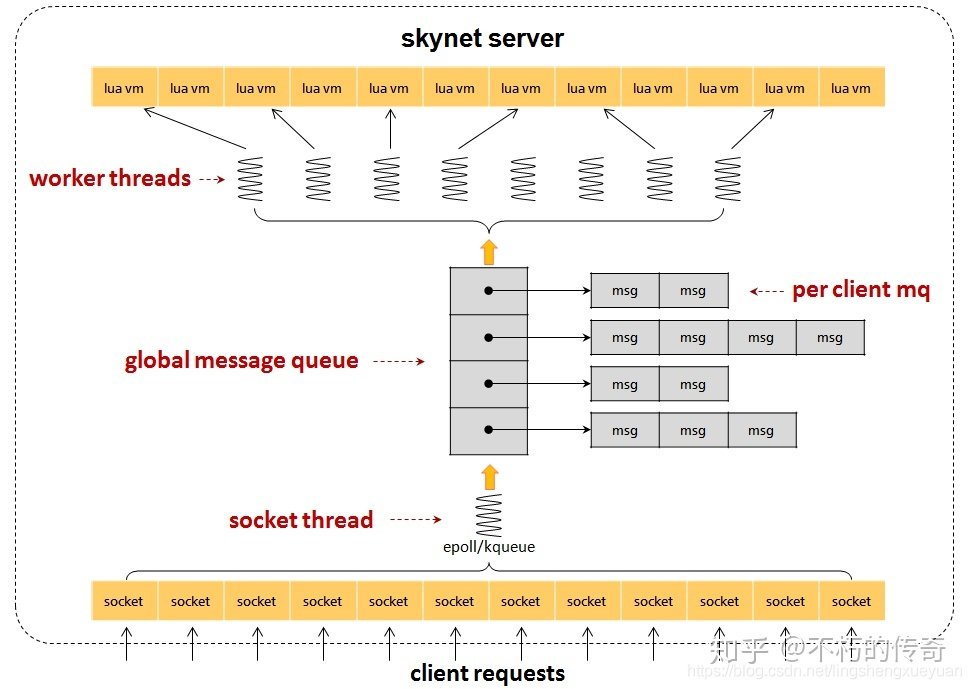
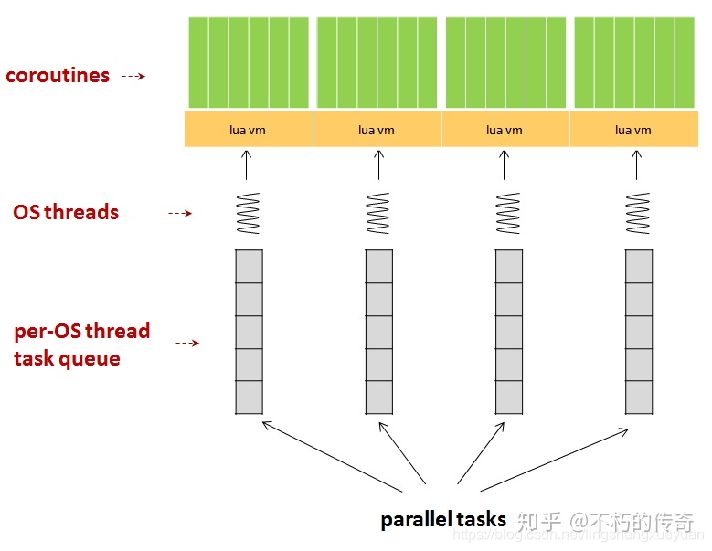

# Skynet总结

[TOC]


## 最佳实践

#### 1模块数量限制

TODO

#### 2 热更新

TODO

#### 3 服务内存报警阈值（32MB）

TODO

#### 4 协程数量

TODO

#### 5 集群

TODO

#### 6 工作线程数量

skynet的配置文件选项`thread`，指定启动多少个工作线程；请合理配置该选项，通常将它设置为CPU核心数，但是不要超过CPU核心数，否则性能反而会降低。

#### 7 计时器精度

TODO

#### 8 优先选用更多核心的机器

根据skynet的特点，如果CPU运算能力不足，选用更多核心的机器比增加物理机性价比高

#### 9 skynet消息处理的非有序性

skynet服务在收到消息时，会创建一个协程，在协程中会运行消息处理方法（即用skynet.dispatch设置的回调方法）；这意味着，如果在消息处理方法中调用阻塞API（如：skynet.call, skynet.sleep, socket.read）时，服务不会被卡住（仅仅是处理消息的协程被卡住），导致程序的执行时序得不到保证。


## 源码目录结构

- `3rd`
  
    第三方库，包括：
    
    - `lua` 语言支持
    - `lpeg `
    - `jemalloc` 内存管理
    - `lua-md5` md5加密
    
- `lualib`

    - lua的辅助函数

- `lualib-src`

    lua调C提供C层级的API调用，包括：

    - socket模块API
    - skynet消息发送，注册回调函数API

- `service`

    lua层服务，依附于snlua这个c服务，涵盖skynet lua层级的一些基本服务，包括：

    - lua层级服务的bootstrap服务
    - gate服务
    - 供lua层创建新服务的launcher服务

- `service-src`

    依附于skynet核心模块的c服务，包括：

    - 日志
    - snlua

- `skynet-src`

    包含skynet最核心机制的模块，包括：
    
    - 逻辑入口
    - skynet_module模块
    - skynet_context模块
    - 消息队列
    - 定时器
    - socket


## 架构



1. 每一个`socket`对应一个`lua vm`和一个`per client mq`
2. 有一个`socket thread`轮询所有的`socket`，收到信息后，打包发送到`per client mq`中
3. 将`per client mq`挂到`global message queue`的尾部
4. `worker threads`从`global message queue`头部开始，获取每个`client`对应的消息队列
5. 处理获取到的消息队列，用完放回`global message queue`


## 多线程

```flow
start=>start: 消费开始
sleep=>operation: 线程睡眠2.5ms
wakeup=>operation: 唤醒线程
pop=>operation: 从global_mq中pop一个次级消息队列
bempty=>condition: 次级消息队列是否为空?
pop=>operation: 从次级消息队列pop出n条消息，并将其传递给callback函数
callback=>operation: callback函数回调消息
pushback=>operation: 将用完的次级消息队列push回global_mq

start->sleep->wakeup->bempty
bempty(yes)->sleep
bempty(no)->pop->callback->pushback(right)->sleep
```

线程从次级消息队列`pop`出消息时，消息的条数取决于线程的权重`w`：

- `w<0`

  一个线程一次消费一条消息

- `w==0`

  一个线程一次消费完次级消息队列中的所有消息

- `w>0`

  一个线程一次消费w条消息

### 线程安全

skynet使用以下特性保证线程安全：

1. 依附于skynet核心模块的c服务；
2. global_mq和次级消息队列在push/pop时都有加`spinlock`；
3. 通过handle从handle_storage的slot里获取`skynet_context`时，加上了`rowlock`。


## 任务调度



1. 每个`OS thread`会创建一个`lua vm`
2. 每个`lua vm`会创建海量的`coroutine`

**注意：**

- 不支持任务跨`lua vm`迁移，coroutine是`lua vm`内部的数据结构，两个`lua vm`之间的coroutine无法通用。


## 消息

### 一级消息结构

| 包头  | type  | 其它 |
| ----- | ----- | ---- |
| 2byte | 1byte | 变长 |

### 二级消息结构

- 进程内消息

  | 消息头 | 消息内容 | 空白区  |
  | ------ | -------- | ------- |
  | 8byte  | 256byte  | 256byte |

  常用的序列化格式：

  - C服务的文本协议
  - Lua服务的自定义序列化库
  - 自定义的内存数据结构
  - ...

- 跨进程消息

  常用的序列化格式：

  - 自定义协议
  - sproto
  - Google Proto Buffers
  - JSON
  - ...


## 集群

### `master/slave`模式

`master/slave`模式下节点的harbor之间通过master来建立网络，master既可以是一个单独的进程也可以依附于某个进程（默认）。

master其实就是一个简单的内存key-value数据库；key表示节点的名字/ID，value存储节点harbor的地址信息。

一个5节点网络示意图：


- master连接所有slave节点
- slave节点的新增/减少/服务变更都是先通知master，再由master转发

### cluster模式

cluster模式兼容`master/slave`模式，cluster模式其实就是用更上层的api来实现一个节点信息查询系统；通过查询注册的节点以及对应的服务信息来远程调用，从而实现消息路由。


## 参考

- [skynet的总体架构以及任务调度分析](https://zhuanlan.zhihu.com/p/339599579)
- [skynet简介](https://blog.csdn.net/o8413897/article/details/79044437)
- [Skynet 设计综述](https://blog.codingnow.com/2012/09/the_design_of_skynet.html)
- [skynet源码赏析](https://manistein.github.io/blog/post/server/skynet/skynet%E6%BA%90%E7%A0%81%E8%B5%8F%E6%9E%90/)


