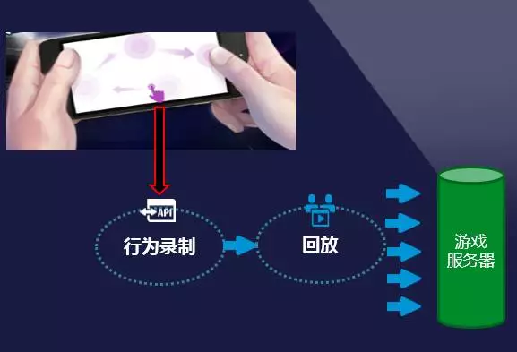

[TOC]

# 软件测试


## 专业术语

- `事务成功率(Availability)`
- `平均响应时间(ART, Average Response Time)` 在一次事务中，发出请求到指令系统响应的平均时间
- `并发(Concurrency)` 同时处理多个任务的能力（逻辑上处理能力）
- `并发用户数(Concurrency User)` 现实系统中操作业务的用户，也叫虚拟用户数(Virtual User)
- `数据吞吐量(Data transferred)`
- `测试耗时(Elapsed time)` 整个测试过程持续的时长
- `错误率(ER, Error Rate)` 请求成功的数量与请求失败数量的比率
- `最大响应时间(MaxRT, Max Response Time)` 在一次事务中，从发出请求到指令系统响应的最大时间
- `最小响应时间(MinRT, Mininum Response Time)` 在一次事务中，从发出请求到指令系统响应的最小时间
- `并行(Parallel)` 多个处理器或多核处理器同时处理多个不同任务的能力（物理上处理能力）
- `每秒查询数(QPS, Query Per Second)` 服务器每秒能处理请求的数量
- `请求成功数(RSN, Request Success Number)` 请求成功的总数量
- `请求失败数(RFN, Request Filures Number)` 请求失败的总数量
- `事务(Transactions)` 用户一次或几次请求的集合
- `每秒事务数(TR, Transaction rate)` 每秒处理事务的数量


## 测试分类

- 集成测试（Integration Testing）
- 验收测试（Acceptance Testing）
- α测试（Alpha Testing）
- β测试（Beta Testing）
- 自动化测试（Automated Testing）

按是否需要运行程序分类：

- 静态测试（Static Testing）
- 动态测试（Dynamic Testing）

按是否需要源码分类：

- 黑盒测试（Black Box Testing）

  测试时不需要源代码。

- 白盒测试（White Box Testing）

  测试时需要源代码。

- 灰盒测试（Gray Box Testing）

  通过其他软件制品或者反编译手段获得了部分软件结构信息进而进行测试。

按测试层次分类：

- 单元测试（Unit Testing）
- 模块测试（Module Testing）
- 集成测试（Integration Testing）
- 系统测试（System Testing）

压力测试分类：

- 压力测试 (Stress Testing)

  也称之为强度测试，测试一个系统的最大抗压能力，在强负载（大数据，高并发）的情况下，测试系统所能承受的最大压力，预估系统的瓶颈。

- 并发测试 (Concurrency Testing)

  通过模拟很多用户同一时刻访问系统或对系统某一功能进行操作，来测试系统的性能，从中发现问题（并发读写，线程控制，资源争抢）。

- 耐久性测试 (Configuration Testing)

  通过对系统在大负荷的条件下长时间运行，测试系统，机器的长时间运行下的状况，从中发现问题（内存泄漏，数据库连接池不释放，资源不回收）。


## 测试指标

### 单元测试指标

TODO

### 性能测试指标

| 指标         | 说明                                                         |
| ------------ | ------------------------------------------------------------ |
| `并发数`     | (CU, Concurrent Users)系统同时能处理的请求数量，反应了系统的负载能力；<br>并发数的计算公式[<sup>[1]</sup>](#ref1)为：<br>$C=\frac{nL}{T}$​<br>  - `C` 并发数<br>  - `n` 压测时间段内所有的请求数<br>  - `L` 平均响应时间<br>  - `T`​ 压测总时长 |
| `每秒查询率` | （QPS, Queries Per Second）在单位时间内响应的请求次数（单位：请求/秒）；<br>QPS的计算公式为：<br>$QPS = \frac{C}{L}$​​​​<br>  - `C` 并发数<br>  - `L` 平均响应时间 |
| `吞吐量`     | （TPS, Transactions Per Second）在单位时间内处理事务的数量（单位：事务/秒）；<br>吞吐量分为以下几类：<br>  - `平均吞吐量` 一段时间内吞吐量的平均值（无法体现吞吐量的瞬间变化）；<br>  - `峰值吞吐量` 一段时间内吞吐量的最大值，是用来评估系统容量的重要指标之一；<br>  - `最低吞吐量` 一段时间内吞吐量的最小值（如果接近于0，说明系统有卡顿现象）；<br>  - `70%的吞吐集中区间` 通过统计15%和85%的吞吐量边界值，计算出70%的吞吐量集中区间；区间越集中，吞吐量越稳定；<br>吞吐量的计算公式为：<br>公式一：$TPS = \frac{C}{L}$ <br>  - `C` 并发数<br>  - `L` 平均响应时间<br>公式二：$TPS = \frac{n}{T}$<br>  - `n` 压测时间段内所有的请求数<br>  - `T` 压测总时长 |
| `响应时间`   | （RT, Response Time）对请求作出响应的时间，通常指从一个请求发出，到服务器进行处理后返回，再到接收完毕应答数据的时间间隔（单位：ms）；<br>响应时间分为以下几类：<br>  - `平均响应时间` 一段时间内响应时间的平均值（无法体现响应时间的波动情况）；<br>  - `中间响应时间` 一段时间内响应时间的中间值，50%响应时间，有一半的服务器响应时间低于该值而另一半高于该值；<br>  - `90%响应时间` 一段时间内90%的事务响应时间比此数值要小。反应总体响应速度，和高于该值的10%超时率，是用来评估系统容量的重要指标之一；<br>  - `最小响应时间` 响应时间的最小值，反映服务最快处理能力；<br>  - `最大响应时间` 响应时间的最大值，反映服务器最慢处理能力； |

### 运营指标

| 指标             | 说明                                                         |
| ---------------- | ------------------------------------------------------------ |
| `页面访问量`     | （PV，Page View）页面浏览量或点击量，用户每刷新即被计算一次； |
| `独立访客`       | （UV，Unique Visitor）单位时间内访问某站点的用户数；         |
| `日新增用户数`   | （DNU，Daily New Users）日新增用户数；                       |
| `日活跃用户数`   | （DAU，Daily Active Users）一个统计日内登录或使用了某个产品的用户数（去重）； |
| `周活跃用户数`   | （WAU，Weak Active Users）一个统计周内登录或使用了某个产品的用户数（去重）； |
| `月活跃用户数`   | （MAU，Month Active Users）一个统计月内登录或使用了某个产品的用户数（去重）； |
| `用户活跃度指数` | （AUI, Active Users Index）用于描述新增用户占比；<br>用户活跃度指数的计算公式为：<br>$AUI = \frac{DNU}{DAU}$<br>  - `AUI` ​​​用户活跃度指数<br>  - `DNU` 日新增用户数<br>  - `DAU` 日活跃用户数 |
| `最高同时在线数` | （PCU, Peak Concurrent Users）最高同时在线玩家人数；         |
| `平均同时在线数` | （ACU, Average Concurrent Users）平均同时在线玩家人数；      |

### 其他指标

| 指标         | 说明                                                         |
| ------------ | ------------------------------------------------------------ |
| `CPU使用率`  | （CPUU, Cpu Usage）表示CPU被使用情况，CPU执行非系统空闲进程的时间与CPU总执行时间的比率，反映了系统资源利用情况；<br>CPU占用率的计算公式为：<br>$U = 1 - F$<br>  - `U` CPU占用率<br>  - `F` CPU空闲率 |
| `内存使用率` | （MU, Memory Usage）表示此进程所开销的内存                   |
| `IO`         | （IO, Disk Input/Output）磁盘的读写包速率                    |
| `网卡负载`   | （NL, Network Load）网卡的进出带宽，消息包数量               |


## 测试/调试/监控工具

| 测试项     | 工具                                                   |
| ---------- | ------------------------------------------------------ |
| CPU占用    | - Nmon<br>- top命令                                    |
| 内存占用   | - [Valgrind](valgrind.md)<br>- Nmon<br>- top命令       |
| HTTP压测   | - [Jemeter]                                            |
| core dump  | - [GDB](gdb.md)<br>- [linux系统日志](linux_sys_log.md) |
| 抓包       | - [Wireshark](wire_shark.md)                           |
| 长连接压测 | - 自行编写测试脚本                                     |


## 性能测试

性能测试的核心概念主要包括两部分：正确的测试方法，正确的评价性能的指标。

### 性能测试方法

常用的服务器性能测试方法有以下几种：

1. 现网数据预估

   现网数据预估是根据压力测试过程中的部分数据，对未来大量用户访问的情况机型预估；如图所示：

   

   - `横坐标` 现网吞吐量
   - `纵坐标` CPU压力

2. 真人压测

   通过邀请一定数量的真实用户来玩游戏，从而对服务器达到一个测试效果；

3. 接口测试

   当开发人员需要对一套服务器进行评估，但是又时间不足的情况下，我们可以考虑选择一些具有代表性的功能，以及一些高风险功能进行测试，通过以小见大的方式，来评估整套服务器性能；

4. ”录制回放“

   “录制”：通过抓取数据包的方式，来获取游戏时的协议；”回放“：把这些捕获的协议重新发送给服务端；如图所示：

   

5. 机器人模拟

   机器人模拟测试是对以上各种测试做了一个平衡， 通过通过机器人脚本高还原真实玩家的用户行为，模拟高并发场景，从而得到类似很多人同时游戏的测试效果；

性能测试方法对比：

| 性能测试方法 | 优点                                                         | 缺点                                               | 适用场景                                   |
| ------------ | ------------------------------------------------------------ | -------------------------------------------------- | ------------------------------------------ |
| 现网数据预估 | - 快速                                                       | - 数据准确成都低                                   | 适用于无测试人力情况下，简单预估服务器性能 |
| 真人压测     | - 数据真实度高                                               | - 并发低<br>- 价格贵<br>- 不可服用<br>- 性能回归难 | 适用人数要求较低的游戏进行验证性的测试     |
| 接口测试     | - 高复用<br>- 高并发<br>- 相对机器人开发量小                 | - 只适用于判断局部风险                             | 适用于时间紧张下快速诊断高风险模块         |
| 录制回放     | - 低成本                                                     | - 适用性狭窄                                       | 适用于固定的输入输出服务器类型             |
| 机器人模拟   | - 高还原游戏玩法，深度模拟真实用户行为<br>- 高复用<br>- 高并发<br>- 7*24小时不断监控 | - 有一定技术门槛<br>- 数据评估需要一定时间         | 时间宽裕情况下的最佳选择                   |


## 游戏压力测试

### 必要性

技术层面：

- 确认服务器架构是否可靠；
- 测试单组服务器的最大承载能力和高负载能力；
- 查看极限状态下数据传输和存储是否正常；
- 查找BUG与性能瓶颈；

设计/策划层面：

- 确定单服人数的最高承载能力，为运营提供数据支持；
- 通过各类功能服务器的负载情况来指导功能玩法的调整和设计；

### 游戏服务器压测指标

由于游戏服务器的特殊性，压测指标要比普通的性能测试指标复杂一些，一些常用的指标如下：

| 指标                    | 参考值                                                       |
| ----------------------- | ------------------------------------------------------------ |
| CPU使用率(CPUU, %)      | - `<70%`      优秀<br>- `70%~85%` 一般<br>- `>85%`      差   |
| 内存使用率(MU, %)       | - `<70%`      优秀<br/>- `70%~85%` 一般<br/>- `>85%`      差 |
| 磁盘I/O(%)              | 建议`<80%`                                                   |
| 网络带宽使用(NU, %)     |                                                              |
| 用户并发数(CU)          | - `大型系统`    分配5000基本够了<br>- `中小型系统` 分配1000基本够了 |
| 在线用户数(OU)          |                                                              |
| 平均响应时间(ART, ms)   |                                                              |
| 最大响应时间(MaxRT, ms) |                                                              |
| 最小响应时间(MinRT, ms) |                                                              |
| 吞吐量(TPS, t/s)        |                                                              |
| 总事务数(TTN)           |                                                              |
| 事务成功率(TSP, %)      | - `99.5%` 优秀<br>- `98.6%` 轻微隐患<br>- `98.0%` 轻微隐患<br>- `97.5%` 严重隐患 |
| 超时错误率(TEP)         |                                                              |
| 平均收包率(个/s)        |                                                              |
| 平均发包率(个/s)        |                                                              |
| 发送流量(kb)            |                                                              |
| 接收流量(kb)            |                                                              |

这里是[游戏服务器压测文档模板](tmpl_game_server_benchmark_report.md)，仅供参考；

### 压测流程

- 建模

  建模分为2种方法：

  1. 探索典型玩家关键路径

     通过大量玩家数据的支撑，选择最多的行为路径，设计机器人模拟的行为；例：

     

  2. 通过封测过程中的运营数据，生成专家视图

     通过去测试服中搜集用户的协议数据，并对这些协议数据进行分析，确定各自是什么行为，把用户的这些协议数据还原成为用户行为；例：

     

- 分析

  对客户端进行行为交互和协议分析，为后续协议开发实现做准备；

- 代码开发

  主要包含2部分：

  1. 协议的开发：包括协议的实现，协议的解包等；
  2.  业务逻辑的组织：主要对上述游戏模型进行实现；

### 压测细节

1. 区分内外网络

   内网与外网的延时，价格都不一样，内外网流量在游戏正式运行时是完全分开的；


## 内核优化

### 修改程序的最大文件打开数量

文件最大打开数量，限制了建立套接字的数量，通过以下方法可以解除限制：

- 方法一 ulimit命令

  ```sh
  # 查看系统默认的值
  ulimit -n
  # 设置最大文件打开数量
  ulimit -n 1040000
  ```

- 方法二 手动修改配置文件

  修改`limits.conf`文件：

  ```sh
  vim /etc/security/limits.conf
  
  # 添加以下参数
  root soft nofile 1040000
  root hard nofile 1040000
  
  root soft nofile 1040000
  root hard nproc 1040000
  
  root soft core unlimited
  root hard core unlimited
  
  * soft nofile 1040000
  * hard nofile 1040000
  
  * soft nofile 1040000
  * hard nproc 1040000
  
  * soft core unlimited
  * hard core unlimited
  ```

  修改`file-max`文件（file-max表示系统级别的能够打开的文件句柄的数量，不能小于limits中设置的值，如果file-max的值小于limits设置的值会导致系统重启以后无法登陆）

  ```sh
  vim /proc/sys/fs/file-max
  
  # 添加以下参数
  root soft nofile 1040000
  root hard nofile 1040000
  
  root soft nofile 1040000
  root hard nproc 1040000
  
  root soft core unlimited
  root hard core unlimited
  
  * soft nofile 1040000
  * hard nofile 1040000
  
  * soft nofile 1040000
  * hard nproc 1040000
  
  * soft core unlimited
  * hard core unlimited
  ```


## 参考

### 外链

- [性能测试常见术语浅析](https://www.cnblogs.com/imyalost/p/7117320.html)
- [当压测遇见奥运 ——游戏服务器如何在上线时面对用户的洪荒之力](https://wetest.qq.com/lab/view/144.html)
- [日新进用户 200W+，解密《龙之谷》手游背后的压测故事](https://testerhome.com/topics/8092)
- [早知道早幸福——从压测工具谈并发、压力、吞吐量](https://wetest.qq.com/lab/view/177.html)
- [用户并发数量的估算方法](https://blog.csdn.net/darling_8868/article/details/101379370)
- [游戏压力测试总结](https://blog.csdn.net/erbozhao/article/details/80749609)
- [百度百科-游戏压力测试](https://baike.baidu.com/item/%E6%B8%B8%E6%88%8F%E5%8E%8B%E5%8A%9B%E6%B5%8B%E8%AF%95/10013568?fr=aladdin)
- [完整的性能测试报告模板](https://www.testwo.com/blog/8290)
- [go实现压测工具【单台机器100w连接压测实战】](https://studygolang.com/articles/23218)
- [[性能测试工具] wrk,ab,locust,Jmeter 压测结果比较](https://testerhome.com/topics/17068)
- [性能测试常见名词解释](https://blog.csdn.net/r455678/article/details/53063989)
- [游戏服务器性能测试](https://blog.csdn.net/FlyPigYe/article/details/91872979)

### 文献

<div id="ref1">[1] Eric Man Wong . Method for Estimating the Number of Concurrent Users . p-p . 2004</div>

