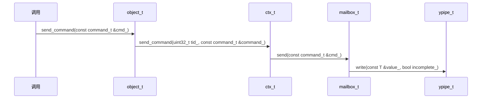
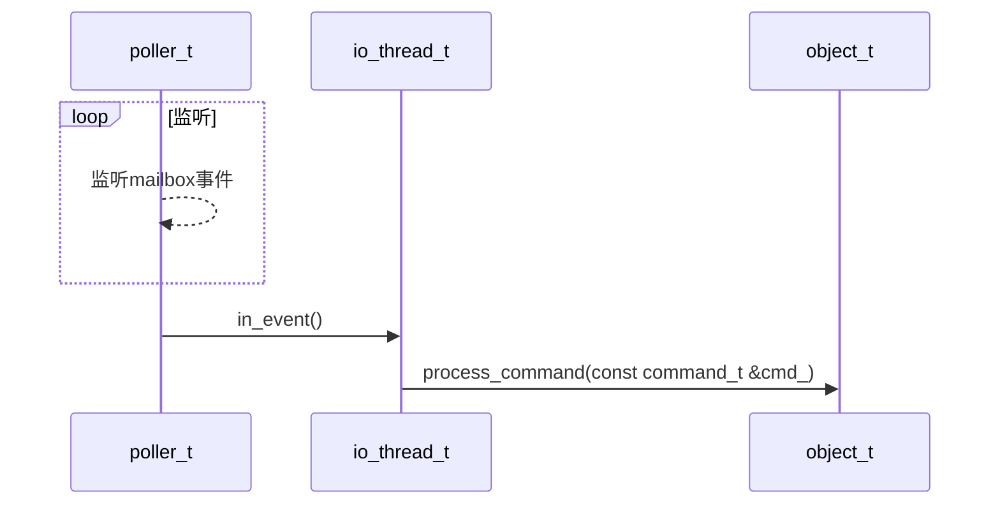
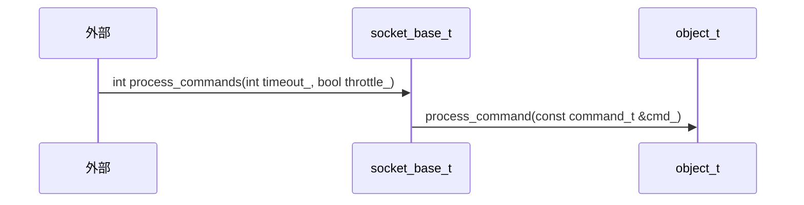

# ZMQ源码分析 - 多线程

[TOC]


## 分类

zeromq的线程可以分为两类：

- io线程
- socket线程

### IO线程

IO线程内含一个轮询器poller及[mailbox_t](#ansys_mailbox.md)，用于监听/激活mailbox_t信号；其定义如下：

```c++
class io_thread_t ZMQ_FINAL : public object_t, public i_poll_events
{
  public:
    io_thread_t (zmq::ctx_t *ctx_, uint32_t tid_);
    ~io_thread_t ();
    
    void start ();                 // 启动线程
    void stop ();                  // 停止线程
    mailbox_t *get_mailbox ();     // 返回线程的邮箱
    void in_event ();              // 处理poller事件
    void out_event ();             // 此函数无意义
    void timer_event (int id_);    // 处理计时器事件
    poller_t *get_poller () const; // 返回轮询器
    void process_stop ();          // 处理stop命令
    int get_load () const;         // 返回io线程的负载

  private:
    mailbox_t _mailbox;                 // 邮箱（用于线程通信）
    poller_t::handle_t _mailbox_handle; // 邮箱信号回调函数
    poller_t *_poller;                  // 轮询器

    ZMQ_NON_COPYABLE_NOR_MOVABLE (io_thread_t)
};
```

### socket线程

socket线程不含poller但是有[mailbox_t](#ansys_mailbox.md)，用于收发命令；由于不含poller（因为不能被阻塞），只能再每次使用socket_base_t实例的时候先处理`mailbox_t`，看是否有命令需要处理；其定义如下：

```c++
// socket线程
class socket_base_t : public own_t,
                      public array_item_t<>,
                      public i_poll_events,
                      public i_pipe_events
{
    friend class reaper_t;

  public:
    ...
    void in_event () ZMQ_FINAL; // 处理事件（只在销毁socket时用到）
    ...
};
```


## object_t

TODO


## command_t

线程消息(command_t)用于线程/套接字间通信，其定义如下：

```c++
struct command_t
{
    //  Object to process the command.
    zmq::object_t *destination; // 目的地

    enum type_t // 命令类型
    {
        stop,
        plug,
        own,
        attach,
        bind,
        activate_read,
        activate_write,
        hiccup,
        pipe_term,
        pipe_term_ack,
        pipe_hwm,
        term_req,
        term,
        term_ack,
        term_endpoint,
        reap,
        reaped,
        inproc_connected,
        conn_failed,
        pipe_peer_stats,
        pipe_stats_publish,
        done
    } type;

    union args_t // 参数
    {
        struct
        {
        } stop;
        ...
    }
```

### 发送



*command_t发送流程*

### 接收



*io_thread_t的command_t接收流程*



*socket_base_t的command_t接收流程*


## 总结

1. 在ZMQ中，每个线程都拥有一个mailbox，命令收发功能底层都是由mailbox实现的。
2. ZMQ提供了`object_t`类，用于使用mailbox发送命令。
3. IO线程有一个poller用于监听信号，以读取mailbox的内容。


## 参考

[1] (美)Pieter Hintjens. ZeroMQ-云时代极速消息通信库. 1th ED

[2] [zeromq源码分析笔记之线程间收发命令（2）](https://www.cnblogs.com/zengzy/p/5132437.html)
