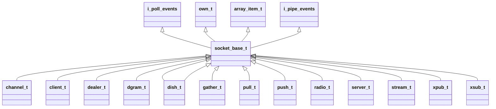

# ZMQ源码分析 - socket

[TOC]


## 类结构




## socket分类

| socket类别             | 说明 |
| ---------------------- | ---- |
| ZMQ_PAIR               |      |
| ZMQ_PUB                |      |
| ZMQ_SUB                |      |
| ZMQ_REQ                |      |
| ZMQ_XREQ（ZMQ_DEALER） |      |
| ZMQ_REP                |      |
| ZMQ_XREP（ZMQ_ROUTER） |      |
| ZMQ_DEALER             |      |
| ZMQ_ROUTER             |      |
| ZMQ_PULL               |      |
| ZMQ_PUSH               |      |
| ZMQ_XPUB               |      |
| ZMQ_XSUB               |      |
| ZMQ_STREAM             |      |


## socket_base_t

### 建立连接

```c++
int zmq::socket_base_t::connect (const char *endpoint_uri_) -> 
    
    int zmq::socket_base_t::connect_internal (const char *endpoint_uri_) -> 
    
    zmq::session_base_t *zmq::session_base_t::create (class io_thread_t *io_thread_,
                                                  bool active_,
                                                  class socket_base_t *socket_,
                                                  const options_t &options_,
                                                  address_t *addr_) ->
    
    
    
```

```c++
void zmq::stream_connecter_base_t::timer_event (int id_) ->
void zmq::session_base_t::start_connecting (bool wait_) -> 
fd_t connect ()
```


### 断线重连

TODO

### 消息触发模式

TODO


## 选项

### socket option

- ZMQ_AFFINITY
- ZMQ_ROUTING_ID
- ZMQ_SUBSCRIBE
- ZMQ_UNSUBSCRIBE
- ZMQ_RATE
- ZMQ_RECOVERY_IVL
- ZMQ_SNDBUF
- ZMQ_RCVBUF
- ZMQ_RCVMORE
- ZMQ_FD
- ZMQ_EVENTS
- ZMQ_TYPE
- ZMQ_LINGER
- ZMQ_RECONNECT_IVL
- ZMQ_BACKLOG
- ZMQ_RECONNECT_IVL_MAX
- ZMQ_MAXMSGSIZE
- ZMQ_SNDHWM 发送消息高水位（最大缓存量）
- ZMQ_RCVHWM
- ZMQ_MULTICAST_HOPS
- ZMQ_RCVTIMEO
- ZMQ_SNDTIMEO
- ZMQ_LAST_ENDPOINT
- ZMQ_ROUTER_MANDATORY
- ZMQ_TCP_KEEPALIVE
- ZMQ_TCP_KEEPALIVE_CNT
- ZMQ_TCP_KEEPALIVE_INTVL
- ZMQ_IMMEDIATE
- ZMQ_XPUB_VERBOSE
- ZMQ_ROUTER_RAW
- ZMQ_IPV6
- ZMQ_MECHANISM
- ZMQ_PLAIN_SERVER
- ZMQ_PLAIN_USERNAME
- ZMQ_PLAIN_PASSWORD
- ZMQ_CURVE_SERVER
- ZMQ_CURVE_PUBLICKEY
- ZMQ_CURVE_SECRETKEY
- ZMQ_CURVE_SERVERKEY
- ZMQ_PROBE_ROUTER
- ZMQ_REQ_CORRELATE
- ZMQ_REQ_RELAXED
- ZMQ_CONFLATE
- ZMQ_ZAP_DOMAIN
- ZMQ_ROUTER_HANDOVER
- ZMQ_TOS
- ZMQ_CONNECT_ROUTING_ID
- ZMQ_GSSAPI_SERVER
- ZMQ_GSSAPI_PRINCIPAL
- ZMQ_GSSAPI_SERVICE_PRINCIPAL
- ZMQ_GSSAPI_PLAINTEXT
- ZMQ_HANDSHAKE_IVL
- ZMQ_SOCKS_PROXY
- ZMQ_XPUB_NODROP
- ZMQ_BLOCKY
- ZMQ_XPUB_MANUAL
- ZMQ_XPUB_WELCOME_MSG
- ZMQ_STREAM_NOTIFY
- ZMQ_INVERT_MATCHING
- ZMQ_HEARTBEAT_IVL
- ZMQ_HEARTBEAT_TTL
- ZMQ_HEARTBEAT_TIMEOUT
- ZMQ_XPUB_VERBOSER
- ZMQ_CONNECT_TIMEOUT
- ZMQ_TCP_MAXRT
- ZMQ_THREAD_SAFE
- ZMQ_MULTICAST_MAXTPDU
- ZMQ_VMCI_BUFFER_SIZE
- ZMQ_VMCI_BUFFER_MIN_SIZE
- ZMQ_VMCI_BUFFER_MAX_SIZE
- ZMQ_VMCI_CONNECT_TIMEOUT
- ZMQ_USE_FD
- ZMQ_GSSAPI_PRINCIPAL_NAMETYPE
- ZMQ_GSSAPI_SERVICE_PRINCIPAL_NAMETYPE
- ZMQ_BINDTODEVICE

### message options

- ZMQ_MORE
- ZMQ_SHARED

### send/recv options

- ZMQ_DONTWAIT
- ZMQ_SNDMORE

### security mechainsms

- ZMQ_NULL
- ZMQ_PLAIN
- ZMQ_CURVE
- ZMQ_GSSAPI

### RDDIO-DISH protocol

- ZMQ_GROUP_MAX_LENGTH 255


## 通讯协议

zmq支持以下通讯方式：

- `tcp` 使用TCP的单播传输。
- `inpro` 本地**进程内（线程间）**通信。
- `ipc` 本地**进程间**通信。
- `pgm` 基于IP网络协议的可靠多路广播（只可用于pub和sub类型套接字）。
- `epgm` 基于IP网络协议的可靠多路广播（只可用于pub和sub类型套接字）。
- `vmci` 虚拟机通信接口。


## pub_t

TODO


## xpub_t

TODO


## 参考

-  [ZeroMQ 教程 002 : 高级技巧](https://www.cnblogs.com/neooelric/p/9020872.html)
-  [ZeroMQ源码阅读阶段性总结](https://www.icode9.com/content-1-120408.html#socket_base_t___343)
- [源码分析-ZeroMQ连接的建立与重连机制](https://dymanzy.github.io/2017/08/11/%E6%BA%90%E7%A0%81%E5%88%86%E6%9E%90-ZeroMQ%E8%BF%9E%E6%8E%A5%E7%9A%84%E5%BB%BA%E7%AB%8B%E4%B8%8E%E9%87%8D%E8%BF%9E%E6%9C%BA%E5%88%B6/)
- [ZMQ源码分析（五） --TCP通讯](https://blog.csdn.net/tbyzs/article/details/50577284)
- [源码分析-ZeroMQ连接的建立与重连机制](https://dymanzy.github.io/2017/08/11/%E6%BA%90%E7%A0%81%E5%88%86%E6%9E%90-ZeroMQ%E8%BF%9E%E6%8E%A5%E7%9A%84%E5%BB%BA%E7%AB%8B%E4%B8%8E%E9%87%8D%E8%BF%9E%E6%9C%BA%E5%88%B6/)
- [ZeroMQ接口函数之 ：zmq_setsockopt –设置ZMQ socket的属性](https://www.cnblogs.com/fengbohello/p/4398953.html)