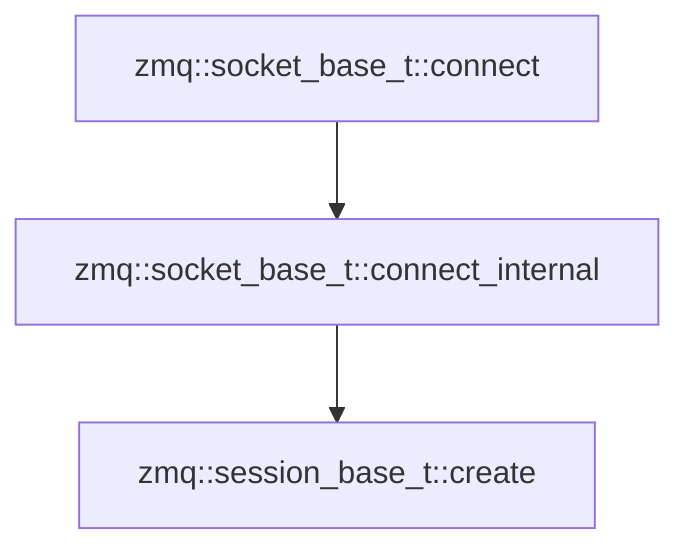
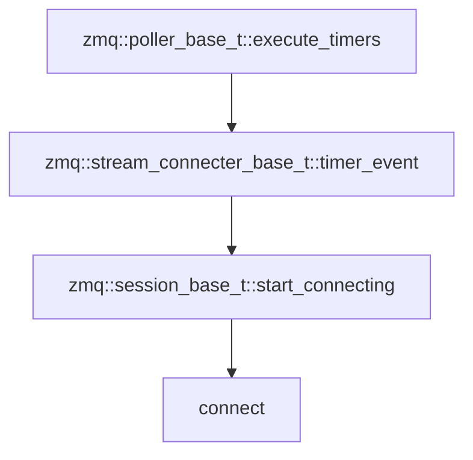

# ZMQ源码分析 - socket

[TOC]

## 类结构

## 通讯协议

zmq支持以下通讯方式：

- `tcp` 使用TCP的单播传输。
- `inpro` **线程间**通信。
- `ipc` 本地**进程间**通信。
- `pgm` 基于IP网络协议的可靠多路广播（只可用于pub和sub类型套接字）。
- `epgm` 基于IP网络协议的可靠多路广播（只可用于pub和sub类型套接字）。
- `vmci` 虚拟机通信接口。

## socket分类

| socket      | 组合                                                         | 说明                                       |
| ----------- | ------------------------------------------------------------ | ------------------------------------------ |
| ZMQ_PAIR    | `ZMQ_PAIR + ZMQ_PAIR`：线程间通信                            | 套接字对                                   |
| ZMQ_PUB     | `ZMQ_PUB + ZMQ_SUB`：经典发布订阅模型 `ZMQ_PUB + ZMQ_XSUB`：高级发布模型 | 发布套接字                                 |
| ZMQ_SUB     | `ZMQ_SUB + ZMQ_PUB`：经典发布订阅模型 `ZMQ_SUB + ZMQ_XPUB`：高级订阅模型 | 订阅套接字                                 |
| ZMQ_XPUB    | `ZMQ_XPUB + ZMQ_XSUB`：高级发布订阅模型 `ZMQ_SUB + ZMQ_XPUB`：高级订阅模型 | 高级订阅套接字（用于转发套接字发布的消息） |
| ZMQ_XSUB    | `ZMQ_XPUB + ZMQ_XSUB`：高级发布订阅模型 `ZMQ_PUB + ZMQ_XSUB`：高级发布模型 | 高级发布套接字（用于接收套接字发布的消息） |
| ZMQ_REQ     | `ZMQ_REQ + ZMQ_REP`：经典请求响应模型                        | 请求套接字（一问一答）                     |
| ZMQ_REP     | `ZMQ_REQ + ZMQ_REP`：经典请求响应模型                        | 响应套接字（一问一答）                     |
| ZMQ_XREQ    | `ZMQ_XREQ + ZMQ_XREP`：高级请求响应模型                      |                                            |
| ZMQ_XREP    | `ZMQ_XREQ + ZMQ_XREP`：高级请求响应模型                      |                                            |
| ZMQ_PUSH    | `ZMQ_PUSH + ZMQ_PULL`：经典推/拉模型                         | 推送套接字                                 |
| ZMQ_PULL    | `ZMQ_PUSH + ZMQ_PULL`：经典推/拉模型                         | 拉取套接字                                 |
| ZMQ_STREAM  |                                                              |                                            |
| ZMQ_SERVER  |                                                              |                                            |
| ZMQ_CLIENT  |                                                              |                                            |
| ZMQ_GATHER  |                                                              |                                            |
| ZMQ_SCATTER |                                                              |                                            |
| ZMQ_DGRAM   |                                                              |                                            |
| ZMQ_PEER    |                                                              |                                            |
| ZMQ_CHANNEL |                                                              |                                            |

## socket_base_t

### 建立连接

触发连接事件：

### 断线重连

TODO

### 消息触发模式

TODO

### 释放与销毁

TODO

### 发送多帧

TODO

### 多次发送

TODO

## pub_t

TODO

## xpub_t

TODO

## 参考

-  [ZeroMQ 教程 002 : 高级技巧](https://www.cnblogs.com/neooelric/p/9020872.html)
-  [ZeroMQ源码阅读阶段性总结](https://www.icode9.com/content-1-120408.html#socket_base_t___343)
- [源码分析-ZeroMQ连接的建立与重连机制](https://dymanzy.github.io/2017/08/11/%E6%BA%90%E7%A0%81%E5%88%86%E6%9E%90-ZeroMQ%E8%BF%9E%E6%8E%A5%E7%9A%84%E5%BB%BA%E7%AB%8B%E4%B8%8E%E9%87%8D%E8%BF%9E%E6%9C%BA%E5%88%B6/)
- [ZMQ源码分析（五） --TCP通讯](https://blog.csdn.net/tbyzs/article/details/50577284)
- [源码分析-ZeroMQ连接的建立与重连机制](https://dymanzy.github.io/2017/08/11/%E6%BA%90%E7%A0%81%E5%88%86%E6%9E%90-ZeroMQ%E8%BF%9E%E6%8E%A5%E7%9A%84%E5%BB%BA%E7%AB%8B%E4%B8%8E%E9%87%8D%E8%BF%9E%E6%9C%BA%E5%88%B6/)
- [ZeroMQ接口函数之 ：zmq_setsockopt –设置ZMQ socket的属性](https://www.cnblogs.com/fengbohello/p/4398953.html)