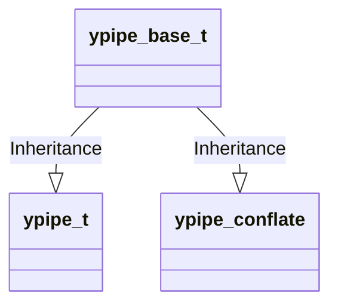

# ZeroMQ源码分析 - ypipe

<!-- vim-markdown-toc GFM -->

* [ypipe_t](#ypipe_t)
* [参考](#参考)

<!-- vim-markdown-toc -->


## 定义



### ypipe_t

```c++
template <typename T, int N> class ypipe_t ZMQ_FINAL : public ypipe_base_t<T>
{
public:
    ypipe_t () {...}
    void write (const T &value_, bool incomplete_) {...} // 写数据
    bool flush () {...}         // 刷入数据
    bool check_read () {...}    // 检查是否可读
    bool read (T *value_) {...} // 读数据
protected:
    yqueue_t<T, N> _queue; // 线程安全的链表（存放数据）
    T *_w;                 // 指向第一个未刷新的元素（只被写线程使用）
    T *_r;                 // 指向第一个还没预提取的元素（只被读线程使用）
    T *_f;                 // 指向下一轮要被刷新的一批元素中的第一个
    atomic_ptr_t<T> _c;    // 指向每一轮刷新的起点（读写线程共享）

    ZMQ_NON_COPYABLE_NOR_MOVABLE (ypipe_t)
}
```

### ypipe_conflate

`ypipe_conflate_t`是`ypipe_base_t`的另一种实现，相比ypipe效率更高，但是不安全。

```c++
TODO
```

### ypipe_base_t

```c++
// ypipe抽象基类
template <typename T> class ypipe_base_t
{
  public:
    virtual ~ypipe_base_t () ZMQ_DEFAULT;
    virtual void write (const T &value_, bool incomplete_) = 0; // 写
    virtual bool unwrite (T *value_) = 0;                       // 
    virtual bool flush () = 0;                                  // 刷入数据
    virtual bool check_read () = 0;                             // 检查读入的数据
    virtual bool read (T *value_) = 0;                          // 读
    virtual bool probe (bool (*fn_) (const T &)) = 0;           // 
};
```


## 参考

- [ZMQ源码分析（一）-- 基础数据结构的实现](https://blog.csdn.net/tbyzs/article/details/50569627)

