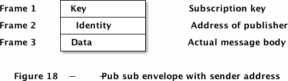

# ZeroMQ - 发布订阅模式

<!-- vim-markdown-toc GFM -->

* [发布订阅](#发布订阅)
* [封包](#封包)
* [高级发布订阅](#高级发布订阅)
* [参考](#参考)

<!-- vim-markdown-toc -->

## 发布订阅

TODO

## 封包

*发布-订阅消息封包（二帧）*

*发布-订阅消息封包（三帧）*

## 高级发布订阅

TODO

## 参考

- [第二章 ZeroMQ进阶](https://wizardforcel.gitbooks.io/zmq-guide/content/chapter2.html)

- [重头戏！ZeroMQ的发布-订阅模式详解：ZMQ_PUB、ZMQ_SUB](https://blog.51cto.com/u_15346415/3673854)
