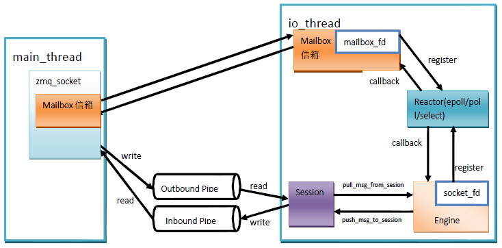
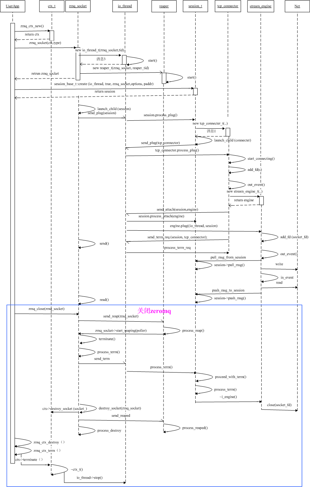
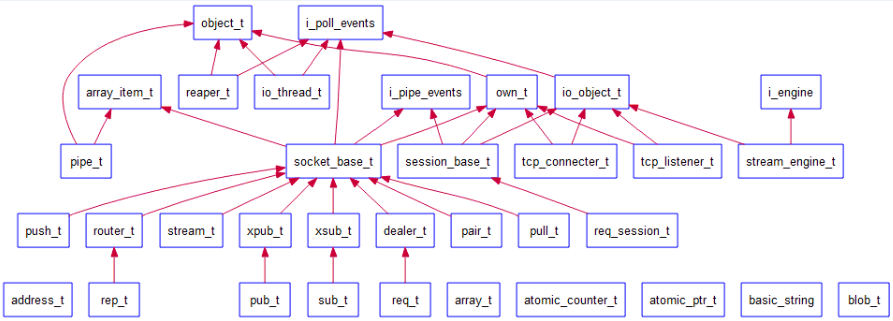
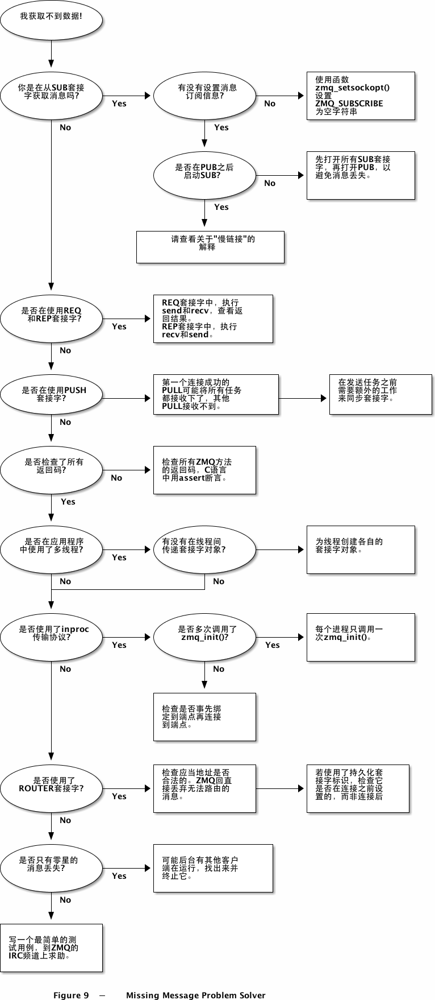

# zmq源码分析-总结

[TOC]


## 整体架构




## 基本流程


### 对象交互

```c++
void *requester = zmq_socket (context, ZMQ_REQ);
zmq_connect (requester, "tcp://localhost:5555");
```




## 类层次



- `object_t` 主要用于发送命令和处理命令，所有继承object_t的子类都具备该类的功能；
- `io_thread_t` 内含一个poller，可监听句柄的读、写、异常状态，继承自object_t，具有接收命令、处理命令、发送命令的功能；
- `io_object_t` 可以获取一个io_thread_t的poller，从而具备poller功能，所有继承自该类的子类都具有pollere功能，可监听句柄的读、写、异常状态；
- `reaper_t` zmq的回收线程；
- `own_t` zmq的对象树结点，或者说多叉树的结点，其主要用于对象的销毁，可以想到，对象的销毁就是这棵树的销毁过程，必须要使用深度优先的算法来销毁；
- `tcp_connector_t` zmq_socket的连接器，使用她来建立tcp连接；
- `tcp_listener_t` zmq_socket的监听器；
- `stream_engine` 负责处理io事件中的一种----网络事件，把网络字节流转换成zeromq的msg_t消息传递给session_base_t；
- `session_base_t` 管理zmq_socket的连接和通信，主要与engine进行交换；
- `socket_base_t` zeromq的socket，在zmq中，被当成一种特殊的”线程“，具有收发命令的功能。


## 性能测试


## 最佳实践

1. 线程间通信推荐使用`pair`类型socket，而不是mutex这一类传统的线程通信方法；


## 查错指南




## 参考

- [zeromq源码分析笔记之架构（1） ](https://www.cnblogs.com/zengzy/p/5122634.html)
- [zeromq源码分析笔记之线程间收发命令（2）](https://www.cnblogs.com/zengzy/p/5132437.html)
- [zeromq源码分析笔记之无锁队列ypipe_t（3）](https://www.cnblogs.com/zengzy/p/5134568.html)
- [<摘录>开源软件架构-ZeroMQ ](https://www.cnblogs.com/hummersofdie/p/4597031.html)
- [ZeroMQ研究与应用分析_zzhongcy的专栏-程序员ITS201](https://its201.com/article/yangyangye/19814133)
- [Zeromq 源码全解析(1)_不积跬步无以至千里-程序员宅基地_zeromq源码分析](https://www.cxyzjd.com/article/qq_22478401/103965222)
- [Internal Architecture of libzmq](http://wiki.zeromq.org/whitepapers:architecture)

