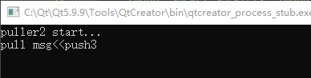

# zmqpp

[TOC]

个人认为，zmqpp库是对libzmq封装的最好的c++库，非常方便用于构建zmq程序，推荐使用。


## 环境构建

### windows

1. 打开`CMakeLists.txt`文件，修改以下内容：

   ```cmake
   # zmq-static is the name of the static target in libzmq's CMakeLists.txt
   set( ZMQPP_LIBZMQ_NAME_STATIC  "libzmq-v140-mt-4_3_4" CACHE STRING "The ZMQ library to link the static ZMQPP. (if built)" ) # libzmq生成的静态库名字（不需要带.dll后缀）
   set( ZMQPP_LIBZMQ_NAME_SHARED  "libzmq-v140-mt-4_3_4" CACHE STRING "The ZMQ library to link the dynamic ZMQPP. (if built)" ) # libzmq生成的动态库名字（不需要带.lib后缀）
   
   # Paths to set to look for zmq
   set( ZEROMQ_LIB_DIR       "C:/libzmq"      CACHE PATH "The library directory for libzmq" ) # libzmq生成的动态和静态库存放目录（建议动静态库放一起）
   set( ZEROMQ_INCLUDE_DIR   "C:/libzmq"      CACHE PATH "The include directory for ZMQ" ) # libzmq生成的zmq.h头文件存放目录
   ```

2. cmake编译构建；

   使用cmake进行编译构建，格式为`cmake .. -G "编译器" -D参数`；

   | 编译器                      | 说明              |
   | --------------------------- | ----------------- |
   | Visual Studio 14 2015 Win64 | vs2015 64位编译器 |
   | Visual Studio 14 2015 Win32 | vs2015 32位编译器 |
   | ...                         |                   |

   | 参数               | 说明                       |
   | ------------------ | -------------------------- |
   | ZMQ_BUILD_TESTS    | 是否开启test               |
   | ZMQPP_BUILD_STATIC | 是否编译静态库（默认开启） |
   | ZMQPP_BUILD_SHARED | 是否编译动态库（默认开启） |
   | ...                |                            |

   例：

   ```sh
   cmake .. -G "Visual Studio 14 2015 Win64" -DZMQ_BUILD_TESTS=OFF -DZMQPP_BUILD_STATIC=OFF
   ```

3. 使用vs2015打开`zmqpp.sln`进行构建。

4. 测试

   - 新建qt console项目；

   - 在项目下新建lib目录并添加静态链接库文件`libzmq-v140-mt-4_3_4.lib`，`zmqpp.lib`（动态链接库分别对应`*.dll`或`*.so`文件）；

   - 在项目下新建3rd目录并复制zmqpp项目代码到3rd下面；

   - 复制头文件`zmq.h`，`zmqpp_export.h`到项目目录下；

   - 修改每个项目的`*.pro`文件，添加以下内容；

     ```c++
     LIBS += \
         -L$$PWD/./lib/ -llibzmq-v140-mt-4_3_4 \
         -L$$PWD/./lib/ -lzmqpp
     
     HEADERS += zmq.h \
         zmqpp_export.h \
         3rd/zmqpp/zmqpp_export.h \
         3rd/zmqpp/actor.hpp \
         3rd/zmqpp/auth.hpp \
         3rd/zmqpp/byte_ordering.hpp \
         3rd/zmqpp/compatibility.hpp \
         3rd/zmqpp/context.hpp \
         3rd/zmqpp/context_options.hpp \
         3rd/zmqpp/curve.hpp \
         3rd/zmqpp/exception.hpp \
         3rd/zmqpp/frame.hpp \
         3rd/zmqpp/inet.hpp \
         3rd/zmqpp/loop.hpp \
         3rd/zmqpp/message.hpp \
         3rd/zmqpp/poller.hpp \
         3rd/zmqpp/proxy.hpp \
         3rd/zmqpp/proxy_steerable.hpp \
         3rd/zmqpp/reactor.hpp \
         3rd/zmqpp/signal.hpp \
         3rd/zmqpp/socket.hpp \
         3rd/zmqpp/socket_mechanisms.hpp \
         3rd/zmqpp/socket_options.hpp \
         3rd/zmqpp/socket_types.hpp \
         3rd/zmqpp/z85.hpp \
         3rd/zmqpp/zap_request.hpp \
         3rd/zmqpp/zmqpp.hpp
     ```

   - 修改`main.cpp`，编译运行。


## 发布订阅(pub-sub)模式


### 注意事项

TODO

### Qt+zmqpp发布订阅示例

1. 按照[windows环境构建](#windows)方案的第4步，分别新建3个项目，并修改main.cpp文件：

   - `qzmq_pubsub_publisher`

     ```c++
     // main.cpp
     #include <QCoreApplication>
     #include <iostream>
     #include <string>
     #include <QElapsedTimer>
     
     #include "zmq.h"
     #include "3rd/zmqpp/zmqpp.hpp"
     
     static const std::string TOPIC1{"hello"};
     static const std::string TOPIC2{"world"};
     
     void Sleep(int ms)
     {
         QElapsedTimer t;
         t.start();
         while(t.elapsed() < ms);
     }
     
     int main(int argc, char *argv[])
     {
         QCoreApplication a(argc, argv);
     
         int x, y, z;
         zmq_version(&x, &y, &z);
         std::cout << "qt + zmqpp-" << x << "-" << y << "-" << z << " client example!" << std::endl;
     
         zmqpp::context ctx;
         zmqpp::socket sock(ctx, zmqpp::socket_type::pub);
         sock.bind("tcp://*:5555");
         Sleep(3000);
         for (int i = 0; i < 2; i++)
         {
             auto str = TOPIC1 + std::to_string(i);
             sock.send(str);
             std::cout << "pub msg>>" << str << std::endl;
             Sleep(1000);
         }
     
         for (int i = 0; i < 2; i++)
         {
             auto str = TOPIC2 + std::to_string(i);
             sock.send(str);
             std::cout << "pub msg>>" << str << std::endl;
             Sleep(1000);
         }
     
         return a.exec();
     }
     ```

   - `qzmq_pubsub_publisher1`

     ```c++
     // main.cpp
     #include <QCoreApplication>
     #include <iostream>
     #include <string>
     #include <QElapsedTimer>
     
     #include "zmq.h"
     #include "3rd/zmqpp/zmqpp.hpp"
     
     static const std::string TOPIC{"hello"};
     
     int main(int argc, char *argv[])
     {
         QCoreApplication a(argc, argv);
     
         std::cout << "subscriber1 start..." << std::endl;
         zmqpp::context ctx;
         zmqpp::socket sock(ctx, zmqpp::socket_type::sub);
         sock.set(zmqpp::socket_option::subscribe, TOPIC);
         sock.connect("tcp://localhost:5555");
         while (true)
         {
             std::string msg;
             sock.receive(msg);
             std::cout << "recv msg<<" << msg << " , from topic:" << TOPIC << std::endl;
         }
     
         return a.exec();
     }
     ```

   - `qzmq_pubsub_publisher2`

     ```c++
     // main.cpp
     #include <QCoreApplication>
     #include <iostream>
     #include <string>
     #include <QElapsedTimer>
     
     #include "zmq.h"
     #include "3rd/zmqpp/zmqpp.hpp"
     
     static const std::string TOPIC{"world"};
     
     int main(int argc, char *argv[])
     {
         QCoreApplication a(argc, argv);
     
         std::cout << "subscriber2 start..." << std::endl;
         zmqpp::context ctx;
         zmqpp::socket sock(ctx, zmqpp::socket_type::sub);
         sock.set(zmqpp::socket_option::subscribe, TOPIC);
         sock.connect("tcp://localhost:5555");
         while (true)
         {
             std::string msg;
             sock.receive(msg);
             std::cout << "recv msg<<" << msg << " , from topic:" << TOPIC << std::endl;
         }
     
         return a.exec();
     }
     
     ```
     
   
2. 结果如下
   
   


## 一问一答(req-rep)模式


### Qt+zmqpp一问一答示例

1. 按照[windows环境构建](#windows)方案的第4步，分别新建2个项目，并修改main.cpp文件：

   - `qzmq_reqrep_cli`

     ```c++
     // main.cpp
     #include <QCoreApplication>
     #include <iostream>
     #include <string>
     #include <QElapsedTimer>
     
     #include "zmq.h"
     #include "3rd/zmqpp/zmqpp.hpp"
     
     int main(int argc, char *argv[])
     {
         QCoreApplication a(argc, argv);
     
         std::cout << "cli start..." << std::endl;
         zmqpp::context ctx;
         zmqpp::socket sock(ctx, zmqpp::socket_type::req);
         sock.connect("tcp://localhost:5555");
         int idx = 1;
         for (; idx < 3; idx++)
         {
             std::string req{"req" + std::to_string(idx)};
             sock.send(req);
             std::cout << "send msg>>" << req << std::endl;
     
             std::string rsp{};
             sock.receive(rsp);
             std::cout << "recv msg<<" << rsp << std::endl;
         }
     
         for (; true; idx++)
         {
             std::string rsp{};
             sock.receive(rsp);
             std::cout << "recv msg<<" << rsp << std::endl;
     
             std::string req{"req" + std::to_string(idx)};
             sock.send(req);
             std::cout << "send msg>>" << req << std::endl;
         }
     
         return a.exec();
     }
     ```

   - `qzmq_reqrep_srv`

     ```c++
     // main.cpp
     #include <QCoreApplication>
     #include <iostream>
     #include <string>
     #include <QElapsedTimer>
     
     #include "zmq.h"
     #include "3rd/zmqpp/zmqpp.hpp"
     
     int main(int argc, char *argv[])
     {
         QCoreApplication a(argc, argv);
     
         std::cout << "server start..." << std::endl;
         zmqpp::context ctx;
         zmqpp::socket sock(ctx, zmqpp::socket_type::rep);
         sock.bind("tcp://*:5555");
         for (int idx = 1; true; idx++)
         {
             std::string req{};
             sock.receive(req);
             std::cout << "recv msg<<" << req << std::endl;
     
             std::string rsp{"rsp" + std::to_string(idx)};
             sock.send(rsp);
             std::cout << "send msg>>" << rsp << std::endl;
         }
         sock.send("rsp3");
     
         return a.exec();
     }
     ```

2. 结果如下：

   


## 推送拉取(push-pull)模式


### Qt+zmqpp推送拉取示例

1. 按照[windows环境构建](#windows)方案的第4步，分别新建个3项目，并修改main.cpp文件：

   - `qzmq_pushpull_pusher`

     ```c++
     // main.cpp
     #include <QCoreApplication>
     #include <iostream>
     #include <string>
     #include <QElapsedTimer>
     
     #include "zmq.h"
     #include "3rd/zmqpp/zmqpp.hpp"
     
     void Sleep(int ms)
     {
         QElapsedTimer t;
         t.start();
         while(t.elapsed() < ms);
     }
     
     int main(int argc, char *argv[])
     {
         QCoreApplication a(argc, argv);
     
         std::cout << "pusher start..." << std::endl;
         Sleep(3000);
         zmqpp::context ctx;
         zmqpp::socket sock(ctx, zmqpp::socket_type::push);
         sock.bind("tcp://*:5555");
         for (int idx = 1; idx < 3; idx++)
         {
             std::string msg{"push" + std::to_string(idx)};
             sock.send(msg);
             std::cout << "push msg>>" << msg << std::endl;
         }
     
         Sleep(5000);
         sock.send("push3");
         std::cout << "push msg>>" << "push3" << std::endl;
         return a.exec();
     }
     ```

   - `qzmq_pushpull_puller1`

     ```c++
     // main.cpp
     #include <QCoreApplication>
     #include <iostream>
     #include <string>
     #include <QElapsedTimer>
     
     #include "zmq.h"
     #include "3rd/zmqpp/zmqpp.hpp"
     
     int main(int argc, char *argv[])
     {
         QCoreApplication a(argc, argv);
     
         std::cout << "puller1 start..." << std::endl;
         zmqpp::context ctx;
         zmqpp::socket sock(ctx, zmqpp::socket_type::pull);
         sock.connect("tcp://localhost:5555");
     
         while (true)
         {
             std::string msg{};
             sock.receive(msg);
             std::cout << "pull msg<<" << msg << std::endl;
         }
         return a.exec();
     }
     
     ```

   - `qzmq_pushpull_puller2`

     ```c++
     // main.cpp
     #include <QCoreApplication>
     #include <iostream>
     #include <string>
     #include <QElapsedTimer>
     
     #include "zmq.h"
     #include "3rd/zmqpp/zmqpp.hpp"
     
     int main(int argc, char *argv[])
     {
         QCoreApplication a(argc, argv);
     
         std::cout << "puller2 start..." << std::endl;
         zmqpp::context ctx;
         zmqpp::socket sock(ctx, zmqpp::socket_type::pull);
         sock.connect("tcp://localhost:5555");
     
         while (true)
         {
             std::string msg{};
             sock.receive(msg);
             std::cout << "pull msg<<" << msg << std::endl;
         }
         return a.exec();
     }
     ```

2. 输出结果

   

   

   


## 高级应答(dealer-router)模式


### Qt+zmqpp高级应答示例

1. 按照[windows环境构建](#windows)方案的第4步，分别新建个2项目，并修改main.cpp文件：

   - `qzmq_dealerrouter_router`

     ```c++
     #include <QCoreApplication>
     #include <iostream>
     #include <string>
     #include <QElapsedTimer>
     
     #include "zmq.h"
     #include "3rd/zmqpp/zmqpp.hpp"
     
     static const std::string TOPIC{"world"};
     
     int main(int argc, char *argv[])
     {
         QCoreApplication a(argc, argv);
     
         std::cout << "router start..." << std::endl;
         zmqpp::context ctx;
         zmqpp::socket sock(ctx, zmqpp::socket_type::router);
         sock.bind("tcp://*:5555");
         while (true)
         {
             std::string sender{};
             std::string msg{};
             sock.receive(sender);
             sock.receive(msg);
             std::cout << "recv msg<<" << msg << " , from:" << sender << std::endl;
     
             if (sender == "dealer1")
             {
                 sock.send("dealer2", zmqpp::socket::send_more);
             }
             else if (sender == "dealer2")
             {
                 sock.send("dealer1", zmqpp::socket::send_more);
             }
             sock.send(msg);
         }
     
         return a.exec();
     }
     ```

   - `qzmq_dealerrouter_dealer1`

     ```c++
     #include <QCoreApplication>
     #include <iostream>
     #include <string>
     #include <QElapsedTimer>
     
     #include "zmq.h"
     #include "3rd/zmqpp/zmqpp.hpp"
     
     void Sleep(int ms)
     {
         QElapsedTimer t;
         t.start();
         while(t.elapsed() < ms);
     }
     
     int main(int argc, char *argv[])
     {
         QCoreApplication a(argc, argv);
     
         std::cout << "dealer1 start..." << std::endl;
         zmqpp::context ctx;
         zmqpp::socket sock(ctx, zmqpp::socket_type::dealer);
         sock.set(zmqpp::socket_option::identity, "dealer1");
         sock.connect("tcp://localhost:5555");
     
         Sleep(3000);
         std::string msg{"msg1"};
         sock.send(msg);
         std::cout << "send msg>>" << msg << " to router" << std::endl;
     
         sock.receive(msg);
         std::cout << "recv msg<<" << msg << " from router" << std::endl;
         return a.exec();
     }
     ```

   - `qzmq_dealerrouter_dealer2`

     ```c++
     #include <QCoreApplication>
     #include <iostream>
     #include <string>
     #include <QElapsedTimer>
     
     #include "zmq.h"
     #include "3rd/zmqpp/zmqpp.hpp"
     
     int main(int argc, char *argv[])
     {
         QCoreApplication a(argc, argv);
     
         std::cout << "dealer2 start..." << std::endl;
         zmqpp::context ctx;
         zmqpp::socket sock(ctx, zmqpp::socket_type::dealer);
         sock.set(zmqpp::socket_option::identity, "dealer2");
         sock.connect("tcp://localhost:5555");
     
         std::string msg{};
         sock.receive(msg);
         std::cout << "recv msg<<" << msg << " from router" << std::endl;
     
         msg="msg2";
         sock.send(msg);
         std::cout << "send msg>>" << msg << " to router" << std::endl;
     
         return a.exec();
     }
     ```

2. 输出结果

   


## 高级发布订阅(xpub-xsub)模式

TODO

**注意事项**

1. 一个pub套接字无法接收xsub的订阅请求，需要使用poller将他们关联起来；


## 参考

- [XPub / XSub](https://netmq.readthedocs.io/en/latest/xpub-xsub/)
- [跟我一起学习ZeroMQ（8）：带broker的发布订阅模式：ZMQ_PUB、broker(ZMQ_XPUB和ZMQ_XSUB)、ZMQ_SUB](https://lianshaohua.blog.csdn.net/article/details/109574363)
- [（一）zeromq 学习之请求应答模型](https://my.oschina.net/u/3312209/blog/4833661)
- [（二）zeromq 学习之推送拉取模式](https://my.oschina.net/u/3312209/blog/4867760)
- [（三）zeromq 学习之发布订阅模型](https://my.oschina.net/u/3312209/blog/4867792)
- [（四）zeromq 学习之高级请求 - 应答模式](https://my.oschina.net/u/3312209/blog/4868525)
