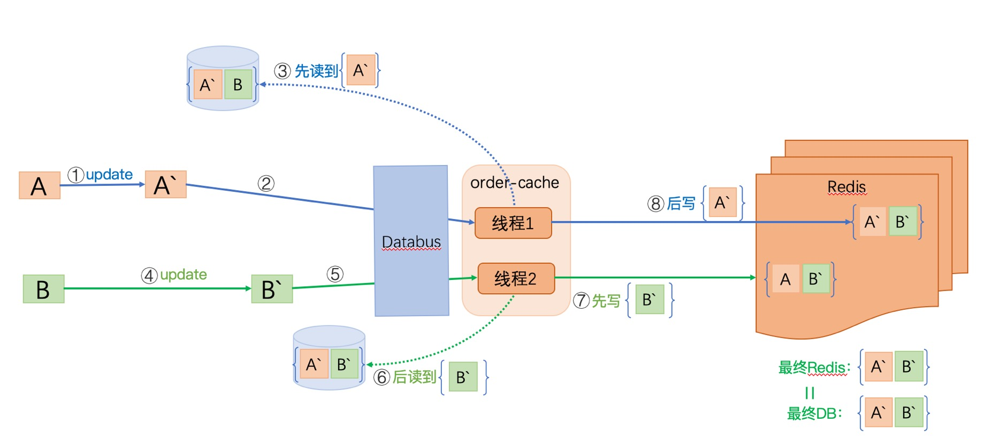

# 缓存系统

[TOC]


## 缓存系统评判指标

- 强一致性(Strict Consistency)
  1. 任何一次读都能读到某个数据的最近一次写的数据（最终一致性）
  2. 系统中的所有进程，看到的操作顺序，都和全局时钟下的顺序一致
- 弱一致性(Weak Consistency)
  1. 数据更新后，如果能容忍后续的访问只能访问到部分或者全部访问不到
- 并发量
  1. 单表单库并发读写
  2. 多表多库并发读写


## 数据一致性解决方案

### 方案一 先删缓存再更新数据库


- 写操作

  1. 先删除缓存数据
  2. 更新数据库数据，避免脏数据
  3. 异步将数据刷回缓存
  
- 读操作

  1. 读缓存数据
  2. 如果缓存找不到数据，去读数据库
  3. 异步将数据刷回缓存

#### 优点

1. 整个流程非常简单，适用于低并发场景

#### 缺点

1. 容灾不足

   "写1"时删除缓存失败怎么处理；如果继续执行，那一直读的缓存数据不就是错误数据了？

2. 并发问题

   - 写写并发

     如果多个服务同时更新数据库，无法保证操作顺序，会存在相互覆盖问题

   - 读写并发

     如果消费者A的读操作与消费者B的写操作同时进行；流程如下：

     1. B删除缓存数据v1

     2. A读缓存数据，缓存找不到数据

     3. A读数据库数据，数据库返回数据v1

     4. B将数据库的数据v1更新为v2

     5. B将v2刷回缓存

     6. A将v1刷回缓存

        此时A的“脏数据”会覆盖B已经修改过的缓存数据，此时缓存中还是v1，此方案无法保证最终一致性。

     示意图如下：

     ```sequence
     Title: 读写并发异常示意
     B->缓存: 1.删除缓存数据v1
     A->缓存: 2.读缓存数据
     缓存-->A: 缓存找不到数据
     A->数据库: 读数据库数据
     数据库-->A: 返回数据v1
     B->数据库: 更新数据库数据v2
     B->缓存: 更新缓存数据v2
     A->缓存: 更新缓存数据v1
     ```

#### 总结

使用场景：并发量，一致性要求都不是很高的情况

由于其刷新缓存策略可能会失败，失败之后缓存数据一直处于错误状态，它并不能保证数据的最终一致性，也不能保证并发读写的安全性。

### 方案二 先删缓存再更新数据库同时引入binlog机制



- 写操作
  1. 删除缓存数据
  2. 更新数据库
  3. 监听数据库的binlog，找到需要刷新的数据
  4. 读数据库数据
  5. 把读到的数据写入缓存
- 读操作
  1. 读缓存数据
  2. 如果缓存找不到数据，去读数据库
  3. 异步将数据刷回缓存

#### 优点

1. “写4”或“写5”如果失败，可以进行日志回放，再次重试
2. 无论“写1”是否成功，后面都会刷新缓存

#### 缺点

1. 并发问题

   对于缓存中没有数据的情况无效：

   - 读的时候，缓存中的数据已经失效，此时又发生了更新
   - 数据更新的时候，缓存中的数据已经失效，此时又发生了更新

#### 总结

适用场景：业务简单，读写QPS比较低的情况。

binlog用来刷新缓存，由于其天然的顺序性，做同步操作很有优势。但是当不同行，表，库的binlog同时消费时，binglog并不是时间串行的。

#### 使用案例

- [阿里巴巴开源组件：canal](https://github.com/alibaba/canal)
- [linkedin开源组件：databus](https://github.com/linkedin/databus)

### 方案三 在方案二的基础上引入MQ串行化机制


- 写操作
  1. 先删除缓存
  2. 更新数据库
  3. 监听数据库的binlog，分析出需要刷新的数据标识
  4. 将数据标识push给MQ
  5. 从MQ中消费数据标识，根据数据标识从数据库读取数据
  6. 更新缓存
- 读操作
  1. 先读缓存
  2. 没读到缓存，再去读数据库
  3. 把需要更新的数据标识push给MQ
  4. 从MQ中消费数据标识，根据数据标识从读数据库读取数据
  5. 更新缓存

#### 优点

1. 容灾完备

   - "写1"删除缓存失败：后面会覆盖
   - "写4"写MQ失败：Databus或Canal都会重试
   - "写5"或"写6"失败：MQ支持重新消费
   - "读3"写MQ失败：不会影响到缓存，下次还是会来读数据库

2. 串行化

   借助MQ的机制，让读和写操作都串行化，不存在并发问题

#### 缺点

1. "写5"每次都会去读数据库，会加大数据库压力（每次写也就加多1次读，问题不大）

### 方案四 在方案三的基础上添加标记


- 写操作
  1. 把要修改的数据做个标记，标识“正在被修改”，同时设定标记的有效时间；如果标记失败，放弃本次修改。
  2. 更新数据库。
  3. 删除缓存。
  4. 监听数据库的binlog，分析出需要刷新的数据标识。
  5. 将数据标识push给MQ。
  6. 从MQ中消费数据标识，根据数据标识从数据库读取数据。
  7. 更新缓存。
- 读操作
  1. 检查数据标记，如果被标记，直接读数据库，读完结束。
  2. 如果没有被标记，先读缓存。
  3. 如果缓存没有，再读数据库。
  4. 把需要更新的数据标识push给MQ
  5. 从MQ中消费数据标识，根据数据标识从读数据库读取数据
  6. 更新缓存


## 缓存系统组件

- Redis
- ...


## 缓存系统常见问题

### 1. 缓存穿透

缓存和数据库中都没有的数据，用户还是源源不断的发起请求，导致每次请求都会到数据库，从而压垮数据库

#### 解决方案

1. 业务层校验

   对用户发过来的请求进行检查，有问题直接拦截

2. 对于查找不到的数据，在缓存中将其值设置为NULL，并设置较短的过期时间

3. 布隆过滤器

   利用布隆过滤器的特性，判断数据存不存在，存在才去查找

### 2. 缓存击穿

缓存中一个热点key在失效的同时，大量的请求过来，这些请求全部到达数据库，压垮数据库

#### 解决方案

1. 设置热点数据永不过期

   对于频繁读取的数据设置其永不过期

2. 定时更新过期时间

   在过期时间到来之前，去给它重新设置（续命）

3. 互斥锁

   利用一个缓存中的数据值来作为锁标记，锁住时设置为1或true，释放锁时设置为0或false（记得设置过期，放置锁死）；要想修改数据库，得先拿到这个锁标记。


### 3. 缓存雪崩

缓存中混存的数据大面积失效或者缓存宕机，导致大量请求直接到数据库，压垮数据库。

#### 解决方案

1. 数据过期时间不要太密集，不要全都排到一起失效

2. 数据预热

   对于即将来临的大量请求，提前缓存到缓存中

3. 保证缓存高可用

   做集群


## 参考

- [缓存与数据库一致性系列-01](https://blog.kido.site/2018/12/01/db-and-cache-01/)
- [缓存与数据库一致性系列-02](https://blog.kido.site/2018/12/07/db-and-cache-02/)
- [cannal与databus的对比](https://www.cnblogs.com/xunshao/p/9762377.html)
- [最全面的缓存架构设计（全是干货）](https://blog.csdn.net/zjttlance/article/details/80234341)
- [大型分布式系统中的缓存架构](https://www.cnblogs.com/panchanggui/p/9503666.html)
- [漫谈Web缓存架构](https://www.cnblogs.com/neal-ke/p/8966971.html)

