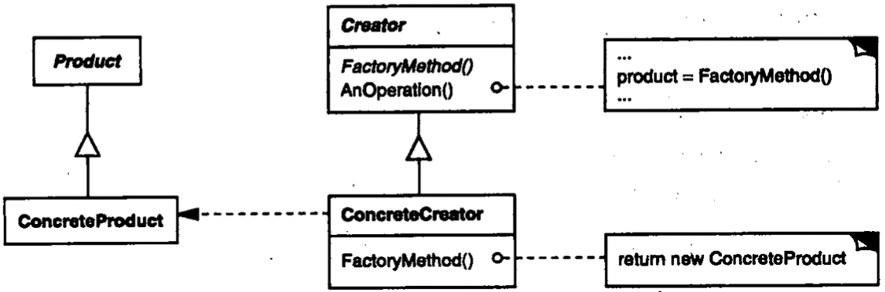
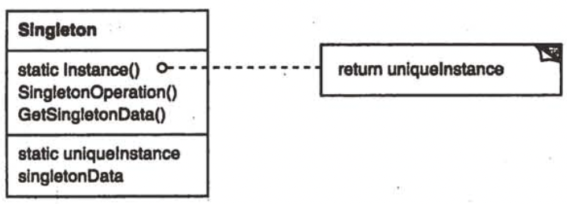
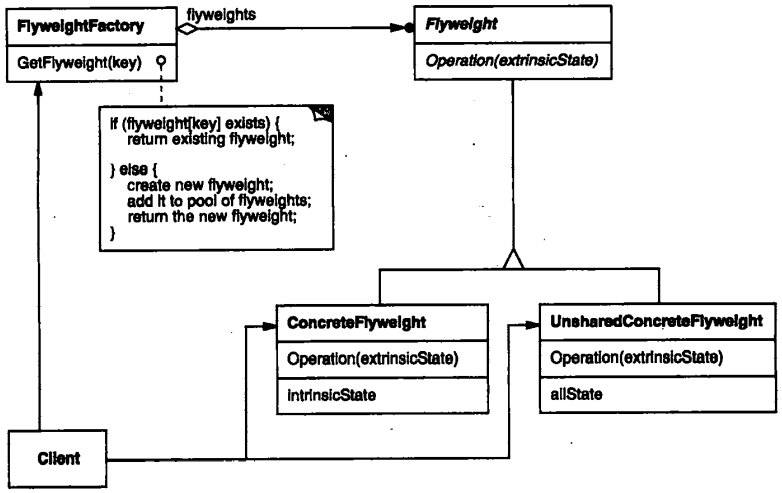
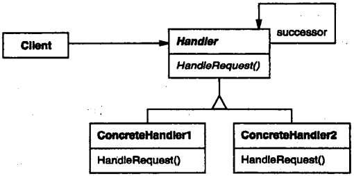
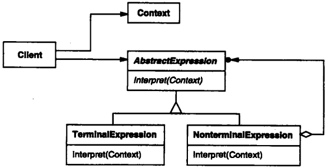
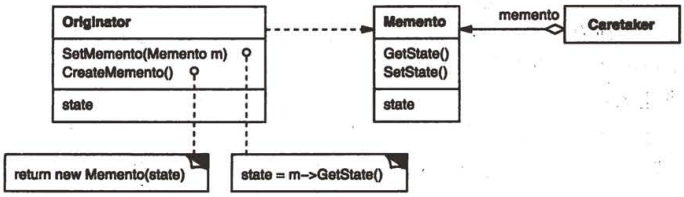
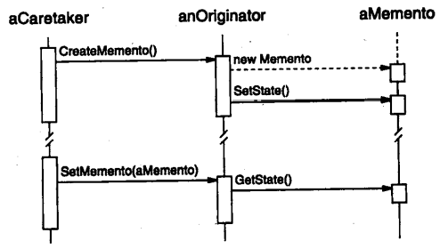
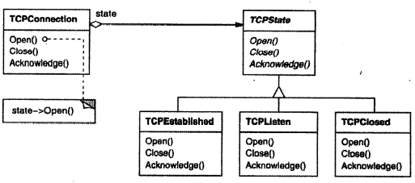
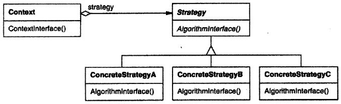
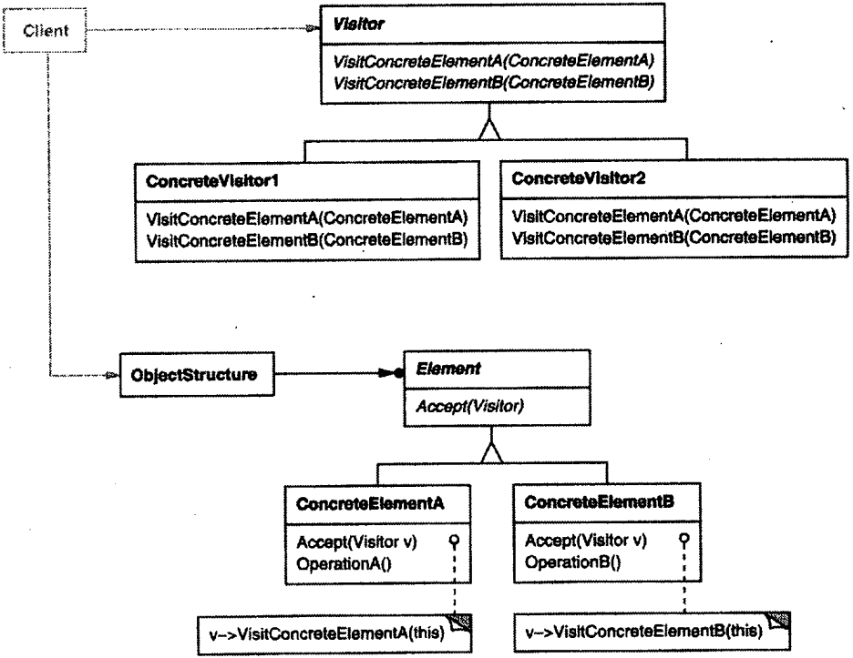

# Design Pattern

[TOC]


---


## ABSTRACT FACTORY

1. Intent

   Provide an interface for creating families of related or dependent objects without specifying their concrete classes.

2. Also Known As

   Kit

3. Motivation

4. Applicability

   Use the Abstract Factory pattern when:

   - a system should be independent of how its products are created, composed, and represented.
   - a system should be configured with one of multiple families of products.
   - a family of related product objects is designed to be used together, and you need to enforce these constraints.
   - you want to provide a class library of products, and you want to reveal just their interfaces, not their implementations.

5. Structure

   

6. Participants

   - AbstractFactory

     declares an interface for operations that create abstract product objects.

   - ConcreteFactory

     implements the operations to create concrete product objects.

   - AbstractProduct

     declares an interface for a type of product objects.

   - ConcreteProduct

     defines a product object to be created by the corresponding concrete factory.

     implements the AbstractProduct interface.

   - Client

     uses only interfaces declared by AbstractFactory and AbstractProduct classes.

7. Collaborations

   - Normally a single instance of a ConcreteFactory class is created at run-time. This concrete factory creates product objects having a particular implementation. To create different product objects, clients should use a different concrete factory.
   - AbstractFactory defers creation of product objects to its ConcreteFactory subclass.

8. Consequences

   The Abstract Factory pattern has the following benefits and liabilities:

   - It isolates concrete classes.
   - It makes exchanging product families easy.
   - It promotes consistency among products.
   - Supporting new kinds of products is difficult.

9. Implementation

   Here are some useful techniques for implementing the Abstract Factory pattern:

   1. Factories as singletons.
   2. Creating the products.
   3. Defining extensible factories.

10. Sample Code

    ```c++
    class MazeFactory {
    public:
        MazeFactory();
        
        virtual Maze* MakeMaze() const { return new Maze; }
        virtual Wall* MakeWall() const { return new Wall; }
        virtual Room* MakeRoom(int n) const { return Room(n); }
        virtual Door* MakeDoor(Room* r1, Room* r2) const { return new Door(r1, r2); }
    };
    
    Maze* MazeGame::CreateMaze(MazeFactory& factory) {
        Maze* aMaze = factory.MakeMaze();
        Room* r1 = factory.MakeRoom(1);
        Room* r2 = factory.MakeRoom(2);
        Door* aDoor = factory.MakeDoor(r1, r2);
        
        aMaze->AddRoom(r1);
        aMaze->AddRoom(r2);
        
        r1->SetSide(North, factory.MakeWall());
        r1->SetSide(East, aDoor);
        r1->SetSide(South, factory.MakeWall());
        r1->SetSide(West, factory.MakeWall());
        r2->SetSide(North, factory.MakeWall());
        r2->SetSide(East, factory.MakeWall());
        r2->SetSide(South, aDoor);
        r2->SetSide(West, factory.MakeWall());
    
        return aMaze;
    }
    
    class EnchantedMazeFactory : public MazeFactory {
    public:
        EnchantedMazeFactory();
        
        virtual Room* MakeRoom(int n) const { return new EnchantedRoom(n, CastSpell()); }
        virtual Door* MakeDoor(Room* r1, Room* r2) const { return new DoorNeedingSpell(r1, r2); }
    
    protected:
        Spell* CastSpell() const;
    };
    
    Wall* BombedMazeFactory::MakeWall() const { return new BombedWall; }
    
    Room* BombedMazeFactory::MakeRoom(int n) const { return new RoomWithABomb(n); }
    ```

11. Known Uses

12. Related Patterns

    - Factory Method
    - Singleton

---


## BUILDER

1. Intent

   Separate the construction of a complex object from its representation so that the same construction process can create different representations.

2. Motivation

3. Applicability

   Use the Builder pattern when:

   - the algorithm for creating a complex object should be independent of the parts that make up the object and how they're assembled.
   - the construction process must allow different representations for the object that's constructed.

4. Structure

   

5. Participants

   - Builder

     specifies an abstract interface for creating parts of a Product object.

   - ConcreteBuilder

     constructs and assembles parts of the product by implementing the Builder interface.

     defines and keeps track of the representation it creates.

     provides an interface for retrieving the product.

   - Director

     constructs an object using the Builder interface.

   - Product

     represents the complex object under construction. ConcreteBuilder builds the product's internal representation and defines the process by which it's assembled.

     includes classes that define the constituent parts, including interfaces for assembling the parts into the final result.

6. Collaborations

   - The client creates the Director object and configures it with the desired Builder object.
   - Director notifies the builder whenever a part of the product should be built.
   - Builder handles requests from the director and adds parts to the product.
   - The client retrieves the product from the builder.

7. Consequences

   Here are key consequences of the Builder pattern:

   1. It lets you vary a product's internal representation.
   2. It isolates code for construction and representation.
   3. It gives you finer control over the construction process.

8. Implementation

   Here are other implementation issues to consider:

   - Assembly and construction interface.
   - Why no abstract class for products.
   - Empty methods as default in Builder.

9. Sample Code

   ```c++
   class MazeBuilder {
   public:
       virtual void BuildMaze() { }
       virtual void BuildRoom(int room) { }
       virtual void BuildDoor(int roomFrom, int roomTo) { }
       
       virtual Maze* GetMaze() { return 0; }
   protected:
       MazeBuilder();
   };
   
   Maze* MazeGame::CreateMaze(MazeBuilder& builder) {
       builder.BuildMaze();
   
       builder.BuildRoom(1);
       builder.BuildRoom(2);
       builder.BuildDoor(1, 2);
       
       return builder.GetMaze();
   }
   
   Maze* MazeGame::CreateComplexMaze(MazeBuilder& builder) {
       builder.BuildRoom(1);
       builder.BuildRoom(1001);
       return builder.GetMaze();
   }
   
   class StandardMazeBuilder : public MazeBuilder {
   public:
       StandardMazeBuilder();
       
       virtual void BuildMaze();
       virtual void BuildRoom(int);
       virtual void BuildDoor(int, int);
       virtual Maze* GetMaze();
   private:
       Direction CommonWall(Room*, Room*);
       Maze* _currentMaze;
   };
   
   StandardMazeBuilder::StandardMazeBuilder() {
       _currentMaze = 0;
   }
   
   void StandardMazeBuilder::BuildMaze() {
       _currentMaze = new Maze;
   }
   
   Maze* StandardMazeBuilder::GetMaze() {
       return _currentMaze;
   }
   
   void StandardMazeBuilder::BuildRoom(int n) {
       if (!_currentMaze->RoomNo(n)) {
           Room* room = new Room(n);
           _currentMaze->AddRoom(room);
           
           room->SetSide(North, new Wall);
           room->SetSide(South, new Wall);
           room->SetSide(East, new Wall);
           room->SetSide(West, new Wall);
       }
   }
   
   void StandardMazeBuilder::BuildDoor(int n1, int n2) {
       Room* r1 = _currentMaze->RoomNo(n1);
       Room* r2 = _currentMaze->RoomNo(n2);
       Door* d = new Door(r1, r2);
       
       r1->SetSide(CommonWall(r1, r2), d);
       r2->SetSide(CommonWall(r2, r1), d);
   }
   
   class CountingMazeBuilder : public MazeBuilder {
   public:
       CountingMazeBuilder();
       
       virtual void BuildMaze();
       virtual void BuildRoom(int);
       virtual void BuildDoor(int, int);
       virtual void AddWall(int, Direction);
       
       void GetCounts(int&, int&) const;
   private:
       int _doors;
       int _rooms;
   };
   
   CountingMazeBuilder::CountingMazeBuilder() {
       _rooms = _doors = 0;
   }
   
   void CountingMazeBuilder::BuildRoom(int) {
       _rooms++;
   }
   
   void CountingMazeBuilder::GetCounts(int& rooms, int& doors) {
       rooms = _rooms;
       doors = _doors;
   }
   ```

10. Known Uses

11. Related Patterns

    - Abstract Factory
    - Composite

---


## FACTORY METHOD

1. Intent

   Define an interface for creating an object, but let subclasses decide which class to instantiate. Factory Method lets a class defer instantiation to subclasses.

2. Also Known As

   Virtual Constructor

3. Motivation

4. Applicability

   Use the Factory Method pattern when:

   - a class can't anticipate the class of objects it must create.
   - a class wants its subclasses to specify the objects it creates.
   - classes delegate responsibility to one of several helper subclasses, and you want to localize the knowledge of which helper subclass is the delegate.

5. Structure

   

6. Participants

   - Product

     defines the interface of objects the factory method creates.

   - ConcreteProduct

     implements the Product interface.

   - Creator

     declares the factory method, which returns an object of type Product. Creator may also define a default implementation of the factory method that returns a default ConcreteProduct object.

     may call the factory method to create a Product object.

   - ConcreteCreator

     overrides the factory method to return an instance of a ConcreteProduct.

7. Collaborations

   Creator relies on its subclasses to define the factory method so that it returns an instance of the appropriate ConcreteProduct.

8. Consequences

   Here are two additional consequences of the Factory Method pattern:

   1. Provides hooks for subclasses.
   2. Connects parallel class hierarchies.

9. Implementation

   Consider the following issues when applying the Factory Method pattern:

   1. Two major varieties.
   2. Parameterized factory methods.
   3. Language-specific variants and issues.
   4. Using templates to avoid subclassing.
   5. Naming conventions.

10. Sample Code

    ```c++
    class MazeGame {
    public:
      Maze* CreateMaze();
      
      virtual Maze* MakeMaze() const { return new Maze; }
      virtual Room* MakeRoom(int n) const { return new Room(n); }
      virtual Wall* MakeWall() const { return new Wall; }
      virtual Door* MakeDoor(Room* r1, Room* r2) const { return new Door(r1, r2); }
    };
    
    Maze* MazeGame::CreateMaze() {
      Maze* aMaze = MakeMaze();
      
      Room* r1 = MakeRoom(1);
      Room* r2 = MakeRoom(2);
      
      Door* theDoor = MakeDoor(r1, r2);
      
      aMaze->AddRoom(r1);
      aMaze->AddRoom(r2);
      
      r1->SetSide(North, MakeWall());
      r1->SetSide(East, theDoor);
      r1->SetSide(South, MakeWall());
      r1->SetSide(West, MakeWall());
      
      r2->SetSide(North, MakeWall());
      r2->SetSide(East, MakeWall());
      r2->SetSide(South, MakeWall());
      r2->SetSide(West, theDoor);
      return aMaze;
    }
    
    class BombedMazeGame : public MazeGame {
    public:
      BombedMazeGame();
      
      virtual Wall* MakeWall() const { return new BombedWall; }
      
      virtual Room* MakeRoom(int n) const { return new RoomWithABomb(n); }
    };
    
    class EnchantedMazeGame : public MazeGame {
    public:
      EnchantedMazeGame();
      
      virtual Room* MakeRoom(int n) const { return new EnchantedRoom(n, CastSpell()); }
      
      virtual Door* MakeDoor(Room* r1, Room* r2) const { return new DoorNeedingSpell(r1, r2); }
    protected:
      Spell* CastSpell() const;
    };
    ```

11. Known Uses

12. Related Patterns

    Abstract Factory

    Template Methods

    Prototypes

---


## PROTOTYPE

1. Intent

   Specify the kinds of objects to create using a prototypical instance, and create new objects by copying this prototype.

2. Motivation

3. Applicability

   Use the Prototype pattern when a system should be independent of how its products are created, composed, and represented; and 

   - when the classes to instantiate are specified at run-time, for example, by dynamic loading; or
   - to avoid building a class hierarchy of factories that parallels the class hierarchy of products; or
   - when instances of a class can have one of only a few different combinations of state. It may be more convenient to install a corresponding number of prototype and clone them rather than instantiating the class manually, each time with the appropriate state.

4. Structure

   

5. Participants

   - Prototype

     declares an interface for cloning itself.

   - ConcretePrototype

     implements an operation for cloning itself.

   - Client

     creates a new object by asking a prototype to clone itself.

6. Collaborations

   A client asks a prototype to clone itself.

7. Consequences

   Additional benefits of the Prototype pattern are listed below:

   1. Adding and removing products at run-time.
   5. Specifying new objects by varying values.
   3. Specifying new objects by varying structure.
   4. Reduced subclassing.
   5. Configuring an application with classes dynamically.

8. Implementation

   Consider the following issues when implementing prototypes:

   1. Using a prototype manager.
   2. Implementing the Clone operation.
   3. Initializing clones.

9. Sample Code

   ```c++
   class MazePrototypeFactory : public MazeFactory {
   public:
     MazePrototypeFactory(Maze*, Wall*, Room*, Door*);
     
     virtual Maze* MakeMaze() const;
     virtual Room* MakeRoom(int) const;
     virtual Wall* MakeWall() const;
     virtual Door* MakeDoor(Room*, Room*) const;
     
   private:
     Maze* _prototypeMaze;
     Room* _prototypeRoom;
     Wall* _prototypeWall;
     Door* _prototypeDoor;
   };
   
   MazePrototypeFactory::MazePrototypeFactory(
     Maze* m, Wall* w, Room* r, Door* d) {
     _prototypeMaze = m;
     _prototypeWall = w;
     _prototypeRoom = r;
     _prototypeDoor = d;
   }
   
   Wall* MazePrototypeFactory::MakeWall() const {
     return _prototypeWall->Clone();
   }
   
   Door* MazePrototypeFactory::MakeDoor(Room* r1, Room* r2) const {
     Door* door = _prototypeDoor->Clone();
     door->Initialize(r1, r2);
     return door;
   }
   
   MazeGame game;
   MazePrototypeFactory simpleMazeFactory(new Maze, new Wall, new Room, new Door);
   Maze* maze = game.CreateMaze(simpleMazeFactory);
   
   MazePrototypeFactory bombedMazeFactory(
     new Maze, new BombedWall, new RoomWithABomb, new Door);
   
   class Door : public MapSite {
   public:
     Door();
     Door(const Door&);
     
     virtual void Initialize(Room*, Room*);
     virtual Door* Clone() const;
     virtual void Enter();
     Room* OtherSideFrom(Room*);
   private:
     Room* _room1;
     Room* _room2;
   };
   
   Door::Door(const Door& other) {
     _room1 = other._room1;
     _room2 = other._room2;
   }
   
   void Door::Initialize(Room* r1, Room* r2) {
     _room1 = r1;
     _room2 = r2;
   }
   
   Door* Door::Clone() const {
     return new Door(*this);
   }
   
   class BombedWall : public Wall {
   public:
     BombedWall();
     BombedWall(const BombedWall&);
     
     virtual Wall* Clone() const;
     bool HasBomb();
   private:
     bool _bomb;
   };
   
   BombedWall::BombedWall(const BombedWall& other) : Wall(other) {
       _bomb = other._bomb;
   }   Wall* BombedWall::Clone() const {
     return new BombedWall(*this);
   }
   ```

10. Known Uses

11. Related Patterns

    Abstract Factory

    Composite

    Decorator

---


## SINGLETON

1. Intent

   Ensure a class only has one instance, and provide a global point of access to it.

2. Motivation

3. Applicability

   Use the Singleton pattern when:

   - there must be exactly one instance of a class, and it must be accessible to clients from a well-known access point.
   - when the sole instance should be extensible by subclassing, and clients should be able to use an extended instance without modifying their code.

4. Structure

   

5. Participants

   - Singleton

     defines an Instance operation that lets clients access its unique instance. Instance is a class operation.

     may be responsible for creating its own unique instance.

6. Collaborations

   Clients access a Singleton instance solely through Singleton's Instance operation.

7. Consequences

   The Singleton pattern has several benefits:

   1. Controlled access to solo instance.
   2. Reduced name space.
   3. Permits refinement of operations and representation.
   4. Permits a variable number of instance.
   5. More flexible than class operations.

8. Implementation

   Here are implementation issue to consider when using the Singleton pattern:

   1. Ensuring a unique instance.
   2. Subclassing the Singleton class.

9. Sample Code

   ```c++
   class MazeFactory {
   public:
       static MazeFactory* Instance();
       
   protected:
       MazeFactory();
       
   private:
       static MazeFactory* _instance;
   };
   
   MazeFactory* MazeFactory::_instance = 0;
   
   MazeFactory* MazeFactory::Instance() {
       if (_instance == 0) {
           const char* mazeStyle = getenv("MAZESTYLE");
           
           if (strcmp(mazeStyle, "bombed") == 0) {
               _instance = new BombedMazeFactory;
               
               // ...
           } else {
           	_instance = new MazeFactory;
           }
       }
       return _instance;
   }
   ```

10. Known Uses

11. Related Patterns

    Abstract Factory

    Builder

    Prototype

---


## ADAPTER

1. Intent

   Convert the interface of a class into another interface clients expect. Adapter let classes work together that couldn't otherwise because of incompatible interfaces.

2. Also Known As

   Wrapper

3. Motivation

4. Applicability

   Use the Adapter pattern when:

   - you want to use an existing class, and its interface does not match the one you need.
   - you want to create a reusable class that cooperates with unrelated or unforeseen classes, that is, classes that don't necessarily have compatible interfaces.
   - (object adapter only) you need to use several existing subclasses, but it's impractical to adapt their interface by subclassing every one. An object adapter can adapt the interface of its parent class.

5. Structure

   A class adapter uses multiple inheritance to adapt one interface to another.

   

   An object adapter relies on object composition:

   

6. Participants

   - `Target` defines the domain-specific interface that Client uses.
   - `Client` collaborates with objects conforming to the Target interface.
   - `Adaptee` defines an existing interface that needs adapting.
   - `Adapter` adapts the interface of Adaptee to the Target interface.

7. Collaborations

   - Clients call operations on an Adapter instance. In turn, the adapter calls Adaptee operations that carry out the request.

8. Consequences

   Class and object adapters have different trade-offs. A class adapter:

   - adapts Adaptee to Target by committing to a concrete Adaptee class. As a consequence, a class adapter won't work when we want to adapt a class and all its subclasses.
   - lets Adapter override some of Adaptee's behavior, since Adapter is a subclass of Adaptee.
   - introduces only one object, and no additional pointer indirection is needed to get to the adaptee.

   An object adapter:

   - lets a single Adapter work with many Adaptees -- that is, the Adaptee itself and all of its subclasses (if any). The Adapter can also add functionality to all Adaptees at once.
   - makes it harder to override Adaptee behavior. It will require subclassing Adaptee and making Adapter refer to the subclass rather than the Adaptee itself.

   Here are other issues to consider when using the Adapter pattern:

   1. How much adapting does Adapter do?
   2. Pluggable adapters.
   3. Using two-way adapters to provide transparency.

9. Implementation

   Although the implementation of Adapter is usually straightforward, here are some issues to keep in mind:

   1. Implementing class adapters in C++.
   2. Pluggable adapters.

10. Sample Code

    ```c++
    class Shape {
    public:
        Shape();
        virtual void BoundingBox(Point& bottomLeft, Point& topRight) const;
        virtual Manipulator* CreateManipulator() const;
    };
    
    class TextView {
    public:
        TextView();
        void GetOrigin(Coord& x, Coord& y) const;
        void GetExtent(Coord& width, Coord& height) const;
        virtual bool IsEmpty() const;
    };
    
    class TextShape : public Shape {
    public:
        TextShape(TextView*);
        
        virtual void BoundingBox(Point& bottomLeft, Point& topRight) const;
        virtual bool IsEmpty() const;
        virtual Manipulator* CreateManipulator() const;
    private:
        TextView* _text;
    };
    
    TextShape::TextShape(TextView* t) {
        _text = t;
    }
    
    void TextShape::BoundingBox(Point& bottomLeft, Point& topRight) const {
        Coord bottom, left, width, height;
        
        _text->GetOrigin(bottom, left);
        _text->GetExtent(width, height);
        
        bottomLeft = Point(bottom, left);
        topRight = Point(bottom + height, left + width);
    }
    
    bool TextShape::IsEmpty() const {
        return _text->IsEmpty();
    }
    
    Manipulator* TextShape::CreateManipulator() const {
        return new TextManipulator(this);
    }
    ```

11. Known Uses

12. Related Patterns

    Bridge

    Decorator

    Proxy

---


## BRIDGE

1. Intent

   Decouple an abstraction from its implementation so that the two can vary independently.

2. Also Known As

   Handle/Body

3. Motivation

4. Applicability

   - you want to avoid a permanent binding between an abstraction and its implementation.
   - both the abstractions and their implementations should be extensible by subclassing.
   - changes in the implementation of an abstraction should have no impact on clients; that is, their code should not have to be recompiled.
   - (C++) you want to hide the implementation of an abstraction completely from clients. In C++ the representation of a class is visible in the class interface.
   - you have a proliferation of classes as shown earlier in the first Motivation diagram. Such a class hierarchy indicates the need for splitting an object into two parts.
   - you want to share an implementation among multiple objects (perhaps using reference counting), and this fact should be hidden from the client.

5. Structure

   

6. Participants

   - Abstraction

     defines the abstraction's interface.

     maintains a reference to an object of type Implementor.

   - Refined Abstraction

     Extends the interface defined by Abstraction.

   - Implementor

     defines the interface for implementation classes. This interface doesn't have to correspond exactly to Abstraction's interface; in fact the two interfaces can be quite different. Typically the Implementor interface provides only primitive operations, and Abstraction defines higher-level operations based on these primitives.

   - ConcreteImplementor

     implements the Implementor interface and defines its concrete implementation.

7. Collaborations

   Abstraction forwards client requests to its Implementor object.

8. Consequences

   The Bridge pattern has the following consequences:

   1. Decoupling interface and implementation.
   2. Improved extensibility.
   3. Hiding implementation details from clients.

9. Implementation

   Consider the following implementation issues when applying the Bridge pattern:

   1. Only one Implementor.
   2. Creating the right Implementor object.
   3. Sharing implementors.
   4. Using multiple inheritance.

10. Sample Code

    ```c++
    class Window {
    public:
        Window(View* contents);
        
        // requests handled by window
        virtual void DrawContents();
        
        virtual void Open();
        virtual void Close();
        virtual void Iconify();
        virtual void Deiconify();
        
        // requests forwarded to implementation
        virtual void SetOrigin(const Point& at);
        virtual void SetExtent(const Point& extent);
        virtual void Raise();
        virtual void Lower();
        
        virtual void DrawLine(const Point&, const Point&);
        virtual void DrawRect(const Point&, const Point&);
        virtual void DrawPolygon(const Point[], int n);
        virtual void DrawText(const char*, const Point&);
        
    protected:
        WindowImp* GetWindowImp();
        View* GetView();
        
    private:
        WindowImp* _imp;
        View* _contents; // the window's contents
    };
    void Window::DrawRect(const Point& p1, const Point& p2) {
        WindowImp* imp = GetWindowImp();
        imp->DeviceRect(p1.X(), p1.Y(), p2.X(), p2.Y());
    }
    
    class WindowImp {
    public:
        virtual void ImpTop() = 0;
        virtual void ImpBottom() = 0;
        virtual void ImpSetExtent(const Point&) = 0;
        virtual void ImpSetOrigin(const Point&) = 0;
        
        virtual void DeviceRect(Coord, Coord, Coord, Coord) = 0;
        virtual void DeviceText(const char*, Coord, Coord) = 0;
        virtual void DeviceBitmap(const char*, Coord, Coord) = 0;
        // lots more functions for drawing on windows...
        
    protected:
        WindowImp();
    };
    
    class ApplicationWindow : public Window {
    public:
        // ...
        virtual void DrawContents();
    };
    void ApplicationWindow::DrawContents() {
        GetView()->DrawOn(this);
    }
    
    class IconWindow : public Window {
    public:
        // ...
        virtual void DrawContents();
        
    private:
        const char* _bitmapName;
    };
    void IconWindow::DrawContents() {
        WindowImp* imp = GetWindowImp();
        if (imp != 0) {
            imp->DeviceBitmap(_bitmapName, 0.0, 0.0);
        }
    }
    
    class XWindowImp : public WindowImp {
    public:
        XWindowImp();
        
        virtual void DeviceRect(Coord, Coord, Coord, Coord);
        // remainder of public interface...
        
    private:
        // lots of X window system-specific state, including:
        Display* _day;
        Drawable _winid;
        GC _gc;
    };
    void XWindowImp::DeviceRect(Coord x0, Coord y0, Coord x1, Coord y1) {
        int x = round(min(x0, x1));
        int y = round(min(y0, y1));
        int w = round(abs(x0 - x1));
        int h = round(abs(y0 - y1));
        XDrawRectangle(_dpy, _winid, _gc, x, y, w, h);
    }
    
    class PMWindowImp : public WindowImp {
    public:
        PMWindowImp();
        virtual void DeviceRect(Coord, Coord, Coord, Coord);
        
        // remainder of public interface...
    private:
        // lots of PM window system-specific state, including:
        HPS _hps;
    };
    void PMWindowImp::DeviceRect(Coord x0, Coord y0, Coord x1, Coord y1) {
        Coord left = min(x0, x1);
        Coord right = max(x0, x1);
        Coord bottom = min(y0, y1);
        Coord top = max(y0, y1);
        
        PPOINTL point[4];
        
        point[0].x = left; point[0].y = top;
        point[1].x = right; point[1].y = top;
        point[2].x = right; point[2].y = bottom;
        point[3].x = left; point[3].y = bottom;
        
        if (
            (GpiBeginPath(_hps, 1L) == false) || 
            (GpiSetCurrentPosition(_hps, &point[3]) == false) ||
            (GpiPolyLine(_hps, 4L, point) == GPI_ERROR) ||
            (GpiEndPath(_hps) == false)
        ) { 
            // report error 
        } else {
            GpiStrokePath(_hps, 1L, 0L);
        }
    }
    
    WindowImp* Window::GetWindowImp() {
        if (_imp == 0) {
            _imp = WindowSystemFactory::Instance()->MakeWindowImp();
        }
        return _imp;
    }
    ```

11. Known Uses

12. Related Patterns

    Abstract Factory.

    Adapter.

---


## COMPOSITE

1. Intent

   Compose objects into tree structures to represent part-whole hierarchies. Composite lets clients treat individual objects and compositions of objects uniformly.

2. Motivation

3. Applicability

   Use the Composite pattern when:

   - you want to represent part-whole hierarchies of objects.
   - you want clients to be able to ignore the difference between compositions of objects and individual objects. Client will treat all objects in the composite structure uniformly.

4. Structure

   

5. Participants

   - Component

     declares the interface for objects in the composition.

     implements default behavior for the interface common to all classes, as appropriate.

     declares an interface for accessing and managing its child components.

     (optional) defines an interface for accessing a component's parent in the recursive structure, and implements it if that's appropriate.

   - Leaf

     represents leaf objects in the composition. A leaf has no children.

     defines behavior for primitive objects in the composition.

   - Composite

     define behavior for components having children.

     stores child components.

     implements child-related operations in the Component interface.

   - Client

     manipulates objects in the composition through the Component interface.

6. Collaborations

   Clients use the Component class interface to interact with objects in the composite structure. If the recipient is a leaf, then the request is handled directly. If the recipient is a Composite, then it usually forwards requests to its child components, possibly performing additional operations before and/or after forwarding.

7. Consequences

   The Composite pattern:

   - defines class hierarchies consisting of primitive objects and composite objects.
   - make the client simple.
   - makes it easier to add new kinds of components.
   - can make your design overly general.

8. Implementation

9. Sample Code

   ```c++
   class Equipment {
   public:
       virtual ~Equipment();
       
       const char* Name() { return _name; }
       
       virtual Watt Power();
       virtual Currency NetPrice();
       virtual Currency DiscountPrice();
       
       virtual void Add(Equipment*);
       virtual void Remove(Equipment*);
       virtual Iterator<Equipment*>* CreateIterator();
       
   protected:
       Equipment(const char*);
       
   private:
       const char* _name;
   };
   
   class FloppyDisk : public Equipment {
   public:
       FloppyDisk(const char*);
       virtual ~FloppyDisk();
       
       virtual Watt Power();
       virtual Currency NetPrice();
       virtual Currency DiscountPrice();
   };
   
   class CompositeEquipment : public Equipment {
   public:
       virtual ~CompositeEquipment();
       
       virtual Watt Power();
       virtual Currency NetPrice();
       virtual Currency DiscountPrice();
       
       virtual void Add(Equipment*);
       virtual void Remove(Equipment*);
       virtual Iterator<Equipment*>* CreateIterator();
       
   protected:
       CompositeEquipment(const char*);
       
   private:
       List<Equipment*> _equipment;
   };
   Currency CompositeEquipment::NetPrice() {
       Iterator<Equipment*>* i = CreateIterator();
       Currency total = 0;
       
       for (i->First(); !i->IsDone(); i->Next()) {
           total += i->CurrentItem()->NetPrice();
       }
       delete i;
       return total;
   }
   
   class Chassis : public CompositeEquipment {
   public:
       Chassis(const char*);
       virtual ~Chassis();
       virtual Watt Power();
       virtual Currency NetPrice();
       virtual Currency DiscountPrice();
   };
   
   Cabinet* cabinet = new Cabinet("PC Cabinet");
   Chassis* chassis = new Chassis("PC Chassis");
   
   cabinet->Add(chassis);
   
   Bus* bus = new Bus("MCA Bus");
   bus->Add(new Card("16Mbs Token Ring"));
   
   chassis->Add(bus);
   chassis->Add(new FloppyDisk("3.5in Floppy"));
   
   cout << "The net price is " << chassis->NetPrice() << endl;
   ```

10. Known Uses

11. Related Patterns

    Decorator

    Flyweight

    Iterator

    Visitor

---


## DECORATOR

1. Intent

   Attach additional responsibilities to an object dynamically. Decorators provide a flexible alternative to subclassing for extending functionality.

2. Also Known As

   Wrapper

3. Motivation

4. Applicability

   Use Decorator:

   - to add responsibilities to individual objects dynamically and transparently, that is, without affecting other objects.
   - for responsibilities that can be withdrawn.
   - when extension by subclassing is impractical. Sometimes a large number of independent extensions are possible and would produce an explosion of subclasses to support every combination. Or a class definition may be hidden or otherwise unavailable for subclassing.

5. Structure

   

6. Participants

   - Component

     defines the interface for objects that can have responsibilities added to them dynamically.

   - Concrete Component

     defines an object to which additional responsibilities can be attached.

   - Decorator

     maintains a reference to a Component object and defines an interface that conforms to Component's interface.

   - Concrete Decorator

     adds responsibilities to the component.

7. Collaborations

   Decorator forwards requests to its Component object. It may optionally perform additional operations before and after forwarding the request.

8. Consequences

   The Decorator pattern has at least two key benefits and two liabilities:

   1. More flexibility than static inheritance.
   2. Avoids feature-laden classes high up in the hierarchy.
   3. A decorator and its component aren't identical.
   4. Lots of little objects.

9. Implementation

10. Sample Code

    ```c++
    class VisualComponent {
    public:
        VisualComponent();
        
        virtual void Draw();
        virtual void Resize();
        // ...
    };
    
    class Decorator : public VisualComponent {
    public:
        Decorator(VisualComponent*);
        
        virtual void Draw();
        virtual void Resize();
        // ...
        
    private:
        VisualComponent* _component;
    };
    
    void Decorator::Draw() {
        _component->Draw();
    }
    void Decorator::Resize() {
        _component->Resize();
    }
    
    class BorderDecorator : public Decorator {
    public:
        BorderDecorator(VisualComponent*, int borderWidth);
        
        virtual void Draw();
        
    private:
        void DrawBorder(int);
        
    private:
        int _width;
    };
    void BorderDecorator::Draw() {
        Decorator::Draw();
        DrawBorder(_width);
    }
    
    void Window::SetContents(VisualComponent* contents) {
        // ...
    }
    
    Window* window = new Window;
    TextView* textView = new TextView;
    window->SetContents(textView);
    window->SetContents(new BorderDecorator(new ScrollDecorator(textView), 1));
    ```

11. Known Uses

12. Related Patterns

    Adapter: A decorator is different from an adapter in that a decorator only changes an object's responsibilities, not its interface; an adapter will give an object a completely new interface.

    Composite: A decorator can be viewed as a degenerate composite with only one component. However, a decorator adds additional responsibilities -- it isn't intended for object aggregation.

    Strategy: A decorator lets you change the skin of an object; a strategy lets you change the guts. These are two alternative ways of changing an object.

---


## FACADE

1. Intent

   Provide a unified interface to a set of interfaces in subsystem. Facade defines a higher-level interface that makes the subsystem easier to use.

2. Motivation

3. Applicability

   Use the Facade pattern when:

   - you want to provide a simple interface to a complex subsystem.
   - there are many dependencies between clients and the implementation classes of an abstraction.
   - you want to layer your subsystems.

4. Structure

   

5. Participants

   - Facade

     knows which subsystem classes are responsible for a request.

     delegates client requests to appropriate subsystem objects.

   - subsystem classes

     implement subsystem functionality.

     handle work assigned by the Facade object.

     have no knowledge of the facade; that is, they keep no references to it.

6. Collaborations

   - Clients communicate with the subsystem by sending requests to Facade, which forwards them to the appropriate subsystem object(s). Although the subsystem objects perform the actual work, the facade may have to do work of its own to translate its interface to subsystem interfaces.
   - Clients that use the facade don't have to access its subsystem objects directly.

7. Consequences

   The Facade pattern offers the following benefits:

   1. It shields clients from subsystem components, thereby reducing the number of objects that clients deal with and making the subsystem easier to use.
   2. It promotes weak coupling between the subsystem and its clients.
   3. It doesn't prevent applications from using subsystem classes if they need to.

8. Implementation

9. Sample Code

   ```c++
   class Scanner {
   public:
       Scanner(istream&);
       virtual ~Scanner();
       
       virtual Token& Scan();
       
   private:
       istream& _inputStream;
   };
   
   class Parser {
   public:
       Parser();
       virtual ~Parser();
       
       virtual void Parse(Scanner&, ProgramNodeBuilder&);
   };
   
   class ProgramNodeBuilder {
   public:
       ProgramNodeBuilder();
       
       virtual ProgramNode* NewVariable(const char* variableName) const;
       virtual ProgramNode* NewAssignment(ProgramNode* variable, ProgramNode* expression) const;
       virtual ProgramNode* NewReturnStatement(ProgramNode* value) const;
       virtual ProgramNode* NewCondition(
           ProgramNode* condition, 
           ProgramNode* truePart, 
           ProgramNode* falsePart) const;
       // ...
       ProgramNode* GetRootNode();
   
   private:
       ProgramNode* _node;
   };
   
   class ProgramNode {
   public:
       // program node manipulation
       virtual void GetSourcePosition(int& line, int& index);
       // ...
       
       // child manipulation
       virtual void Add(ProgramNode*);
       virtual void Remove(ProgramNode*);
       // ...
       
       virtual void Traverse(CodeGenerator&);
       
   protected:
       ProgramNode();
   };
   
   class CodeGenerator {
   public:
       virtual void Visit(StatementNode*);
       virtual void Visit(ExpressionNode*);
       // ...
   
   protected:
       CodeGenerator(BytecodeStream&);
       
   protected:
       BytecodeStream& _output;
   };
   
   void ExpressionNode::Traverse(CodeGenerator& cg) {
       cg.Visit(this);
       
       ListIterator<ProgramNode*> i(_children);
       
       for (i.First(); !i.IsDone(); i.Next()) {
           i.CurrentItem()->Traverse(cg);
       }
   }
   
   class Compiler {
   public:
       Compiler();
       
       virtual void Compile(istream&, BytecodeStream&);
   };
   
   void Compiler::Compile(istream& input, BytecodeStream& output) {
       Scanner scanner(input);
       ProgramNodeBuilder builder;
       Parser parser;
       parser.Parse(scanner, builder);
       RISCCodeGenerator generator(output);
       ProgramNode* parseTree = builder.GetRootNode();
       parseTree->Traverse(generator);
   }
   ```

10. Known Uses

11. Related Patterns

    `Abstract Factory` can be used with Facade to provide an interface for creating subsystem objects in a subsystem-independent way. Abstract Factory can also be used as an alternative to Facade to hide platform-specific classes.

    `Mediator` is similar to Facade in that it abstracts functionality of existing classes.

---


## FLYWEIGHT

1. Intent

   Use sharing to support large numbers of fine-grained objects efficiently.

2. Motivation

   Some applications could benefit from using objects throughout their design, but a naive implementation would be prohibitively expensive.

3. Applicability

   Apply the Flyweight pattern when all of the following are true:

   - An application uses a large number of objects.
   - Storage costs are high because of the sheer quantity of objects.
   - Most object state can be made extrinsic.
   - Many groups of objects may be replaced by relatively few shared objects once extrinsic state is removed.
   - The application doesn't depend on object identity. Since flyweight objects may be shared, identity tests will return true for conceptually distinct objects.

4. Structure

   

5. Participants

   - Flyweight

     declares an interface through which flyweights can receive and act on extrinsic state.

   - Concrete Flyweight

     implements the Flyweight interface and adds storage for intrinsic state, if any. A ConcreteFlyweight object must be sharable. Any state it stores must be intrinsic; that is, it must be independent of the ConcreteFlyweight object's context.

   - Unshared Concrete Flyweight

     not all Flyweight subclasses need to be shared. The Flyweight interface `enables` sharing; it doesn't enforce it. It's common for UnsharedConcreteFlyweight objects to have ConcreteFlyweight objects as children at some level in the flyweight object structure (as the Row and Column classes have).

   - Flyweight Factory

     creates and manages flyweight objects.

     ensures that flyweights are shared properly. When a client requests a flyweight, the FlyweightFactory object supplies an existing instance or creates one, if not exists.

   - Client

     maintains a reference to flyweight(s).

     computes or stores the extrinsic state of flyweight(s).

6. Collaborations

   - State that a flyweight needs tofunction must be characterized aseither intrinsic or extrinsic. Intrinsic state is stored in the ConcreteFlyweight object; extrinsic state is stored or computed by Client objects. Clients pass this state to the flyweight when they invoke its operations.
   - State that a flyweight needs tofunction must be characterized aseither intrinsic or extrinsic. Intrinsic state is stored in the ConcreteFlyweight object; extrinsic state is stored or computed by Client objects. Clients pass this state to the flyweight when they invoke its operations

7. Consequences

   Storage savings are a function of several factors:

   - the reduction in the total number of instances that comes from sharing.
   - the amount of intrinsic state per object.
   - whether extrinsic state is computed or stored.

8. Implementation

9. Sample Code

   ```c++
   class Glyph {
   public:
       virtual ~Glyph();
       virtual void Draw(Window*, GlyphContext&);
       virtual void SetFont(Font*, GlyphContext&);
       virtual Font* GetFont(GlyphContext&);
       virtual void First(GlyphContext&);
       virtual void Next(GlyphContext&);
       virtual bool IsDone(GlyphContext&);
       virtual Glyph* Current(GlyphContext&);
       virtual void Insert(Glyph*, GlyphContext&);
       virtual void Remove(GlyphContext&);
       
   protected:
       Glyph();
   };
   
   class Character : public Glyph {
   public:
       Character(char);
       virtual void Draw(Window*, GlyphContext&);
       
   private:
       char _charcode;
   };
   
   class GlyphContext {
   public:
       GlyphContext();
       virtual ~GlyphContext();
       virtual void Next(int step = 1);
       virtual void Insert(int quantity = 1);
       virtual Font* GetFont();
       virtual void SetFont(Font*, int span = 1);
       
   private:
       int _index;
       BTree* _fonts;
   };
   
   const int NCHARCODES = 128;
   
   class GlyphFactory {
   public:
       GlyphFactory();
       virtual ~GlyphFactory();
       virtual Character* CreateCharacter(char);
       virtual Row* CreateRow();
       virtual Column* CreateColumn();
       // ...
       
   private:
       Character* _character[NCHARCODES];
   };
   
   GlyphFactory::GlyphFactory(){
       for (int i = 0; i < NCHARCODES; ++i) {
           _character[i] = 0;
       }
   }
   
   Character* GlyphFactory::CreateCharacter(char c) {
       if (!_character[c]) {
           _character[c] = new Character(c);
       }
       return _character[c];
   }
   
   Row* GlyphFactory::CreateRow() {
       return new Row;
   }
   
   Column* GlyphFactory::CreateColumn() {
       return new Column;
   }
   ```

10. Known Uses

11. Related Patterns

    The Flyweight pattern is often combined with the Composite pattern to implement a logically hierarchical structure in terms of a directed-acyclic graph with shared leaf nodes. It's often best to implement State and Strategy objects as flyweights.

---


## PROXY

1. Intent

   Provide a surrogate or placeholder for another object to control access to it.

2. Also Known As

   Surrogate

3. Motivation

4. Applicability

   - A remote proxy provides a local representative for an object in a different address space.
   - A virtual proxy creates expensive objects on demand.
   - A protection proxy controls access to the original object.
   - Asmart reference is a replacement for a bare pointerthat performs additional actions when an object is accessed. 

5. Structure

   

6. Participants

   - Proxy

     maintains a reference that letsthe proxy access the real subject. Proxymay refer to a Subject if the RealSubject and Subjectinterfaces are the same.

     provides an interface identical to Subject's so that a proxy can by substituted for the real subject.

     controls access to the real subject and may be responsible for creating and deleting it.

     other responsibilities depend on the kind of proxy:

     - remote proxies are responsible for encoding a request and its arguments and for sending the encoded request to the real subject in a different address space.
     - virtual proxies are responsible for caching additional information about the real subject so that they can postpone accessing it.
     - protection proxies check that the caller has the access permissions required to perform a request.

   - Subject

     defines the common interface for RealSubject and Proxy so that a Proxy can be used anywhere a RealSubject is expected.

   - RealSubject

     defines the real object that the proxy represents.

7. Collaborations

   Proxy forwards requests to RealSubject when appropriate, depending on the kind of proxy.

8. Consequences

   The Proxy pattern introduces a level of indirection when accessing an object. The additional indirection has many uses, depending on the kind of proxy: 

   1. A remote proxy can hide the fact that an object resides in a different address space. 
   2. A virtual proxy can perform optimizations such as creating an object on demand.
   3. Both protection proxies and smart references allow additional housekeeping tasks when an object is accessed.

9. Implementation

10. Sample Code

    ```c++
    class Graphic {
    public:
        virtual ~Graphic();
        virtual void Draw(const Point& at) = 0;
        virtual void HandleMouse(Event& event) = 0;
        virtual const Point& GetExtent() = 0;
        virtual void Load(istream& from) = 0;
        virtual void Save(ostream& to) = 0;
        
    protected:
        Graphic();
    };
    
    class Image : public Graphic {
    public:
        Image(const char* file); // loads image from a file
        virtual ~Image();
        virtual void Draw(const Point& at);
        virtual void HandleMouse(Event& event);
        virtual const Point& GetExtent();
        virtual void Load(istream& from);
        virtual void Save(ostream& to);
        
    private:
        // ...
    };
    
    class ImageProxy : public Graphic {
    public:
        ImageProxy(const char* imageFile);
        virtual ~ImageProxy();
        virtual void Draw(const Point& at);
        virtual void HandleMouse(Event& event);
        virtual const Point& GetExtent();
        virtual void Load(istream& from);
        virtual void Save(ostream& to);
        
    protected:
        Image* GetImage();
        
    private:
        Image* _image;
        Point _extent;
        char* _fileName;
    };
    ImageProxy::ImageProxy(const char* fileName) {
        _fileName = strdup(fileName);
        _extent = Point::Zero; // don't know extent yet
        _image = 0;
    }
    Image* ImageProxy::GetImage() {
        if (_image == 0) {
            _image = new Image(_fileName);
        }
        return _image;
    }
    const Point& ImageProxy::GetExtent() {
        if (_extent == Point::Zero) {
            _extent = GetImage()->GetExtent();
        }
        return _extent;
    }
    void ImageProxy::Draw(const Point& at) {
        GetImage()->Draw(at);
    }
    void ImageProxy::HandleMouse(Event& event) {
        GetImage()->HandleMouse(event);
    }
    void ImageProxy::Save(ostream& to) {
        to << _extent << _fileName;
    }
    void ImageProxy::Load(istream& from) {
        from >> _extent >> _fileName;
    }
    
    class TextDocument {
    public:
        TextDocument();
        
        void Insert(Graphic*);
        // ...
    };
    
    TextDocument* text = new TextDocument;
    // ...
    text->Insert(new ImageProxy("anImageFileName"));
    ```

11. Known Uses

12. Related Patterns

    Adapter: An adapter provides a different interface to the object it adapts. In contrast, a proxy provides the same interface as its subject.However, a proxy used for access protection might refuse to perform an operation that the subject will perform, so its interface may be effectively a subset of the subject's.

    Decorator: Although decorators can have similar implementations as proxies, decorators have a different purpose. A decorator adds one or more responsibilities to an object, whereas a proxy controls access to an object.

---


## CHAIN OF RESPONSIBILITY

1. Intent

   Avoid coupling the sender of a request to its receiver by giving more than one object a chance to handle the request. Chain the receiving objects and pass the request along the chain until an object handles it.

2. Motivation

3. Applicability

   Use Chain of Responsibility when:

   - more than one object may handle a request, and the handler isn't known a priori. The handler should be ascertained automatically.
   - you want to issue a request to one of several objects without specifying the receiver explicitly.
   - the set of objects that can handle a request should be specified dynamically.

4. Structure

   

5. Participants

   - Handler

     defines an interface for handling requests.

     (optional)implements the successor link.

   - ConcreteHandler

     handles requests it is responsible for.

     can access its successor.

     if the ConcreteHandler can handle the request, it does so; otherwise it forwards the request to its successor.

   - Client

     initiates the request to a ConcreteHandler object on the chain.

6. Collaborations

   When a client issues a request, the request propagates along the chain until a ConcreteHandler object takes responsibility for handling it.

7. Consequences

   Chain of Responsibility has the following benefits and liabilities:

   - Reduced coupling.
   - Added flexibility in assigning responsibilities to objects.
   - Receipt isn't guaranteed.

8. Implementation

9. Sample Code

   ```c++
   typedef int Topic;
   const Topic NO_HELP_TOPIC = -1;
   
   class HelpHandler {
   public:
       HelpHandler(HelpHandler* = 0, Topic = NO_HELP_TOPIC);
       virtual bool HasHelp();
       virtual void SetHandler(HelpHandler*, Topic);
       virtual void HandleHelp();
       
   private:
       HelpHandler* _successor;
       Topic _topic;
   };
   
   HelpHandler::HelpHandler(HelpHandler* h, Topic t) : _successor(h), _topic(t) {}
   
   bool HelpHandler::HasHelp() {
       return _topic != NO_HELP_TOPIC;
   }
   void HelpHandler::HandleHelp() {
       if (_successor != 0) {
           _successor->HandleHelp();
       }
   }
   
   class Widget : public HelpHandler {
   protected:
       Widget(Widget* parent, Topic t = NO_HELP_TOPIC);
       
   private:
       Widget* _parent;
   };
   
   Widget::Widget(Widget* w, Topic t) : HelpHandler(w, t) {
       _parent = w;
   }
   
   class Button : public Widget {
   public:
       Button(Widget* d, Topic t = NO_HELP_TOPIC);
       
       virtual void HandleHelp();
       // Widget operations that Button overrides...
   };
   Button::Button(Widget* h, Topic t) : Widget(h, t) {}
   void Button::HandleHelp() {
       if (HasHelp()) {
           // offer help on the button
       } else {
           HelpHandler::HandleHelp();
       }
   }
   
   class Dialog : public Widget {
   public:
       Dialog(HelpHandler* h, Topic t = NO_HELP_TOPIC);
       virtual void HandleHelp();
       
       // Widget operations that Dialog overrides...
       // ...
   };
   
   Dialog::Dialog(HelpHandler* h, Topic t) : Widget(0) {
       SetHandler(h, t);
   }
   
   void Dialog::HandleHelp() {
       if (HasHelp()) {
           // offer help on the button
       } else {
           HelpHandler::HandleHelp();
       }
   }
   
   class Dialog : public Widget {
   public:
       Dialog(HelpHandler* h, Topic t = NO_HELP_TOPIC);
       virtual void HandleHelp();
       
       // Widget operations that Dialog overrides...
       // ...
   };
   
   Dialog::Dialog(HelpHandler* h, Topic t) : Widget(0) {
       SetHandler(h, t);
   }
   
   void Dialog::HandleHelp() {
       if (HasHelp()) {
           // offer help on the dialog
       } else {
           HelpHandler::HandleHelp();
       }
   }
   
   class Application : public HelpHandler {
   public:
       Application(Topic t) : HelpHandler(0, t) {}
       
       virtual void HandleHelp();
       // application-specific operations...
   };
   
   void Application::HandleHelp() {
       // show a list of help topics
   }
   
   const Topic PRINT_TOPIC = 1;
   const Topic PAPER_ORIENTATION_TOPIC = 2;
   const Topic APPLICATION_TOPIC = 3;
   
   Application* application = new Application(APPLICATION_TOPIC);
   Dialog* dialog = new Dialog(application, PRINT_TOPIC);
   Button* button = new Button(dialog, PAPER_ORIENTATION_TOPIC);
   button->HandleHelp();
   ```

10. Known Uses

11. Related Patterns

    Chain of Responsibility is often applied in conjunction with Composite. There, a component's parent can act as its successor.

---


## COMMAND

1. Intent

   Encapsulate a request as an object, thereby letting you parameterize clients with different requests, queue or log requests, and support undoable operations.

2. Also Known As

   Action, Transaction

3. Motivation

4. Applicability

   - parameterize objects by an action to perform, as MenuItem objects did above.
   - specify, queue, and execute requests at different times.
   - support undo.
   - support logging changes so that they can be reapplied in case of a system crash.
   - structure a system around high-level operations built on primitives operations.

5. Structure

   

6. Participants

   - Command

     declares an interface for executing an operation

   - ConcreteCommand

     defines a binding between a Receiver object and an action.

     implements Execute by invoking the corresponding operation(s) on Receiver.

   - Client

     creates a ConcreteCommand object and sets its receiver

   - Invoker

     asks the command to carry out the request.

   - Receiver

     knows how to perform the operations associated with carrying out a request. Any class may serve as a Receiver.

7. Collaborations

   - The client creates a ConcreteCommand object and specifies its receiver.
   - An Invoker object stores the ConcreteCommand object.
   - The invoker issues a request by calling Execute on the command. When commands are undoable, ConcreteCommand stores state for undoing the command prior to invoking Execute.
   - The ConcreteCommand object invokes operations on its receiver to carry out the request.

8. Consequences

   The Command pattern has the following consequences:

   - Command decouples the object that invokes the operation from the one that knows how to perform it.
   - Commands are first-class objects. They can be manipulated and extended like any other object.
   - You can assemble commands into a composite command. An example is the MacroCommand class described earlier. In general, composite commands are an instance of the Composite pattern.
   - It's easy to add new Commands, because you don't have to change existing classes.

9. Implementation

10. Sample Code

    ```c++
    class Command {
    public:
        virtual ~Command();
        virtual void Execute() = 0;
        
    protected:
        Command();
    };
    
    class OpenCommand : public Command {
    public:
        OpenCommand(Application*);
        virtual void Execute();
        
    protected:
        virtual const char* AskUser();
        
    private:
        Application* _application;
        char* _response;
    };
    
    OpenCommand::OpenCommand(Application* a) {
        _application = a;
    }
    void OpenCommand::Execute() {
        const char* name = AskUser();
        
        if (name != 0) {
            Document* document = new Document(name);
            _application->Add(document);
            document->Open();
        }
    }
    
    class PasteCommand : public Command {
    public:
        PasteCommand(Document*);
        virtual void Execute();
        
    private:
        Document* _document;
    };
    PasteCommand::PasteCommand(Document* doc) {
        _document = doc;
    }
    void PasteCommand::Execute() {
        _document->Paste();
    }
    
    template <class Receiver>
    class SimpleCommand : public Command {
    public:
        typedef void (Receiver::* Action)();
        SimpleCommand(Receiver* r, Action a) : _receiver(r), _action(a) {}
        virtual void Execute();
        
    private:
        Action _action;
        Receiver* _receiver;
    };
    template <class Receiver>
    void SimpleCommand<Receiver>::Execute() {
        (_receiver->*_action)();
    }
    
    class MacroCommand : public Command {
    public:
        MacroCommand();
        virtual ~MacroCommand();
        virtual void Add(Command*);
        virtual void Remove(Command*);
        virtual void Execute();
        
    private:
        List<Command*>* _cmds;
    };
    void MacroCommand::Execute() {
        ListIterator<Command*> i(_cmds);
        
        for (i.First(); !i.IsDone(); i.Next()) {
            Command* c = i.CurrentItem();
            c->Execute();
        }
    }
    void MacroCommand::Add(Command* c) {
        _cmds->Append(c);
    }
    void MacroCommand::Remove(Command* c) {
        _cmds->Remove(c);
    }
    
    MyClass* receiver = new MyClass;
    // ...
    Command* aCommand = new SimpleCommand<MyClass>(receiver, &MyClass::Action);
    // ...
    aCommand->Execute();
    ```

11. Known Uses

12. Related Patterns

    A Composite can be used to implement MacroCommands. 

    A Memento can keep state the command requires to undo its effect. 

    A command that must be copied before being placed on the history list acts as a Prototype.

---


## INTERPRETER

1. Intent

   Given a language, define a representation for its grammar along with an interpreter that uses the representation to interpret sentences in the language.

2. Motivation

   If a particular kind of problem occurs often enough, then it might be worthwhile to express instances of the problem as sentences in a simple language. Then you can build an interpreter that solves the problem by interpreting these sentences.

3. Applicability

   - the grammar is simple.
   - efficiency is not a critical concern.

4. Structure

   

5. Participants

   - AbstractExpression

     declares an abstract Interpret operation that is common to all nodes in the abstract syntax tree

   - TerminalExpression

     implements an Interpret operation associated with terminal symbols in the grammar.

     an instance is required for every terminal symbol in a sentence.

   - NonterminalExpression 

     one such class is required for every rule $R ::= R_1 R_2 ... R_n$ in the grammar.

     maintains instance variables of type AbstractExpression for each of the symbols $R_1$ through $R_n$.

     implements an Interpret operation for nonterminal symbols in the grammar. Interpret typically calls itself recursively on the variables representing $R_1$ through $R_n$.

   - Context

     contains information that's global to the interpreter.

   - Client

     builds (or is given) an abstract syntax tree representing a particular sentence in the language that the grammar defines. The abstract syntax tree is assembled from instances of the NonterminalExpression and TerminalExpression classes.

     invokes the Interpret operation.

6. Collaborations

   - The client builds (or is given) the sentence as an abstract syntax tree of NonterminalExpression and TerminalExpression instances. Then the client initializes the context and invokes the Interpret operation.
   - Each NonterminalExpression node defines Interpret in terms of Interpret on each subexpression. The Interpret operation of each TerminalExpression defines the base case in the recursion.
   - The Interpret operations at each node use the context to store and access the state of the interpreter.

7. Consequences

   The Interpreter pattern has the following benefits and liabilities:

   - It's easy to change and extend the grammar.
   - Implementing the grammar is easy, too.
   - Complex grammars are hard to maintain.
   - Adding new ways to interpret expressions.

8. Implementation

9. Sample Code

   ```c++
   class BooleanExp {
   public:
       BooleanExp();
       virtual ~BooleanExp();
       virtual bool Evaluate(Context&) = 0;
       virtual BooleanExp* Replace(const char*, BooleanExp&) = 0;
       virtual BooleanExp* Copy() const = 0;
   };
   
   class Context {
   public:
       bool Lookup(const char*) const;
       void Assign(VariableExp*, bool);
   };
   
   class VariableExp : public BooleanExp {
   public:
       VariableExp(const char*);
       virtual ~VariableExp();
       virtual bool Evaluate(Context&);
       virtual BooleanExp* Replace(const char*, BooleanExp&);
       virtual BooleanExp* Copy() const;
       
   private:
       char* _name;
   };
   VariableExp::VariableExp(const char* name) {
       _name = strdup(name);
   }
   bool VariableExp::Evaluate(Context& aContext) {
       return aContext.Lookup(_name);
   }
   BooleanExp* VariableExp::Copy() const {
       return new VariableExp(_name);
   }
   BooleanExp* VariableExp::Replace(const char* name, BooleanExp& exp) {
       if (strcmp(name, _name) == 0) {
           return exp.Copy();
       } else {
           return new VariableExp(_name);
       }
   }
   
   class AndExp : public BooleanExp {
   public:
       AndExp(BooleanExp*, BooleanExp*);
       virtual ~AndExp();
       virtual bool Evaluate(Context&);
       virtual BooleanExp* Replace(const char*, BooleanExp&);
       virtual BooleanExp* Copy() const;
       
   private:
       BooleanExp* _operand1;
       BooleanExp* _operand2;
   };
   AndExp::AndExp(BooleanExp* op1, BooleanExp* op2) {
       _operand1 = op1;
       _operand2 = op2;
   }
   bool AndExp::Evaluate(Context& aContext) {
       return _operand1->Evaluate(aContext) &&
                _operand2->Evaluate(aContext);
   }
   BooleanExp* AndExp::Copy() const {
       return new AndExp(_operand1->Copy(), _operand2->Copy());
   }
   BooleanExp* AndExp::Replace(const char* name, BooleanExp& exp) {
       return new AndExp(_operand1->Replace(name, exp), 
                         _operand2->Replace(name, exp));
   }
   
   BooleanExp* expression;
   Context context;
   
   VariableExp* x = new VariableExp("X");
   VariableExp* y = new VariableExp("Y");
   
   expression = new OrExp(
       new AndExp(new Constant(true), x),
       new AndExp(y, new NotExp(x))
   );
   
   context.Assign(x, false);
   context.Assign(y, true);
   
   bool result = expression->Evaluate(context);
   
   VariableExp* z = new VariableExp("Z");
   NotExp not_z(z);
   
   BooleanExp* replacement = expression->Replace("Y", not_z);
   
   context.Assign(z, true);
   
   result = replacement->Evaluate(context);
   ```

10. Known Uses

11. Related Patterns

    Composite: The abstract syntax tree is an instance of the Composite pattern. 

    Flyweight: shows how to share terminal symbols within the abstractsyntax tree. 

    Iterator: The interpreter can use an Iterator to traverse the structure. 

    Visitor: can be used to maintain the behavior in each node in the abstract syntax tree in one class.

---


## ITERATOR

1. Intent

   Provide a way to access the elements of an aggregate object sequentially without exposing its underlying representation.

2. Motivation

3. Applicability

   Use the Iterator pattern:

   - to access an aggregate object's contents without exposing its internal representation.
   - to support multiple traversals of aggregate objects.
   - to provide a uniform interface for traversing different aggregate structures (that is, to support polymorphic iteration).

4. Structure

   

5. Participants

   - Iterator

     defines an interface for accessing and traversing elements.

   - ConcreteIterator

     1. implements the Iterator interface.
     2. keeps track of the current position in the traversal of the aggregate.

   - Aggregate

     defines an interface for creating an Iterator object.

   - ConcreteAggregate

     implements the Iterator creation interface to return an instance of the proper ConcreteIterator.

6. Collaborations

   A ConcreteIterator keeps track of the current object in the aggregate and can compute the succeeding object in the traversal.

7. Consequences

   The Iterator pattern has three important consequences:

   - It supports variations in the traversal of an aggregate.
   - Iterators simplify the Aggregate interface.
   - More than one traversal can be pending on an aggregate.

8. Implementation

9. Sample Code

   ```c++
   template <class Item>
   class List {
   public:
       List(long size = DEFAULT_LIST_CAPACITY);
       long Count() const;
       Item& Get(long index) const;
       // ...
   };
   
   template <class Item>
   class Iterator {
   public:
       virtual void First() = 0;
       virtual void Next() = 0;
       virtual bool IsDone() const = 0;
       virtual Item CurrentItem() const = 0;
       
   protected:
       Iterator();
   };
   
   template<class Item>
   class ListIterator : public Iterator<Item> {
   public:
       ListIterator(const List<Item>* aList);
       virtual void First();
       virtual void Next();
       virtual bool IsDone() const;
       virtual Item CurrentItem() const;
       
   private:
       const List<Item>* _list;
       long _current;
   };
   
   template<class Item>
   ListIterator<Item>::ListIterator(const List<Item>* aList) : 
       _list(aList), _current(0) {}
   
   template<class Item>
   void ListIterator<Item>::First() {
       _current = 0;
   }
   
   template <class Item>
   void ListIterator<Item>::Next() {
       _current++;
   }
   
   template <class Item>
   bool ListIterator<Item>::IsDone() const {
       return _current >= _list->Count();
   }
   
   template <class Item>
   Item ListIterator<Item>::CurrentItem() const {
       if (IsDone()) {
           throw IteratorOutOfBounds;
       }
       return _list->Get(_current);
   }
   
   void PrintEmployee(Iterator<Employee*>& i) {
       for (i.First(); !i.IsDone(); i.Next()) {
           i.CurrentItem()->Print();
       }
   }
   
   List<Employee*>* employees;
   // ...
   ListIterator<Employee*> forward(employees);
   ReverseListIterator<Employee*> backward(employees);
   PrintEmployees(forward);
   PrintEmployees(backward);
   
   SkipList<Employee*>* employees;
   // ...
   
   SkipListIterator<Employee*> iterator(employees);
   PrintEmployees(iterator);
   
   template<class Item>
   class AbstractList {
   public:
       virtual Iterator<Item>* CreateIterator() const = 0;
       // ...
   };
   
   template <class Item>
   Iterator<Item>* List<Item>::CreateIterator() const {
       return new ListIterator<Item>(this);
   }
   
   // we know only that we have an AbstractList
   AbstractList<Employee*>* employees;
   // ...
   
   Iterator<Employee*>* iterator = employees->CreateIterator();
   PrintEmployees(*iterator);
   delete iterator;
   
   template<class Item>
   class IteratorPtr {
   public:
       IteratorPtr(Iterator<Item>* i) : _i(i) {}
       ~IteratorPtr() { delete _i; }
       
       Iterator<Item>* operator->() { return _i; }
       Iterator<Item>& operator*() { return *_i; }
       
   private:
       // disallow copy and assignment to avoid
       // multiple deletions of _i:
       
       IteratorPtr(const IteratorPtr&);
       IteratorPtr& operator=(const IteratorPtr&);
       
   private:
       Iterator<Item>* _i;
   };
   
   AbstractList<Employee*>* employees;
   // ...
   
   IteratorPtr<Employee*> iterator(employees->CreateIterator());
   PrintEmployees(*iterator);
   
   template <class Item>
   class ListTraverser {
   public:
       ListTraverser(List<Item>* aList);
       bool Traverse();
       
   protected:
       virtual bool ProcessItem(const Item&) = 0;
       
   private:
       ListIterator<Item> _iterator;
   };
   
   template <class Item>
   ListTraverser<Item>::ListTraverser(List<Item>* aList) : 
       _iterator(aList) {}
   
   template <class Item>
   bool ListTraverser<Item>::Traverse() {
       bool result = false;
       
       for (_iterator.First(); !_iterator.IsDone(); _iterator.Next()) {
           result = ProcessItem(_iterator.CurrentItem());
           
           if (result == false) {
               break;
           }
       }
       return result;
   }
   
   class PrintNEmployees : public ListTraverser<Employee*> {
   public:
       PrintNEmployees(List<Employee*>* aList, int n) :
           ListTraverser<Employee*>(aList), _total(n), _count(0) {}
       
   protected:
       bool ProcessItem(Employee* const&);
       
   private:
       int _total;
       int _count;
   };
   
   bool PrintNEmployees::ProcessItem(Employee* const& e) {
       _count++;
       e->Print();
       return _count < _total;
   }
   
   List<Employee*>* employees;
   // ...
   
   PrintNEmployees pa(employees, 10);
   pa.Traverse();
   
   ListIterator<Employee*> i(employees);
   int count = 0;
   for (i.First(); !i.IsDone(); i.Next()) {
       count++;
       i.CurrentItem()->Print();
       if (count >= 10) {
           break;
       }
   }
   
   template <class Item>
   class FilteringListTraverser {
   public:
       FilteringListTraverser(List<Item>* aList);
       bool Traverse();
       
   protected:
       virtual bool ProcessItem(const Item&) = 0;
       virtual bool TestItem(const Item&) = 0;
       
   private:
       ListIterator<Item> _iterator;
   };
   
   template <class Item>
   void FilteringListTraverser<Item>::Traverse() {
       bool result = false;
       for (_iterator.First(); !_iterator.IsDone(); _iterator.Next()) {
           if (TestItem(_iterator.CurrentItem())) {
               result = ProcessItem(_iterator.CurrentItem());
               if (result == false) {
                   break;
               }
           }
       }
       return result;
   }
   ```

10. Known Uses

11. Related Patterns

    Composite (163):Iterators are often applied to recursive structures such as Composites.

    Factory Method (107):Polymorphic iterators rely on factory methods to instantiate the appropriate Iterator subclass. 

    Memento (283) is often used in conjunction with the Iterator pattern. An iterator can use a memento to capture the state of an iteration. The iterator stores the memento internally.

---


## MEDIATOR

1. Intent

   Define an object that encapsulateshow a set of objects interact. Mediator promotes loose coupling by keeping objects from referring to each other explicitly, and it lets you vary their interaction independently.

2. Motivation

3. Applicability

   Use the Mediator pattern when:

   - a set of objects communicate in well-defined but complex ways. The resulting interdependencies are unstructured and difficult to understand.
   - reusing an object is difficult because it refers to and communicates with many other objects.
   - a behavior that's distributed between several classes should be customizable without a lot of subclassing.

4. Structure

   

5. Participants

   - Mediator

     defines an interface for communicating with Colleague objects

   - ConcreteMediator

     implements cooperative behavior by coordinating Colleague objects.

     knows and maintains its colleagues.

   - Colleague class

     each Colleague class knows its Mediator object.

     each colleague communicates with its mediator whenever it would have otherwise communicated with another colleague.

6. Collaborations

   Colleagues send and receive requests from a Mediator object. The mediator implements the cooperative behavior by routing requests between the appropriate colleague(s).

7. Consequences

   The Mediator pattern has the following benefits and drawbacks:

   1. It limits subclassing.
   2. It decouples colleagues.
   3. It simplifies object protocols.
   4. It abstracts how objects cooperate.
   5. It centralizes control.

8. Implementation

9. Sample Code

   ```c++
   class DialogDirector {
   public:
       virtual ~DialogDirector();
       virtual void ShowDialog();
       virtual void WidgetChanged(Widget*) = 0;
       
   protected:
       DialogDirector();
       virtual void CreateWidgets() = 0;
   };
   
   class Widget {
   public:
       Widget(DialogDirector*);
       virtual void Changed();
       virtual void HandleMouse(MouseEvent& event);
       // ...
       
   private:
       DialogDirector* _director;
   };
   
   void Widget::Changed() {
       _director->WidgetChanged(this);
   }
   
   class ListBox : public Widget {
   public:
       ListBox(DialogDirector*);
       virtual const char* GetSelection();
       virtual void SetList(List<char*>* listItems);
       virtual void HandleMouse(MouseEvent& event);
       // ...
   };
   
   class EntryField : public Widget {
   public:
       EntryField(DialogDirector*);
       virtual void SetText(const char* text);
       virtual const char* GetText();
       virtual void HandleMouse(MouseEvent& event);
       // ...
   };
   
   class Button : public Widget {
   public:
       Button(DialogDirector*);
       virtual void SetText(const char* text);
       virtual void HandleMouse(MouseEvent& event);
       // ...
   };
   void Button::HandleMouse(MouseEvent& event) {
       // ...
       Changed();
   }
   
   class FontDialogDirector : public DialogDirector {
   public:
       FontDialogDirector();
       virtual ~FontDialogDirector();
       virtual void WidgetChanged(Widget*);
       
   protected:
       virtual void CreateWidgets();
       
   private:
       Button* _ok;
       Button* _cancel;
       ListBox* _fontList;
       EntryField* _fontName;
   };
   void FontDialogDirector::CreateWidgets() {
       _ok = new Button(this);
       _cancel = new Button(this);
       _fontList = new ListBox(this);
       _fontName = new EntryField(this);
       // fill the listBox with the available font names
       // assemble the widgets in the dialog
   }
   void FontDialogDirector::WidgetChanged(Widget* theChangedWidget) {
       if (theChangedWidget == _fontList) {
           _fontName->SetText(_fontList->GetSelection());
       } else if (theChangedWidget == _ok) {
           // apply font change and dismiss dialog
           // ...
       } else if (theChangedWidget == _cancel) {
           // dismiss dialog
       }
   }
   ```

10. Known Uses

11. Related Patterns

    Facade (185) differs from Mediator in that it abstracts a subsystem of objects to provide a more convenient interface. Its protocol is unidirectional; that is, Facade objects make requests of the subsystem classes but not vice versa. In contrast, Mediator enables cooperative behavior that colleague objects don't or can't provide, and the protocol is multidirectional.

    Colleagues can communicate with the mediator using the Observer (293) pattern.

---


## MEMENTO

1. Intent

   Without violating encapsulation, capture and externalize an object's internal state so that the object can be restored to this state later.

2. Motivation

3. Applicability

   Use the Memento pattern when:

   - a snapshot of (some portion of) an object's state must be saved so that it can be restored to that state later, and
   - a direct interface to obtaining the state would expose implementation details and break the object's encapsulation.

4. Structure

   

5. Participants

   - Memento

     stores internal state of the Originator object. The memento may store as much or as little of the originator's internal state as necessary at its originator's discretion.

     protects against access by objects other than the originator. Mementos have effectively two interfaces. Caretaker sees a narrow interface to the Mementoit can only pass the memento to other objects. Originator, in contrast, sees a wide interface, one that lets it access all the data necessary to restore itself to its previous state. Ideally, only the originator that produced the memento would be permitted to access the memento's internal state.

   - Originator

     creates a memento containing a snapshot of its current internal state.

     uses the memento to restore its internal state.

   - Caretaker

     is responsible for the memento's safekeeping.

     never operates on or examines the contents of a memento.

6. Collaborations

   - A caretaker requests a memento from an originator, holds it for a time, and passes it back to the originator, as the following interaction diagram illustrates:

     

   - Mementos are passive. Only the originator that created a mementowill assign or retrieve its state.

7. Consequences

   The Memento pattern has several consequences:

   - Preserving encapsulation boundaries.
   - It simplifies Originator.
   - Using mementos might be expensive.
   - Defining narrow and wide interfaces.
   - Hidden costs in caring for mementos.

8. Implementation

9. Sample Code

   ```c++
   class State;
   
   class Originator {
   public:
       Memento* CreateMemento();
       void SetMemento(const Memento*);
       // ...
   private:
       State* _state; // internal data structures
       // ...
   };
   
   class Memento {
   public:
       // narrow public interface
       virtual ~Memento();
   private:
       // private members accessible only to Originator
       friend class Originator;
       Memento();
       void SetState(State*);
       State* GetState();
       // ...
   private:
       State* _state;
       // ...
   };
   
   class Graphic;
   // base class for graphical objects in the graphical editor
   
   class MoveCommand {
   public:
       MoveCommand(Graphic* target, const Point& delta);
       void Execute();
       void Unexecute();
   private:
       ConstraintSolverMemento* _state;
       Point _delta;
       Graphic* _target;
   };
   void MoveCommand::Unexecute() {
       ConstraintSolver* solver = ConstraintSolver::Instance();
       _target->Move(-_delta);
       solver->SetMemento(_state); // restore solver state
       solver->Solve();
   }
   
   class ConstraintSolver {
   public:
       static ConstraintSolver* Instance();
       
       void Solve();
       void AddConstraint(Graphic* startConnection, Graphic* endConnection);
       void RemoveConstraint(Graphic* startConnection, Graphic* endConnection);
       ConstraintSolverMemento* CreateMemento();
       void SetMemento(ConstraintSolverMemento*);
   private:
       // nontrivial state and operations for enforcing
       // connectivity semantics
   };
   
   class ConstraintSolverMemento {
   public:
       virtual ~ConstraintSolverMemento();
   private:
       friend class ConstraintSolver;
       ConstraintSolverMemento();
       
       // private constraint solver state
   };
   ```

10. Known Uses

11. Related Patterns

    Command (233): Commands can use mementos to maintain state for undoable operations. 

    Iterator (257): Mementos can be used for iteration as described earlier.

---


## OBSERVER

1. Intent

   Define a one-to-many dependency between objects so that when one object changes state, all its dependents are notified and updated automatically.

2. Motivation

   A subject may have any number of dependent observers. All observers are notified whenever the subject undergoes a change in state. In response, each observer will query the subject to synchronize its state with the subject's state. 

   This kind of interaction is also known as publish-subscribe. The subject is the publisher of notifications. It sends out these notifications without having to know who its observers are. Any number of observers can subscribe to receive notifications.

3. Applicability

   Use the Observer pattern in any of the following situations: 

   - When an abstraction has two aspects, one dependent on the other. Encapsulating these aspects in separate objects lets you vary and reuse them independently. 
   - When a change to one object requires changing others, and you don't know how many objects need to be changed. 
   - When an object should be able to notify other objects without making assumptions about who these objects are. In other words, you don't want these objects tightly coupled.

4. Structure

   

5. Participants

   - Subject

     knows its observers. Any number of Observer objects may observe a subject.

     provides an interface for attaching and detaching Observer objects.

   - Observer

     defines an updating interface for objects that should be notified of changes in a subject.

   - ConcreteSubject

     stores state of interest to ConcreteObserver objects.

     sends a notification to its observers when its state changes.

   - ConcreteObserver

     maintains a reference to a ConcreteSubject object.

     stores state that should stay consistent with the subject's.

     implements the Observer updating interface to keep its state consistent with the subject's.

6. Collaborations

   - ConcreteSubject notifies its observers whenever a change occurs that could make its observers' state inconsistent with its own.

   - After being informed of a change in the concrete subject, a ConcreteObserver object may query the subject for information. ConcreteObserver uses this information to reconcile its state with that of the subject.

     The following interaction diagram illustrates the collaborations between a subject and two observers:

     

7. Consequences

   Further benefits and liabilities of the Observer pattern include the following:

   - Abstract coupling between Subject and Observer.
   - Support for broadcast communication.
   - Unexpected updates.

8. Implementation

9. Sample Code

   ```c++
   class Subject;
   
   class Observer {
   public:
       virtual ~Observer();
       virtual void Update(Subject* theChangedSubject) = 0;
   protected:
       Observer();
   };
   
   class Subject {
   public:
       virtual ~Subject();
       
       virtual void Attach(Observer*);
       virtual void Detach(Observer*);
       virtual void Notify();
   protected:
       Subject();
   private:
       List<Observer*> *_observers;
   };
   void Subject::Attach(Observer* o) {
       _observers->Append(o);
   }
   void Subject::Detach(Observer* o) {
       _observers->Remove(o);
   }
   void Subject::Notify() {
       ListIterator<Observer*> i(_observers);
       for (i.First(); !i.IsDone(); i.Next()) {
           i.CurrentItem()->Update(this);
       }
   }
   
   class ClockTimer : public Subject {
   public:
       ClockTimer();
       
       virtual int GetHour();
       virtual int GetMinute();
       virtual int GetSecond();
       
       void Tick();
   };
   void ClockTimer::Tick() {
       // update internal time-keeping state
       // ...
       Notify();
   }
   
   class DigitalClock : public Widget, public Observer {
   public:
       DigitalClock(ClockTimer*);
       virtual ~DigitalClock();
       virtual void Update(Subject*);
       // overrides Observer operation
       
       virtual void Draw();
       // overrides Widget operation;
       // defines how to draw the digital clock
   private:
       ClockTimer* _subject;
   };
   DigitalClock::DigitalClock(ClockTimer* s) {
       _subject = s;
       _subject->Attach(this);
   }
   DigitalClock::~DigitalClock() {
       _subject->Detach(this);
   }
   void DigitalClock::Update(Subject* theChangedSubject) {
       if (theChangedSubject == _subject) {
           Draw();
       }
   }
   void DigitalClock::Draw() {
       // get the new values from the subject
       
       int hour = _subject->GetHour();
       int minute = _subject->GetMinute();
       // etc.
       
       // draw the digital clock
   }
   
   class AnalogClock : public Widget, public Observer {
   public:
       AnalogClock(ClockTimer*);
       virtual void Update(Subject*);
       virtual void Draw();
       // ...
   };
   
   ClockTimer* timer = new ClockTimer;
   AnalogClock* analogClock = new AnalogClock(timer);
   DigitalClock* digitalClock = new DigitalClock(timer);
   ```

10. Known Uses

11. Related Patterns

    Mediator (273):Byencapsulating complex update semantics, theChangeManager acts as mediator between subjects and observers.

    Singleton (127): The ChangeManager may use the Singleton pattern to make it unique and globally accessible.

---


## STATE

1. Intent

   Allow an object to alter its behavior when its internal state changes. The object will appear to change its class.

2. Motivation

3. Applicability

   Use the State pattern in either of the following cases:

   - An object's behavior depends on its state, and it must change its behavior at run-time depending on that state.
   - Operations have large, multipart conditional statements that depend on the object's state. This state is usually represented by one or more enumerated constants.

4. Structure

   

5. Participants

   - Context

     defines the interface of interest to clients.

     maintains an instance of a ConcreteState subclass that defines the current state.

   - State

     defines an interface for encapsulating the behavior associated with a particular state of the Context.

   - ConcreteState subclasses

     each subclassimplements a behavior associated with a state of the Context.

6. Collaborations

   - Context delegates state-specific requests to the current ConcreteState object.
   - A context may pass itself as an argument to the State object handling the request. This lets the State object access the context if necessary.
   - Context is the primary interface for clients. Clients can configure a context with State objects. Once a context is configured, its clients don't have to deal with the State objects directly.
   - Either Context or the ConcreteState subclasses can decide which state succeeds another and under what circumstances.

7. Consequences

   The State pattern has the following consequences:

   - It localizes state-specific behavior and partitions behavior for different states.
   - It makes state transitions explicit.
   - State objects can be shared.

8. Implementation

9. Sample Code

   ```c++
   class TCPOctetStream;
   class TCPState;
   
   class TCPConnection {
   public:
       TCPConnection();
       
       void ActiveOpen();
       void PassiveOpen();
       void Close();
       void Send();
       void Acknowledge();
       void Synchronize();
       
       void ProcessOctet(TCPOctetStream*);
   private:
       friend class TCPState;
       void ChangeState(TCPState*);
   private:
       TCPState* _state;
   };
   
   TCPConnection::TCPConnection() {
       _state = TCPClosed::Instance();
   }
   void TCPConnection::ChangeState(TCPState* s) {
       _state = s;
   }
   void TCPConnection::ActiveOpen() {
       _state->ActiveOpen(this);
   }
   void TCPConnection::PassiveOpen() {
       _state->PassiveOpen(this);
   }
   void TCPConnection::Close() {
       _state->Close(this);
   }
   void TCPConnection::Acknowledge() {
       _state->Acknowledge(this);
   }
   void TCPConnection::Synchronize() {
       _state->Synchronize(this);
   }
   
   class TCPState {
   public:
       virtual void Transmit(TCPConnection*, TCPOctetStream*);
       virtual void ActiveOpen(TCPConnection*);
       virtual void PassiveOpen(TCPConnection*);
       virtual void Close(TCPConnection*);
       virtual void Synchronize(TCPConnection*);
       virtual void Acknowledge(TCPConnection*);
       virtual void Send(TCPConnection*);
   protected:
       void ChangeState(TCPConnection*, TCPState*);
   };
   
   class TCPEstablished : public TCPState {
   public:
       static TCPState* Instance();
       virtual void Transmit(TCPConnection*, TCPOctetStream*);
       virtual void Close(TCPConnection*);
   };
   
   class TCPListen : public TCPState {
   public:
       static TCPState* Instance();
       virtual void Send(TCPConnection*);
       // ...
   };
   
   class TCPClosed : public TCPState {
   public:
       static TCPState* Instance();
       
       virtual void ActiveOpen(TCPConnection*);
       virtual void PassiveOpen(TCPConnection*);
       // ...
   };
   
   void TCPClosed::ActiveOpen(TCPConnection* t) {
       ChangeState(t, TCPEstablished::Instance());
   }
   
   void TCPClosed::PassiveOpen(TCPConnection* t) {
       ChangeState(t, TCPListen::Instance());
   }
   
   void TCPEstablished::Close(TCPConnection* t) {
       ChangeState(t, TCPListen::Instance());
   }
   
   void TCPEstablished::Transmit(TCPConnection* t, TCPOctetStream* o) {
       t->ProcessOctet(o);
   }
   
   void TCPListen::Send(TCPConnection* t) {
       ChangeState(t, TCPEstablished::Instance());
   }
   ```

10. Known Uses

11. Related Patterns

    The Flyweight (195) pattern explains when and how State objects can be shared. 

    State objects are often Singletons (127).

---


## STRATEGY

1. Intent

   Define a family of algorithms, encapsulate each one, and make them interchangeable. Strategy lets the algorithm vary independently from clients that use it.

2. Motivation

   Many algorithms exist for breaking a stream of text into lines. Hard-wiring all such algorithms into the classes that require them isn't desirable for several reasons:

   - Clients that need linebreaking get more complex if they include the linebreaking code. That makes clients bigger and harder to maintain, especially if they support multiple linebreaking algorithms.
   - Different algorithms will be appropriate at different times. We don't want to support multiple linebreaking algorithms if we don't use them all.
   - It's difficult to add new algorithms and vary existing ones when linebreaking is an integral part of a client.

3. Applicability

   Use the Strategy pattern when:

   - many related classes differ only in their behavior. Strategies provide a way to configure a class with one of many behaviors.
   - you need different variants of an algorithm. For example, you might define algorithms reflecting different space/time trade-offs. Strategies can be used when these variants are implemented as a class hierarchy of algorithms.
   - an algorithm uses data that clients shouldn't know about. Use the Strategy pattern to avoid exposing complex, algorithm-specific data structures.
   - a class defines many behaviors, and these appear as multiple conditional statements in its operations. Instead of many conditionals, move related conditional branches into their own Strategy class.

4. Structure

   

5. Participants

   - Strategy

     declares an interface common to all supported algorithms. Context uses this interface to call the algorithm defined by a ConcreteStrategy

   - ConcreteStrategy

     implements the algorithm using the Strategy interface.

   - Context

     is configured with a ConcreteStrategy object.

     maintains a reference to a Strategy object.

     may define an interface that lets Strategy access its data.

6. Collaborations

   - Strategy and Context interact to implement the chosen algorithm. A context may pass all data required by the algorithm to the strategy when the algorithm is called. Alternatively, the context can pass itself as an argument to Strategy operations. That lets the strategy call back on the context as required.
   - A context forwards requests from its clients to its strategy. Clients usually create and pass a ConcreteStrategy object to the context; thereafter, clients interact with the context exclusively. There is often a family of ConcreteStrategy classes for a client to choose from.

7. Consequences

   The Strategy pattern has the following benefits and drawbacks:

   - Families of related algorithms.
   - An alternative to subclassing.
   - Strategies eliminate conditional statements. 
   - A choice of implementations.
   - Clients must be aware of different Strategies.
   - Communication overhead between Strategy and Context.
   - Increased number of objects.

8. Implementation

9. Sample Code

   ```c++
   class Composition {
   public:
       Composition(Compositor*);
       void Repair();
   private:
       Compositor* _compositor;
       Component* _components;
       int _componentCount;
       int _lineWidth;
       int* _lineBreaks;
       int _lineCount;
   };
   
   class Compositor {
   public:
       virtual int Compose(Coord natural[], Coord stretch[], Coord shrink[], 
                           int componentCount, int lineWidth, int breaks[]) = 0;
   protected:
       Compositor();
   };
   void Composition::Repair() {
       Coord* natural;
       Coord* stretchability;
       Coord* shrinkability;
       int componentCount;
       int* breaks;
       
       // prepare the arrays with the desired component sizes
       // ...
       
       // determine where the breaks are:
       int breakCount;
       breakCount = _compositor->Compose(
           natural, stretchability, shrinkability,
           componentCount, _lineWidth, breaks);
       
       // lay out components according to breaks
       // ...
   }
   
   class SimpleCompositor : public Compositor {
   public:
       SimpleCompositor();
       virtual int Compose(Coord natural[], Coord stretch[], Coord shrink[],
                           int componentCount, int lineWidth, int breaks[]);
       // ...
   };
   
   class TeXCompositor : public Compositor {
   public:
       TeXCompositor();
       virtual int Compose(Coord natural[], Coord stretch[], Coord shrink[], 
                           int componentCount, int lineWidth, int breaks[]);
       // ...
   };
   
   class ArrayCompositor : public Compositor {
   public:
       ArrayCompositor(int interval);
       virtual int Compose(Coord natural[], Coord stretch[], Coord shrink[],
                           int componentCount, int lineWidth, int breaks[]);
       // ...
   };
   
   Composition* quick = new Composition(new SimpleCompositor);
   Composition* slick = new Composition(new TeXCompositor);
   Composition* iconic = new Composition(new ArrayCompositor(100));
   ```

10. Known Uses

11. Related Patterns

    Flyweight (195): Strategy objects often make good flyweights.

---


## TEMPLATE METHOD

1. Intent

   Define the skeleton of an algorithm in an operation, deferring some steps to subclasses. Template Method lets subclasses redefine certain steps of an algorithm without changing the algorithm's structure.

2. Motivation

   By defining some of the steps of an algorithm using abstract operations, the template method fixes their ordering, but it lets Application and Document subclasses vary those steps to suit their needs.

3. Applicability

   The Template Method pattern should be used:

   - to implement the invariant parts of an algorithm once and leave it up to subclasses to implement the behavior that can vary.
   - when common behavior among subclasses should be factored and localized in a common class to avoid code duplication.
   - to control subclasses extensions.

4. Structure

5. Participants

   - AbstractClass

     defines abstract primitive operations that concrete subclasses define to implement steps of an algorithm.

     implements a template method defining the skeleton of an algorithm. The template method calls primitive operations as well as operations defined in AbstractClass or those of other objects.

   - ConcreteClass

     implements the primitive operations to carry out subclass-specific steps of the algorithm.

6. Collaborations

   ConcreteClass relies on AbstractClass to implement the invariant steps of the algorithm.

7. Consequences

   Template methods call the following kinds of operations:

   - concrete operations (either on the ConcreteClass or on client classes);
   - concrete AbstractClass operations (i.e., operations that are generally useful to subclasses);
   - primitive operations (i.e., abstract operations);
   - factory methods (see Factory Method (107)); and
   - hook operations, which provide default behavior that subclasses can extend if necessary. A hook operation often does nothing by default.

8. Implementation

9. Sample Code

   ```c++
   void View::Display() {
       SetFocus();
       DoDisplay();
       ResetFocus();
   }
   
   void View::DoDisplay(){}
   
   void MyView::DoDisplay() {
       // render the view's contents
   }
   ```

10. Known Uses

11. Related Patterns

    Factory Methods (107) are often called by template methods. In the Motivation example, the factory method DoCreateDocument is called by the template method OpenDocument.

    Strategy (315): Template methods use inheritance to vary part of an algorithm. Strategies use delegation to vary the entire algorithm.

---


## VISITOR

1. Intent

   Represent an operation to be performed on the elements of an object structure. Visitor lets you define a new operation without changing the classes of the elements on which it operates.

2. Motivation

3. Applicability

   Use the Visitor pattern when:

   - an object structure contains many classes of objects with differing interfaces, and you want to perform operations on these objects that depend on their concrete classes.
   - many distinct and unrelated operations need to be performed on objects in an object structure, and you want to avoid "polluting" their classes with these operations. Visitor lets you keep related operations together by defining them in one class. When the object structure is shared by many applications, use Visitor to put operations in just those applications that need them.
   - the classes defining the object structure rarely change, but you often want to define new operations over the structure. Changing the object structure classes requires redefining the interface to all visitors, which is potentially costly. If the object structure classes change often, then it's probably better to define the operations in those classes.

4. Structure

   

5. Participants

   - Visitor

     declares a Visit operation for each class of ConcreteElement in the object structure. The operation's name and signature identifies the class that sends the Visit request to the visitor. That lets the visitor determine the concrete class of the element being visited. Then the visitor can access the element directly through its particular interface.

   - ConcreteVisitor

     implements each operation declared by Visitor. Each operation implements a fragment of the algorithm defined for the corresponding class of object in the structure. ConcreteVisitor provides the context for the algorithm and stores its local state. This state often accumulates results during the traversal of the structure.

   - Element

     defines an Accept operation that takes a visitor as an argument.

   - ConcreteElement

     implements an Accept operation that takes a visitor as an argument.

   - ObjectStructure

     can enumerate its elements.

     may provide a high-level interface to allow the visitor to visit its elements.

     may either be a composite (see Composite (163)) or a collection such as a list or a set.

6. Collaborations

   - A client that uses the Visitor pattern must create a ConcreteVisitor object and then traverse the object structure, visiting each element with the visitor.

   - When an element is visited, it calls the Visitor operation that corresponds to its class. The element supplies itself as an argument to this operation to let the visitor access its state, if necessary.

     

7. Consequences

   Some of the benefits and liabilities of the Visitor pattern are as follows:

   - Visitor makes adding new operations easy.
   - A visitor gathers related operations and separates unrelated ones.
   - Adding new ConcreteElement classes is hard.
   - Visiting across class hierarchies.
   - Accumulating state.
   - Breaking encapsulation.

8. Implementation

9. Sample Code

   ```c++
   class Equipment {
   public:
       virtual ~Equipment();
       const char* Name() { return _name; }
       virtual Watt Power();
       virtual Currency NetPrice();
       virtual Currency DiscountPrice();
       virtual void Accept(EquipmentVisitor&);
   protected:
       Equipment(const char*);
   private:
       const char* _name;
   };
   
   class EquipmentVisitor {
   public:
       virtual ~EquipmentVisitor();
       virtual void VisitFloppyDisk(FloppyDisk*);
       virtual void VisitCard(Card*);
       virtual void VisitChassis(Chassis*);
       virtual void VisitBus(Bus*);
       
       // and so on for other concrete subclasses of Equipment
   protected:
       EquipmentVisitor();
   };
   
   class PricingVisitor : public EquipmentVisitor {
   public:
       PricingVisitor();
       Currency& GetTotalPrice();
       virtual void VisitFloppyDisk(FloppyDisk*);
       virtual void VisitCard(Card*);
       virtual void VisitChassis(Chassis*);
       virtual void VisitBus(Bus*);
       // ...
   private:
       Currency _total;
   };
   void PricingVisitor::VisitFloppyDisk(FloppyDisk* e) {
       _total += e->NetPrice();
   }
   void PricingVisitor::VisitChassis(Chassis* e) {
       _total += e->DiscountPrice();
   }
   
   class InventoryVisitor : public EquipmentVisitor {
   public:
       InventoryVisitor();
       Inventory& GetInventory();
       virtual void VisitFloppyDisk(FloppyDisk*);
       virtual void VisitCard(Card*);
       virtual void VisitChassis(Chassis*);
       virtual void VisitBus(Bus*);
       // ...
   private:
       Inventory _inventory;
   };
   
   void InventoryVisitor::VisitFloppyDisk(FloppyDisk* e) {
       _inventory.Accumulate(e);
   }
   
   void InventoryVisitor::VisitChassis(Chassis* e) {
       _inventory.Accumulate(e);
   }
   
   Equipment* component;
   InventoryVisitor visitor;
   component->Accept(visitor);
   cout << "Inventory " << component->Name() << visitor.GetInventory();
   ```

10. Known Uses

11. Related Patterns

    Composite (163):Visitorscan be used to apply an operation over an object structure defined by the Composite pattern. 

    Interpreter (243): Visitor may be applied to do the interpretation.


## REFERENCE

[1] Erich Gamma, Richard Helm, Ralph Johnson, John Vlissides. Design Pattern . 1th Edition
