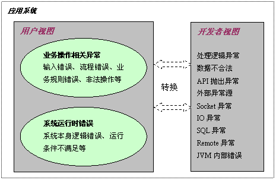
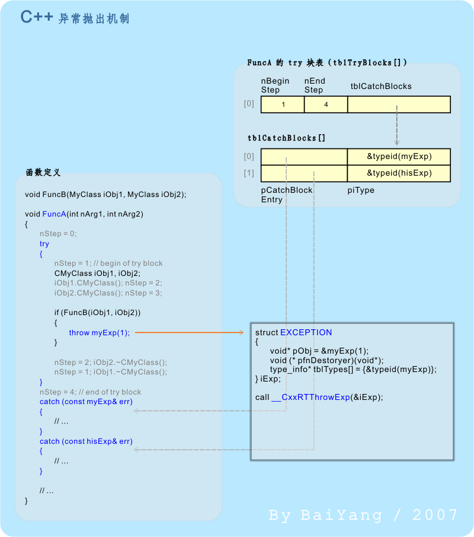
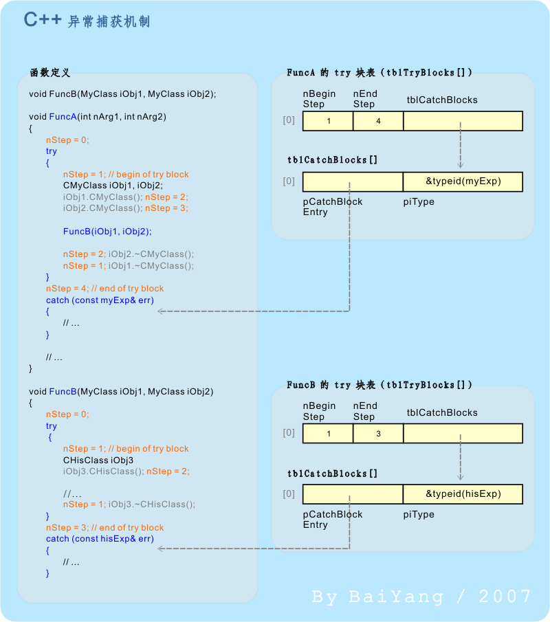
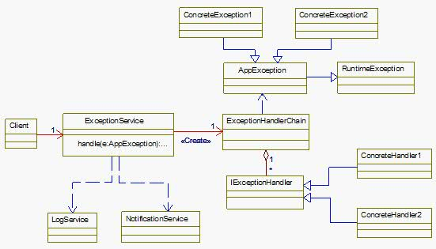
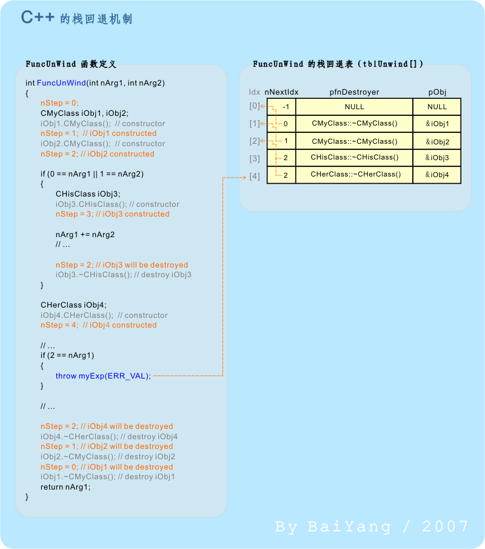

# 错误与异常处理

[TOC]

## 错误

### 定义

维基百科中关于`程序错误（bug）`的定义：指在软件运行中因为程序本身有错误而造成的功能不正常、死机、数据丢失、非正常中断等现象。有些程序错误会造成计算机安全隐患，此时叫做**漏洞**。

### 分类

错误按照恢复性可以分为：

- 可恢复性错误；
- 不可恢复性错误。

### 错误处理

`错误处理（error handling）`是通过处理函数的**返回值**的形式从而处理错误的一种编程方式。

## 异常

### 定义

百度百科中关于`异常（exception）`的定义：异常指的是在程序运行过程中发生的异常事件，通常是由外部问题（如硬件错误、输入错误）所导致的。

### 分类

按照异常发生的对象，将异常分为以下两类：

- 硬件异常：由 CPU 启动。 它们可能会导致执行某些指令序列，例如除以零或尝试访问无效的内存地址。
- 软件异常：由应用程序或操作系统显式启动。 例如，系统可以检测何时指定了无效的参数值。

在Java中，将异常分为以下两类：

- 非检查异常：如果一个异常是致命的且不可恢复并且对于捕获该异常的方法根本不知如何处理时，或者捕获这类异常无任何益处（比如：数据库连接错误，网络连接错误，文件错误等）。

- 检查异常：可以回避异常或预料内可以恢复并存在相应的处理方法的异常（比如：业务系统异常）。

### 异常抛出与捕获机制

  ### 异常处理

异常处理用于处理软件或信息系统中出现的异常状况（即超出程序正常执行流程的某些特殊条件）。

一般当程序发生异常时，通常异常处理可能需要做一些通用处理，如异常日志记录、异常通知，重定向到一个统一的错误页面（如 Web 应用）等。如果这些通用异常处理放置于 catch 块中，将导致大量的重复代码，从而可能引起日志冗余、同一异常的实现多样化等问题。另外，大量异常处理程序放置于 catch 块中造成程序的高耦合性。为了解决此类问题，有必要分离出异常处理程序、统一异常处理风格、降低耦合性、增强异常处理模块的复用程度。通常的异常处理模式包括：

- 业务委托模式（Business Delegate）；
- 前端控制器模式（Front Controller）；
- 拦截过滤器模式（Intercepting Filter）；
- AOP 模式；
- 模板方法模式。

*一般性异常处理框架*

## 错误/异常处理模型

### 终止模型

假设错误非常严重，已至你无法在回到错误发生的地方，也就是说，这段程序经过判断认为，他已经没有办法挽回，于是就抛出异常，希望这个异常不要在回来，这也是Java 当前所采用的模式。

在实际使用中，中止模型比较实用，使用的频率比较高。

### 继续模型

这种模型的主旨是恢复当前的运行环境，然后希望能够重新回到错误的发生地，并希望第二次的尝试能够获得成功，这种模型通常为操作系统所应用。

在实际使用中，继续模型使用的频率比较低。

## 错误与异常的区别

JDK中对于错误（Error）和异常（Exception）的定义：

- Error

  An `Error` is a subclass of `Throwable` that indicates serious problems that a reasonable application should not try to catch. Most such errors are abnormal conditions. The `ThreadDeath` error, though a "normal" condition, is also a subclass of `Error` because most applications should not try to catch it.

- Exception

  The class `Exception` and any subclasses that are not also subclasses of RuntimeException are *checked exceptions*. Checked exceptions need to be declared in a method or constructor's `throws` clause if they can be thrown by the execution of the method or constructor and propagate outside the method or constructor boundary.

错误与异常的区别总结：

1. 异常是运行期产生的，错误是运行期或编译期产生的。
2. 异常可以是`可被控制(checked) `或`不可控制的(unchecked) `，错误总是`不可控制的(unchecked) `。
3. 错误应该在系统层被捕获，异常应该在应用层被捕获。
4. 错误用于表示系统或低层资源错误，异常用于表示应用层的错误。

## 数据结构

### 栈

由于栈“后进先出”的结构特性，非常适用于错误/异常处理。通过`栈回退（stack unwind）`机制，可以方便地解决错误/异常嵌套问题。

`栈回退（stack unwind）`：是伴随异常处理机制引入 C++ 中的一个新概念，主要用来确保在异常被抛出、捕获并处理后，所有生命期已结束的对象都会被正确地析构，它们所占用的空间会被正确地回收。

## 第三方实现

### boost错误处理

boost.system提供了对于某个特定操作系统的返回值类型可以被转换成为跨平台的类型。

### Windows异常处理机制

Windows包含两种异常处理机制：

- Windows异常处理（VEH、SEH）；
- C++异常处理。

Windows异常处理机制支持嵌套异常的处理，即在执行异常处理回调函数时再次发生异常。这种情况下仍遵照普通异常处理机制，操作系统`RtlDispatchException`函数再入处理新出现的嵌套的异常。嵌套的异常的处理函数得到的`DispatcherContext`参数值即为在执行时发生了新异常的异常帧的地址。

## 参考

[1] [异常以及异常处理框架探析](https://www.cnblogs.com/qixin622/p/6654022.html)

[2] [JDK/Class Error](https://docs.oracle.com/javase/7/docs/api/java/lang/Error.html)

[3] [JDK/Class Exception](https://docs.oracle.com/javase/7/docs/api/java/lang/Exception.html)

[4] [维基百科-结构化异常处理](https://zh.wikipedia.org/wiki/%E7%BB%93%E6%9E%84%E5%8C%96%E5%BC%82%E5%B8%B8%E5%A4%84%E7%90%86)

[5] [维基百科-程序错误](https://zh.wikipedia.org/wiki/%E7%A8%8B%E5%BA%8F%E9%94%99%E8%AF%AF)

[6] [维基百科-异常处理](https://en.wikipedia.org/wiki/Exception_handling)

[7] [微软官网-C++ 中的异常和堆栈展开](https://learn.microsoft.com/zh-cn/cpp/cpp/exceptions-and-stack-unwinding-in-cpp?view=msvc-170)

[8] [C++异常机制的实现方式和开销分析](http://baiy.cn/doc/cpp/inside_exception.htm)

