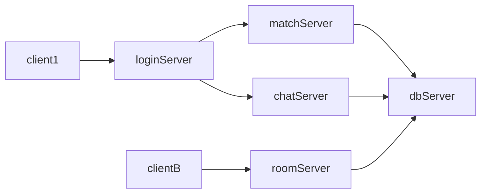
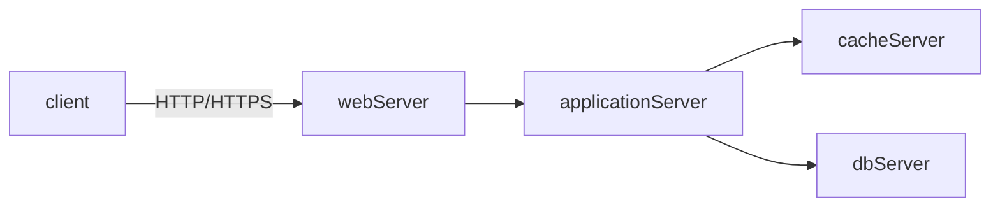
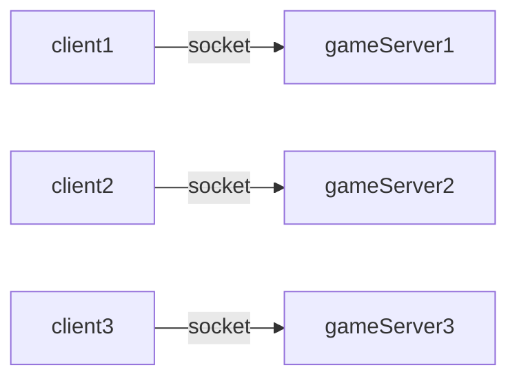
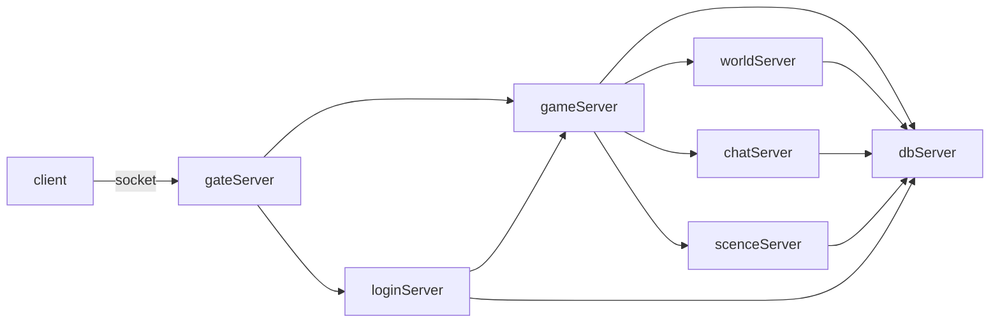

[TOC]

# 游戏服务器架构


## 总体架构图

### 房间类游戏



### 弱交互游戏



### 简单的分区分服游戏



### 数据共享游戏服务器




## 登录系统

### 认证与授权

- `认证(Authentication)` 用于鉴别访问者是否为合法用户；
- `授权(Authorisation)` 用于决定访问者有访问哪些资源的权限；

### 单点登录

单点登录（Single sign-on, SSO），当用户登录时，就可以获取所有系统的访问权限，不用对每个单一系统都逐一登录；

SSO有以下2种协议：

1. SAML 2.0
2. OAuth 2.0

#### SAML 2.0

SAML 2.0时序图如下：

```sequence
Title:SAML 2.0
Client->Resource Server/SP: 用户获取资源
Note right of Resource Server/SP: >>> 生成认证请求
Resource Server/SP->Authorization Server/IdP: 认证请求
Authorization Server/IdP-->Client: 通知客户端提供账号和密码用于认证
Client->Authorization Server/IdP: [user, passwd]
Note left of Authorization Server/IdP: 生成 SAML token <<<
Authorization Server/IdP-->Resource Server/SP: [SAML token]
Note right of Resource Server/SP: >>> 解析[SAML token]
```

- `Authorization Server/Identity Provider` (IdP)负责认证的服务
- `Resource Server/Service Provider` (SP)负责提供资源（API调用）的服务器

1. 尚未登录的客户端访问SP；
2. SP向IdP发送了一个SAML认证请求；
3. IdP验证SAML请求，验证成功，通知客户端提供账号和密码到IdP进行登录；
4. 用户提供账号和密码进行登录；
5. 登录成功，IdP根据用户名和密码生成SAML token；
6. IdP将SAML token发送给SP；
7. SP解析SAML token，得到账号，密码，权限...等信息。

#### OAuth 2.0

OAuth（开放授权）是一个开放标准，允许用户授权第三方移动应用访问他们存储在另外的服务提供者上的信息，而不需要将用户名和密码提供给第三方移动应用或分享他们数据的所有内容，OAuth2.0是OAuth协议的延续版本，但不向后兼容OAuth 1.0即完全废止了OAuth1.0。

OAuth 2.0的认证流程如下：

```sequence
Title:SAML 2.0
Client->Resource Server/SP: Authorization Request
Resource Server/SP-->Client: Authorization Grant

Client->Authorization Server/IdP: Authorization Grant
Note left of Authorization Server/IdP: Generated Access Token <<<
Authorization Server/IdP-->Client: Access Token

Client->Resource Server/SP: Access Token
Resource Server/SP-->Client: Protected Resource
```

- `Authorization Server/Identity Provider` (IdP)负责授权的服务
- `Resource Server/Service Provider` (SP)负责提供资源（API调用）的服务器

1. Client访问SP；
2. SP引导Client重定向到IdP；
3. Client同意给与SP授权；
4. IdP生成一个Access Token，并返回给Client；
5. Client使用Access Token访问资源；
6. SP返回资源。


## 参考

- [云风-LoginServer](https://github.com/cloudwu/skynet/wiki/LoginServer)
- [云风-MsgServer](https://github.com/cloudwu/skynet/wiki/MsgServer)
- [游戏服务器架构设计](https://www.cnblogs.com/panchanggui/p/9841768.html)
- [游戏服务器的常用架构](https://blog.csdn.net/u011308294/article/details/78627540)
- [不要用JWT替代session管理（上）：全面了解Token,JWT,OAuth,SAML,SSO](https://zhuanlan.zhihu.com/p/38942172)
- [Oauth2详解-介绍(一)](https://www.jianshu.com/p/84a4b4a1e833)
- [理解OAuth2](https://zhuanlan.zhihu.com/p/84670338)

