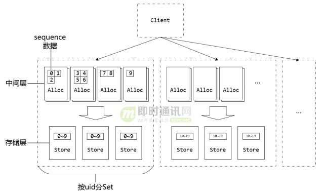

[TOC]

# IM-ID的生成


生成有效的消息ID，避免消息ID碰撞是一道难题（网络延迟，调试出错等等都可能导致消息ID碰撞）；要解决这个问题，思路有以下几种：
1. 优先保证消息ID一致性
2. 优先保证消息ID时序性（微信的思路）


## 1 腾讯seqsvr

seqsvr是微信的一个高可用，高可靠的消息序列号生成器；用于为微信消息提供递增的消息序列号(sequence)；

### sequence

sequence是一个递增的64bit整型变量；由于全局唯一的sequence会有非常严重的申请互斥问题，所以微信给每个用户一个独立的64位sequence体系。

### 预分配中间层

通过增加一个预分配sequence的中间层，在保证sequence不回退的前提下，大幅地提升了分配sequence的性能。

例：

一张存放用户sequence的表格结构如下：

| 用户    | 小明 | 小红 | ...  |
| ------- | ---- | ---- | ---- |
| cur_seq | 100  | 200  | ...  |
| max_seq | 200  | 200  | ...  |

小明和小红各自申请一个sequence之后的表格结构如下：

| 用户    | 小明 | 小红 | ...  |
| ------- | ---- | ---- | ---- |
| cur_seq | 101  | 201  | ...  |
| max_seq | 200  | 300  | ...  |

- 这里的步长为100，微信实际应用中的步长为10000

### 分号段共享存储

微信的uid上限为$2^{32}$个，每个用户占用8byte的sequence空间，一共$2^{32} \times 8 = 34 359 738 368$​​约32GB的空间才能放得下所有的sequence；问题在于：重启时需要读取约32GB的`max_seq`数据加载到内存，时间花费太大。

通过引入号段来解决这个问题：相邻的一段用户属于一个号段，同个号段内的用户共享一个`max_seq`。

例：

改良后的存放用户sequence的表格结构如下：


小明，小红，小白每个人申请一个sequence的时候，小白突破了`max_seq`，导致`max_seq`升级；

### seqsvr总架构




## 2 美团Leaf-segment

利用数据库写入时自增ID特性，是一种常用的生成全局唯一ID的方法；

Leaf-segment对数据库自增ID方案进行了改进，主要做了以下改变：

1. 原方案每次获取ID都需要读写一次数据库，导致数据库压力太大；修改为利用`proxy server`批量获取，用完之后再去拿；
2. 对于不同业务的ID，利用`biz_tag`字段来区分，以后需要对数据库扩容时，利用`biz_tag`分表分库；
3. 当一个号段快用完的时候，提前生成好下一个号段。

### 数据库表设计

```txt
+-------------+--------------+------+-----+-------------------+-----------------------------+
| Field       | Type         | Null | Key | Default           | Extra                       |
+-------------+--------------+------+-----+-------------------+-----------------------------+
| biz_tag     | varchar(128) | NO   | PRI |                   |                             |
| max_id      | bigint(20)   | NO   |     | 1                 |                             |
| step        | int(11)      | NO   |     | NULL              |                             |
| desc        | varchar(256) | YES  |     | NULL              |                             |
| update_time | timestamp    | NO   |     | CURRENT_TIMESTAMP | on update CURRENT_TIMESTAMP |
+-------------+--------------+------+-----+-------------------+-----------------------------+
```

- `biz_tag` 业务区分；
- `max_id` 该biz_tag目前被分配的ID号段的最大值；
- `step` 每次分配的号段长度。


## 3 美团Leaf-snowflake

美团Leaf-snowflake是对twitter-snowflake的一种改进，沿用了twitter-snowflake的位图设计，并做了以下修改：

- 机器ID的配置方式由手动改为ZooKeeper
  
  
  1. 启动Leaf-snowflake服务，连接Zookeeper，在leaf_forever父节点下检查自己是否已经注册过（是否有该顺序子节点）；
  2. 如果有注册过直接取回自己的workerID（zk顺序节点生成的int类型ID号），启动服务；
  3. 如果没有注册过，就在该父节点下面创建一个持久顺序节点，创建成功后取回顺序号当作自己的workerID号，启动服务。
  
- 解决“时钟回拨问题”

  


## 4 融云方案

融云的ID结构：

| 时间戳（ms） | 自增ID | 会话类型 | 会话ID |
| ------------ | ------ | -------- | ------ |
| 42bit        | 12bit  | 4bit     | 22bit  |


## 参考

- [IM消息ID技术专题(一)：微信的海量IM聊天消息序列号生成实践（算法原理篇）](http://www.52im.net/forum.php?mod=viewthread&tid=1998&highlight=ID)
- [IM消息ID技术专题(二)：微信的海量IM聊天消息序列号生成实践（容灾方案篇）](http://www.52im.net/thread-1999-1-1.html)
- [IM消息ID技术专题(三)：解密融云IM产品的聊天消息ID生成策略](http://www.52im.net/thread-2747-1-1.html)
- [IM消息ID技术专题(四)：深度解密美团的分布式ID生成算法](http://www.52im.net/thread-2751-1-1.html)
- [IM消息ID技术专题(五)：开源分布式ID生成器UidGenerator的技术实现](http://www.52im.net/thread-2953-1-1.html)

