# Project Management

[TOC]

**Good management cannot guarantee project success. However, bad management usually results in project failure.**

For most projects, important goals are:

1. Deliver the software to the customer at the agreed time.
2. Keep overall costs within budget.
3. Deliver software that meets the customer's expectations.
4. Maintain a happy and well-functioning development team.

Most managers take responsibility at some stage for some or all of the following activities:

1. Project planning.
2. Reporting.
3. Risk management.
4. People management.
5. Proposal writing.

## Project Planning

Project planning takes place at three stages in a project life cycle:

1. At the proposal stage.
2. During the project startup phase.
3. Periodically throughout the project.

There are three main parameters that you should use when computing the costs of a software development project:

- effort costs (the costs of paying software engineers and managers);
- hardware and software costs, including maintenance;
- travel and training costs.

### Software Pricing

Factors affecting software pricing:

| Factor                    | Description                                                  |
| ------------------------- | ------------------------------------------------------------ |
| Market opportunity        | A development organization may quote a low price because it wishes to move into a new segment of the software market. |
| Cost estimate uncertainty |                                                              |
| Contractual terms         |                                                              |
| Requirements volatility   |                                                              |
| Financial health          |                                                              |

### Project plans

Although the specific details of project plans vary depending on the type of project and organization, plans normally include the following sections:

1. Introduction.
2. Project organization.
3. Risk analysis.
4. Hardware and software resource requirements.
5. Work breakdown.
6. Project schedule.
7. Monitoring and reporting mechanisms.

Project plan supplements:

| Plan                          | Description |
| ----------------------------- | ----------- |
| Quality plan                  |             |
| Validation plan               |             |
| Configuration management plan |             |
| Maintenance plan              |             |
| Staff development plan        |             |

The project planning process:

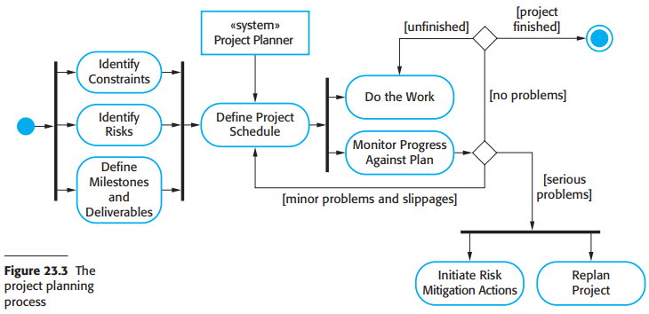

The project scheduling process:

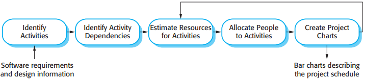

There are two types of representation that are commonly used:

1. Bar charts.
2. Activity networks.

### Agile planning

The most commonly used agile approaches, such as Scrum (Schwaber, 2004) and extreme programming (Beck, 2000) have a two-stage approach to planning, corresponding to the startup phase in plan-driven development and development planning:

1. Release planning, which looks ahead for several months and decides on the features that should be included in a release of a system.
2. Iteration planning, which has a shorter-term outlook and focuses on planning the next increment of a system.

Planning in XP:

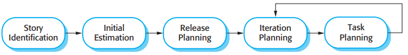

### Estimation techniques

Organizations need to make software efforts and cost estimates. There are two types of techniques that can be used to do this:

1. `Experience-based techniques.` The estimate of future effort requirements is based on the manager's experience of past projects and the application domain. Essentially, the manager makes an informed judgment of what the effort requirements are likely to be.
2. `Algorithmic cost modeling.` In this approach, a formulaic approach is used to compute the project effort based on estimates of product attributes, such as size, and process characteristics, such as the experience of staff involved.

Estimate uncertainty:

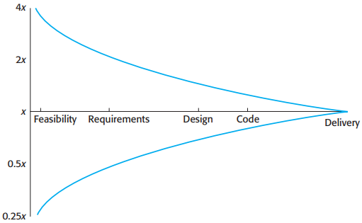

### Algorithmic cost modeling

Algorithmic models for estimating effort in a software project are mostly based on a simple formula:
$$
Effort = A \times Size^{B} \times M
$$

- $A$ is a constant factor that depends on local organizational practices and the type of software that is developed.
- $Size$ may be either an assessment of the code size of the software or a functionality estimate expressed in function or application points.
- The value of exponent $B$ usually lies between 1 and 1.5.
- $M$ is a multiplier made by combining process, product, and development attributes, such as the dependability requirements for the software and the experience of the development team.

### The COCOMO II model

*COCOMO estimation models*

The submodels that are part of the COCOMO II model are:

1. An application-composition model

   

   *Application-point productivity*

   The final formula for effort computation for system prototypes is: $PM = (NAP \times (1 - \%reuse/100))/PROD$

   - $PM$ is the effort estimate in person-months.
   - $NAP$ is the total number of application points in the delivered system.
   - $\text{"\%reuse"}$ is an estimate of the amount of reused code in the development.
   - $PROD$ is the application-point productivity.

2. An early design model

   The estimates produced at this stage are based on the standard formula for algorithmic models, namely:$Effor = A \times Size^{B} \times M$

   The multiplier $M$ is based on seven project and process attributes tht increase or decrease the estimate. Where: $M = PERS \times RCPX \times RUSE \times RDIF \times PREX \times FCIL \times SCED$

   - RCPX: complexity.
   - RUSE: reuse required.
   - PDIF: platform difficulty.
   - PERS: personnel capability.
   - PREX: personnel experience.
   - SCED: schedule.
   - FCIL: support facilities.

3. A reuse model

   The COCOMO II reuse model includes a formula to estimate the effort rquired to integrate this generated code:

   $PM_{Audio} = (ASLOC \times (AT/100)) / ATPROD // \text{Estimate for generated code}$

   - $ASLOC$ is the total number of lines of reused code, including code that is automatically generated. 
   - $AT$ is the percentage of reused code that is automatically generated.
   - $ATPROD$ is the productivity of engineers in integrating such code.

   The following formula is used to calculate the number of equivalent lines of soruce code: $ESLOC = ASLOC \times AAM$

   - $ESLOC$ is the equivalent number of liens of new source code.
   - $ASLOC$ is the number of lines of code in the components that have to be changed.
   - $AAM$ is an Adaptation Adjustment Multiplier, as discussed below.

   If some code adaptation can be done automatically, this reduces the effort rquired. You therefore adjust the estimate by estimating the percentage of auto matically adapted code ($AT$) and using this to adjust $ASLOC$. Therefore, the final formula is: $ESLOC = ASLOC \times (1 - AT/100) \times AAM$.

4. A post-architecture model

   

   *Scale factors used in the exponent computation in the post-architecture model*

### Project duration and staffing

The COCOMO model includes a formula to estimate the calendar time required to complete a project:
$$
TDEV = 3 \times (PM)^{(0.33 + 0.2 \times (B - 1.01))}
$$

- $TDEV$ is the nominal schedule for the project, in calendar months, ignoring any multiplier that is related to the project scheduel.
- $PM$ is the effort computed by the COCOMO model.
- $B$ is the complexity-related exponent.

---

## Risk management

Three related categories of risk:

1. Project risks.
2. Product risks.
3. Business risks.

Examples of common project, product, and business risks:

| Risk                       | Affects             | Description                                                  |
| -------------------------- | ------------------- | ------------------------------------------------------------ |
| Staff turnover             | Project             | Experienced staff will leave the project before it is finished. |
| Management change          | Project             | There will be a change of organizational management with different priorities. |
| Hardware unavailability    | Project             | Hardware that is essential for the project will not be delivered on schedule. |
| Requirements change        | Project and product | There will be a larger number of changes to the requirements than anticipated. |
| Specification delays       | Project and product | Specifications of essential interfaces are not available on schedule. |
| Size underestimate         | Project and product | The size of the system has been underestimated.              |
| CASE tool underperformance | Product             | CASE tools, which support the project, do not perform as anticipated. |
| Technology change          | Business            | The underlying technology on which the system is built is superseded by new technology. |
| Product competition        | Business            | A competitive product is marketed before the system is completed. |

An outline of the process of risk management is illustrated in Figure 22.2. It involves several stages:

1. `Risk identification:` You should identify possible project, product, and business risks.
2. `Risk analysis:` You should assess the likelihood and consequences of these risks.
3. `Risk planning:` You should make plans to address the risk, either by avoiding it or minimizing its effects on the project.
4. `Risk monitoring:` You should regularly assess the risk and your plans for risk mitigation and revise these when you learn more about the risk.

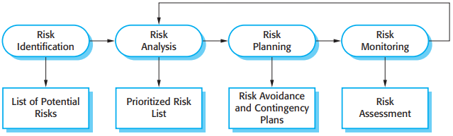

*The risk management process*

There are at least six types of risk that may be included in a risk checklist:

1. `Technology risks` Risks that derive from the software or hardware technologies that are used to develop the system.
2. `People risks` Risks that are associated with the people in the development team.
3. `Organizational risks` Risks that derive from the organizational environment where the software is being developed.
4. `Tools risks` Risks that derive from the software tools and other support software used to develop the system.
5. `Requirements risks` Risks that derive from changes to the customer requirements and the process of managing the requirements change.
6. `Estimation risks` Risks that derive from the management estimates of the resources required to build the system.

### Risk Analysis

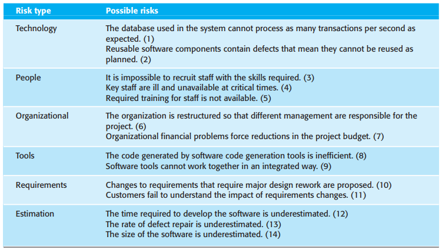

*Examples of different types of risks*

### Risk Planning

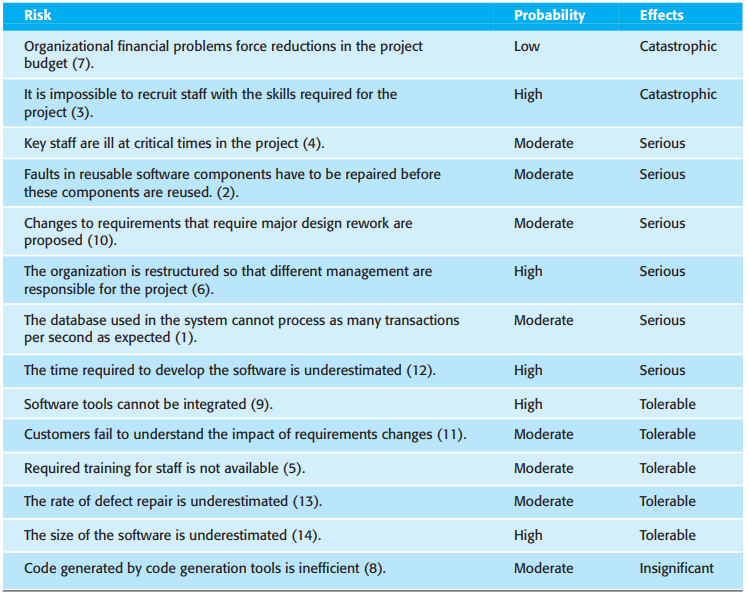

*Risk types and examples*

### Risk planning

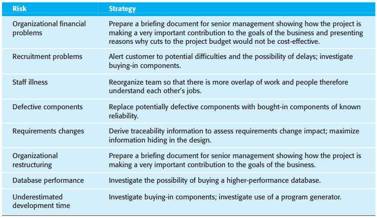

*Strategies to help manage risk*

### Risk monitoring

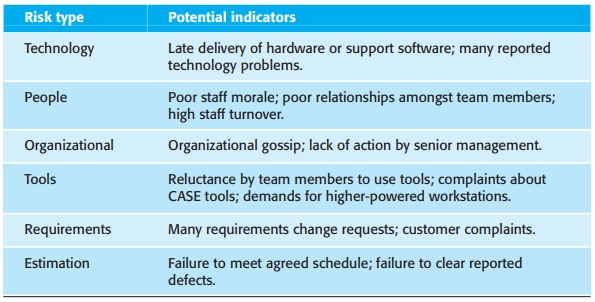

*Risk indicators*

---

## Managing people

There are four critical factors in people management:

1. Consistency.
2. Respect.
3. Inclusion.
4. Honesty.

### Motivating people

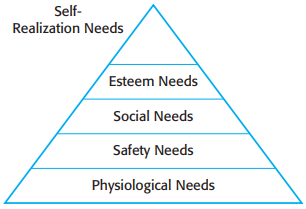

*Human needs hierarchy*

Bass and Dunteman (1963) classify professionals into three types:

1. Task-oriented people.
2. Self-oriented people.
3. Interaction-oriented people.

---

## Teamwork

The benefits of creating a cohesive group are:

1. The group can establish its own quality standards.
2. Individuals learn from and support each other.
3. Knowledge is shared.
4. Refactoring and continual improvement is encouraged.

There are three generic factors that affect team working:

1. The people in the group.
2. The group organization.
3. Technical and managerial communications.

### Group communications

The effectiveness and efficiency of communications is influenced by:

1. Group size.
2. Group structure.
3. Group composition.
4. The physical work environment.
5. The available communication channels.

---

## Version management

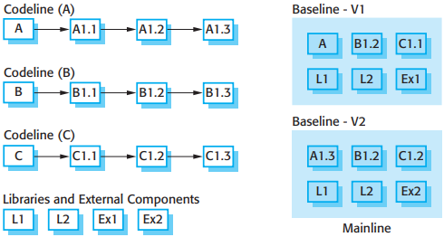

*Codelines and baselines*

Version management systems normally provide a range of features:

1. Version and release identification.
2. Storage management.
3. Change history recording.
4. Independent development.
5. Project support.

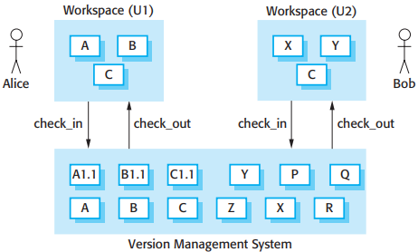

*Check-in and check-out from a version repository*

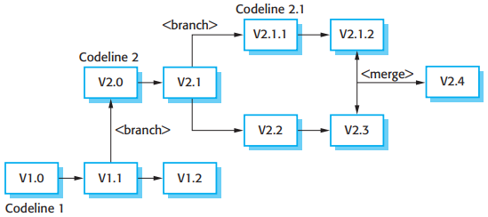

*Branching and merging*

---

## REFERENCE

[1] Ian Sommerville. SOFTWARE ENGINEERING . 9th Edition