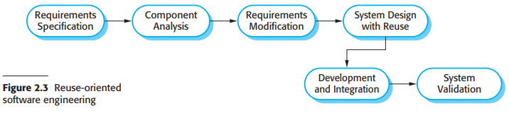

# Software Engineering — Concise Notes

[TOC]

This document summarizes core concepts in software engineering, consolidating content from the provided NOTES. It is organized to give a practical overview: requirements, process models, design and implementation activities, validation and testing, risk-driven approaches, and agile practices. Where helpful, diagrams referenced from the repository are retained.

## 1. Requirements Engineering

Requirements capture what the system should do and the constraints it must satisfy. Requirements are commonly classified into:

- Functional requirements: the services the system offers, behavior in response to inputs, and required outputs. They may also state explicitly what the system should not do.
- Non-functional requirements (quality attributes): constraints on how those services are delivered — performance, reliability, security, usability, maintainability, and standards compliance.

Non-functional requirements are often critical to system success; they should be documented, measurable, and testable. See diagram: 

### The Software Requirements Document (SRD)

An SRD typically organizes requirements by feature and includes acceptance criteria, priorities, and traceability back to stakeholders. Typical SRD elements:

- Introduction and scope
- Stakeholder and user descriptions
- Functional requirements (grouped by feature)
- Non-functional requirements (performance, security, availability)
- Use cases and user scenarios
- Glossary and references

Good requirements are clear, consistent, complete, and verifiable. Requirements validation (reviews, prototypes, acceptance tests) reduces costly rework later.

---

## 2. Software Process Models

Software process models describe how development activities are organized. The right model depends on project size, risk, stakeholder involvement, and domain.

### 2.1 Waterfall model

The waterfall model sequences activities into distinct phases: requirements, system/software design, implementation, integration and testing, and operation/maintenance. It is easy to understand and manage for projects with stable and well-understood requirements, but it is inflexible when requirements change.

Diagram: 

Pros:
- Clear milestones and deliverables
- Simple project control and documentation

Cons:
- Poor adaptability to change
- Late delivery of working software

### 2.2 Incremental development

In incremental development, the system is delivered in a series of releases (increments). Each increment adds functionality and is validated with stakeholders.

Benefits:
- Lower initial delivery time; customers get working features earlier
- Easier to incorporate changes between increments
- Improved feedback loop with users

Risks:
- Architectural decay if increments are not well coordinated
- Reduced process visibility if work is not well tracked

Diagram: 

### 2.3 Reuse-oriented development

This approach focuses on assembling systems from existing components or COTS products. Key activities include component analysis, requirements adaptation, system design with reuse, and integration.

Diagram: 

Advantages:
- Faster delivery and potentially lower cost
- Leverage proven functionality

Challenges:
- Component mismatch and need to adapt requirements
- Integration and licensing issues

### 2.4 Risk-driven (Spiral) model

The spiral model (Boehm) centers development around iterative risk analysis and reduction. Each loop includes objective setting, risk analysis, development/validation, and planning.

Diagram: 

Use the spiral model when the project has high technical, managerial, or market risk and when incremental prototyping and risk mitigation are essential.

---

## 3. Core Process Activities

Software engineering splits broadly into three interleaved activities: specification, development (design and implementation), and validation.

### 3.1 Specification (Requirements engineering)

Main tasks:

1. Feasibility study — evaluate whether the system is achievable and cost-effective given current technology and budget constraints.
2. Requirements elicitation and analysis — gather needs via interviews, workshops, observation, and document analysis.
3. Requirements specification — write the SRD with structured, testable requirements.
4. Requirements validation — ensure requirements are realistic, consistent, and complete (reviews, prototypes, acceptance criteria).

Diagram: 

### 3.2 Design and Implementation

Design decomposes the system into architecture, components, and interfaces. Typical activities:

- Architectural design — identify major components, their responsibilities, communication patterns, and deployment topology.
- Interface design — define clean, versioned interfaces (APIs, data schemas, protocol contracts).
- Component design — detail algorithms, data structures, and internal interfaces of each component.
- Database design — model persistent data and map it to a DBMS schema, with attention to integrity constraints and performance.

Diagram: 

Good design practices:

- Keep components small and cohesive
- Define clear separation of concerns and abstraction boundaries
- Use proven architectural patterns and document key design decisions

### 3.3 Validation and Testing

Testing strategies should be planned early and aligned with requirements. Typical test levels:

1. Development/unit testing — low-level module tests, ideally automated
2. Integration testing — verify interactions between components and subsystems
3. System testing — validate the integrated system against requirements
4. Acceptance testing — stakeholder validation before release

Diagrams:  and 

Good testing practices:

- Automate unit and integration tests where possible
- Use CI pipelines to run tests on every change
- Maintain test data and environments reproducibly

---

## 4. Agile Software Development

Agile methods prioritize working software, customer collaboration, and responsiveness to change. Key characteristics:

1. Specification, design, and implementation are interleaved.
2. The system evolves through frequent increments/iterations.
3. Strong customer involvement and continuous feedback.

### Agile principles (summary)

| Principle | Summary |
|---|---|
| Customer involvement | Customers continuously provide requirements and feedback. |
| Incremental delivery | Deliver working increments frequently. |
| People over process | Empower teams to choose working practices. |
| Embrace change | Accept requirement changes and adapt. |
| Simplicity | Keep design and process simple; eliminate unnecessary complexity. |

Diagram comparing plan-driven and agile specification: 

When to prefer agile:

- Requirements are evolving or uncertain
- Early user feedback is critical
- Teams are empowered and co-located (or have strong communication channels)

When to prefer plan-driven approaches:

- Safety-critical, highly regulated domains where documentation and traceability are required
- Large, distributed teams requiring formal coordination

Hybrid approaches often combine agile practices for development with plan-driven governance and documentation for compliance.

---

## 5. Practical Advice & Patterns

- Prioritize requirements with stakeholders and keep acceptance criteria explicit.
- Invest in automated testing and continuous integration early.
- Keep architecture resilient to change: design for modularity and loose coupling.
- Monitor non-functional requirements (SLA metrics) and treat them as first-class requirements.
- Reuse components when it reduces risk and cost, but validate integration and licensing implications.

## References

- Ian Sommerville, SOFTWARE ENGINEERING, 9th Edition — source material for these notes.