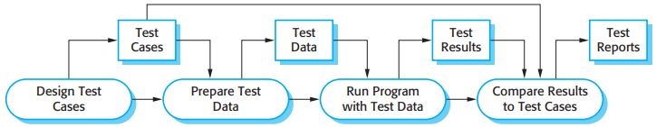
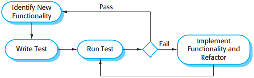
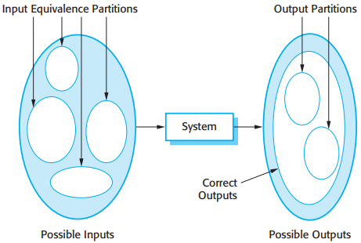

[中文版](software_test_zh.md) | English

# Software Test

[TOC]

*A model of the software testing process*

## Goal

The testing process has two distinct goals:

1. To demonstrate to the developer and the customer that the software meets its requirements.
2. To discover situations in which the behavior of the software is incorrect, undesirable, or does not conform to its specification.

## Stage

Typically, a commercial software system has to go through three stages of testing:

1. Development testing, where the system is tested during development to discover bugs and defects.
2. Release testing, where a separate testing team tests a complete version of the system before it is released to users.
3. User testing, where users or potential users of a system test the system in their own environment.

### Development testing

*Test-driven development*

As well as better problem understanding, other benefits of test-driven development are:

1. `Code coverage.` In principle, every code segment that you write should have at least one associated test.
2. `Regression testing:` A test suite is developed incrementally as a program is developed.
3. `Simplified debugging.` When a test fails, it should be obvious where the problem lies.
4. `System documentation.` The tests themselves act as a form of documentation that describes what the code should be doing.

During development, testing may be carried out at three levels of granularity:

1. Unit testing, where individual program units or object classes are tested.

   When you are testing object classes, you should design your tests to provide coverage of all of the features of the object. This means that you should:

   - test all operations associated with the object;
   - set and check the value of all attributes associated with the object;
   - put the object into all possible states. This means that you should simulate all events that cause a state change.

   An automated test has three parts:

   - A setup part, where you initialize the system with the test case, namely the inputs and expected outputs.
   - A call part, where you call the object or method to be tested.
   - An assertion part where you compare the result of the call with the expected result.

2. Component testing, where several individual units are integrated to create composite components.

   There are different types of interfaces between program components and, consequently, different types of interface errors that can occur:

   - `Parameter interfaces` These are interfaces in which data or sometimes function references are passed from one component to another.
   - `Shared memory interfaces` These are interfaces in which a block of memory is shared between components.
   - `Procedural interfaces` These are interfaces in which one component encapsulates a set of procedures that can be call ed by other components.
   - `Message passing interfaces` These are interfaces in which one component requests a service from another component by passing a message to it.

3. System testing, where some or all of the components in a system are integrated and the system is tested as a whole.

### Release testing

There are two important distinctions between release testing and system testing during the development process:

1. A separate team that has not been involved in the system development should be responsible for release testing.
2. System testing by the development team should focus on discovering bugs in the system (defect testing). The objective of release testing is to check that the system meets its requirements and is good enough for external use (validation testing).

### User testing

In practice, there are three different types of user testing:

1. Alpha testing, where users of the software work with the development team to test the software at the developer's site.
2. Beta testing, where a release of the software is made available to users to allow them to experiment and to raise problems that they discover with the system developers.
3. Acceptance testing, where customers test a system to decide whether or not it is ready to be accepted from the system developers and deployed in the customer environment.

## Choosing unit test cases

Testing is expensive and time-consuming, so it is important that you choose effective unit test cases. Effectiveness, in this case, means two things:

1. The test cases should show that, when used as expected, the component that you are testing does what it is supposed to do.
2. If there are defects in the component, these should be revealed by test cases.

*Equivalence partitioning*

Two possible strategies here that can be effective in helping you choose test cases. There are:

1. Partition testing, where you identify groups of inputs that have common characteristics and should be processed in the same way.
2. Guideline-based testing, where you use testing guidelines to choose test cases.

## REFERENCE

[1] Ian Sommerville. SOFTWARE ENGINEERING . 9th Edition
