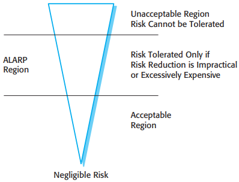
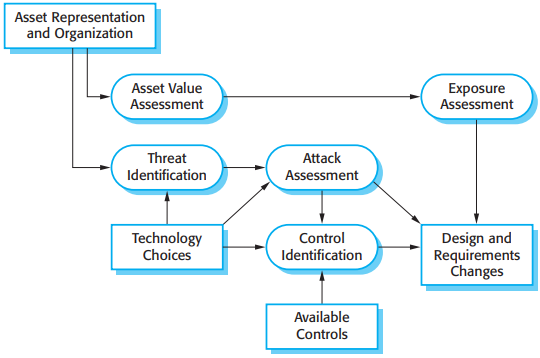
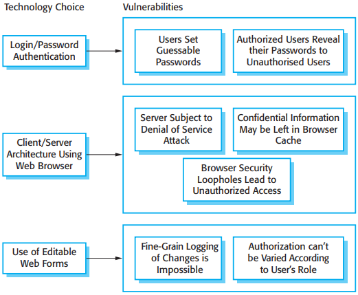
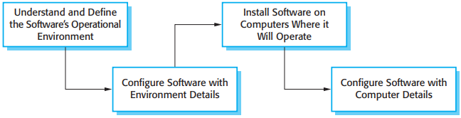

# System Dependability

[TOC]

There are some principal dimensions to dependability:

1. Availability.
2. Reliability.
3. Safety.
4. Security.
5. Repairability.
6. Maintainability.
7. Survivability.
8. Error tolerance.

To develop dependable software, you therefore need to ensure that:

1. You avoid the introduction of accidental errors into the system during software specification and development.
2. You design verification and validation processes that are effective in discovering residual errors that affect the dependability of the system.
3. You design protection mechanisms that guard against external attacks that can compromise the availability or security of the system.
4. You configure the deployed system and its supporting software correctly for its operating environment.

*Principal dependability properties*

## Availability

System **availability** may be defined more precisely as: The probability that a system, at a point in time, will be operational and able to deliver the requested services.

System faults do not always result in system errors and system errors do not necessarily result in system failures. The reasons for this are as follows:

1. Not all code in a program is executed.
2. Errors are transient.
3. The system may include fault detection and protection mechanisms.

## Reliability

System **reliability** may be defined more precisely as: The probability of failure-free operation over a specified time, in a given environment, for a specific purpose.

Identify three complementary approaches that are used to improve the reliability of a system:

1. Fault avoidance.
2. Fault detection and removal.
3. Fault tolerance.

### Reliability specification

Reliability requirements are, therefore, of two kinds:

1. Non-functional requirements, which define the number of failures that are acceptable during normal use of the system, or the time in which the system is unavailable for use. These are quantitative reliability requirements.
2. Functional requirements, which define system and software functions that avoid, detect, or tolerate faults in the software and so ensure that these faults do not lead to system failure.

### Reliability metrics

The choice of metric depends on the type of system that is being specified and the requirements of the application domain. The metrics are:

1. `Probability of failure on demand (POFOD)` If you use this metric, you define the probability that a demand for service from a system will result in a system failure.
2. `Rate of occurrence of failures (ROCOF)` This metric sets out the probable number of system failures that are likely to be observed relative to a certain time period (e.g., an hour), or to the number of system executions.
3. `Availability (AVAIL)` The availability of a system reflects its ability to deliver services when requested.

### Non-functional reliability requirements

There are several advantages in deriving quantitative reliability specifications:

1. The process of deciding what required level of the reliability helps to clarify what stakeholders really need. It helps stakeholders understand that there are different types of system failure, and it makes clear to them that high levels of reliability are very expensive to achieve.
2. It provides a basis for assessing when to stop testing a system. You stop when the system has achieved its required reliability level.
3. It is a means of assessing different design strategies intended to improve the reliability of a system. You can make a judgment about how each strategy might lead to the required levels of reliability.
4. If a regulator has to approve a system before it goes into service (e.g., all systems that are critical to flight safety on an aircraft are regulated), then evidence that a required reliability target has been met is important for system certification.

### Functional reliability specification

There are three types of functional reliability requirements for a system:

1. Checking requirements
2. Recovery requirements
3. Redundancy requirements

### Reliability testing

*Reliability measurement*

This conceptually attractive approach to reliability measurement is not easy to apply in practice. The principal difficulties that arise are:

1. Operational profile uncertainty.
2. High costs of test data generation.
3. Statistical uncertainty when high reliability is specified. 
4. Recognizing failure.

## Safety

Safety-critical software falls into two classes:

1. Primary safety-critical software.
2. Secondary safety-critical software.

The key to assuring safety is to ensure either that accidents do not occur or that the consequences of an accident are minimal. This can be achieved in three complementary ways:

1. `hazard avoidance` The system is designed so that hazards are avoided.
2. `hazard detection and removal` The system is designed so that hazards are detected and removed before they result in an accident.
3. `Damage limitation` The system may include protection features that minimize the damage that may result from an accident.

### Safety specification

#### Hazard assessment

*The risk triangle*

There are three risk categories that you can use in hazard assessment:

1. Intolerable risks in safety-critical systems are those that threaten human life.
2. As low as reasonably practicable (ALARP) risks are those that have less serious consequences or that are serious but have a very low probability of occurrence.
3. Acceptable risks are those where the associated accidents normally result in minor damage.

#### Hazard analysis

### Risk reduction

1. Once potential risks and their root cause have been identified, you are then able to derive safety requirements that manage the risks and ensure that incidents or accidents do not occur. There are three possible strategies that you can use:

   1. `Hazard avoidance:` The system is designed so that the hazard cannot occur.
   2. `Hazard detection and removal:` The system is designed so that hazards are detected and neutralized before they result in an accident.
   3. `Damage limitation:` The system is designed so that the consequences of an accident are minimized.

### Structured safety arguments

*Informal safety argument based on demonstrating contradictions*

## Security

In any networked system, there are three main types of security threats:

1. Threats to the confidentiality of the system and its data.
2. Threats to the integrity of the system and its data.
3. Threats to the availability of the system and its data.

The controls that you might put in place to enhance system security are comparable to those for reliability and safety:

1. Vulnerability avoidance.
2. Attack detection and neutralization.
3. Exposure limitation and recovery.

### Security risk management

Risk assessment stage:

1. Preliminary risk assessment.
2. Life-cycle risk assessment.
3. Operational risk assessment.

### Life-cycle risk assessment

*Life-cycle risk analysis*

*Vulnerabilities associated with technology choices*

### Design for security

#### Architectural design

In designing a system architecture that maintains security, you need to consider two fundamental issues:

1. Protection--how should the system be organized so that critical assets can be protected against external attack?
2. Distribution--how should system assets be distributed so that the effects of a successful attack are minimized?

*A layered protection architecture*

#### Design guidelines

Design guidelines for secure systems engineering:

1. Base security decisions on an explicit security policy.
2. Avoid a single point of failure.
3. Fail securely.
4. Balance security and usability.
5. Log user actions.
6. Use redundancy and diversity to reduce risk.
7. Validate all inputs.
8. Compartmentalize your assets.
9. Design for deployment.
10. Design for recoverability.

#### Design for deployment

*Software deployment*

Four ways to incorporate deployment support in a system:

1. Include support for viewing and analyzing configurations.
2. Minimize default privileges.
3. Localize configuration settings.
4. Provide easy ways to fix security vulnerabilities.

### Security testing

Fundamentally, there are two reasons why security testing is so difficult:

1. Security requirements, like some safety requirements, are `shall not` requirements.
2. The people attacking a system are intelligent and are actively looking for vulnerabilities that they can exploit.

## Dependable Programming

There are some good practice guidelines for dependable programming:

1. Limit the visibility of information in a program.
2. Check all inputs for validity.
3. Provide a handler for all exceptions.
4. Minimize the use of error-prone constructs.
5. Provide restart capabilities.
6. Check array bounds.
7. Include timeouts when calling external components.
8. Name all constants that represent real-world values.

## REFERENCE

[1] Ian Sommerville. SOFTWARE ENGINEERING . 9th Edition
