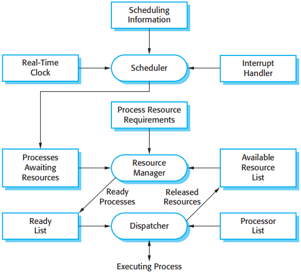
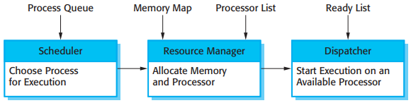

# System Design

[TOC]

## Modeling

### Behavioral Models

Behavioral models are models of the dynamic behavior of the system as it is executing. They show what happens or what is supposed to happen when a system responds to a stimulus from its environment. You can think of these stimuli as being of two types:

1. `Data` Some data arrives that has to be processed by the system.
2. `Events` Some event happens that triggers system processing. Events may have associated data but this is not always the case.

### Model-driven Architecture

The MDA(model-driven architecture) method recommends that three types of abstract system models should be produced:

1. A computation-independent model (CIM) that models the important domain abstractions used in the system.
2. A platform-independent model (PIM) that models the operation of the system without reference to its implementation.
3. Platform-specific models (PSM) which are transformations of the platform-independent model, with a separate PSM for each application platform.

*Multiple platform-specific models*

### Executable UML

To create an executable sub-set of UML, the number of model types has therefore been dramatically reduced to three key model types:

1. Domain models identify the principal concerns in the system. These are defined using UML class diagrams that include objects, attributes, and associations.
2. Class models, in which classes are defined, along with their attributes and operations.
3. State models, in which a state diagram is associated with each class and is used to describe the lifecycle of the class.

---

## Architectural Design

### MVC Pattern

The MVC pattern is used when there are multiple ways to view and interact with data. Also used when the future requirements for interaction and presentation of data are unknown.

By separates presentation and interaction from the system data. The system is structured into three logical components that interact with each other. The **Model** component manages the system data and associated operations on that data. The **View** component defines and manages how the data is presented to the user. The **Controller** component manages user interaction (e.g., key presses, mouse clicks, etc) and passes these interactions to the view and the Model.

*Notic*:

- MVC pattern allows the data to change independently of its representation and vice versa. Supports presentation of the same data in different ways with changes made in one representation shown in all of them.
- It can involve additional code and code complexity when the data model and interactions are simple.

### Layered Architecture Pattern

The Layered Architecture pattern is used when building new facilities on top of existing systems; when the development is spread across several teams with each responsibility for a layer of functionality; when there is a requirement for multi-level security.

By organizing the system into layers with related functionality associated with each layer. A layer provides services to the layer above it, so the lowest-level layers represent core services that are likely to be used throughout the system.

*Notice*:

- Layer Architecture Pattern allows replacement of entire layers so long as the interface is maintained. Redundant facilities (e.g., authentication) can be provided in each layer to increase the dependability of the system.
- In practice, providing a clean separation between layers is often difficult and a high-level layer may have to interact directly with lower-level layers rather than through the layer immediately below it. Performance can be a problem because of multiple levels of interpretation of a service request as it is processed at each layer.

### Repository Architecture Pattern

The Repository Architecture Pattern is used when you have a system in which large volumes of information are generated that have to be stored for a long time. You may also use it in data-driven systems where the inclusion of data in the repository triggers an action or tool.

All data in a system is managed in a central repository that is accessible to all system components. Components do not interact directly, only through the repository.

*Notice*:

- Components can be independent--they do not need to know of the existence of other components. Changes made by one component can be propagated to all components. All data can be managed consistently (e.g., backups done at the same time) as it is all in one place.
- The repository is a single point of failure, so problems in the repository affect the whole system. May be inefficiencies in organizing all communication through the repository. Distributing the repository across several computers may be difficult.

### Client-Server Architecture

The Client-Server Architecture is used when data in a shared database to be accessed from a range of locations. Because servers can be replicated, may be used when the load on a system is variable.

In a client-server architecture, the functionality of the system is organized into services, with each service delivered from a separate server. Clients are users of these services and access servers to make use of them.

*Notice*:

- The principal advantage of this model is that servers can be distributed across a network. General functionality (e.g., a printing service) can be available to all clients and does not need to be implemented by all services.
- Each service is a single point of failure so susceptible to denial of service attacks or server failure. Performance may be unpredictable because it depends on the network as well as the system. May be management problems if servers are owned by different organizations.

### Pipe And Filter Architecture

The Pipe And Filter Architecture Pattern is commonly used in data processing applications (both batch- and transaction-based) where inputs are processed in separate stages to generate related outputs.

The processing of the data in a system is organized so that each processing component (filter) is discrete and carries out one type of data transformation. The data follows (as in a pipe) from one component to another for processing.

*Notice*:

- The Pipe And Filter Architecture is easy to understand and supports transformation reuse.  Workflow style matches the structure of many business processes. Evolution by adding transformations is straightforward. Can be implemented as either a sequential or concurrent system.
- The format for data transfer has to be agreed upon between communicating transformations. Each transformation must parse its input and unparse its output tp the agreed form. This increases system overhead and may mean that it is impossible to reuse functional transformations that use incompatible data structures.

---

## Embedded System Design

As well as the need for real-time response, there are other important differences between embedded systems and other types of software systems:

1. Embedded systems generally run continuously and do not terminate.
2. Interactions with the system's environment are uncontrollable and unpredictable.
3. There may be physical limitations that affect the design of a system.
4. Direct hardware interaction may be necessary.
5. Issues of safety and reliability may dominate the system design.

There is no standard embedded system design process. Rather, different processes are used that depend on the type of system, available hardware, and the organization that is developing the system. The following activities may be included in a real-time software design process:

1. Platform selection.
2. Stimuli/response identification.
3. Timing analysis.
4. Process design.
5. Algorithm design.
6. Data design.
7. Process scheduling.

### Real-time operating systems

*Components of a real-time operating system*

For all except the simplest systems, they usually include:

1. A real-time clock, which provides the information required to schedule processes periodically.
2. An interrupt handler, which manages aperiodic requests for service.
3. A scheduler, which is responsible for examining the processes that can be executed and choosing one of these for execution.
4. A resource manager, which allocates appropriate memory and processor resources to processes that have been scheduled for execution.
5. A dispatcher, which is responsible for starting the execution of processes.

*A general model of an embedded real-time system*

*Sensor and actuator processes*

The RTOS has to be able to manage at least two priority levels for system processes:

1. `Interrupt level` This is teh highest priority level. It is allocated to processes that need a very fast response. One of these processes will be the real-time clock process.
2. `Clock level` This level of prioroty is allocated to periodic processes.

*RTOS actions required to start a process*

There are two commonly used scheduling strategies:

1. `Non-pre-emptive scheduling` Once a process has been scheduled for execution it runs to completion or until it is blocked for some reason, such as waiting for input.
2. `pre-emptive scheduling` The execution of an executing process may be stopped if a higher-priority process requires service.

Stimuli fall into two classes:

1. `Periodic stimuli:` These occur at predictable time intervals.
2. `Aperiodic stimuli:` These occur irregularly and unpredictably and are usually signaled using the computer's interrupt mechanism.

### Architectural patterns

Three real-time architectural patterns that are commonly used:

1. Observe and React.
2. Environmental Control.
3. Process Pipeline.

### Timing analysis

When you are analyzing the timing requirements of embedded real-time systems and designing systems to meet these requirements, there are three key factors that you have to consider:

1. Deadlines.
2. Frequency.
3. Execution time.

---

## Reference

[1] Ian Sommerville. SOFTWARE ENGINEERING . 9th Edition
