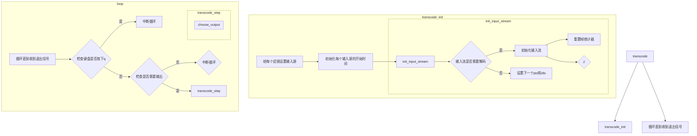

# fftools模块
## ffmpeg.c

```mermaid
graph TD
A[transcode]-->B[transcode_init]
	subgraph transcode_init
		B1[给每个滤镜设置输入源]-->B2[初始化每个输入源的开始时间]
		B2[初始化每个输入源的开始时间]-->B3[init_input_stream]
		subgraph init_input_stream
			B3[init_input_stream]-->B3.1{输入流是否需要解码}
			B3.1-->|是|B3.1.1[初始化输入流]
			B3.1.1[初始化输入流]-->B3.1.1.1[重置帧统计器]
			B3.1.1[初始化输入流]-->B3.1.1.2{//}
			B3.1-->|否|B3.2[设置下一个pts和dts]
		end
	end

A[transcode]-->C[循环直到收到退出信号]
	subgraph loop
		C1[循环直到收到退出信号]-->C2{检查键盘是否按下q}
		C2-->|是|C2.1[中断循环]
		C2-->|否|C2.2{检查是否需要输出}
		C2.2-->|否|C2.2.1{中断循环}
		C2.2-->|是|C2.2.2[transcode_step]
		subgraph transcode_step
			subgraph choose_output
			
			end
		end
	end
```

- transcode: 转码

- transcode_init: 转码的初始化工作

- init_input_stream: 初始化输入流

- transcode_step: 真正的转码工作

  

