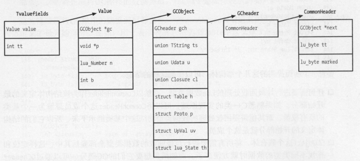
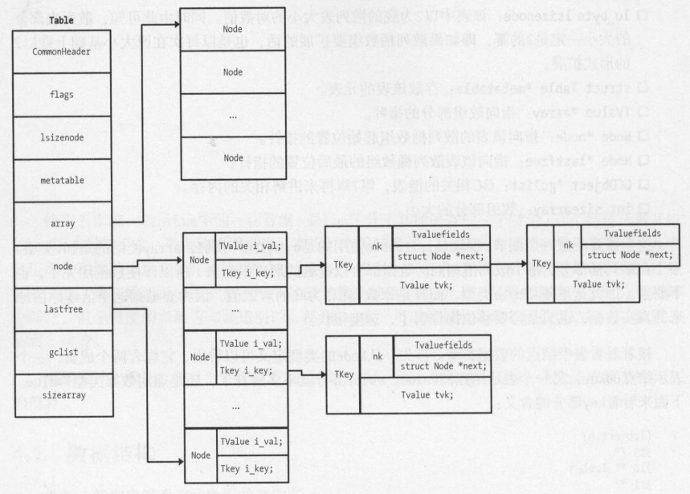
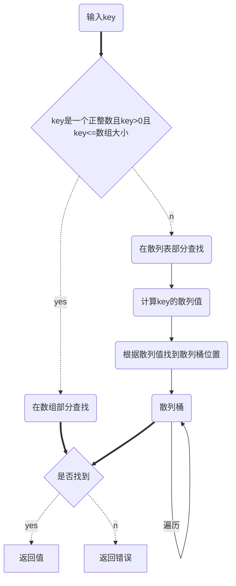
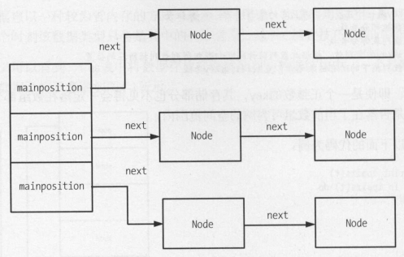

# LUA数据类型


## 内化

内化（internalization），每当创建一份新数据时，都会去检查当前系统中是否已经有一份相同的数据；如果有就直接复用，将引用指向这个已经存在的数据，否则重新创建一份新的数据。


## Lua通用数据结构的实现

Lua中的数据类型：

| 宏                 | 类型            | 对应的数据结构       |
| ------------------ | --------------- | -------------------- |
| LUA_NONE           | 无类型          | 无                   |
| LUA_TNIL           | 空类型          | 无                   |
| LUA_TBOOLEAN       | 布尔类型        | 无                   |
| LUA_TLIGHTUSERDATA | 指针            | `void *`             |
| LUA_TNUMBER        | 数据            | `lua_Number`         |
| LUA_TSTRING        | 字符串          | `TString`            |
| LUA_TTABLE         | 表              | Table                |
| LUA_TFUNCTION      | 函数            | `CClosure, LClosure` |
| LUA_TUSERDATA      | 指针            | `void *`             |
| LUA_TTHREAD        | Lua虚拟机，协程 | `lua_State`          |

- `LUA_TLIGHTUSERDATA`由Lua外部的使用者来完成分配和释放
- `LUA_TUSERDATA` 由Lua内部来完成分配和释放

Lua通用数据结构的组织如下：



- `CommonHeader`

  ```c
  /**
   * @brief 宏定义需要GC的类型
   * @param next 指向下一个GC链表的成员 @param tt 数据的类型 @param marked GC相关的标记位
   */
  #define CommonHeader	GCObject *next; lu_byte tt; lu_byte marked
  ```

- `GCheader`(3.6.5已废弃)

- `GCObject`

  ```c
  /**
   * @brief 需要进行GC的数据类型 
   */
  struct GCObject {
    CommonHeader;
  };
  ```

- `Value`

  ```c
  /**
   * @brief 值
  */
  typedef union Value {
    GCObject *gc;    /* collectable objects */
    void *p;         /* light userdata */
    int b;           /* booleans */
    lua_CFunction f; /* light C functions */
    lua_Integer i;   /* integer numbers */
    lua_Number n;    /* float numbers */
  } Value;
  ```

- `TValuefields`

  ```c
  /** @brief 将值和类型结合在一起 @param value_ 值 @param tt_ 类型 */
  #define TValuefields	Value value_; int tt_
  ```

Lua表示任何类型的数据结构定义如下：

```c
/** @brief 万能的数据类型（可以用来标识任何数据和类型）*/
typedef struct lua_TValue {
  TValuefields;
} TValue;
```


## 字符串

1. 在Lua虚拟机中存在一个全局的数据区，用来存放当前系统中的所有字符串。
2. 同一个字符串数据，在Lua虚拟机中只可能有一份副本，一个字符串一旦创建，不可被改写。
3. 变量存放的仅仅是字符串的引用，而不是其实际内容。
4. 在Lua中，应该尽量少地使用字符串连接操作符，因为每一次都会生成一个新的字符串。

### API

TODO

### 创建

字符串有长度限制，其长度最大不能超过`min(max(size_t), max(int64))`；

流程如下：

1. 先判断字符串长度，如果小于`LUAI_MAXSHORTLEN`，即为短字符串，内化创建；
2. 如果大于`min(max(size_t), max(int64))`，直接报错；
3. 长度合格，创建长字符串对象（此时不计算hash值，而是标记下extra域，并给hash值一个随机种子；直到下次对字符串做键匹配时才根据随机种子惰性计算hash值）；

### hash Dos攻击

在Lua 5.2.0以前，字符串是不分长短一律内部化后放在string table中的[^1]。

对于长字符串，为了加快内部化的过程，计算长字符串哈希值是跳跃进行的，下面是Lua5.2.0中的hash计算代码：

```c
unisgned int h = cast(unsigned int, 1)
size_t step = (1>>5)+1;
size_t l1;
for (l1=1, l1>=step; l1-=step)
    h = h ^ ((h<<5)+(h>>2)+cast(unsigned char, str[l1-1]));
```

这个设计有一个问题：攻击者可以模拟这个过程从而轻易构造出上千万个拥有相同哈希值的不同字符串，对于大量依赖字符串处理的HTTP服务，输入的字符串不可控，很容易被恶意利用。

Lua 5.2.1解决了这个问题，通过放在全局变量中的一个随机种子`seed`，来增加string哈希值生成的随机性。下面是Lua 5.6.3中string hash的计算代码：

```c
/** @brief 创建长字符串对象 @param L, @param l */
TString *luaS_createlngstrobj (lua_State *L, size_t l) {
  TString *ts = createstrobj(L, l, LUA_TLNGSTR, G(L)->seed); /* 给hash一个G(L)->seed 随机种子，但不创建hash*/
    ...
}

/** @brief 字符串hash计算函数 */
unsigned int luaS_hash (const char *str, size_t l, unsigned int seed) {
  unsigned int h = seed ^ cast(unsigned int, l);
  size_t step = (l >> LUAI_HASHLIMIT) + 1;
  for (; l >= step; l -= step)
    h ^= ((h<<5) + (h>>2) + cast_byte(str[l - 1]));
  return h;
}
```

### 内存调整

触发`luaS_resize`的情景：

- `checkSizes`

  如果没有开GC强制模式，且此时桶的数量>实际存放的字符串的数量*4，将桶数组减少为原来的一半。

- `luaS_init`

  初始化string表和string缓存时，将桶子的初始数量设置为`MINSTRTABSIZE`

- `internshrstr`

  字符串内化时，桶的数量<=存储的字符串数量且字符串数量<=MAX_INT/2

### 例

测试使用字符串连连接操作性能：

测试环境

| 操作系统     | cpu                                     | lua版本 |
| ------------ | --------------------------------------- | ------- |
| ubuntu 18.04 | Intel(R) Core(TM) i5-9400 CPU @ 2.90GHZ | 5.6.3   |

1. 新建lua脚本`lua_append_test1.lua`，内容如下：

   ```lua
   require "os"
   a = os.clock() -- 开始时间
   local s = ''
   for i = 1,300000 do
       s = s .. 'a'
   end
   b = os.clock() -- 结束时间
   print(b-a)

2. 新建lua脚本`lua_append_test2.lua`，内容如下：

   ```lua
   require "os"
   a = os.clock() -- 开始时间
   local s = ''
   local t = {}
   for i = 1,300000 do
       t[#t + 1] = 'a'
   end
   s = table.concat(t, '')
   b = os.clock() -- 结束时间
   print(b-a)
   
   ```


测试结果如下：

```sh
he@SD-20210816HMLO:/mnt/e/work/lua/test$ l lua_append_test2.lua
0.046875
he@SD-20210816HMLO:/mnt/e/work/lua/test$ l lua_append_test1.lua
12.5
he@SD-20210816HMLO:/mnt/e/work/lua/test$
```


## 表

### 定义

Lua表中将数据存放在两种类型的数据结构中：

- 数组
- 散列表

表结构示意图：



源码如下：

```c
TODO
```

### 查找元素

- pairs

  TODO

- ipairs

  TODO

在表中查找一个数据的流程如下：



### 新增元素

#### mainposition

mainposition表示key所在的桶的位置，其数据结构为:



#### rehash

插入时如果桶中找不到空位，会进行rehash(重新散列)操作；

流程如下：

1. 分配一个位图nums并重置。
2. 遍历Lua table中的数组，计算其中的元素数量，更新对应的nums数组中的元素数量。(numusearray函数)
3. 遍历Lua table中的散列桶，根据这里的正整数数量更新对应的nums数组元素数量。(numusehash函数)
4. 遍历nums中所有关于正整数的分配统计，获得其范围区间内所包含的整数数量大于50%的最大索引，作为重新散列之后的数组大小，超过这个范围的正整数，就分配到散列桶。(computesizes函数)
5. 根据上面得到的调整后的数组和散列桶大小调整表。(resize函数)

#### 新增元素流程

新建key流程如下：

1. 根据key计算出mainposition，然后根据mainposition找到散列桶
2. 如果散列桶不存在，直接新建一个，并插入
3. 如果散列桶存在，则找个空位插入桶里面（注意要做碰撞处理和rehash操作）

## 参考

### 文献

[^1]: 云风.[Lua源码欣赏](res/readinglua.pdf).18-1.2013

### 外链

- [Lua字符串库(整理)](https://www.cnblogs.com/jadeboy/p/4077459.html)

