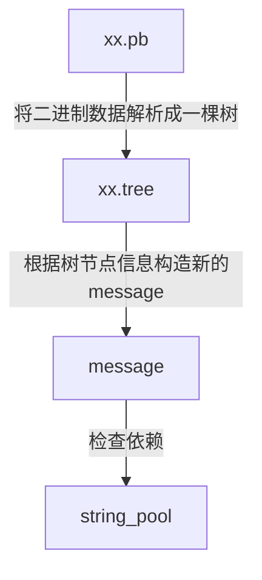
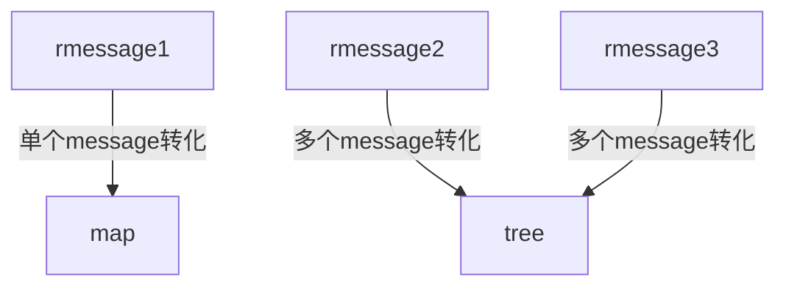
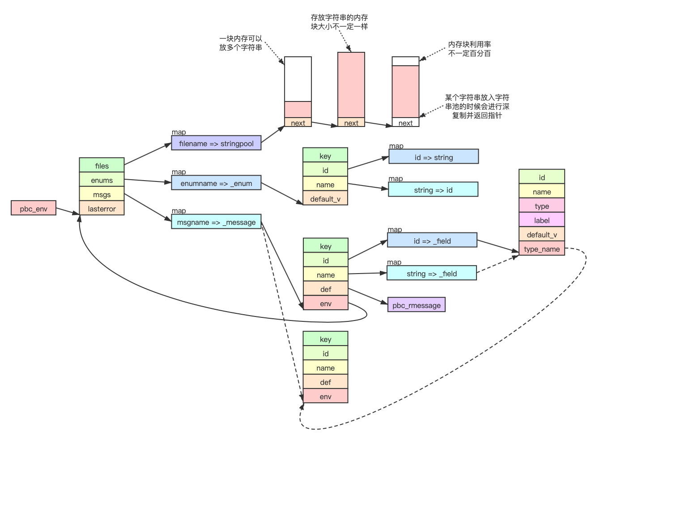
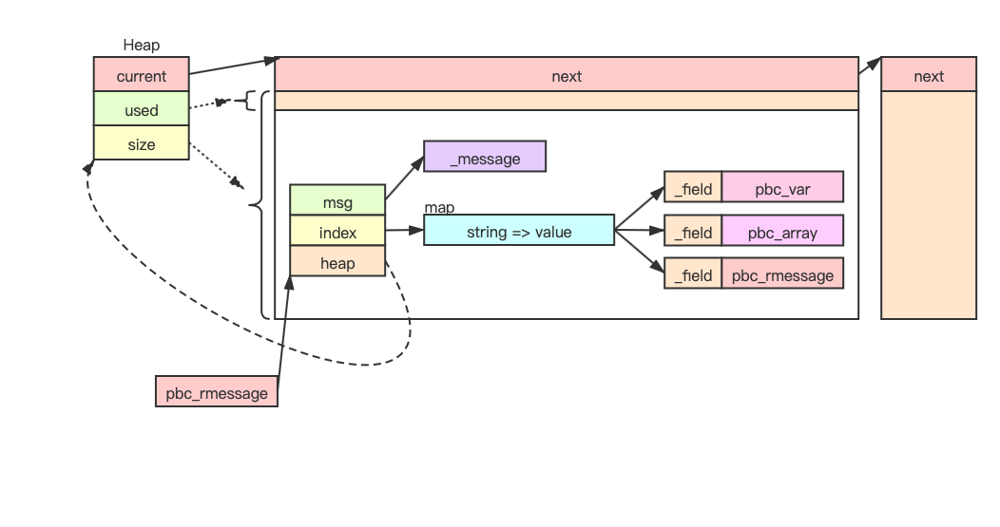

# PBC源码分析-总结

[TOC]

## 数据类型

### 分类

- `integer`
- `string`
- `real`

## API

### 分类

- `pbc_rmessage_xxx` 编码类API
- `pbc_wmessage_xxx` 解码类API
  1. optional的字段判断与默认值一致时啥都不写（字段是 repeated 或者 packed 都不会被省略，即使是存放数据为默认值）；
- `pbc_pattern_xxx`   适配类API
  1. 将序列化内容通过顺序标号与 C 语言结构体的字段一一对应起来；

### 常用API

| API                  | 功能                                                         |
| -------------------- | ------------------------------------------------------------ |
| pbc_rmessage_new     |                                                              |
| pbc_rmessage_delete  |                                                              |
| pbc_rmessage_integer |                                                              |
| pbc_rmessage_real    |                                                              |
| pbc_rmessage_string  |                                                              |
| pbc_rmessage_message |                                                              |
| pbc_rmessage_size    | 查询message中的field被重复了多少次；                         |
| pbc_wmessage_new     |                                                              |
| pbc_wmessage_delete  |                                                              |
| pbc_wmessage_integer | 压入负数时，记得将高位传-1，因为接口一律把传入的参数当成是无符号的整数； |
| pbc_wmessage_real    |                                                              |
| pbc_wmessage_string  |                                                              |
| pbc_wmessage_message |                                                              |
| pbc_wmessage_buffer  |                                                              |
| pbc_pattern_new      |                                                              |
| pbc_pattern_delete   |                                                              |
| pbc_pattern_pack     |                                                              |
| pbc_pattern_unpack   |                                                              |

## 架构

### 创建pbc_env

TODO

### 注册PB文件

- pbc仅在register的时候检查了dependency，register之后并没有保存dependency，因此，想要检查某个Message是否依赖其他Message，或者某个Message是否被其他Message依赖，则需要额外的实现来支持

### 解析message协议消息

- pbc在加载Message的时候，并没有判断该Message当前是否存在；
- bc中实现的哈希表并没有进行唯一性的判断，插入一个键值对总会占用一个新槽，这就导致可能两个键值对的键字符串内容一致！(pbc不支持多次加载同一个Message，用户如果这么做可能出现异常)；

## 内存布局

### pbc_env内存布局

### rmessage内存布局

### wmessage内存布局

## 源码

- `alloc` 统一管理内存分配，支持堆内分配优化；
- `array`  实现由联合体pbc_var组成的可变长度数组pbc_array；
- `map` 哈希表的实现；
  - `map_si` 一个字符串映射为整数的静态哈希表，通过map_kv数组进行初始化，不支持扩容；
  - `map_ip` 一个整数映射到指针的静态哈希表，同样通过map_kv数组进行初始化，不支持扩容，如果所有整数都不大于2倍的size，内部实现会用C语言数组来代替哈希表；
  - `map_sp` 一个字符串映射到指针的动态哈希表，支持扩容，支持遍历，支持heap内存分配策略（使用heap时扩容会浪费原来的那部分内存）；
- `stringpool` 字符串池；
- `varint` 解析varint编码的基本功能函数；
- `context` 针对传入的一段二进制数据解析一层varint键值对序列；
- `descriptor.pbc.h` 二进制内容转成字节数组放在头文件中；
- `bootstrap` 初始化pbc的过程，自动加载desc_simple.pbcbin，准备好解析xxx.pb的环境
- `pattern` 根据协议描述将C语言内存与数据对应起来并做解析，pbc_pattern记录的是内存结构体格式，按照该格式可以解析某段字符串；
- `proto` 实现pbc导出的接口；
- `register` 实现pbc_register接口；
- `decode` 实现pbc_decode接口;
- `rmessage` 实现pbc_rmessage_xx相关接口；
- `wmessage` 实现pbc_wmessage相关接口；

## 最佳实践

1. 建议所有的 string 都在末尾加上 \0 。因为，这样在解码的时候，可以将字符串指针直接指向数据包内，而不需要额外复制一份出来。
2. Pattern API 可以得到更高的性能。更快的速度和更少的内存占用量。更重要的是，对于比较小的消息包，如果你使用得当，使用 pattern api 甚至不会触发哪怕一次堆上的内存分配操作。api 工作时的所有的临时内存都在栈上。

## 参考

### 外链

- [云风的 BLOG](https://blog.codingnow.com/)
- [pbc实现分析](https://www.zhyingkun.com/markdown/pbcanalysis/)