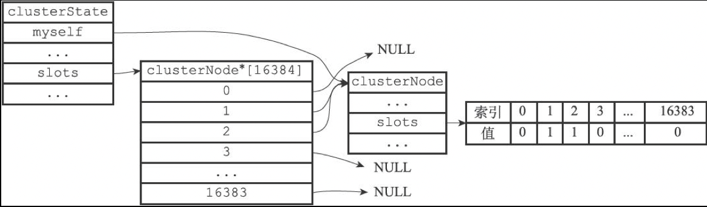

[TOC]

# Redis集群


## 节点

### 定义

```c
/* 连接节点所需的有关信息 */
typedef struct clusterLink {
    mstime_t ctime;             /* 连接创建的时间 */
    int fd;                     /* 套接字描述符 */
    sds sndbuf;                 /* 输出缓冲区 */
    sds rcvbuf;                 /* 输入缓冲区 */
    struct clusterNode *node;   /* 与这个连接相关联的节点，如果没有就为NULL */
} clusterLink;

/* 当前节点所在的集群状态 */
typedef struct clusterState {
    clusterNode *myself;    /* 本节点 */
    uint64_t currentEpoch;  /* 集群当钱的配置纪元（用于故障转移） */
    int state;              /* 集群当前的状态（REDIS_CLUSTER_OK, REDIS_CLUSTER_FAIL, ... ）*/
    int size;               /* 集群中至少处理着一个槽的节点的数量 */
    dict *nodes;            /* 节点字典：key:节点名字，value:节点 */
    dict *nodes_black_list; /* Nodes we don't re-add for a few seconds. */
    clusterNode *migrating_slots_to[REDIS_CLUSTER_SLOTS];
    clusterNode *importing_slots_from[REDIS_CLUSTER_SLOTS];
    clusterNode *slots[REDIS_CLUSTER_SLOTS];
    zskiplist *slots_to_keys;
    /* The following fields are used to take the slave state on elections. */
    mstime_t failover_auth_time; /* Time of previous or next election. */
    int failover_auth_count;    /* Number of votes received so far. */
    int failover_auth_sent;     /* True if we already asked for votes. */
    int failover_auth_rank;     /* This slave rank for current auth request. */
    uint64_t failover_auth_epoch; /* Epoch of the current election. */
    int cant_failover_reason;   /* Why a slave is currently not able to
                                   failover. See the CANT_FAILOVER_* macros. */
    /* Manual failover state in common. */
    mstime_t mf_end;            /* Manual failover time limit (ms unixtime).
                                   It is zero if there is no MF in progress. */
    /* Manual failover state of master. */
    clusterNode *mf_slave;      /* Slave performing the manual failover. */
    /* Manual failover state of slave. */
    long long mf_master_offset; /* Master offset the slave needs to start MF
                                   or zero if stil not received. */
    int mf_can_start;           /* If non-zero signal that the manual failover
                                   can start requesting masters vote. */
    /* The followign fields are used by masters to take state on elections. */
    uint64_t lastVoteEpoch;     /* Epoch of the last vote granted. */
    int todo_before_sleep; /* Things to do in clusterBeforeSleep(). */
    long long stats_bus_messages_sent;  /* Num of msg sent via cluster bus. */
    long long stats_bus_messages_received; /* Num of msg rcvd via cluster bus.*/
} clusterState;

/* 集群节点 */
typedef struct clusterNode {
    mstime_t ctime;                     /* 节点创建时间 */
    char name[REDIS_CLUSTER_NAMELEN];   /* 节点名字（由40个十六进制字符组成） */
    int flags;                          /* 节点标识（标记节点的角色和状态） */
    uint64_t configEpoch;               /* 当前的配置纪元（用于故障转移） */
    unsigned char slots[REDIS_CLUSTER_SLOTS/8]; /* slots handled by this node */
    int numslots;   /* Number of slots handled by this node */
    int numslaves;  /* Number of slave nodes, if this is a master */
    struct clusterNode **slaves; /* pointers to slave nodes */
    struct clusterNode *slaveof; /* pointer to the master node. Note that it
                                    may be NULL even if the node is a slave
                                    if we don't have the master node in our
                                    tables. */
    mstime_t ping_sent;      /* Unix time we sent latest ping */
    mstime_t pong_received;  /* Unix time we received the pong */
    mstime_t fail_time;      /* Unix time when FAIL flag was set */
    mstime_t voted_time;     /* Last time we voted for a slave of this master */
    mstime_t repl_offset_time;  /* Unix time we received offset for this node */
    mstime_t orphaned_time;     /* Starting time of orphaned master condition */
    long long repl_offset;      /* Last known repl offset for this node. */
    char ip[REDIS_IP_STR_LEN];  /* 节点IP */
    int port;                   /* 节点端口 */
    clusterLink *link;          /* 保存连接节点所需的有关信息 */
    list *fail_reports;         /* List of nodes signaling this as failing */
} clusterNode;
```

redisClient结构与clusterLink结构的相同和不同之处：

redisClient结构和clusterLink结构都有自己的套接字描述符和输入，输出缓冲区，这两个结构的区别在于，redisClient结构中的套接字和缓冲区是用于连接客户端的，而clusterLink结构中的套接字和缓冲区则是用于连接节点的。

### 启动节点

一个节点就是一个运行在集群模式下的Redis服务器，Redis服务器在启动时会根据配置`cluster-enabled`是否为yes来决定是否开启服务器的集群模式；流程如下：


### 节点握手

```sh
CLUSTER MEET <ip> <port>
```

该命令可以让node节点与`<ip>:<port>`所指定的节点进行握手（handshake）；当握手成功时，node节点就会将ip和port所指定的节点添加到node节点当前所在的集群中；

```sequence
Title:节点的握手过程
客户端->节点A: 发送命令 CLUSTER MEET <ip> <port>
节点A->节点B: 发送MEET消息
节点B-->节点A: 返回PONG消息
节点A->节点B: 返回PING消息
```

源码如下：

```c
void clusterCommand(redisClient *c) {
    if (server.cluster_enabled == 0) {
        addReplyError(c,"This instance has cluster support disabled");
        return;
    }
    /* 命令 CLUSTER MEET 的实现 */
    if (!strcasecmp(c->argv[1]->ptr,"meet") && c->argc == 4) {
        long long port;

        if (getLongLongFromObject(c->argv[3], &port) != REDIS_OK) {
            addReplyErrorFormat(c,"Invalid TCP port specified: %s",
                                (char*)c->argv[3]->ptr);
            return;
        }
        /* 与节点握手 */
        if (clusterStartHandshake(c->argv[2]->ptr,port) == 0 &&
            errno == EINVAL)
        {
            addReplyErrorFormat(c,"Invalid node address specified: %s:%s",
                            (char*)c->argv[2]->ptr, (char*)c->argv[3]->ptr);
        } else {
            addReply(c,shared.ok);
        }
    }
    ...
}
```


## 槽指派

Redis集群通过分片的方式来保存数据库中的键值对：集群的整个数据库被分为16384个槽（slot），数据库中的每个键都属于这16384个槽中的一个，集群中的每个节点可以处理0或最多16384个槽。

将一个或多个槽指派给节点负责：

```sh
CLUSTER ADDSLOTS <slot> [slot ...]
```

例，将槽0至槽5000指派给节点7000负责：

```sh
CLUSTER ADDSLOTS 1 2
```

执行上面的命令之前，节点的clusterState结构如下：


执行上面的命令之后，节点的clusterState结构如下：



### 在集群中执行命令


1. 客户端想节点发送命令；
2. 节点计算键属于哪个槽（CRC16算法）；
3. 如果所在的槽正好在当前节点，就指派给当前节点，直接执行这个命令；
4. 如果键所在的槽并没有指派给当前节点，那么节点会向客户端返回一个MOVED错误，指引客户端转向（redirect）至正确的节点，并再次发送之前想要执行的命令；

使用以下语句计算键属于哪个槽：

```c++
CLUSTER KEYSLOT "xx"
```

MOVED错误的格式为：

```sh
MOVED <slot> <ip>:<port> # slot:键所在的槽，ip:port:负责处理槽slot的节点的IP地址和端口号
```

使用以下命令返回属于槽slot的数据库键：

```sh
CLUSTER GETKEYSINSLOT <slot> <count> # count:键最多个数，slot:槽
```


## 重新分片

Redis集群的重新分片操作可以将任意数量已经指派给某个节点（源节点）的槽改为指派给另一个节点（目标节点），并且相关槽所属的键值对也会从源节点被移动到目标节点。

重新分片操作可以在线（online）进行，在重新分片的过程中，集群不需要下线，并且源节点和目标节点都可以继续处理命令请求。

### 实现原理

Redis集群的重新分片操作是由Redis的集群管理软件redis-trib负责执行的，Redis提供了进行重新分片所需要的所有命令，而redis-trib则通过向源节点和目标节点发送命令来进行重新分片操作。

迁移键的过程：

```sequence
Title:迁移键的过程
redis_trib->源节点: 1.发送命令 CLUSTER GETKEYSINSLOT <slot> <count>
源节点-->redis_trib: 2.返回最多count个属于槽slot的键
redis_trib->源节点: 3.对于每个返回键，向源节点发送一个MIGRATE命令
源节点->目标节点: 4.根据MIGRATE命令的指示将键迁移至目标节点
```

对槽slot进行重新分片的整个过程：


1. redis-trib对目标节点发送`CLUSTER SETSLOT <slot> IMPORTING <source_id>`命令，让目标节点准备好从源节点导入（import）属于槽slot的键值对。
2. redis-trib对源节点发送`CLUSTER SETSLOT <slot> MIGRATING <target_id>`命令，让源节点准备好将属于槽slot的键值对迁移（migrate）至目标节点。
3. redis-trib向源节点发送`CLUSTER GETKEYSINSLOT <slot> <count>`命令，获得最多count个属于槽slot的键值对的键名（key name）。
4. 对于步骤3获得的每个键名，redis-trib都向源节点发送一个`MIGRATE <target_ip> <target_port> <key_name> 0 <timeout>`命令，将被选中的键原子地从源节点迁移至目标节点。
5. 重复执行步骤3和步骤4，直到源节点保存的所有属于槽slot的键值对都被迁移至目标节点为止。
6. redis-trib向集群中的任意一个节点发送`CLUSTER SETSLOT <slot> NODE <target_id>`命令，将槽slot指派给目标节点，这一指派信息会通过消息发送至整个集群，最终集群中的所有节点都会知道槽slot已经指派给目标节点。

## ASK错误

