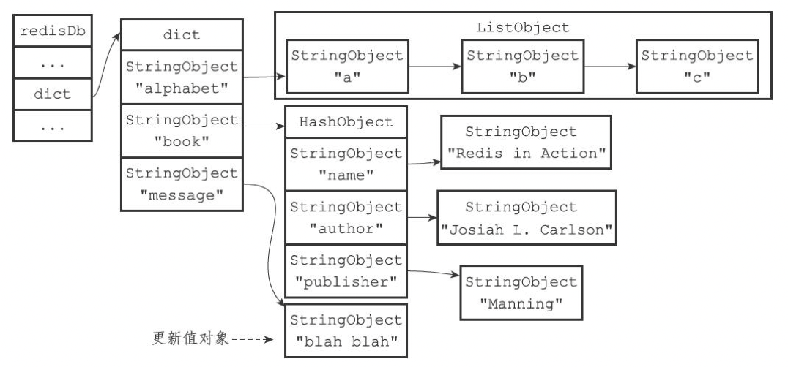

# Redis的数据库实现


## 定义

### redis服务器

```c
// redis服务器
struct redisServer {
    ...
    redisDb *db;                		/* 数据库数组 */
  	...
    int dbnum;                      /* 数据库个数，默认16个 */
    ...
    long long dirty;                /* 最后一次成功持久化后新增的修改数 */
    ...
    struct saveparam *saveparams;   /* 配置“save”的参数 <秒数> <修改数> */
    ...
    time_t lastsave;                /* 最后一次成功持久化的时间 */
    ...
    dict *pubsub_channels;  				/* 订阅的客户端字典：key:频道，value:客户端列表 */
    list *pubsub_patterns;  				/* 订阅关系列表 */
    ...
};
```

- `dbnum` 值由服务器配置的database选项决定

### redis客户端

```c
/** 
 * @brief redis客户端 */
typedef struct redisClient {
    ...
    redisDb *db;            /* 当前正在使用的数据库 */
  	...
} redisClient;
```

### redis数据库定义

```c
/**
 * @brief redis数据库
 */
typedef struct redisDb {
    dict *dict;                 /* 键空间，保存了数据库中所有的键值对 */
    dict *expires;              /* 键的过期字典，key：键，value：过期时间 */
    dict *blocking_keys;        /* Keys with clients waiting for data (BLPOP) */
    dict *ready_keys;           /* Blocked keys that received a PUSH */
    dict *watched_keys;         /* WATCHED keys for MULTI/EXEC CAS */
    struct evictionPoolEntry *eviction_pool;    /* Eviction pool of keys */
    int id;                     /* Database ID */
    long long avg_ttl;          /* Average TTL, just for stats */
} redisDb;
```


## 数据库切换

1. 默认情况下，Redis客户端的目标数据库为0号数据库，但客户端可以通过执行SELECT命令来切换目标数据库。
2. Redis没有可以返回客户端目标数据库的命令；最好先执行一个SELECT命令，显式地切换到指定的数据库，然后才执行别的命令。


## 数据库键空间

- 键空间的键也就是数据库的键，每个键都是一个字符串对象
- 键空间的值也就是数据库的值，每个值可以是字符串对象，列表对象，哈希表对象，集合对象和有序集合对象中的任意一种Redis对象。

例1，添加键值对：

```sh
redis>SET message "helloworld"
OK
redis>RPUSH alphabet "a""b""c"
(integer)3
redis>HSET bookname "RedisinAction"
(integer)
1redis>HSET bookauthor "JosiahL.Carlson"
(integer)
1redis>HSET bookpublisher "Manning"
(integer)1
```

数据库键空间结构如下：


例2，添加新键：

```sh
redis>SET date "2013.12.1"
OK
```

添加date键之后的键空间如下：


例3，删除键：

```sh
redis> DEL book
(integer) 1
```

删除book键之后的键空间：


例4，更新键：

```sh
redis> SET message "blah blah"
OK
```

使用SET命令更新message键之后的键空间：



例5，使用HSET更新键：

```sh
redis> HSET book page 320
(integer) 1
```

使用HSET命令更新page键之后的键空间：


例6，使用GET命令取值过程：


例7，使用LRANGE命令取值过程：


### 维护操作

当使用Redis命令对数据库进行读写时，服务器不仅会对键空间执行指定的读写操作，还会执行一些额外的维护操作，包括：

- 在读取一个键之后（读操作和写操作都要对键进行读取），服务器会根据键是否存在来更新服务器的键空间命中（hit）次数或键空间不命中（miss）次数，这两个值可以在`INFO stats`命令的`keyspace_hits`属性和`keyspace_misses`属性中查看。
- 在读取一个键之后，服务器会更新键的LRU时间，这个值可以用于计算键的闲置时间，使用OBJECT idletime命令可以查看键key的闲置时间。
- 如果服务器在读取一个键时发现该键已经过期，那么服务器会先删除这个过期键，然后才执行余下的其他操作。
- 如果有客户端使用WATCH命令监视了某个键，那么服务器对被监视的键进行修改之后，会将这个键标记为脏（dirty），从而让事务程序注意到这个键已经被修改过。
- 服务器每次修改一个键之后，都会对脏（dirty）键计数器的值+1，这个计数器会触发服务器的持久化以及复制操作。
- 如果服务器开启了数据库通知功能，那么在对键进行修改之后，服务器将按配置发送相应的数据库通知。

### 其他操作

- `FLUSHDB` 清空整个数据库（删除键空间中的所有键值对）。
- `RANDOMKEY` 随机返回数据库中某个键（随机返回键空间中的一个键）。
- `DBSIZE` 返回数据库键数量（返回键空间中包含的键值对的数量）。
- `EXISTS` TODO
- `RENAME` TODO
- `KEYS` TODO


## 设置生存时间或过期时间

