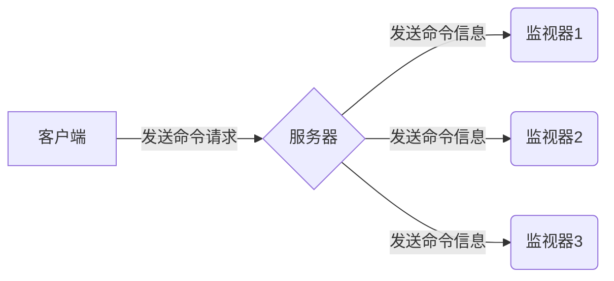

# Redis源码分析-监视器

[TOC]


客户端可以将自己变为一个监视器，实时地接收并打印出服务器当前处理的命令请求相关信息；

使用以下命令让一个客户端变为监视器

```sh
MONITOR
```

命令的接收和信息的发送：




## 成为监视器

```c
/** @brief 命令: monitor */
void monitorCommand(redisClient *c) {
    /* ignore MONITOR if already slave or in monitor mode */
    if (c->flags & REDIS_SLAVE) return; /* slave不允许称为监视器 */

    c->flags |= (REDIS_SLAVE|REDIS_MONITOR);
    listAddNodeTail(server.monitors,c); /* 添加到监视器链表 */
    addReply(c,shared.ok);
}
```


## 向监视器发送命令信息

服务器在每次处理命令请求之前，都会调用`replicationFeedMonitors`函数，由这个函数将被处理的命令请求的相关信息发送给各个监视器；


## 参考

### 文献

[1] 黄健宏.Redis设计与实现

### 外链

- [面试官:Redis监控指标有哪些?](https://zhuanlan.zhihu.com/p/152087914)

