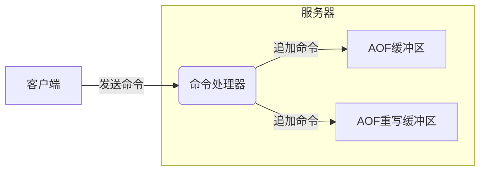

[TOC]

# Redis持久化


## 持久化策略

### save选项

用户通过`save`选项可以设置多个保存条件，只要其中任一个条件被满足，Redis就会执行`BGSAVE`命令；

源码如下：

```c
struct redisServer {
    struct saveparam *saveparams;   /* 配置“save”的参数 <秒数> <修改数> */
    int saveparamslen;              /* 配置“save”的条数 */
}
```

### dirty计数器和lastsave属性

- `dirty` 最后一次成功持久化后新增的修改数
- `lastsave` 最后一次成功持久化的时间

源码如下：

```c
struct redisServer {
    long long dirty;                /* 最后一次成功持久化后新增的修改数 */
    time_t lastsave;                /* 最后一次成功持久化的时间 */
}
```

### 保存条件检查函数

`serverCron`默认每隔100ms执行一次，用于检查`save`选项所设置的保存条件是否已经满足。

源码如下：

```c
TODO
```


## RDB文件的创建与载入

有2条命令可以生成RDB文件：

- `SAVE` 创建RDB文件（阻塞）
- `BGSAVE` 后台创建RDB文件（派生出一个子进程来操作，非阻塞）

**注意：**

1. Redis会优先使用AOF文件来还原数据库，只有在AOF功能关闭的情况下，才使用RDB文件来还原数据库状态。
2. `BGSAVE`命令执行期间，客户端发送过来的`SAVE`和`BGSAVE`命令会被拒绝；`BGREWRITEAOF`命令会被延迟到`BGSAVE`命令执行完毕以后再执行。
3. `BGREWRITEAOF`命令执行期间，客户端发送过来的`BGSAVE`命令会被拒绝。

### 源码实现

#### 保存RDB

Redis使用函数`int rdbSave(char *filename)`或`int rdbSaveBackground(char *filename)`保存RDB文件到数据库。

```c
/** @brief 保存RDB文件到磁盘 @param filename RDB文件路径 */
int rdbSave(char *filename) {
    char tmpfile[256];
    FILE *fp;
    rio rdb;
    int error;

    snprintf(tmpfile,256,"temp-%d.rdb", (int) getpid());
    fp = fopen(tmpfile,"w"); /* 创建临时文件 temp-进程ID.rdb */
    if (!fp) {
        redisLog(REDIS_WARNING, "Failed opening .rdb for saving: %s",
            strerror(errno));
        return REDIS_ERR;
    }

    rioInitWithFile(&rdb,fp);
    if (rdbSaveRio(&rdb,&error) == REDIS_ERR) { /* 复制一份RDB副本并保存到临时文件 */
        errno = error;
        goto werr;
    }

    /* Make sure data will not remain on the OS's output buffers */
    if (fflush(fp) == EOF) goto werr;
    if (fsync(fileno(fp)) == -1) goto werr;
    if (fclose(fp) == EOF) goto werr;

    /* Use RENAME to make sure the DB file is changed atomically only
     * if the generate DB file is ok. */
    if (rename(tmpfile,filename) == -1) { /* 重命名临时文件 */
        redisLog(REDIS_WARNING,"Error moving temp DB file on the final destination: %s", strerror(errno));
        unlink(tmpfile);
        return REDIS_ERR;
    }
    redisLog(REDIS_NOTICE,"DB saved on disk");
    server.dirty = 0;
    server.lastsave = time(NULL);
    server.lastbgsave_status = REDIS_OK;
    return REDIS_OK;

werr:
    redisLog(REDIS_WARNING,"Write error saving DB on disk: %s", strerror(errno));
    fclose(fp);
    unlink(tmpfile);
    return REDIS_ERR;
}
```

#### 载入RDB

Redis使用函数`int rdbLoad(char *filename)`来载入RDB文件。

```c
/** @brief 载入RDB文件 @param filename 文件路径 */
int rdbLoad(char *filename) {
	...
    fp = fopen(tmpfile,"w"); /* 创建临时文件 temp-进程ID.rdb */
    ...
    if (rdbSaveRio(&rdb,&error) == REDIS_ERR) { /* 复制一份RDB副本并保存到临时文件 */
    ...
    if (rename(tmpfile,filename) == -1) { /* 重命名临时文件 */
    ...
}
```

服务器载入文件时的判断流程：

```flow
a=>operation: 服务器启动
load=>operation: 执行载入程序
isAOFEnable=>condition: 已开启AOF持久化功能？
loadAOF=>operation: 载入AOF文件
loadRDB=>operation: 载入RDB文件

a->load->isAOFEnable
isAOFEnable(yes)->loadAOF
isAOFEnable(no)->loadRDB
```


## RDB文件结构

一个完整的RDB文件结构：

| REDIS | db_version | databases | EOF   | check_sum |
| ----- | ---------- | --------- | ----- | --------- |
| 5byte | 4byte      | 变长      | 1byte | 8字节     |

- `REDIS`：即'R''E''D''I''S'这五个字符，用于标识这是一个Redis的RDB文件。

- `db_version`：字符串形式的整数，记录了RDB文件的版本号。

- `databases`：包含着0或任意多个数据库以及各数据库中间的键值对数据；结构如下：

  | SELECTDB | db_number | key_value_pairs |
  | -------- | --------- | --------------- |
  | 1byte    | 1/2/5byte | 变长            |

  - `SELECTDB`：标识接下来要读的是一个数据库的ID；

  - `db_number`：数据库ID，根据ID的大小可以为1/2/5字节；

  - `key_value_pairs`：键值对数据；可以分为以下几类：

    - 不带过期时间的键值对

      | TYPE  | key  | value |
      | ----- | ---- | ----- |
      | 1byte | 变长 | 变长  |

      - `TYPE`：记录了value的类型，格式为REDIS_RDB_TYPE_XXX；
      - `key`：键值对的键，字符串类型；
      - `value`：键值对的值，它的编码方式说明[在这里](#value的编码)

    - 带过期时间的键值对

      | EXPIRETIME_MS | ms    | TYPE  | key  | value |
      | ------------- | ----- | ----- | ---- | ----- |
      | 1byte         | 8byte | 1byte | 变长 | 变长  |

      - `EXPIRETIME_MS`：告知读入程序，接下来要读入的是一个以毫秒为单位的过期时间；
      - `ms`：带符号整数，记录键值对的过期时间(ms)；
      - `TYPE`：同上
      - `key`：同上
      - `value`：同上

- `EOF`：标志着RDB文件正文内容已结束；

- `check_sum`：无符号整数，保存一个校验和（通过计算REDIS, db_version, databases, EOF得出）。

### value的编码

RDB文件中键值对的value可以为以下任何类型：

- 字符串对象

  字符串对象(REDIS_RDB_TYPE_STRING)的编码方式有以下2种：

  - `REDIS_ENCODING_INT`
  - `REDIS_ENCODING_RAW`

  对于不同长度的字符串，**开启文件压缩功能时**，其保存方式不一样

  - 如果字符串的长度小于等于20字节，这个字符串会直接被原样保存；
  - 如果字符串的长度大于20字节，这个字符串会被压缩(LZF压缩算法)之后再保存。

  如果关闭文件压缩功能，那么不管字符串长度，都是原样保存；

- 列表对象

  列表对象(REDIS_RDB_TYPE_LIST)采用`REDIS_ENCODING_LINKEDLIST`编码，其格式如下：

  `|list_length|item1|item2|...|itemN|`

  例：

  `|3|5|"hello"|5|"world"|1|"!"|`

- 集合对象

  集合对象(REDIS_RDB_TYPE_SET)采用`REDIS_ENCODING_HT`编码，其格式如下：

  `|set_size|elem1|elem2|...|elemN|`

  例：

  `|4|5|"apple"|6|"banana"|3|"cat"|3|"dog"|`

- 哈希表对象

  哈希表对象(REDIS_RDB_TYPE_HASH)采用`REDIS_ENCODING_HT`编码，其格式如下：

  `|hash_size|key_value_pair1|key_value_pair2|...|key_value_pairN|`

  - `hash_size` 记录了哈希表的大小，即这个哈希表保存了多少键值对；
  - `key_value_pairXXX` 代表了哈希表中的键值对，键值对的键和值都是字符串对象，所以程序会以处理字符串对象的方式来保存和读入键值对。 

  例：

  `|2|1|"a"|5|"apple"|1|"b"|6|"banana"|`

- 有序集合对象

  有序集合对象(REDIS_RDB_TYPE_ZSET)采用`REDIS_ENCODING_SKIPLIST`编码，格式如下：

  `|sorted_set_size|element1|element2|...|elementN|`

  - `sorted_set_size` 有序集合大小
  - `elementxxx`
    - `member` 成员
    - `score` 分值
  
  例：`|2|2|"pi"|4|"3.14"|1|"e"|3|"2.7"|`
  
  第1格标识集合有2个元素，第2格表示"pi"的长度为2，第3格表示"pi"，第4格表示"3.14"的长度为4，第5格表示"e"的长度为1，第6格表示"e"，第7格表示"2.7"的长度为3，第8格表示"2.7"。
  
- 整数集合对象
  
  整数集合对象(REDIS_RDB_TYPE_SET_INTSET)，先将整数集合转换为字符串对象，然后将这个字符串对象保存到RDB文件里面。
  
- ZIPLIST编码的列表，哈希表或者有序集合

  压缩列表对象(REDIS_RDB_TYPE_LIST_ZIPLIST/REDIS_RDB_TYPE_HASH_ZIPLIST/REDIS_RDB_TYPE_ZSET_ZIPLIST)的保存方法是：

  1. 将压缩列表转换成一个字符串对象。
  2. 将转换所得的字符串对象保存到RDB文件。

  如果程序在读入RDB文件的过程中，碰到有压缩列表对象转换成的字符串对象，那么程序会根据TYPE值的指示，执行以下操作：

  1. 读入字符串对象，并将它转换成原来的压缩表对象。
  2. 根据TYPE的值，设置压缩列表对象的类型：
     - 如果TYPE的值为`REDIS_RDB_TYPE_LIST_ZIPLIST`，那么压缩列表对象的类型为列表；
     - 如果TYPE的值为`REDIS_RDB_TYPE_HASH_ZIPLIST`，那么压缩列表对象的类型为哈希表；
     - 如果TYPE的值为`REDIS_RDB_TYPE_ZSET_ZIPLIST`，那么压缩列表对象的类型为有序集合。

### 分析RDB文件

  当一个RDB文件没有包含任何数据库数据时，这个RDB文件由以下4个部分组成：

  - 5字节的"REDIS"字符串;
  - 4字节的版本号(db_version);
  - 1字节的EOF常量;
  - 8字节的校验和(check_sum)。

  当一个数据库被保存到RDB文件时，这个数据库将由以下部分组成：

  - 1字节长的特殊值SELECTDB;
  - 1字节/2字节/5字节的数据库号码(db_number);
  - 一个或以上数量的键值对(key_value_pairs)。

  一个带有过期时间的键值对由以下部分组成：

  - 1字节长的EXPIRETIME_MS特殊值；
  - 8字节长的过期时间(ms)；
  - 1字节长的类型(TYPE)；
  - 1个键(key)和一个值(value)。

  

## AOF持久化

AOF持久化是通过保存Redis服务器所执行的写命令来记录数据库状态的，流程如下：


### AOF持久化的实现

AOF持久化功能的实现可以分为以下步骤：

1. 命令追加(append)；
2. 文件写入；
3. 文件同步(sync)。

#### AOF文件的写入与同步

不同的appendfsync配置选项，产生不同的持久化行为：

| appendfsync选项的值 | flushAppendOnlyFile函数的行为                                |
| ------------------- | ------------------------------------------------------------ |
| always              | 将aof_buf缓冲区中的所有内容写入并同步到AOF文件               |
| everysec            | 将aof_buf缓冲区中的所有内容写入到AOF文件，如果上次同步AOF文件的时间距离现在超过一秒钟，那么再次对AOF文件进行同步，并且这个同步操作是由一个线程专门负责执行的 |
| no                  | 将aof_buf缓冲区中的所有内容写入到AOF文件，但并不对AOF文件进行同步，何时同步由操作系统来决定 |

#### AOF持久化的效率和安全性

appendfsync选项的值决定AOF持久化功能的效率和安全性：

- `always` 服务器在每个事件循环都要将aof_buf缓冲区中的所有内容写入到AOF文件，并且同步AOF文件，所以always的效率是appendfsync选项三个值当中**最慢**的一个，但从安全性来说，always也是最安全的，因为即使出现故障停机，AOF持久化也只会丢失一个事件循环中所产生的命令数据。
- `everysec` 服务器在每个事件循环都要将aof_buf缓冲区中的所有内容写入到AOF文件，并且每隔一秒就要在子线程中对AOF文件进行一次同步。从效率上来讲，everysec模式足够快，并且就算出现故障停机，数据库也只丢失一秒钟的命令数据。
- `no` 服务器在每个事件循环都要将aof_buf缓冲区中的所有内容写入到AOF文件，至于何时对AOF文件进行同步，则由操作系统控制。因为处于no模式下的flushAppendOnlyFile调用无须执行同步操作，所以该模式下的AOF文件写入速度总是最快的，不过因为这种模式会在系统缓存中积累一段时间的写入数据，所以该模式的单次同步时长通常是三种模式中时间最长的。

### AOF文件的载入与数据还原

Redis读取AOF文件并还原数据库状态的详细步骤：

```flow
load=>operation: 服务器启动载入程序
create_cli=>operation: 创建伪客户端
read_wcmd=>operation: 从AOF文件中分析并读取出一条写命令
exec_wcmd=>operation: 使用伪客户端执行写命令
exec_fin=>condition: AOF文件中的所有写命令都已经被执行完毕？
load_fin=>operation: 载入完毕

load->create_cli->read_wcmd->exec_fin
exec_fin(yes)->load_fin
exec_fin(no)->read_wcmd
```

1. 创建一个不带网络连接的伪客户端（fake client）；
2. 从AOF文件中分析并读取出一条写命令；
3. 使用伪客户端执行被读出的写命令；
4. 一直执行步骤2和步骤3，知道AOF文件中的所有写命令都被处理完毕为止。

### AOF重写

Redis服务器可以使用AOF文件重写(rewrite)功能创建一个新的AOF文件来替代现有的AOF文件，新旧两个AOF文件所保存的数据库状态相同，但新AOF文件不会包含任何浪费空间的冗余命令。

#### AOF后台重写

Redis将AOF重写程序放到子进程的目的如下：

- 子进程进行AOF重写期间，服务器进程（父进程）可以继续处理命令请求；
- 子进程带有服务器进程的数据副本，使用子进程而不是线程，可以在避免使用锁的情况下，保证数据的安全性。

为了解决子进程进行AOF重写期间，父进程与子进程的数据不一致问题；Redis服务器设置了一个AOF重写缓冲区，这个缓冲区在服务器创建子进程之后开始使用，当Redis服务器执行完一个写命令之后，它会同时将这个写命令发送给AOF缓冲区和AOF重写缓冲区，如图所示：



1. 将AOF重写缓冲区中的所有内容写入到新AOF文件中，这时新AOF文件所保存的数据库状态将和服务器当前的数据库状态一致；
2. 对新的AOF文件进行改名，原子地(atomic)覆盖现有的AOF文件，完成新旧两个AOF文件的替换。
