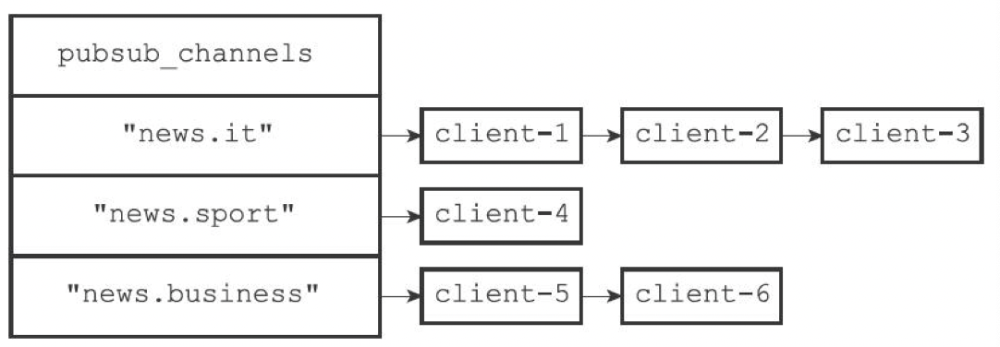
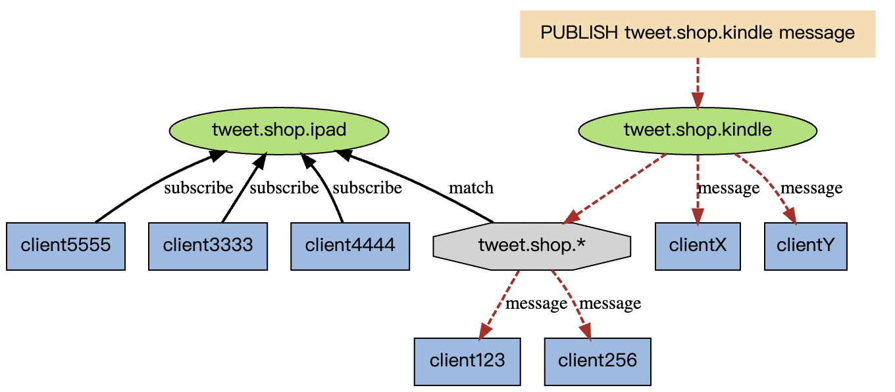

[TOC]

# 发布订阅


## 定义

### 客户端

```c
typedef struct redisClient {
    uint64_t id;            /* Client incremental unique ID. */
    int fd;
    redisDb *db;
    int dictid;
    robj *name;             /* As set by CLIENT SETNAME */
    sds querybuf;
    size_t querybuf_peak;   /* Recent (100ms or more) peak of querybuf size */
    int argc;
    robj **argv;
    struct redisCommand *cmd, *lastcmd;
    int reqtype;
    int multibulklen;       /* number of multi bulk arguments left to read */
    long bulklen;           /* length of bulk argument in multi bulk request */
    list *reply;
    unsigned long reply_bytes; /* Tot bytes of objects in reply list */
    int sentlen;            /* Amount of bytes already sent in the current
                               buffer or object being sent. */
    time_t ctime;           /* Client creation time */
    time_t lastinteraction; /* time of the last interaction, used for timeout */
    time_t obuf_soft_limit_reached_time;
    int flags;              /* REDIS_SLAVE | REDIS_MONITOR | REDIS_MULTI ... */
    int authenticated;      /* when requirepass is non-NULL */
    int replstate;          /* replication state if this is a slave */
    int repl_put_online_on_ack; /* Install slave write handler on ACK. */
    int repldbfd;           /* replication DB file descriptor */
    off_t repldboff;        /* replication DB file offset */
    off_t repldbsize;       /* replication DB file size */
    sds replpreamble;       /* replication DB preamble. */
    long long reploff;      /* replication offset if this is our master */
    long long repl_ack_off; /* replication ack offset, if this is a slave */
    long long repl_ack_time;/* replication ack time, if this is a slave */
    long long psync_initial_offset; /* FULLRESYNC reply offset other slaves
                                       copying this slave output buffer
                                       should use. */
    char replrunid[REDIS_RUN_ID_SIZE+1]; /* master run id if this is a master */
    int slave_listening_port; /* As configured with: SLAVECONF listening-port */
    int slave_capa;         /* Slave capabilities: SLAVE_CAPA_* bitwise OR. */
    multiState mstate;      /* MULTI/EXEC state */
    int btype;              /* Type of blocking op if REDIS_BLOCKED. */
    blockingState bpop;     /* blocking state */
    long long woff;         /* Last write global replication offset. */
    list *watched_keys;     /* Keys WATCHED for MULTI/EXEC CAS */
    dict *pubsub_channels;  /* channels a client is interested in (SUBSCRIBE) */
    list *pubsub_patterns;  /* patterns a client is interested in (SUBSCRIBE) */
    sds peerid;             /* Cached peer ID. */

    /* Response buffer */
    int bufpos;
    char buf[REDIS_REPLY_CHUNK_BYTES];
} redisClient;
```

### 订阅字典

```c
struct redisServer {
  ...
  dict *pubsub_channels; // 订阅"频道-客户端列表“字典
  ...
}
```

例，pubsub_channels结构：



### 模式订阅关系

```c
typedef struct pubsubPattern {
    redisClient *client; // 客户端
    robj *pattern;       // 被订阅的模式
} pubsubPattern;

struct redisServer {
  ...
  list *pubsub_patterns;  /* 订阅关系列表 */
  ...
}
```

例，pubs_patterns结构：


## 订阅

```sh
SUBSCRIBE 频道名 客户端ID
```

- 如果频道已经有其他订阅者，将客户端添加到订阅者列表
- 如果频道没有任何订阅者，创建一个订阅者列表，再将客户端添加到列表

### 实现

```c++
/* 订阅频道，返回1表示成功，0表示已经订阅过了
 */
int pubsubSubscribeChannel(redisClient *c, robj *channel) {
    dictEntry *de;
    list *clients = NULL;
    int retval = 0;

    /* 添加一个频道作为key */
    if (dictAdd(c->pubsub_channels,channel,NULL) == DICT_OK) {
        retval = 1;
        incrRefCount(channel);
        /* 根据key找客户端list */
        de = dictFind(server.pubsub_channels,channel);
        if (de == NULL) { // 不存在订阅者列表就创建
            clients = listCreate();
            dictAdd(server.pubsub_channels,channel,clients);
            incrRefCount(channel);
        } else {
            clients = dictGetVal(de);
        }
        listAddNodeTail(clients,c); // 加到客户端list
    }
    /* 通知客户端 */
    addReply(c,shared.mbulkhdr[3]);
    addReply(c,shared.subscribebulk);
    addReplyBulk(c,channel);
    addReplyLongLong(c,clientSubscriptionsCount(c));
    return retval;
}
```


## 退订

```sh
UNSUBSCRIBE 频道 客户端ID
```

1. 根据频道找到订阅者列表，从订阅者列表中删除客户端ID
2. 删除客户端ID后，如果订阅者列表为空，删除当前频道

## 发布消息

```c
/* 发布消息 */
int pubsubPublishMessage(robj *channel, robj *message) {
    int receivers = 0;
    dictEntry *de;
    listNode *ln;
    listIter li;

    /* 根据频道找到客户端list */
    de = dictFind(server.pubsub_channels,channel);
    if (de) {
        list *list = dictGetVal(de);
        listNode *ln;
        listIter li;

        listRewind(list,&li);
        while ((ln = listNext(&li)) != NULL) { // 遍历链表，发送消息
            redisClient *c = ln->value;

            addReply(c,shared.mbulkhdr[3]);
            addReply(c,shared.messagebulk);
            addReplyBulk(c,channel);
            addReplyBulk(c,message);
            receivers++;
        }
    }
    /* Send to clients listening to matching channels */
    if (listLength(server.pubsub_patterns)) {
        listRewind(server.pubsub_patterns,&li);
        channel = getDecodedObject(channel);
        while ((ln = listNext(&li)) != NULL) {
            pubsubPattern *pat = ln->value;

            if (stringmatchlen((char*)pat->pattern->ptr,
                                sdslen(pat->pattern->ptr),
                                (char*)channel->ptr,
                                sdslen(channel->ptr),0)) {
                addReply(pat->client,shared.mbulkhdr[4]);
                addReply(pat->client,shared.pmessagebulk);
                addReplyBulk(pat->client,pat->pattern);
                addReplyBulk(pat->client,channel);
                addReplyBulk(pat->client,message);
                receivers++;
            }
        }
        decrRefCount(channel);
    }
    return receivers;
}
```


## 订阅模式

通过模糊匹配的方式订阅频道

```sh
PSUBSCRIBE 模式名
```

1. 新建一个`pubsubPattern`结构，将结构的`pattern`属性设置为被订阅模式，`client`属性设置为订阅模式的客户端。
2. 将`pubsubPattern`结构添加到pubs_patterns链表的尾部。

例，`tweet.shop.*`模式匹配了`tweet.shop.kindle`和`tweet.shop.ipad`，当有`message`发布到`tweet.shop.kindle`时，`client123`和`client256`也会收到：



### 实现

```c
/** @brief 添加模式匹配 */
int pubsubSubscribePattern(redisClient *c, robj *pattern) {
    int retval = 0;

    if (listSearchKey(c->pubsub_patterns,pattern) == NULL) { // 不存在就新建一个模糊key
        retval = 1;
        pubsubPattern *pat;
        listAddNodeTail(c->pubsub_patterns,pattern);
        incrRefCount(pattern);
        pat = zmalloc(sizeof(*pat));
        pat->pattern = getDecodedObject(pattern);
        pat->client = c;
        listAddNodeTail(server.pubsub_patterns,pat); // 添加到尾部
    }
    /* Notify the client */
    addReply(c,shared.mbulkhdr[3]);
    addReply(c,shared.psubscribebulk);
    addReplyBulk(c,pattern);
    addReplyLongLong(c,clientSubscriptionsCount(c));
    return retval;
}
```


## 退订模式

退订模糊匹配的频道

```sh
PUNSUBSCRIBE 模式名
```

1. 在`pubsub_patterns`链表中查找并删除`pattern`属性为被退订模式，并且`client`属性为执行退订命令的客户端的`pubsubPattern`结构

### 实现

```c
/**
 * @brief 取消模式订阅 */
int pubsubUnsubscribePattern(redisClient *c, robj *pattern, int notify) {
    listNode *ln;
    pubsubPattern pat;
    int retval = 0;

    incrRefCount(pattern); /* Protect the object. May be the same we remove */
    if ((ln = listSearchKey(c->pubsub_patterns,pattern)) != NULL) {
        retval = 1;
        listDelNode(c->pubsub_patterns,ln);
        pat.client = c;
        pat.pattern = pattern;
        ln = listSearchKey(server.pubsub_patterns,&pat);
        listDelNode(server.pubsub_patterns,ln);
    }
    /* Notify the client */
    if (notify) {
        addReply(c,shared.mbulkhdr[3]);
        addReply(c,shared.punsubscribebulk);
        addReplyBulk(c,pattern);
        addReplyLongLong(c,dictSize(c->pubsub_channels)+
                       listLength(c->pubsub_patterns));
    }
    decrRefCount(pattern);
    return retval;
}
```


## 发送消息

### 发送消息给频道订阅者

```sh
PUBLISH 频道名 消息
```

1. 在`pubsub_channels`中查找频道名
2. 遍历频道名对应的订阅者列表，发送消息

#### 实现

```c

```

### 发送消息给模式订阅者

